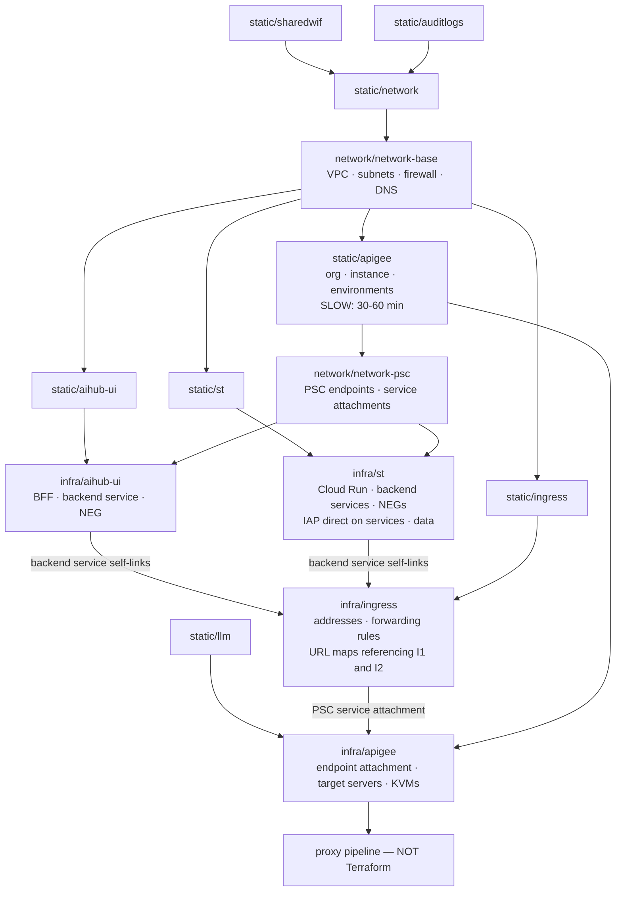

# 09 — Implementation runbook (GCP Console)

**Revision R12.** Reflects confirmed decisions: the second range is `192.168.4.0/22`, the project is `gclt-aicoe-dev-ingress`, the resource-location policy is pinned to `europe-west1`, the UI is a **Backend-for-Frontend** rather than a static SPA, and **Apigee is in the user request path** so per-user rate limiting can be enforced (§0.2.1).

**Correction in R7:** the two Private Service Connect addresses are **not yours to choose**. Apigee's service endpoint address is allocated by the provisioning flow and you look it up; the Vector Search address is best allocated automatically by a service connection policy. §0.6 now reserves a *range* with an owner per address rather than fixing values.

**R7 — the architecture changed.** The AI Hub UI is now a **Backend-for-Frontend**, not a static SPA, and Apigee is back in the user request path. The browser holds only an opaque session cookie; the BFF is the OAuth client and calls Apigee server-side. See `11-reconciled-architecture.md` for the reasoning. Parts affected: 11, 14, 16, 18, 19, 20, 21, 22, 24.

**R12a — coverage gaps closed.** A check against the design found eight things designed but never written into the build: both Entra app registrations and the App Role to group mapping (Part 13), and logout, session rotation, refresh serialisation, fail-closed behaviour and `last_seen_at` throttling (§19.4). Platform limits added as §0.7.

**R12 — one IAP, and Cloud Run IAM for the machine hop.** IAP exists in exactly one place: the front door, authenticating people. The backend hop uses **Cloud Run IAM** — Apigee presents a Google ID token in `X-Serverless-Authorization` and `roles/run.invoker` is granted to the Apigee runtime service account alone. No IAP on the backends, no dedicated OAuth clients, no IAP latency on that hop. Authorization was always Apigee's job and remains so. Parts affected: 18, 19, 20, 22, 24.

**R11 — IAP placement, superseded by R12.** IAP is enabled on **load balancer backend services** everywhere, not directly on Cloud Run. One pattern across the platform rather than two. The front door uses the workforce pool on `bs-aihub-bff`; the backends use a dedicated OAuth client on `bs-translation` and `bs-sales`. Because those backend services live in **different projects**, the OAuth brand collision that partly motivated R9 does not arise. Parts affected: 18, 19, 20, 22.

**R10 — five items closed.** Both LLM token policies are confirmed **Extensible**, so the `llm` environment must be Intermediate and the `int` environment can stay Base (§14.5). Apigee runtime configuration goes in Git — what and what not in §22.13. Terraform layering and cross-project apply order added as Part 25. Business-unit labelling for retrieved documents comes from the Entra token (§15.6). Indirect prompt injection is handled application-side (§17.6).

**R9 — the backend path is decided.** IAP goes **directly on the backend Cloud Run services**, and the Backend load balancer is a pure network path with no IAP of its own (§20.7). This is Google's recommended placement, and it dissolves the `allUsers` problem that had been open since the start: IAP authenticates at the Cloud Run front door, ahead of the IAM invoker check, so the load balancer never needs to authenticate at all.

**R8 — IAP corrections.** Three things verified against Google's documentation. `X-Serverless-Authorization` is IAP's *internal* hop to Cloud Run and must never be sent by a caller (§20.7). The BFF must **strip** that header before forwarding, because Cloud Run passes it through (§19.4). R9 and R11 moved IAP placement twice more before R12 settled it: one IAP at the front door, Cloud Run IAM on the machine hop.

**Corrections in R6:** the Cloud Run instance budget is not 49 — Google documents 2 addresses per instance at steady state and 4x during a revision rollout (§19.3). Apigee's `Quota` and `SpikeArrest` return **500 by default, not 429** (§22.9). `SpikeArrest` is only per-message-processor when `UseEffectiveCount` is false, and the default template sets it true (§22.11). The Cloud Run to Apigee path is the documented **service endpoint** routing option, chosen at provisioning (§14.3, §21.3).

**Corrections in R5:** R4 stated that Model Armor was unavailable in `europe-west1` — wrong; Google's location list includes `europe-west1` (Belgium), so Part 17 uses it, and the narrower constraint that does apply is in §17.2. R4 also cited a 2,000-token screening limit — also wrong; the documented limits are 10,000 tokens per filter and 130,000 for sensitive-data detection, with a 4 MB input ceiling. §17.4 has the corrected figures and the `EXECUTION_SKIPPED` behaviour that matters more than the numbers.

Step-by-step build of the AI CoE dev platform using the Google Cloud Console. Written to be followed by someone who has not built a landing zone before. No Terraform.

**What is in scope:** everything except creating the Cloud Run services themselves. You build those; §19 lists the exact settings each one must have so it fits the platform.

**How to read a step.** Every step has the same five parts:

- **What this is** — plain-language explanation of the resource and why the platform needs it
- **Where** — how to get to the right console page
- **Do this** — the clicks and the exact values
- **Check it worked** — how to confirm before moving on
- **Watch out** — irreversible settings, common errors, waiting times

**Two console habits that will save you time.** Use the search box at the very top of the console — typing "log bucket" or "key ring" jumps straight to the page, and it is more reliable than remembering menu paths, which Google changes. And always confirm the **project selector** at the top-left shows the project you intend, because roughly half of all landing-zone mistakes are a resource created in the wrong project.

**Cloud Shell.** A handful of steps have no console equivalent. Cloud Shell is the terminal built into the console — click the `>_` icon in the top-right. It is still "the console"; it just types instead of clicking. Those steps are marked **Cloud Shell only** and the exact command is given.

---

## Contents

| Part | Subject |
|---|---|
| 0 | Before you start — permissions, decisions, naming, limits |
| 1 | Organisation policies at the folder |
| 2 | Enable APIs in every project |
| 3 | Force service agents into existence |
| 4 | Encryption keys (Cloud KMS) |
| 5 | Logging — 400-day bucket, sinks, audit config |
| 6 | Network — Shared VPC, subnets, firewall, DNS |
| 7 | Attach service projects to the Shared VPC |
| 8 | Private Service Connect to Google APIs |
| 9 | Artifact Registry |
| 10 | Binary Authorization |
| 11 | Secret Manager |
| 12 | Workload Identity Federation for GitLab |
| 13 | Entra ID: workforce federation and app registrations |
| 14 | Apigee organisation, instance, environments |
| 15 | Vertex AI Vector Search |
| 16 | BigQuery, Cloud Storage, Cloud Tasks |
| 17 | Central LLM project, Model Armor and AI safety |
| 18 | Service accounts and IAM |
| 19 | Cloud Run settings you must apply |
| 20 | Load balancers and IAP |
| 21 | Private Service Connect for Apigee, both directions |
| 22 | Apigee configuration and proxies |
| 23 | Monitoring and alerts |
| 24 | End-to-end verification |
| 25 | Infrastructure as code: layering and apply order |
| A | What the console cannot do |
| B | Common errors and what they mean |

---

# Part 0 — Before you start

## 0.1 Roles you need

Ask whoever administers the organisation for these. Without them, steps fail with "permission denied" that looks like a bug.

| Scope | Role | Needed for |
|---|---|---|
| Organisation | `roles/orgpolicy.policyAdmin` | Part 1 |
| Organisation | `roles/iam.workforcePoolAdmin` | Part 13 |
| Folder `AI COE` | `roles/logging.configWriter` | Part 5 folder sinks |
| Folder `AI COE` | `roles/resourcemanager.folderAdmin` | audit config |
| Each project | `roles/owner` for the build, reduced afterwards | most parts |
| Host project | `roles/compute.xpnAdmin` | Shared VPC, Part 7 |
| Host project | Shared VPC endpoint roles | Creating a Private Service Connect endpoint in a service project against a host-project subnet needs additional roles **on the host project**, not just the service project. Parts 8, 15 and 21 all do this |

Do not keep `roles/owner` after the build. Part 18 covers what to reduce it to.

## 0.2 Decisions — answered

Four of the five questions this runbook used to open with now have answers, and they change what you build.

| # | Question | Answer | Consequence |
|---|---|---|---|
| 1 | Second IP range | **`192.168.4.0/22`** | Private address space, as designed. Nothing changes |
| 2 | Ingress project ID | **`gclt-aicoe-dev-ingress`** | Use this spelling everywhere |
| 3 | `gcp.resourceLocations` | **pinned to `europe-west1`** | Model Armor **is** available in `europe-west1`, so it is used. What the pinning does block is the built-in Vertex AI integration, which wants a template in a different region — see §17.2 |
| 4 | Apigee environment type | **Intermediate** for the `llm` environment | The Model Armor policies are Extensible, which Base cannot run. See §14.5 |
| 5 | Apigee to Cloud Run authentication | **decided — see §0.2.1** | Determines whether a second load balancer exists |

### 0.2.1 Apigee is in the user request path

Earlier revisions moved Apigee out of the user path because there was no verified way for it to authenticate to Cloud Run. That is no longer the choice: **per-user rate limiting is a firm requirement, and Apigee is the only place it can be enforced.**

The shape is now:

| Hop | How |
|---|---|
| Browser to BFF | AI Hub load balancer at `10.110.73.20`, protected by IAP |
| BFF to Apigee | Server-side, to Apigee's internal **service endpoint** at `192.168.6.146`. The browser never calls Apigee, so no second CSOC-opened address and no PSC network endpoint group on an internal load balancer |
| Apigee to backends | Southbound Private Service Connect to the Backend load balancer at `192.168.6.145`, which has IAP enabled using a **dedicated** OAuth client. Apigee presents a Google ID token whose audience is that client |

The last hop is **spike S1** and remains the top risk. A Cloud Run service behind a load balancer is not invoked as the caller — the load balancer invokes anonymously, which domain-restricted sharing forbids, or as the IAP service agent, which is the mechanism here. Test it in a scratch project before building. The fallback is Apigee calling the Cloud Run URL directly with `run.invoker` restricted to the Apigee service account, which needs an ingress policy exception.

## 0.3 The projects

| Project ID | Role in the platform |
|---|---|
| `gclt-aicoe-dev-network` | Owns the network. "Host project" |
| `gclt-aicoe-dev-ingress` | Load balancer front doors |
| `gclt-aicoe-dev-apigee` | The API gateway |
| `gclt-aicoe-dev-aihub-ui` | The web interface |
| `gclt-aicoe-dev-st` | Translation and Sales Agent, plus their data |
| `gclt-aicoe-dev-llm` | Central Vertex AI target. Holds no compute |
| `gclt-aicoe-dev-auditlogs` | Central log storage |
| `aicoe-sharedwif` | How GitLab authenticates to Google |

## 0.4 The two IP ranges, and why the split matters

| Range | Reachable from the Colt network? | What goes in it |
|---|---|---|
| `10.110.73.0/24` | **Yes.** Colt routes it, and their CSOC team opens the firewall for individual addresses on request | **Only** addresses that real users must reach. Today that is exactly one: `10.110.73.20`, the AI Hub front door |
| `192.168.4.0/22` | **No.** There is no route from the Colt network into it | Everything else — Cloud Run instances, the load balancer's internal machinery, every Private Service Connect endpoint |

This is a security control, not filing. A machine-only address placed in the unreachable range cannot be reached by a person even if somebody opens a firewall rule by mistake, because the packets have nowhere to travel.

## 0.5 Every subnet you will create

Write these down. You will type them repeatedly, and a typo in a subnet range is painful to undo.

| Subnet name | Range | Purpose setting | What it is for |
|---|---|---|---|
| `gclt-aicoe-dev-subnet-ew1` | `10.110.73.0/24` | Private (normal) | User-facing load balancer addresses |
| `gclt-aicoe-dev-cloudrun-ew1` | `192.168.4.0/23` | Private (normal) | Cloud Run instances draw an address each from here |
| `gclt-aicoe-dev-proxy-ew1` | `192.168.6.0/26` | Regional Managed Proxy | Google's load balancer engines run here |
| `gclt-aicoe-dev-pscnat-ew1` | `192.168.6.128/28` | Private Service Connect | Address translation for Apigee's return path to your backends |
| `gclt-aicoe-dev-internal-ew1` | `192.168.6.144/28` | Private (normal) | Machine-only load balancer and endpoint addresses |

Left deliberately empty, and none of it is spare capacity:

- `192.168.6.64/26` — the landing block for the proxy-only subnet's role swap. A proxy-only subnet cannot be resized in place, so growing the Envoy fleet means creating a second one here, marking it `ACTIVE` and the original `BACKUP`, then removing the original. Allocate this to anything else and that route closes.
- `192.168.6.160/28` — holds a *global* address for the Google APIs endpoint, which must not sit inside any subnet.
- `192.168.6.176/28` through `192.168.6.255` — growth for further platform subnets.
- `192.168.7.0/24` — held for the workload subnets of future use cases.

## 0.6 Addresses — and who actually allocates them

Only one address in this platform is genuinely yours to choose. The rest are allocated by the service you are connecting to, and your job is to reserve space and then record what you were given.

| Address | What | Who allocates it |
|---|---|---|
| `10.110.73.20` | AI Hub load balancer front door | **You.** A static reservation you create, and the one address Colt CSOC opens |
| `192.168.6.144/28` | Reserved block for Private Service Connect endpoints | **You reserve the block; the services allocate within it** |
| — Apigee service endpoint | reached by Cloud Run for the AI gateway | **Apigee's provisioning flow.** You select internal routing with the service endpoint option (§14.3), then look the address up (§21.3) |
| — Vector Search endpoint | reached by the Sales Agent | **A service connection policy**, if you use automatic connection (§15.4) — recommended. Only manual mode lets you pick the address |
| `192.168.6.164` | Private Service Connect to Google APIs | **You.** A global internal address you create and name (§8.3) |
| `192.168.4.0/23` | Cloud Run instances | **Cloud Run**, ephemerally, from the whole subnet. Never reference individual addresses |

**Why this matters in practice.** Earlier revisions of this runbook printed `192.168.6.146` and `192.168.6.147` as if they were decisions. They were placeholders, and treating them as settled would have produced a firewall rule and a DNS record pointing at addresses the platform never assigned. Wherever this document shows those values, read them as "the address you were given, recorded here".

Keep a table as you build:

| Purpose | Reserved from | Actual address | Recorded where |
|---|---|---|---|
| Apigee service endpoint | `192.168.6.144/28` | *(fill in after §14.3)* | DNS §6.9, firewall §6.7 |
| Vector Search endpoint | `192.168.6.144/28` | *(fill in after §15.4)* | firewall §6.7 |

## 0.7 Platform limits

Several limits constrain this design rather than merely bounding it. The full inventory is in `13-session-lifecycle-and-limits.md` §6. The three that will bite first:

| Limit | Value | Where it bites |
|---|---|---|
| Cloud Run direct VPC egress addresses | ~2 per instance, 4x peak during a rollout | **127 total instances** across all services — §19.3 |
| Firestore writes to a single document | about 1 per second sustained | Session `last_seen_at` updates — §19.4 item 7 |
| Model Armor API queries | 1,200 per minute per project | Prompt plus response is two calls, so ~**600 screened model calls per minute** — §17.4 |

Check the others before go-live. Several are adjustable on request, and requests take time.

## 0.8 Region

Everything is `europe-west1`, with no exceptions. The organisation policy `gcp.resourceLocations` is pinned to that region, so nothing can be created elsewhere. Model Armor is available in `europe-west1`, so this is not a constraint on the AI safety design — see §17.2 for the one part of Model Armor it does affect.

---

# Part 1 — Organisation policies at the folder

## 1.1 What this is

Organisation policies are guardrails set once, high up, that every project underneath inherits. They stop mistakes rather than detect them — for example, a policy that forbids public Cloud Run services means nobody can accidentally publish one, and you never have to find it later.

Set these at the **`AI COE` folder**, not per project, so a new project is safe the moment it is created.

## 1.2 Where

Search for **Organization policies**, or: navigation menu → **IAM & Admin** → **Organization policies**. At the top of the page use the resource picker to select the **`AI COE` folder**. If it shows your organisation name instead, you are about to change policy for the whole company — switch to the folder.

## 1.3 Do this

For each policy: find it in the list, click it, click **Manage policy**, choose **Override parent's policy**, add a rule, then **Set policy**.

| Policy to search for | Set it to | What it prevents |
|---|---|---|
| `compute.vmExternalIpAccess` | Off / Deny All | Virtual machines getting public internet addresses |
| `run.allowedIngress` | Custom → allow `internal-and-cloud-load-balancing` only | Cloud Run services being published to the internet |
| `iam.disableServiceAccountKeyCreation` | Enforced | Downloadable credential files, which leak |
| `iam.allowedPolicyMemberDomains` | Allow only your Colt customer ID | Granting access to outsiders, including "anyone on the internet" |
| `gcp.resourceLocations` | **already pinned to `europe-west1` — leave it as it is** | Data being created outside the region |
| `compute.restrictVpcPeering` | Deny all | Somebody later joining your network to another one |
| `storage.publicAccessPrevention` | Enforced | Public storage buckets |
| `compute.requireShieldedVm` | Enforced | Virtual machines without boot integrity checks |
| `compute.disableSerialPortAccess` | Enforced | A console back door into virtual machines |
| `essentialcontacts.allowedContactDomains` | Your Colt domain | Security notifications going to an outside address |

## 1.4 Check it worked

Open any project in the folder, go to the same **Organization policies** page, and confirm each policy shows as inherited and active.

## 1.5 Watch out

- `gcp.resourceLocations` is **already pinned to `europe-west1`**. Leave it. Everything this platform needs, Model Armor included, is available in that region. The only thing it forecloses is Model Armor's built-in Vertex AI integration (§17.2), and the compensating control for that costs nothing.
- `iam.allowedPolicyMemberDomains` is the policy that makes the "public Cloud Run" option in Part 20 impossible. That is intentional. Do not remove it as a workaround.
- Policy changes can take a few minutes to take effect.

---

# Part 2 — Enable APIs in every project

## 2.1 What this is

A Google Cloud project starts with almost everything switched off. Each service you want — load balancing, Apigee, logging — has to be enabled per project. Enabling is free; you pay only for what you then create.

## 2.2 Where

Search for **APIs & Services**, then **Enabled APIs & services**, then the **+ ENABLE APIS AND SERVICES** button at the top.

## 2.3 Do this

Switch project using the selector at the top-left, then enable the listed APIs. Search each by name and click **Enable**.

| Project | APIs to enable |
|---|---|
| `gclt-aicoe-dev-network` | Compute Engine, Cloud DNS, Service Networking, Cloud KMS |
| `gclt-aicoe-dev-ingress` | Compute Engine, Identity-Aware Proxy, Cloud KMS, Certificate Manager |
| `gclt-aicoe-dev-apigee` | Apigee, Apigee Connect, Compute Engine, Cloud KMS |
| `gclt-aicoe-dev-aihub-ui` | Cloud Run, Compute Engine, Artifact Registry, Container Analysis, Binary Authorization, Cloud KMS |
| `gclt-aicoe-dev-st` | Cloud Run, Compute Engine, Artifact Registry, Container Analysis, Binary Authorization, Cloud Tasks, BigQuery, Cloud Storage, Vertex AI, Sensitive Data Protection, Secret Manager, Cloud KMS |
| `gclt-aicoe-dev-llm` | Vertex AI, Model Armor, Cloud KMS |
| `gclt-aicoe-dev-auditlogs` | Cloud Logging, BigQuery, Pub/Sub, Cloud KMS |
| `aicoe-sharedwif` | IAM Service Account Credentials, Security Token Service |

## 2.4 Check it worked

The **Enabled APIs & services** list shows each one. There is no separate confirmation.

## 2.5 Watch out

Enabling an API can take a minute and is not always instant across the whole project. If a later step says a service is not enabled, wait two minutes and retry before assuming something is wrong.

---

# Part 3 — Force service agents into existence

## 3.1 What this is

When a Google service needs to act on your behalf — Apigee reading an encryption key, Logging writing to a bucket — it uses a hidden account called a **service agent**. These are created automatically, but *lazily*: often only the first time the service actually does something.

That causes a specific, confusing failure. In Part 4 you will grant a service agent permission to use an encryption key. If the agent does not exist yet, the console cannot find it and the grant fails — or worse, appears to succeed and the resource creation fails later with a message about the key, not about the missing account.

So you create them deliberately, first.

## 3.2 Where

**Cloud Shell only.** Click the `>_` icon at the top-right of the console and wait for the terminal.

## 3.3 Do this

Paste this, replacing nothing except where the project ID appears. Run it once per block.

```
# Apigee project
gcloud beta services identity create --service=apigee.googleapis.com \
  --project=gclt-aicoe-dev-apigee

# Logging project
gcloud beta services identity create --service=logging.googleapis.com \
  --project=gclt-aicoe-dev-auditlogs
gcloud beta services identity create --service=pubsub.googleapis.com \
  --project=gclt-aicoe-dev-auditlogs
gcloud beta services identity create --service=bigquery.googleapis.com \
  --project=gclt-aicoe-dev-auditlogs

# Usecase project
gcloud beta services identity create --service=artifactregistry.googleapis.com \
  --project=gclt-aicoe-dev-st
gcloud beta services identity create --service=aiplatform.googleapis.com \
  --project=gclt-aicoe-dev-st
gcloud beta services identity create --service=storage.googleapis.com \
  --project=gclt-aicoe-dev-st
gcloud beta services identity create --service=bigquery.googleapis.com \
  --project=gclt-aicoe-dev-st

# AI Hub UI project
gcloud beta services identity create --service=artifactregistry.googleapis.com \
  --project=gclt-aicoe-dev-aihub-ui

# LLM project
gcloud beta services identity create --service=aiplatform.googleapis.com \
  --project=gclt-aicoe-dev-llm
```

Each command prints the email address of the agent it created. **Copy these into a notepad.** You need them in Part 4 and they are tedious to reconstruct.

## 3.4 Check it worked

Each command prints something like `Service identity created: service-123456789@gcp-sa-apigee.iam.gserviceaccount.com`. If it says the identity already exists, that is fine — it means the agent was already there.

## 3.5 Watch out

The number in the middle is the **project number**, not the project ID. Different projects have different numbers, so an agent email from one project will not work in another. Label your notes by project.

---

# Part 4 — Encryption keys (Cloud KMS)

## 4.1 What this is

By default Google encrypts your data with keys Google manages. A **customer-managed encryption key** (CMEK) means the key lives in your project, you control it, and you could revoke it. Several services require the key to exist *before* the thing it protects is created, and cannot be changed afterwards — Apigee is the strictest example.

A **key ring** is a folder for keys, tied to one region. Keys inside inherit that region.

## 4.2 Where

Search for **Key Management**, or navigation menu → **Security** → **Key Management**.

## 4.3 Do this — create the key rings

For each row: switch to the project, click **+ CREATE KEY RING**, enter the name, set **Location type** to **Region** and **Region** to `europe-west1`, then **Create**.

| Project | Key ring | Keys to create inside |
|---|---|---|
| `gclt-aicoe-dev-apigee` | `apigee` | `runtime-db`, `instance-disk` |
| `gclt-aicoe-dev-auditlogs` | `logs` | `log-bucket` |
| `gclt-aicoe-dev-st` | `st` | `app-gcs`, `bq`, `vxai-index`, `secrets`, `artifacts` |
| `gclt-aicoe-dev-aihub-ui` | `aihub` | `artifacts` |
| `gclt-aicoe-dev-llm` | `llm` | `semantic-cache` (only if you enable caching in Part 22) |
| `gclt-aicoe-dev-ingress` | `ingress` | *(the signing key is created in Part 10 — it must be an asymmetric key, not a symmetric one)* |

For each key: inside the key ring click **+ CREATE KEY**, give the name, leave **Protection level** as **Software**, **Purpose** as **Symmetric encrypt/decrypt**, set **Rotation period** to 90 days, then **Create**.

## 4.4 Do this — grant the service agents

This is the step that Part 3 existed for. On each **key**, open it, go to the **Permissions** tab (or select the key's checkbox in the list and use the info panel), click **Add principal**, paste the service agent email from your Part 3 notes, and give the role **Cloud KMS CryptoKey Encrypter/Decrypter**.

| Key | Principal to add |
|---|---|
| `apigee/runtime-db` and `apigee/instance-disk` | the `gcp-sa-apigee` agent for the apigee project |
| `logs/log-bucket` | the `gcp-sa-logging` agent for the auditlogs project |
| `st/app-gcs` | the `gcp-sa-storage` agent for `st` |
| `st/bq` | the `bigquery-encryption` agent for `st` |
| `st/vxai-index` | the `gcp-sa-aiplatform` agent for `st` |
| `st/artifacts` | the `gcp-sa-artifactregistry` agent for `st` |
| `aihub/artifacts` | the `gcp-sa-artifactregistry` agent for `aihub-ui` |
| `llm/semantic-cache` | the `gcp-sa-aiplatform` agent for `llm` |

## 4.5 Check it worked

Open a key, **Permissions** tab, and confirm the service agent is listed with the Encrypter/Decrypter role. If the console refuses to accept the email address, the agent does not exist — go back to Part 3.

## 4.6 Watch out

- **Do not delete or disable a key** once something uses it. The data encrypted with it becomes unreadable. Key deletion has a mandatory waiting period for exactly this reason.
- The key must be in the **same region** as the resource using it. A `europe-west1` resource cannot use a `europe-west4` key.
- Apigee's two keys must exist and be granted **before** you start Part 14. There is no way to add them to an existing Apigee organisation.

---

# Part 5 — Logging: the 400-day bucket, sinks, audit config

## 5.1 What this is

Every project already has two log stores. `_Required` keeps admin actions for 400 days, cannot be changed, and only ever holds logs from its own project. `_Default` keeps everything else for 30 days.

Neither can be your central 400-day archive: one is uneditable and local, the other is per-project and short. So you create a **user-defined log bucket** in the logging project, and a **sink** — a rule that copies logs into it — set at the folder so it captures all nine projects at once.

## 5.2 Do this — create the log bucket

**Where:** switch to `gclt-aicoe-dev-auditlogs`. Search for **Logs Storage**, or navigation menu → **Logging** → **Logs Storage**. Click **CREATE LOG BUCKET**.

| Field | Value |
|---|---|
| Name | `aicoe-dev-logs-400d` |
| Description | Central 400-day retention for AI CoE dev |
| Region | `europe-west1` |
| Retention | `400` days |
| Use customer-managed encryption key | tick, then select `logs/log-bucket` |
| Upgrade to use Log Analytics | **tick** |
| Create a linked BigQuery dataset | **tick**, name it `aicoe_dev_logs` |

Then **Create bucket**.

## 5.3 Check it worked

The bucket appears in the list showing 400 days and a key icon. Under **Logging** → **Log Analytics** the bucket is listed and queryable.

## 5.4 Watch out

- **Tick Log Analytics now.** It gives you SQL access to the logs without a second copy in BigQuery, which would be a second storage bill. The linked dataset can only be created at the same time as the bucket **through the console** — you are in the right place to do it, so do it.
- **Do not tick any "lock" option.** Locking a log bucket is irreversible: you cannot shorten retention afterwards *and* cannot delete the bucket until every entry inside it is 400 days old. In a dev environment that is a bucket you are stuck with for over a year. Lock in production, where tamper-resistance matters more.

## 5.5 Do this — the folder sink to your bucket

**Where:** stay in **Logging**, go to **Log Router**. Change the resource picker at the top to the **`AI COE` folder**. Click **CREATE SINK**.

| Field | Value |
|---|---|
| Sink name | `aicoe-400d` |
| Sink destination | Cloud Logging bucket |
| Select bucket | browse to `gclt-aicoe-dev-auditlogs` → `aicoe-dev-logs-400d` |
| Include logs ingested by this folder and all child resources | **tick** — without this you only capture the folder itself, which produces nothing |
| Logs to include | leave empty to capture everything |
| Logs to exclude | add the exclusions in §5.9 |

Click **Create sink**.

## 5.6 Do this — grant the sink permission to write

A sink writes using its own generated identity, which does not exist until the sink does. That is why this is a separate step.

1. In **Log Router**, find `aicoe-400d`, open the three-dot menu, choose **View sink details**.
2. Copy the **Writer identity** — it looks like `service-...@gcp-sa-logging.iam.gserviceaccount.com`.
3. Switch to project `gclt-aicoe-dev-auditlogs`, go to **IAM & Admin** → **IAM**, click **Grant access**.
4. Paste the writer identity, assign role **Logs Bucket Writer**, save.

## 5.7 Do this — the second sink to the enterprise logging project

Repeat §5.5 with:

| Field | Value |
|---|---|
| Sink name | `aicoe-to-org` |
| Destination | the enterprise logging project's bucket, or whatever destination that team specifies |

Then repeat §5.6 to grant *this* sink's writer identity on *that* destination — you will likely need the other team to do the grant.

**Why a second sink rather than one shared:** a sink is a copy with its own filter. Keeping them separate means your 400-day requirement and their platform standard can change independently without either team breaking the other.

## 5.8 Do this — the Pub/Sub sink for Sentinel

1. In `gclt-aicoe-dev-auditlogs`, search for **Pub/Sub**, create a topic named `aicoe-security-logs`.
2. Create a third folder sink named `aicoe-siem`, destination **Cloud Pub/Sub topic**, select that topic.
3. In **Logs to include**, paste a filter restricting it to security-relevant entries, for example:

```
logName:"cloudaudit.googleapis.com" OR
logName:"iap.googleapis.com" OR
jsonPayload.@type:"firewall" OR
protoPayload.serviceName="apigee.googleapis.com"
```

4. Grant that sink's writer identity the role **Pub/Sub Publisher** on the topic.

**Why filter:** SIEM products usually charge by volume ingested. Sending Cloud Run debug logs to Sentinel is expensive and useless.

## 5.9 Do this — stop paying twice

If a log entry lands in both `_Default` and your new bucket, and both keep it longer than 30 days, you are billed for two copies. Since the central bucket now holds everything, `_Default` does not need to.

For **each of the nine projects**: switch to the project, **Logging** → **Log Router**, click the `_Default` sink, **Edit sink**, and under **Logs to exclude** add an exclusion. The simplest safe choice is to leave `_Default` at its 30-day retention and exclude high-volume categories:

| Exclusion name | Filter |
|---|---|
| `exclude-flow-logs` | `logName:"compute.googleapis.com%2Fvpc_flows"` |
| `exclude-lb-health` | `resource.type="http_load_balancer" AND httpRequest.userAgent:"GoogleHC"` |

Leave `_Required` completely alone. It is fixed, local, and not charged, so its 400-day copy is free.

## 5.10 Do this — turn on Data Access audit logs

By default Google records *who changed configuration* but not *who read data*. Without turning this on you will have no record of which user reached which document — which is exactly what your business-unit attribution depends on.

**Where:** **IAM & Admin** → **Audit Logs**. Set the resource picker to the **`AI COE` folder**.

For each service below, tick **Admin Read**, **Data Read** and **Data Write**, then **Save**:

`Identity-Aware Proxy`, `Cloud Storage`, `BigQuery`, `Vertex AI`, `Secret Manager`, `Cloud KMS`, `Cloud Run`.

## 5.11 Watch out

Data Access logs are high volume, especially Cloud Storage. This is the main driver of your logging bill. Turn them on because you need them, then use §5.9 exclusions and flow-log sampling in Part 6 to control the total.

---

# Part 6 — Network: Shared VPC, subnets, firewall, DNS

## 6.1 What this is

A **VPC** is your private network in Google Cloud. **Shared VPC** means one project owns the network (the "host") and other projects run their workloads inside it (the "service projects"). That way there is one network to secure, one set of firewall rules, and one IP plan — rather than nine disconnected islands.

## 6.2 Do this — create the VPC

**Where:** switch to `gclt-aicoe-dev-network`. Search for **VPC networks**. Click **CREATE VPC NETWORK**.

| Field | Value |
|---|---|
| Name | `gclt-aicoe-dev-vpc` |
| Subnet creation mode | **Custom** |
| First subnet name | `gclt-aicoe-dev-subnet-ew1` |
| Region | `europe-west1` |
| IPv4 range | `10.110.73.0/24` |
| Private Google Access | **Off** |
| Flow logs | **On**, then open **Configure logs** and set sample rate to `0.1` and aggregation interval to 15 minutes |
| Dynamic routing mode | Regional |

Click **Create**. It takes under a minute.

**Why Private Google Access is off:** you want every call to a Google API to travel through one endpoint you control (Part 8), so it can be logged and restricted at a single point. Private Google Access would give workloads a second, invisible route.

**Why flow logs are sampled:** full-rate flow logs on a busy subnet can cost more than the workload. 10% sampling still shows you traffic patterns and denied connections.

## 6.3 Do this — add the four remaining subnets

Open `gclt-aicoe-dev-vpc`, go to the **Subnets** tab, click **ADD SUBNET** for each.

**Subnet 2 — Cloud Run instances**

| Field | Value |
|---|---|
| Name | `gclt-aicoe-dev-cloudrun-ew1` |
| Region | `europe-west1` |
| IPv4 range | `192.168.4.0/23` |
| Purpose | leave as the normal/default option |

**Subnet 3 — the load balancer engines**

| Field | Value |
|---|---|
| Name | `gclt-aicoe-dev-proxy-ew1` |
| Region | `europe-west1` |
| IPv4 range | `192.168.6.0/26` |
| Purpose | **Regional Managed Proxy** |
| Role | **Active** |

**Subnet 4 — address translation for Apigee's return path**

| Field | Value |
|---|---|
| Name | `gclt-aicoe-dev-pscnat-ew1` |
| Region | `europe-west1` |
| IPv4 range | `192.168.6.128/28` |
| Purpose | **Private Service Connect** |

This subnet can hold nothing else. It exists so the Backend load balancer can be published as a service that Apigee connects to.

**Subnet 5 — machine-only addresses**

| Field | Value |
|---|---|
| Name | `gclt-aicoe-dev-internal-ew1` |
| Region | `europe-west1` |
| IPv4 range | `192.168.6.144/28` |

This subnet holds the Private Service Connect endpoints — the ones to Google APIs, to the AI gateway and to Vector Search. No user ever reaches these addresses, because nothing routes to this range from the Colt network.

## 6.4 Check it worked

The **Subnets** tab lists five subnets, all `europe-west1`, with the ranges above. The proxy subnet shows a different purpose from the others.

## 6.5 Watch out

- **You can only have one active Regional Managed Proxy subnet per region per network.** Both load balancers in Part 20 share `gclt-aicoe-dev-proxy-ew1`. Do not try to create a second one.
- The Private Service Connect subnet can hold nothing else. It exists purely for address translation.
- **Do not create anything in `192.168.6.160/28`.** Part 8 needs that space to be outside every subnet.
- Subnet ranges can be expanded later but never shrunk, and never moved. Check each range against §0.5 before clicking Create.

## 6.6 Do this — reserve the fixed addresses

Reserving an address means nothing else can take it. This matters most for `10.110.73.20`: Colt's CSOC team opens their firewall for that exact address, so if a scaling Cloud Run instance grabbed it, their rule would point at the wrong thing and users would lose access.

**Where:** still in `gclt-aicoe-dev-network`, **VPC network** → **IP addresses** → **Internal IP addresses** tab → **RESERVE INTERNAL STATIC ADDRESS**.

| Name | Subnet | Address | Purpose |
|---|---|---|---|
| `aihub-ilb-vip` | `gclt-aicoe-dev-subnet-ew1` | `10.110.73.20` | Shared load balancer VIP |
| `backend-ilb-vip` | `gclt-aicoe-dev-internal-ew1` | `192.168.6.145` | Shared load balancer VIP |

For each: choose **Custom** for the IP address and type it in. Leave **Purpose** as the load-balancer option where offered.

Only `10.110.73.20` needs a CSOC firewall request. `192.168.6.145` sits in the range with no route from the Colt network, so no user can reach it and no request is needed.

## 6.7 Do this — firewall rules

**What this is.** Firewall rules decide which traffic is allowed. The important principle here is **deny everything outbound by default, then allow the few destinations that are genuinely needed.** That way a compromised service cannot phone home, because there is nowhere for it to phone.

**Where:** search for **Firewall**, or **VPC network** → **Firewall**. Click **CREATE FIREWALL RULE** for each.

**Rule 1 — block all outbound traffic**

| Field | Value |
|---|---|
| Name | `egress-deny-all` |
| Network | `gclt-aicoe-dev-vpc` |
| Direction | **Egress** |
| Action | **Deny** |
| Targets | All instances in the network |
| Destination filter | `0.0.0.0/0` |
| Protocols and ports | Deny all |
| Priority | `65000` |
| Logs | On |

**Rule 2 — allow the three destinations that are needed**

| Field | Value |
|---|---|
| Name | `egress-allow-psc` |
| Direction | **Egress** |
| Action | **Allow** |
| Targets | All instances in the network |
| Destination filter | `192.168.6.164/32`, `192.168.6.146/32`, `192.168.6.147/32` |
| Protocols and ports | TCP `443` |
| Priority | `1000` |
| Logs | On |

Priority matters: a **lower number wins**. `1000` beats `65000`, so the allow rule takes precedence over the blanket deny.

**Come back to this rule.** Two of those three destinations are placeholders until the endpoints exist. Google's documentation is explicit that where you have egress deny rules, you must create a specific egress allow rule permitting traffic to the endpoint's internal address — so an unrevised rule here is the most likely cause of a "cannot reach the gateway" fault later. Create the rule now with the reserved block `192.168.6.144/28` as the destination if you prefer, then tighten it to the actual addresses once §14.3 and §15.4 have run.

**Rule 3 — allow the load balancer engines to reach things**

| Field | Value |
|---|---|
| Name | `ingress-allow-proxy-subnet` |
| Direction | **Ingress** |
| Action | **Allow** |
| Source filter | `192.168.6.0/26` |
| Protocols and ports | TCP `443` |
| Priority | `1000` |

## 6.8 Watch out

Rule 3 is defensive rather than strictly required. All of your load balancer backends are Cloud Run, which sits outside the VPC, so VPC firewall rules do not govern that traffic and health checks are not used. Create the rule anyway — it costs nothing and it becomes necessary the moment anyone adds a virtual machine backend. **Do not** add the Google health check ranges `130.211.0.0/22` and `35.191.0.0/16`; nothing in this design uses them, and including them in a security document invites questions you cannot answer.

## 6.9 Do this — private DNS

**What this is.** A **private DNS zone** is a name-to-address phone book that only exists inside your network. `aihub.aicoe-dev-int.colt.net` resolves to `10.110.73.20` for anything inside the VPC, and does not exist anywhere on the public internet.

**Where:** search for **Cloud DNS**. Click **CREATE ZONE**.

**Zone 1 — your platform hostnames**

| Field | Value |
|---|---|
| Zone type | **Private** |
| Zone name | `aicoe-dev-int` |
| DNS name | `aicoe-dev-int.colt.net` |
| Networks | `gclt-aicoe-dev-vpc` |

Then **Add standard** record sets:

| DNS name | Type | TTL | Value |
|---|---|---|---|
| `aihub` | A | 300 | `10.110.73.20` |
| `llm` | A | 300 | `192.168.6.146` |
| `aihub-api` | A | 300 | `192.168.6.146` |
| `backend` | A | 300 | `192.168.6.145` |

**Zone 2 — redirect all Google API traffic to your endpoint**

| Field | Value |
|---|---|
| Zone type | **Private** |
| Zone name | `googleapis-private` |
| DNS name | `googleapis.com` |
| Networks | `gclt-aicoe-dev-vpc` |

Records:

| DNS name | Type | TTL | Value |
|---|---|---|---|
| `*` (wildcard) | A | 300 | `192.168.6.164` |
| (leave blank, the zone root) | A | 300 | `192.168.6.164` |

**Zone 3 — internal Cloud Run addresses**

| Field | Value |
|---|---|
| Zone type | **Private** |
| Zone name | `run-app-private` |
| DNS name | `run.app` |
| Networks | `gclt-aicoe-dev-vpc` |

Leave it empty for now. Cloud Tasks needs it in Part 16 to reach the translation worker.

## 6.10 Check it worked

You cannot test DNS until something exists inside the network to test from. Come back after Part 19 and run, from a Cloud Run service, a name lookup for `storage.googleapis.com` — it should answer `192.168.6.164`.

## 6.11 Watch out

Zone 2 is the reason Private Google Access is off. Together they force every Google API call through one address you control. **Do not create Zone 2 until Part 8 has created the endpoint at `192.168.6.164`**, or every Google API call from inside the network will fail to connect for as long as the gap lasts. If you have already created it, that is fine — just complete Part 8 promptly.

---

# Part 7 — Attach service projects to the Shared VPC

## 7.1 What this is

Right now the network exists in one project and your workloads will live in others. **Attaching** a service project lets its resources use the host project's subnets directly. No peering, no gateways — they simply share the network.

## 7.2 Where

Switch to `gclt-aicoe-dev-network`. Search for **Shared VPC**, or **VPC network** → **Shared VPC**.

## 7.3 Do this

1. If prompted, click **Set up Shared VPC** / **Enable host project**.
2. Click **ATTACH PROJECTS**.
3. Tick these projects: `gclt-aicoe-dev-ingress`, `gclt-aicoe-dev-aihub-ui`, `gclt-aicoe-dev-st`.
4. Under subnet sharing choose **Individual subnets** and select all five, or choose all subnets — either is fine for dev.
5. Click **Save**.

**Do not attach** `gclt-aicoe-dev-llm` (it holds no compute and needs no network), `gclt-aicoe-dev-apigee` (Apigee reaches you over Private Service Connect, not by sharing the network), `gclt-aicoe-dev-auditlogs`, or `aicoe-sharedwif`.

## 7.4 Check it worked

The Shared VPC page lists three attached service projects. Switch to `gclt-aicoe-dev-st`, go to **VPC networks**, and you should see `gclt-aicoe-dev-vpc` listed as shared from the host project.

## 7.5 Watch out

You need the `Shared VPC Admin` role at the folder or organisation for this, not just project owner. If **ATTACH PROJECTS** is greyed out, that is why.

---

# Part 8 — Private Service Connect to Google APIs

## 8.1 What this is

Your workloads need to call Google services — Cloud Storage, BigQuery, Vertex AI. Normally that traffic goes out to Google's public API addresses. **Private Service Connect** gives you a private address inside your own network that forwards to those APIs, so the traffic never touches a public route.

This address is special: it is a **global** internal address and it must **not** sit inside any subnet. That is why §0.5 left `192.168.6.160/28` empty.

## 8.2 Where

In `gclt-aicoe-dev-network`, search for **Private Service Connect**. Go to the **Endpoints** (or **Connected endpoints**) tab. Click **CONNECT ENDPOINT**.

## 8.3 Do this

| Field | Value |
|---|---|
| Target | **All Google APIs** |
| Service bundle / target | choose **vpc-sc** if offered, otherwise **all-apis** |
| Endpoint name | `psc-google-apis` |
| Network | `gclt-aicoe-dev-vpc` |
| IP address | **Create new IP address** → name `psc-google-apis-ip`, custom address `192.168.6.164` |

Click **Add endpoint**.

**Why `vpc-sc` over `all-apis`:** the `vpc-sc` bundle only resolves Google APIs that support perimeter protection. If you later introduce VPC Service Controls, a workload cannot slip data out through an unprotected API. Choosing it now costs nothing and saves a migration later.

## 8.4 Check it worked

The endpoint appears with status **Accepted** and address `192.168.6.164`. Now go back and confirm Part 6 Zone 2 exists with its wildcard pointing here.

## 8.5 Watch out

If the console rejects `192.168.6.164` saying it overlaps a subnet, you have accidentally created a subnet covering `192.168.6.160/28`. Delete or re-range that subnet — a global Private Service Connect address cannot live inside one.

---

# Part 9 — Artifact Registry

## 9.1 What this is

A private, encrypted store for your container images. Each project keeps its own, so a compromise in one usecase does not expose another's images.

## 9.2 Do this

**Where:** switch project, search for **Artifact Registry**, click **CREATE REPOSITORY**.

| Field | Value |
|---|---|
| Name | `containers` |
| Format | **Docker** |
| Mode | Standard |
| Location type | Region → `europe-west1` |
| Encryption | **Customer-managed key**, select the project's `artifacts` key |
| Immutable image tags | **Enable** |
| Cleanup policies | Dry run for now |

Do this in `gclt-aicoe-dev-st` and `gclt-aicoe-dev-aihub-ui`.

## 9.3 Do this — turn on vulnerability scanning

**Where:** search for **Artifact Analysis** (formerly Container Analysis) → **Settings**. Enable **Automatic scanning** for the project.

## 9.4 Check it worked

The repository lists with a key icon. After your first image push, the image shows a vulnerability count.

## 9.5 Watch out

**Immutable tags** means `v1.2.3` can never be repointed at different content. This is what makes an attestation in Part 10 meaningful — without it, someone could sign one image and deploy another under the same tag.

---

# Part 10 — Binary Authorization

## 10.1 What this is

Binary Authorization refuses to run a container unless it carries a cryptographic signature proving it came from your pipeline. The signature is called an **attestation**, and the thing that verifies it is an **attestor**.

## 10.2 Do this — create the signing key

The key from Part 4 will not work here. Attestation needs an **asymmetric signing** key — a private key that signs and a public key that verifies — not the symmetric encryption keys you made earlier.

**Where:** in `gclt-aicoe-dev-ingress`, **Security** → **Key Management** → key ring `ingress` → **CREATE KEY**.

| Field | Value |
|---|---|
| Key name | `attestor-signing` |
| Protection level | Software |
| Purpose | **Asymmetric sign** |
| Algorithm | **Elliptic Curve P-256 - SHA256 Digest** |
| Rotation | Never (manual) |

## 10.3 Do this — create the attestor

**Where:** search for **Binary Authorization** → **ATTESTORS** tab → **CREATE ATTESTOR**.

| Field | Value |
|---|---|
| Attestor name | `aicoe-build-attestor` |
| Note | let the console create one |
| Add public key | **Add PKIX key from Cloud KMS**, browse to `attestor-signing`, version 1 |

## 10.4 Do this — set the policy in each workload project

**Where:** switch to `gclt-aicoe-dev-st`, **Binary Authorization** → **POLICY** tab → **EDIT POLICY**.

| Field | Value |
|---|---|
| Default rule | **Allow only images that have been approved by all of the following attestors** |
| Attestors | add `aicoe-build-attestor` from the ingress project |
| Evaluation mode | **Enforce** and produce audit log entries |
| Exempt images | leave empty |

Repeat in `gclt-aicoe-dev-aihub-ui`.

## 10.5 Check it worked

Try deploying any public image, for example `gcr.io/google-samples/hello-app:1.0`, to Cloud Run in that project. It should be **refused**, with a message about the Binary Authorization policy. That refusal is the control working.

## 10.6 Watch out

- Turn this on **before** your first real deployment, otherwise you will be debugging the policy and the application at the same time.
- The person or pipeline that signs must be different from the person who deploys. If the same identity does both, the control proves nothing.
- **This does not cover Apigee.** Proxy bundles have no equivalent mechanism, which is why Part 22 relies on Git and pipeline-only deployment instead.

---

# Part 11 — Secret Manager

## 11.1 What this is

Somewhere to keep passwords, certificates and signing keys so they are never in code, in environment variables, or in a config file.

## 11.2 Do this

**Where:** in `gclt-aicoe-dev-st`, search for **Secret Manager** → **CREATE SECRET**.

| Secret name | Holds |
|---|---|
| `aihub-tls-cert` | the certificate for `aihub.aicoe-dev-int.colt.net` |
| `aihub-tls-key` | its private key |
| `apigee-consumer-credentials` | the client credentials each Cloud Run service uses to call the AI gateway |
| `entra-bff-client-secret` | the BFF's confidential-client credential. **Prefer a certificate** — no expiry surprise and no secret in transit |
| `apigee-bff-client-key` | the Apigee client key the BFF presents so quota can resolve an API Product |
| `session-encryption-key-ref` | reference to the Cloud KMS key used to envelope-encrypt tokens inside session documents |

For each: set **Replication policy** to **Manual**, choose `europe-west1`, tick **Customer-managed encryption key** and select the `secrets` key.

## 11.3 Do this — set expiry alerts

On each secret, open **Edit**, and under rotation set a rotation period and a notification topic if your process uses one. At minimum record an owner in the secret's labels: `owner: platform-team`.

## 11.4 Watch out

Manual replication with a chosen region is what keeps the secret in the EU. The default automatic replication spreads it globally, which conflicts with your residency policy.

---

# Part 12 — Workload Identity Federation for GitLab

## 12.1 What this is

Normally a pipeline authenticates with a downloaded key file — a permanent credential that leaks. **Workload Identity Federation** replaces it: GitLab presents a short-lived token proving which repository and branch is running, Google verifies it, and hands back a temporary Google credential. Nothing is ever downloaded.

## 12.2 Do this — create the pool and provider

**Where:** switch to `aicoe-sharedwif`. Search for **Workload Identity Federation** → **CREATE POOL**.

| Field | Value |
|---|---|
| Name | `gitlab-pool` |
| Description | GitLab CI for AI CoE, dev and prod |

Then **Add a provider**:

| Field | Value |
|---|---|
| Provider type | **OpenID Connect (OIDC)** |
| Provider name | `gitlab-provider` |
| Issuer URL | your GitLab URL, for example `https://amsgit01.colt.net` |
| Audiences | **Allowed audiences**, set to the value your `.gitlab-ci.yml` requests |

**Attribute mapping** — this translates GitLab's token fields into things Google can match on:

| Google attribute | GitLab claim |
|---|---|
| `google.subject` | `assertion.sub` |
| `attribute.project_path` | `assertion.project_path` |
| `attribute.ref_protected` | `assertion.ref_protected` |
| `attribute.environment` | `assertion.environment` |

**Attribute condition** — paste this into the condition box:

```
attribute.project_path == "aicoe/terraform" && attribute.ref_protected == "true"
```

## 12.3 Why the condition is not optional

This pool serves **dev and prod**. Without a condition, *any* repository on your GitLab server that can request a token for this audience can impersonate any service account bound to the pool — including production ones. The condition is the only thing separating the two environments. Treat it as a security control, not configuration.

## 12.4 Do this — bind it to a service account

In each project, create a service account named `tf-deployer` (Part 18 covers service accounts generally), then:

1. **IAM & Admin** → **Service Accounts** → click `tf-deployer`.
2. **PERMISSIONS** tab → **GRANT ACCESS**.
3. New principal, use the **principal** format for a single pipeline:

```
principal://iam.googleapis.com/projects/<SHAREDWIF_PROJECT_NUMBER>/locations/global/workloadIdentityPools/gitlab-pool/subject/<GITLAB_SUBJECT>
```

4. Role: **Workload Identity User**.

## 12.5 Watch out

Prefer `principal://` (one specific pipeline) over `principalSet://` (a whole group). `principalSet` is convenient and is how most tutorials do it, but it widens who can impersonate the account.

---

# Part 13 — Entra ID: workforce federation and app registrations

## 13.1 What this is

This is how a Colt employee signs in. Google does not hold their password; Entra ID authenticates them and vouches for them, including which groups they belong to. A **workforce pool** is the Google side of that arrangement.

Note this is a different thing from Part 12 despite the similar name. Part 12 is for machines, this is for people.

## 13.2 Do this

**Where:** search for **Workforce Identity Federation**. This lives at the **organisation** level, so the resource picker must show your organisation, not a project.

**CREATE POOL:**

| Field | Value |
|---|---|
| Name | `colt-aiappsui-auth` |
| Description | Entra ID sign-in for AI CoE applications |
| Session duration | start with 8 hours — see §13.5 |

**Add a provider:**

| Field | Value |
|---|---|
| Provider type | **OIDC** |
| Name | `entra` |
| Issuer URL | from your Entra app registration |
| Client ID | from your Entra app registration |
| Response type | Code |
| Client secret | from Entra, stored as a secret |

**Attribute mapping:**

| Google attribute | Entra claim |
|---|---|
| `google.subject` | `assertion.sub` |
| `google.groups` | `assertion.groups` |
| `attribute.department` | `assertion.department` |
| `attribute.organization` | `assertion.companyName` |

## 13.3 Do this — the two Entra app registrations

The workforce pool above lets IAP authenticate people at the front door. The BFF needs something separate: it is an OAuth client in its own right, and it needs an API to request a token *for*. That means two app registrations.

Hand this section to the identity team as written.

### Registration 1 — `AI-BFF`, the confidential client

| Setting | Value |
|---|---|
| Platform | **Web** — not Single-Page Application |
| Redirect URI | `https://aihub.aicoe-dev-int.colt.net/auth/callback` |
| Credential | Client secret, or **preferably a certificate** — no expiry surprise, nothing secret in transit |
| Implicit grant | **Disabled** |
| Front-channel logout URL | `https://aihub.aicoe-dev-int.colt.net/auth/logout` |

The credential goes into Secret Manager as `entra-bff-client-secret` (§11.2). It never appears in code, config or a container image.

### Registration 2 — `AI-API`, the resource

| Setting | Value |
|---|---|
| Application ID URI | `api://aicoe-platform` |
| Exposed scope | `access_as_user` |
| Optional claims on the access token | `department`, `companyName` |

### App Roles, defined on `AI-API`

Set `allowedMemberTypes` to `["User"]` for each.

| Role value | Grants access to |
|---|---|
| `Translation.User` | `/api/translation/*` |
| `SalesAgent.User` | `/api/sales/*` |
| `Platform.Admin` | administrative endpoints |

### Security groups — assigned to roles, not users to roles

| Group | Assigned to |
|---|---|
| `App-AICoE-UI-Users` | *(no role)* — used for the IAP grant in §20.3 |
| `App-AICoE-Translation-Users` | `Translation.User` |
| `App-AICoE-SalesAgent-Users` | `SalesAgent.User` |
| `App-AICoE-Platform-Admins` | `Platform.Admin` |

**Why this indirection is worth the extra step.** The service desk adds and removes people from groups and never touches an app registration. Apigee reads a clean `roles` array rather than opaque group identifiers, so a policy is readable. And Entra's group-overage limit — where a user in too many groups gets a pointer instead of a group list — becomes irrelevant, because roles are not affected by it.

### Grant admin consent

`AI-BFF` needs consent for `api://aicoe-platform/access_as_user`. Without it every sign-in shows a consent prompt, which is both confusing and a support ticket.

## 13.3a What the identity team must also do for the workforce pool

- An app registration with the redirect URI Google shows on the workforce provider page
- The `groups` claim configured to emit **only groups assigned to this application**
- `department` and `companyName` as optional claims
- `App-AICoE-UI-Users` assigned to the application

## 13.4 Check it worked

You cannot fully test until IAP is configured in Part 20. What you can check now is that the pool and provider exist and show no configuration warnings.

## 13.5 Watch out

- **Group overflow.** If a user belongs to more than roughly 150 groups, Entra stops sending the group list and sends a pointer to fetch it instead. Your gateway policy will then see *no* groups. Asking Entra to emit only application-assigned groups makes this very unlikely, and Part 22 configures the gateway to **deny** when groups are missing rather than allow.
- **Session duration** interacts with long-running streams. An 8-hour session is comfortable; a 1-hour session will interrupt long research jobs.

---

# Part 14 — Apigee: organisation, instance, environments

## 14.1 What this is

Apigee is the gateway that sits in front of your APIs and your AI models. An **organisation** is the top-level container, one per project, permanent. An **instance** is the compute that actually processes requests. An **environment** is a deployment target — you will have separate ones for the user-facing API and the AI gateway. An **environment group** maps hostnames to environments.

## 14.2 Before you click anything

Five settings here **cannot be changed afterwards**. Getting one wrong means deleting the organisation and starting again, and deletion on a paid organisation has a waiting period.

| Setting | Value | Why it matters |
|---|---|---|
| Networking | **No VPC peering** / service networking not required | Peering cannot reach other usecase networks later. This is the decision that keeps the gateway usable as a platform |
| Runtime database encryption key | `apigee/runtime-db` from Part 4 | Cannot be added later |
| Analytics region | an **EU** region | Determines where request metadata is stored |
| Billing | **Pay-as-you-go** | |
| Project | `gclt-aicoe-dev-apigee` | One organisation per project, permanently |

Confirm the Part 4 key grants are in place before starting. If the Apigee service agent cannot use the key, provisioning fails partway through with an unhelpful message.

## 14.3 Do this — provision

**Where:** switch to `gclt-aicoe-dev-apigee`, search for **Apigee**, and start the setup wizard.

1. Choose **Pay-as-you-go**.
2. Organisation name: it will use the project ID.
3. Analytics region: an EU region.
4. Encryption: choose **customer-managed**, select `apigee/runtime-db`.
5. Networking: choose the option that means **no VPC peering** — usually phrased as not requiring service networking or as "Private Service Connect". Do **not** supply an IP range. If the wizard insists on a `/22`, you are on the peering path — go back and change the networking choice.
6. Routing: choose **internal** routing, and within that the **service endpoint** option. This is the documented way for clients inside your network to reach Apigee without a load balancer, and it is what Part 21 depends on. Google's own instructions for calling an internal proxy describe exactly this: fetch the service endpoint IP, then call `https://ENDPOINT_IP/basepath` with a `Host:` header naming the environment group. Note the routing choice here rather than leaving it to Part 21 — it is part of provisioning, not something you add afterwards.
6. Create the organisation. **This takes 30 to 45 minutes.** Leave the tab open.

## 14.4 Do this — create the instance

Once the organisation exists, create the runtime instance.

| Field | Value |
|---|---|
| Name | `aicoe-dev-ew1` |
| Location | `europe-west1` |
| Disk encryption key | `apigee/instance-disk` |

**This takes another 30 to 60 minutes.**

## 14.5 Do this — create the two environments

| Environment | Type | Why |
|---|---|---|
| `int` | **Base** | Every policy in the user API proxy is Standard — SpikeArrest, VerifyJWT, ExtractVariables, RaiseFault, VerifyAPIKey, Quota, AssignMessage. Standard policies work with any environment type, so user traffic stays on the lower per-call rate |
| `llm` | **Intermediate** | Required, not optional. Both LLM token policies are **Extensible**, and extensible policies deploy only to intermediate and comprehensive environments |

This is now confirmed rather than assumed. Google's policy reference states that `LLMTokenQuota` and `PromptTokenLimit` are both Extensible policies whose use "might have cost or utilization implications, depending on your Apigee license", and that extensible policies can be used with intermediate and comprehensive environment types only. The Model Armor policies are Extensible too, so the AI gateway was always heading for Intermediate — the token policies remove any remaining doubt.

### The cost consequence

An Intermediate environment costs several times a Base one per month, and a single extensible policy reclassifies the **whole proxy** to roughly five times the Standard per-call rate. The AI gateway is your highest-volume path, so model the monthly figure before committing.

**Keep the `int` proxy clean.** One `JavaScript` step, one `ServiceCallout`, one AI policy, and it moves tier. Google's own guidance: where a standard and an extensible policy would both do the job, use the standard one. Add a pipeline check that fails the build if an extensible policy appears in a proxy targeted at a Base environment.

If the AI gateway arithmetic turns out badly, the alternative is to drop the Model Armor and token policies from the proxy and screen and meter in the application instead, calling the Model Armor API directly from Cloud Run. You lose central enforcement and gain a much cheaper gateway. Decide on numbers, not preference.

Attach each environment to the instance when prompted.

**Do not create `ext` yet.** The external API is the last phase, and every environment is billed hourly whether it carries traffic or not.

## 14.6 Do this — create the environment groups

| Group | Hostname | Attached environment |
|---|---|---|
| `aihub-int` | `aihub-api.aicoe-dev-int.colt.net` | `int` |
| `llm-int` | `llm.aicoe-dev-int.colt.net` | `llm` |

Both hostnames resolve to the **same** service endpoint address. Apigee selects the environment from the `Host` header, which is why the header is functional rather than cosmetic.

## 14.7 Check it worked

The Apigee overview shows the organisation, one instance with a green status, two environments attached, two environment groups. Note the instance's **service attachment** identifier from the instance details page — Part 21 needs it.

## 14.8 Watch out

- **Environment type drives cost and capability.** A single Extensible policy reclassifies the whole proxy to the higher per-call rate. The Model Armor policies are Extensible, so this proxy is in the higher band. That is a deliberate trade for central safety enforcement — see §14.5 for the alternative.
- Provisioning genuinely takes over an hour end to end. Plan the day around it.
- If the wizard offers a "developer portal" or "add-ons", skip them for now — they cost money and you do not need them yet.

---

# Part 15 — Vertex AI Vector Search

## 15.1 What this is

Vector Search stores mathematical representations of documents so the Sales Agent can find semantically similar content. Two pieces: an **index** (the data) and an **index endpoint** (the address you query).

The business-unit isolation in this platform depends on a field called `restricts` attached to each item. A query filtered by business unit only returns that unit's documents.

## 15.2 Do this — create the index

**Where:** switch to `gclt-aicoe-dev-st`, search for **Vector Search** (under Vertex AI). Click **CREATE INDEX**.

| Field | Value |
|---|---|
| Display name | `aicoe-business-index` |
| Region | `europe-west1` |
| Cloud Storage folder | the bucket path where the platform team's ingestion writes embeddings |
| Dimensions | match your embedding model |
| Update method | Streaming or Batch, per the ingestion design |
| Encryption | customer-managed, key `st/vxai-index` |

## 15.3 Do this — create the endpoint privately

Click **CREATE INDEX ENDPOINT**.

| Field | Value |
|---|---|
| Display name | `aicoe-business-endpoint` |
| Region | `europe-west1` |
| Access | **Private Service Connect** |
| Project allowlist | `gclt-aicoe-dev-st` |

Deploy the index to the endpoint. **This takes 20 to 60 minutes.** Set **minimum replicas to 2** — a single replica means a restart is an outage.

## 15.4 Do this — connect to it from your network

Vector Search publishes a **service attachment per deployed index**, and there are two ways to reach it. The difference matters more than it looks.

| Mode | How it works | Trade-off |
|---|---|---|
| **Automatic connection** — recommended | You create a **service connection policy** naming a subnet. Google allocates the address and creates the forwarding rule for you, every time an index is deployed | No manual work per deployment, no address to track |
| **Manual connection** | You create the address and forwarding rule yourself, per deployed index | Documented as the choice only when you need several addresses for one service attachment, which is uncommon |

Take automatic. The reason is the phrase "per deployed index": in manual mode, **every future index deployment needs another address and another forwarding rule**, created by hand, in the right subnet, and added to the egress firewall rule. That is a recurring task that will be forgotten.

**Where:** in `gclt-aicoe-dev-network`, search for **Private Service Connect**, and look for **service connection policies**. Create one:

| Field | Value |
|---|---|
| Network | `gclt-aicoe-dev-vpc` |
| Region | `europe-west1` |
| Service class | the Vertex AI / Vector Search class |
| Subnets | `gclt-aicoe-dev-internal-ew1` (`192.168.6.144/28`) |
| Connection limit | small, for example 5 |

Then deploy the index with automatic connection, and read back the address that was allocated:

```
gcloud compute forwarding-rules list   --filter="network:gclt-aicoe-dev-vpc" --regions=europe-west1
```

Record it in the table in §0.6, add it to the egress rule in §6.7, and — optionally — create a DNS record so application code never holds an address at all. Vector Search documents a DNS suffix (`matchingengine.vertexai.goog.`) for exactly this.

**If you must use manual mode**, the address must be an internal IPv4 address from a **regular subnet in the same region as the service attachment**, and you obtain the attachment URI from the deployed index:

```
gcloud ai index-endpoints describe INDEX_ENDPOINT_ID --region=europe-west1   --format="value(deployedIndexes.privateEndpoints.serviceAttachment)"
```

## 15.6 Business-unit labelling at ingestion

**Why this section exists.** The Sales Agent's tenant isolation works by attaching a `restricts` field to every item in the index and filtering on it at query time. That filtering is only ever as trustworthy as the label written when the document was ingested. A wrong label at write time is a cross-business-unit data leak that no amount of query-side rigour can catch.

**Where the label comes from.** The business unit is carried in the Entra token — as a `department` claim, or derived from the App Role and group membership — and passed into the ingestion API by the caller. The ingestion service reads it from the **verified token**, not from a field in the request body.

That distinction is the whole control. A body field can be set to anything by whoever calls the API; a token claim is signed by Entra and verified by the service. If ingestion accepts a business unit from the payload, the isolation is decorative.

**What the ingestion service must do:**

1. Verify the token, exactly as the read-path services do.
2. Read the business unit from the verified claim, ignoring any value in the request body.
3. Write it into the item's `restricts` field at index time.
4. Record, per document, who ingested it and which business unit was applied — you will need this the first time somebody asks why a document appeared in the wrong result set.
5. Provide a re-index path, because business units change and documents get misfiled.

**Ownership.** Ingestion is built by the platform team rather than in this runbook, so treat points 1 to 5 as the handover contract rather than as implementation detail.

## 15.5 Watch out

- **Deploying an index is slow** and the connection is per deployed index, so the automatic mode in §15.4 is not a convenience — it is what stops the address plan drifting every time an index is redeployed.
- The BU label is written at **ingestion**, which the platform team owns. Query-time filtering is only as trustworthy as that label. Confirm with them that it comes from a verified source and not a free-text job parameter — otherwise the isolation has a hole on the write side.
- Deploying an index is slow. Do not start it ten minutes before you need it.

---

# Part 16 — BigQuery, Cloud Storage, Cloud Tasks

## 16.1 Cloud Storage buckets

**Where:** `gclt-aicoe-dev-st` → search **Cloud Storage** → **CREATE**.

| Bucket | Purpose |
|---|---|
| `gclt-aicoe-dev-st-documents` | uploaded documents for translation |
| `gclt-aicoe-dev-st-vector-source` | embedding source data |

Settings for both:

| Field | Value |
|---|---|
| Location type | Region → `europe-west1` |
| Storage class | Standard |
| Access control | **Uniform** |
| Public access prevention | **Enforced** |
| Encryption | customer-managed, key `st/app-gcs` |
| Object versioning | On |
| Soft delete | leave at default |

**Why uniform access control:** the alternative lets permissions be set on individual objects, which becomes impossible to audit. Uniform means the bucket's IAM is the whole story.

## 16.2 BigQuery datasets

**Where:** search **BigQuery** → in the Explorer panel, three dots next to the project → **Create dataset**.

| Field | Value |
|---|---|
| Dataset ID | `aicoe_usage` |
| Location type | Region → `europe-west1` |
| Encryption | customer-managed, key `st/bq` |

**Watch out:** dataset IDs allow letters, numbers and underscores only. A hyphen is rejected, which catches people out when they mirror project naming.

## 16.3 Firestore — the session store

**What this is.** The BFF keeps each user's session server-side. Firestore holds it: who the user is, their access and refresh tokens, and when the session expires. The browser only ever holds an opaque identifier that points at one of these documents.

**Where:** switch to `gclt-aicoe-dev-aihub-ui`, search for **Firestore** → **CREATE DATABASE**.

| Field | Value |
|---|---|
| Mode | **Native** |
| Location type | Region → `europe-west1` |
| Encryption | **Customer-managed**, key from the `aihub` ring |
| Database ID | `(default)` |

Then create a **TTL policy**: **Firestore** → **Time-to-live** → **CREATE POLICY**, collection `sessions`, field `absolute_expires_at`. Firestore then deletes expired sessions itself and you need no cleanup job.

Collections to expect:

| Collection | Holds | Written by |
|---|---|---|
| `sessions` | one document per active session, keyed on the **hash** of the session id | the BFF |
| `jobs` | asynchronous translation and research jobs, carrying the user identity captured at creation | the translation API |
| `idempotency` | client-supplied keys, so a retried submission does not run twice | the translation API |

**Watch out.** Store the **hash** of the session identifier as the document id, never the identifier itself — otherwise anyone who can read the database holds usable cookies. Envelope-encrypt the access and refresh tokens with a Cloud KMS key on top of Firestore's own encryption, so a database export alone yields nothing usable.

**Why not Redis.** Memorystore Redis on the basic tier uses Private Service Access, which creates a **VPC peering on the Shared VPC host** — forbidden by the networking decision in `01` §2 and a shared-fate change for every service project. If Redis were ever needed it would have to be Memorystore Cluster with Private Service Connect. At this scale Firestore is comfortably sufficient.

## 16.4 Cloud Tasks queue

**What this is.** Document translation can take minutes. Rather than making the user wait, the API hands the job to a queue and returns immediately. Cloud Tasks then calls the worker service.

**Where:** search **Cloud Tasks** → **CREATE QUEUE**.

| Field | Value |
|---|---|
| Queue name | `translation-jobs` |
| Region | `europe-west1` |
| Max dispatches per second | `5` |
| Max concurrent dispatches | `10` |
| Max attempts | `3` |
| Max retry duration | `3600s` |

## 16.5 Watch out

The worker service will have ingress set to **internal only**. Whether Cloud Tasks can reach a Cloud Run service configured that way is spike **S11** in `03`. Test it with a throwaway service before you build the real worker — if it cannot, the worker needs `internal-and-cloud-load-balancing` instead.

---

# Part 17 — Central LLM project, Model Armor and AI safety

## 17.1 What this is

`gclt-aicoe-dev-llm` holds no servers. Its job is to be the single project every Vertex AI call is billed and quota-counted against, so cost and consumption can be seen in one place instead of scattered across usecases.

**Model Armor** inspects prompts and responses for prompt injection, jailbreak attempts, malicious links and sensitive data. It is the primary AI safety control in this design.

## 17.2 Region — what is and is not available to you

Model Armor **is** available in `europe-west1` (Belgium). Google's supported-locations list includes it, alongside five other European regions and the `eu` multi-region.

There are two ways to use it, and the pinned location policy affects only the second:

| Pattern | How it works | Available to you |
|---|---|---|
| **Called explicitly** | your gateway proxy calls the Model Armor API against a template you create | **Yes** — create the template in `europe-west1` |
| **Built-in Vertex AI integration** | configured once per project, every Vertex AI call is screened automatically with no proxy involvement | **Probably not.** This pattern expects the template in `us-central1`, `us-east4`, `us-west1` or `europe-west4`, none of which the pinned policy permits. Confirm against current documentation before ruling it out |

This matters because the built-in pattern would have been **unbypassable** — it screens a call even if the caller goes round your gateway. With only the explicit pattern, screening happens because Apigee chooses to do it.

**The compensating control already exists and costs nothing:** §18.4 removes `aiplatform.user` from every workload service account, so nothing *can* reach a model except through the gateway. That single IAM decision is what makes explicit screening as good as built-in screening — another reason not to defer it.

## 17.3 Do this — create the templates

**Where:** switch to `gclt-aicoe-dev-llm`, search for **Model Armor**. Confirm the region selector shows `europe-west1`. Click **CREATE TEMPLATE**.

| Field | Value |
|---|---|
| Template name | `aicoe-default` |
| Region | `europe-west1` |
| Prompt injection and jailbreak detection | **Enabled**, confidence Medium and above |
| Malicious URL detection | Enabled |
| Sensitive data protection | Basic to start, then point it at your own inspection templates (§17.5) |
| Responsible AI filters | thresholds per your content policy |

Create a second template `aicoe-strict` with tighter thresholds for business units handling customer data. Part 22's `bu-policy` map chooses between them per business unit.

## 17.4 Watch out — screening limits and the silent-skip behaviour

Model Armor has three limits that matter, and one behaviour that matters more than any of them.

**Token limits, per filter**

| Filter | Limit |
|---|---|
| Prompt injection and jailbreak detection | 10,000 tokens |
| Responsible AI | 10,000 tokens |
| Child sexual abuse material | 10,000 tokens |
| Sensitive Data Protection | 130,000 tokens |

**Input size limit:** 4 MB for all supported files and text. Content above this is skipped entirely.

**API quota:** 1,200 queries per minute per project, adjustable on request.

### The behaviour to design around

When content exceeds a filter's token limit, that filter does **not** fail and does **not** block. It returns `EXECUTION_SKIPPED`. Within the limit and clean, it returns `NO_MATCH_FOUND`. Both look like "nothing wrong" to code that only checks for a match.

**So the proxy must treat `EXECUTION_SKIPPED` as its own outcome, not as a pass.** Decide the behaviour explicitly and write it into the proxy:

| Outcome | Suggested handling |
|---|---|
| `MATCH_FOUND` | block, log, return an error to the caller |
| `NO_MATCH_FOUND` | proceed |
| `EXECUTION_SKIPPED` | **decide per usecase.** Options: proceed and log that the request was unscreened, block, or chunk and re-screen |

For the Sales Agent, unscreened input is the risk §17.6 exists for — so blocking or chunking is the safer choice. For document translation, where the content came from your own storage rather than a user's keyboard, proceeding with a log entry is defensible. Whichever you choose, alert on the `EXECUTION_SKIPPED` rate: a sudden rise means either a legitimate change in usage or someone probing for the gap.

### A capacity number worth working out now

Screening a prompt and its response is two API calls. At 1,200 queries per minute per project, that puts a practical ceiling of roughly **600 screened model calls per minute** across all usecases sharing `gclt-aicoe-dev-llm`. Compare that against your expected peak before go-live, and request an increase early if it is close — quota increases are not instant.

Streamed responses can be screened; streaming sanitisation is generally available.

## 17.5 Do this — Sensitive Data Protection templates

Model Armor's sensitive-data filter can use your own inspection rules rather than its defaults, which is worth doing because the defaults do not cover everything.

**Where:** search for **Sensitive Data Protection** → **Configuration** → **Templates** → **CREATE TEMPLATE**, in `gclt-aicoe-dev-llm`, region `europe-west1`.

| Field | Value |
|---|---|
| Template type | Inspection |
| Info types | the personal-data types relevant to Colt — names, email addresses, phone numbers, national identifiers, payment details |
| Likelihood threshold | Possible |

Create a de-identification template too, replacing findings with a placeholder. Then decide per business unit whether a finding **blocks** the request or **redacts** it and continues. Translation prompts legitimately contain personal data, so blocking there would break the usecase — redact instead.

## 17.6 What the application must still do

Model Armor is not a complete answer. Two things remain the application's job.

**Indirect prompt injection — handled application-side.** The Sales Agent retrieves documents and places them in the model's context. Model Armor screens the *user's* prompt; it does not screen an instruction planted inside a retrieved document, because that content never passed through the prompt filter.

This is the application's responsibility, and it is a design decision rather than a configuration setting. Four things the Sales Agent must do:

1. **Delimit retrieved content structurally.** Place it in a clearly bounded section of the prompt and state explicitly that everything inside it is data to be considered, never instructions to be followed.
2. **Screen retrieved chunks as well as prompts.** The same Model Armor template can be called on retrieved text before it enters the context. This costs an extra call per chunk, so apply it to content from less trusted sources rather than to everything.
3. **Constrain the output shape.** A model asked for structured output is much harder to divert than one asked for free prose.
4. **Never let model output trigger a privileged action directly.** If the agent can call tools, each call is authorised in the *user's* context and against the user's entitlements — not the agent's. Otherwise the agent becomes a confused deputy holding the union of everyone's permissions.

Point 4 matters more as the agent gains capabilities. It is cheap to build in now and expensive to retrofit.

**Output handling.** If model output is rendered as HTML or Markdown in the web interface, it is a cross-site-scripting vector. Sanitise on render.

## 17.7 Do this — check your Vertex AI quota

**Where:** **IAM & Admin** → **Quotas & System Limits**, filter for Vertex AI in `europe-west1`.

Note the queries-per-minute and tokens-per-minute limits. Every usecase shares this one project, so these are pooled and one runaway service can starve the others. The gateway quotas in Part 22 prevent that — but you need to know the ceiling you are dividing up.

## 17.8 Record one narrow residual risk

Model Armor covers the main exposure. Record only what remains:

> Prompt screening is performed by the API gateway rather than by the built-in Vertex AI integration, which requires a template region the organisation's resource-location policy does not permit. Screening therefore depends on traffic passing through the gateway; the compensating control is that no workload service account holds permission to call a model directly. Filters screen up to 10,000 tokens (130,000 for sensitive-data detection), and content above the limit returns `EXECUTION_SKIPPED` rather than an error — so an unscreened request is silent unless the proxy handles that outcome explicitly. See §17.4. Indirect injection through retrieved documents is mitigated by prompt construction rather than by screening.

---

# Part 18 — Service accounts and IAM

## 18.1 What this is

A **service account** is an identity for software rather than a person. The rule that matters: **one per service, with only the permissions that service needs.** A shared account means a compromise anywhere is a compromise everywhere.

## 18.2 Do this — create them

**Where:** in each project, **IAM & Admin** → **Service Accounts** → **CREATE SERVICE ACCOUNT**.

| Project | Account name | Used by |
|---|---|---|
| `gclt-aicoe-dev-st` | `translation-api-sa` | translation API service |
| `gclt-aicoe-dev-st` | `translation-worker-sa` | worker service |
| `gclt-aicoe-dev-st` | `salesagent-sa` | sales research service |
| `gclt-aicoe-dev-st` | `mcp-sa` | future MCP service |
| `gclt-aicoe-dev-st` | `worker-invoker-sa` | Cloud Tasks, to call the worker |
| `gclt-aicoe-dev-aihub-ui` | `aihub-bff-sa` | the Backend-for-Frontend |
| `gclt-aicoe-dev-apigee` | `apigee-int-runtime` | the `int` environment, the user API |
| `gclt-aicoe-dev-apigee` | `apigee-llm-runtime` | the `llm` environment |
| `gclt-aicoe-dev-llm` | `llm-breakglass` | emergency direct model access |
| each project | `tf-deployer` | the pipeline |

## 18.3 Do this — grant permissions

**Where:** **IAM & Admin** → **IAM** → **GRANT ACCESS** in the project that owns the resource.

| Principal | Role | Where |
|---|---|---|
| `translation-api-sa` | Storage Object Admin, scoped to the documents bucket | `st` |
| `translation-api-sa` | Cloud Tasks Enqueuer | `st` |
| `translation-api-sa` | Service Account User on `worker-invoker-sa` | `st` |
| `salesagent-sa` | Vertex AI User | `st` — **for Vector Search only, not models** |
| `salesagent-sa` | BigQuery Data Editor, scoped to `aicoe_usage` | `st` |
| `worker-invoker-sa` | Cloud Run Invoker on the worker service | `st` |
| **IAP service agent** of `gclt-aicoe-dev-st` | **Cloud Run Invoker** on translation, sales and MCP services | `st` |
| **IAP service agent** of `gclt-aicoe-dev-aihub-ui` | **Cloud Run Invoker** on the SPA | `aihub-ui` |
| `apigee-llm-runtime` | **Vertex AI User** | `gclt-aicoe-dev-llm` |
| `apigee-llm-runtime` | Model Armor User | `gclt-aicoe-dev-llm` |
| `apigee-llm-runtime` | DLP User, for the inspection templates | `gclt-aicoe-dev-llm` |
| `apigee-llm-runtime` | Model Armor User | `gclt-aicoe-dev-llm` |
| `llm-breakglass` | Vertex AI User | `gclt-aicoe-dev-llm` — see §18.5 |
| `aihub-bff-sa` | Firestore User, scoped to the database | `aihub-ui` |
| `aihub-bff-sa` | Secret Manager Secret Accessor on the three BFF secrets | `aihub-ui` |
| `aihub-bff-sa` | Cloud KMS CryptoKey Encrypter/Decrypter on the session key | `aihub-ui` |
| `apigee-int-runtime` | **Cloud Run Invoker** on `translation-api-service`, `sales-research-application`, `mcp-server` | `st` |
| IAP service agent of `aihub-ui` | Cloud Run Invoker on the BFF — **the only IAP grant in the platform** | `aihub-ui` |

## 18.4 The step that makes the AI gateway real

Nowhere in the table above does a workload service account get permission to call a language model. Only `apigee-llm-runtime` does.

Until that is true, every service can call Vertex AI directly and the gateway's quotas, safety checks and cost attribution are all optional. **Check explicitly** that `translation-api-sa`, `translation-worker-sa`, `salesagent-sa` and `mcp-sa` do **not** hold Vertex AI User in the `llm` project. If any does, remove it.

## 18.4a A note on the IAP service agent

A load balancer, not Apigee, is what actually calls your Cloud Run services — and when IAP is switched on, it invokes them as **its own service agent**, an account named `service-<PROJECT_NUMBER>@gcp-sa-iap.iam.gserviceaccount.com`.

That account must hold Cloud Run Invoker on each service, or every request returns 403 after a successful sign-in, which is a confusing failure to debug. Find the exact address on the **IAM** page with **Include Google-provided role grants** ticked, or force it into existence:

```
gcloud beta services identity create --service=iap.googleapis.com \
  --project=gclt-aicoe-dev-st
```

Note also that IAP now uses a **Google-managed OAuth client by default**, and a custom client is needed only for access from outside your organisation. That removes most of the earlier concern about creating a second OAuth brand — though programmatic access still needs a client id to use as the token audience, which is question 3 of spike S1.

## 18.5 Do this — the break-glass account

Because Apigee now sits on the path of every model call, an Apigee outage stops all AI. `llm-breakglass` is the way out.

1. Grant it Vertex AI User in `gclt-aicoe-dev-llm`.
2. Grant **no human** the ability to impersonate it by default. Access should come through your privileged access process with approval.
3. Part 23 adds an alert on any use of it.

An emergency route that nobody notices being used is not a control. The alert is the point.

## 18.6 Watch out

- Roles like Editor and Owner are convenient during a build and dangerous afterwards. Once the platform works, review **IAM & Admin** → **IAM** in every project and remove them.
- Grant on the narrowest resource the console allows. Storage Object Admin on one bucket is very different from the same role across the project.

---

# Part 19 — Cloud Run settings you must apply

You are building these services. This part is the contract they must meet to work inside the platform.

## 19.1 Settings for every service

**Where:** **Cloud Run** → your service → **EDIT & DEPLOY NEW REVISION**.

| Tab | Setting | Value |
|---|---|---|
| Security | Service account | the matching account from Part 18 |
| Networking | Ingress | **Internal and Cloud Load Balancing** — except the worker, which is **Internal** |
| Networking | Egress / VPC | **Direct VPC egress** |
| Networking | Network / Subnet | `gclt-aicoe-dev-vpc` / `gclt-aicoe-dev-cloudrun-ew1` |
| Networking | Traffic routing | **Route only requests to private IPs to the VPC** |
| Container | Request timeout | 600s for API services, 3600s for the worker |
| Container | Maximum instances | from the budget in §19.3 |
| Variables & Secrets | Secrets | reference Secret Manager, never paste values into environment variables |
| Security | Identity-Aware Proxy | **Leave off.** IAP is enabled on the load balancer backend services instead — see §20.4 and §20.7 |

**Do not** tick anything that allows unauthenticated invocations. The organisation policy in Part 1 should block it anyway.

**IAP exists in exactly one place.** The front door, protecting the BFF, authenticating people:

| Service | IAP | How the caller is authenticated |
|---|---|---|
| BFF | **on `bs-aihub-bff`**, workforce pool | A person, via Entra |
| `translation-api-service`, `sales-research-application`, `mcp-server` | **none** | Cloud Run IAM — `roles/run.invoker` granted only to `apigee-int-runtime@` |
| `translation-worker-service` | none | Cloud Run IAM — `roles/run.invoker` granted only to `worker-invoker-sa@` |

**Why the backends need no IAP.** IAP was only ever going to solve one problem there: a load balancer invoking a Cloud Run service via a serverless network endpoint group does not pass the caller's identity through, so Cloud Run sees an anonymous request and would need `allUsers`, which domain-restricted sharing forbids.

Cloud Run IAM solves the same problem without IAP. A **machine** caller can supply its own token — Apigee sends a Google ID token in `X-Serverless-Authorization`, the load balancer passes the header through untouched, and Cloud Run validates it against `roles/run.invoker`. The permission is scoped to exactly one service account.

That leaves one authentication mechanism per boundary, each doing one job: IAP proves a person at the front door, Apigee decides what they may do, Cloud Run IAM proves the machine on the last hop.

**Note the distinction on `X-Serverless-Authorization`.** When IAP is in the path, that header is IAP's own internal hop and a caller must never construct it. With **no IAP** on these services, it is the documented header for a caller to present a Cloud Run IAM token — which is exactly the situation here. The two cases are different and the rule is not being broken.

## 19.2 Which services need VPC egress

| Service | Direct VPC egress | Why |
|---|---|---|
| **BFF** (`aihub-bff`) | **Yes** | Calls Apigee at `192.168.6.146`, Firestore and Secret Manager via `192.168.6.164`. This is a change from the static SPA, which needed none |
| `translation-api-service` | Yes | Google APIs and the AI gateway |
| `translation-worker-service` | Yes | same |
| `sales-research-application` | Yes | plus Vector Search |
| `mcp-server` | Yes | |

## 19.3 The instance budget — a real constraint

Direct VPC egress assigns addresses from `192.168.4.0/23`, which has 508 usable. Google's documented sizing rules are stricter than they first appear:

- **Steady state is about 2 addresses per instance**, not one. Cloud Monitoring's instance-count metric should be multiplied by 2 to estimate addresses in use.
- **A revision rollout needs 4x peak.** The documented example: revision 1 scaling from 100 to zero while revision 2 scales zero to 100 requires 400 addresses reserved — `(100 + 100) x 2`.
- **Addresses are retained for up to 20 minutes** after a revision scales down, which is what creates the overlap.
- **Addresses are reserved in blocks of 16**, so real capacity is a little below the raw count.
- The subnet must be `/26` or larger. Ours is `/25`, so that is satisfied.

### The number

508 usable ÷ 4 = **127 total maximum instances across all services.** The BFF takes the largest share, because it sits on every request including static asset fetches:

| Service | Maximum instances |
|---|---|
| **BFF** (`aihub-bff`) | 30 |
| `translation-api-service` | 20 |
| `translation-worker-service` | 20 |
| `sales-research-application` | 12 |
| `mcp-server` | 8 |
| **Day-1 subtotal** | **90** |
| *(reserved for future use cases)* | 37 |
| **Ceiling** | **127** |

For a development environment that is comfortable — 127 concurrent instances is a lot of parallel work. But it is a hard ceiling, so agree it with the application teams and write it down. If services default to a high maximum, a rollout eventually cannot obtain addresses and stalls, and the error will not obviously say "out of IP addresses".

**Monitor it:** track the Cloud Run instance-count metric, multiply by 2, and alert if it exceeds 60 — that is the point at which a rollout starts to be at risk.

### If you need more

Every service now needs VPC egress, so the free headroom the static SPA used to provide is gone. Google recommends keeping multiple services **on the same subnet** for allocation efficiency, so the answer is a larger single subnet rather than several small ones — which means another IPAM request, since `192.168.4.0/22` is fully carved.

## 19.4 What the BFF must do

The BFF is the OAuth client and the session authority. Everything below is required, not advisory — full reasoning in `13-session-lifecycle-and-limits.md`.

### Authentication

1. **Complete the authorisation code exchange** with Entra using the confidential-client credential from Secret Manager. Request it with `prompt=none` and `login_hint` seeded from the validated IAP assertion (never a browser-supplied value), so silent SSO is attempted against the Entra session the IAP redirect already established. `login_hint` only tells Entra which account to check — it does not by itself suppress the sign-in prompt; `prompt=none` is the parameter that does that, and Microsoft's own docs are explicit that if it can't complete silently, Entra returns `interaction_required` or `login_required` rather than rendering a page unpredictably.
1a. **Catch `interaction_required` and `login_required`** and retry the same request without `prompt=none`. That shows the user one normal interactive sign-in instead of failing the request outright — this is the designed fallback for U4, not an unhandled edge case.
2. **Grant admin consent** beforehand, or every sign-in shows a consent screen.

### Session creation

3. **Store the session in Firestore keyed on the SHA-256 hash of the session identifier** — never the identifier itself. Anyone who can read the database must not thereby hold usable cookies.
4. **Envelope-encrypt the tokens with a cached data encryption key**, wrapped by Cloud KMS. **Not a KMS call per read** — that adds 10 to 30 ms to every request and consumes KMS quota at your full request rate.
5. **Set the cookie as `__Host-AISESSION`, `HttpOnly`, `Secure`, `SameSite=Lax`.** Not `Strict` — that drops the cookie on the return leg of the Entra redirect and the login loops.

### Session lifetime

6. **Check expiry on every read.** Firestore TTL deletion lags by up to 24 hours, so TTL is housekeeping and not enforcement. A design relying on TTL has sessions outliving their stated lifetime by a day.
7. **Throttle `last_seen_at` writes to once a minute.** Firestore sustains roughly one write per second per document, and a naive write per request will hit that on an active session.
8. **Rotate the session identifier** on authentication and on any privilege change — a new document, a new cookie, and the old document marked superseded with a **30-second grace window** so in-flight parallel requests do not fail.

### Token refresh

9. **Refresh at 80% of the access token's lifetime, with jitter**, so instances do not synchronise onto the same instant.
10. **Serialise refresh with a Firestore lease** of about 10 seconds. One request refreshes, others back off and re-read. Without this, concurrent requests all attempt a refresh, rotation invalidates the token, and the losers sign the user out at random under load.
11. **The Entra call must time out well inside the lease.** A 30-second HTTP timeout under a 10-second lease recreates the stampede.
12. **On `invalid_grant`, terminate the session** and force re-authentication. Never retry.

### Logout

13. **`POST /auth/logout`, CSRF-protected.** A logout reachable by GET is itself a cross-site request forgery vector.
14. Order matters: **revoke the refresh token at Entra first** while you still have it, then **delete** the Firestore document, then clear the cookie with *identical* attributes, then **redirect to IAP's clear-cookie endpoint**.
15. **Clearing the IAP session is mandatory.** Clear only the application session and the next person at that browser is silently signed in as the previous user — no app session, but IAP and Entra sessions still live, so re-authentication completes invisibly.
16. Offer **"Sign out everywhere"** separately, which additionally ends the Entra session. Do not make it the default: it signs the user out of Outlook and Teams too, and people stop using a logout button that does that.
17. **Idle and absolute expiry run the same path.** Logout is idempotent. Log the reason — user, idle, absolute or revoked.

### Request handling

18. **Enforce CSRF on every state-changing request** — a synchroniser or double-submit token, plus an `Origin` check. No state change behind a GET.
19. **Strip `X-Serverless-Authorization` before every outbound call.** The BFF sits behind IAP and receives it; Google's documentation is explicit that a service forwarding onward must remove it.
20. **Fail closed.** Firestore unreachable returns **503** with `Retry-After` — never a fallback to an unauthenticated path. Session not found returns **401**. Keep the two distinct, or you cannot tell an outage from normal expiry in the logs.
21. **Accept the session identifier from the cookie only.** Not a URL parameter, not a header, not a body field.

It must **not** enforce authorisation or rate limits. Those stay in Apigee, keyed on the verified `oid`, or you have two places to keep in sync.

## 19.5 What the backend services must do

1. **Verify the credential on the final hop** — the IAP-issued identity, and the audience.
2. **Strip any incoming `x-colt-*` header** before use. A service that reads a business unit from a plain header lets any caller claim any business unit.
3. **Forward the user context** on calls to the AI gateway, so token spend attributes to a person rather than a service account.
4. **Persist `oid` and `department` into the job record** when creating an asynchronous job. The access token will have expired by the time the worker runs, so capture identity while it is still provable and have the worker read it from that immutable record.

---

# Part 20 — Load balancers and IAP

This is where users first reach the platform. There are **two** load balancers: the AI Hub one that users reach, and a machine-only Backend load balancer that exists so Apigee can reach your services.

## 20.1 What this is, and the rule that shapes it

A load balancer has a **frontend** (the address users connect to, and the rules deciding where each URL goes) and **backends** (what actually serves the request).

The rule that shapes the whole design: **a serverless network endpoint group must live in the same project as the Cloud Run service it points at.** So the backends are created in the workload projects, and the frontend in the ingress project references them across the boundary. This is called cross-project service referencing.

## 20.2 Do this — backend for the web interface

**Where:** switch to `gclt-aicoe-dev-aihub-ui`. **Network services** → **Load balancing** → **BACKENDS** tab → **CREATE BACKEND SERVICE**.

| Field | Value |
|---|---|
| Name | `bs-aihub-bff` |
| Backend type | **Serverless network endpoint group** |
| Protocol | HTTPS |
| Region | `europe-west1` |
| Backend | create a new serverless NEG named `neg-aihub-bff` pointing at your **BFF** Cloud Run service |
| Cloud CDN | off |

## 20.3 Do this — enable IAP on it

**Identity-Aware Proxy** is the checkpoint that requires a Colt sign-in before any request reaches the service.

**Where:** in the same project, search for **Identity-Aware Proxy**. Find `bs-aihub-bff` and switch IAP **on**.

Then grant access: select the backend service, and in the info panel add each Entra group as a principal in the workforce-pool format, with the role **IAP-secured Web App User**:

```
principalSet://iam.googleapis.com/locations/global/workforcePools/colt-aiappsui-auth/group/<GROUP_OBJECT_ID>
```

## 20.4 Do this — backends for the API services

**Where:** switch to `gclt-aicoe-dev-st`. Create one backend service per Cloud Run service, exactly as in §20.2:

| Backend service | Points at |
|---|---|
| `bs-translation` | `translation-api-service` |
| `bs-sales` | `sales-research-application` |
| `bs-mcp` | `mcp-server`, when it exists |

**Do not enable IAP on these backend services.** Nothing human reaches them, and the invocation problem is solved by Cloud Run IAM instead.

Grant, in `gclt-aicoe-dev-st`:

| Principal | Role | On |
|---|---|---|
| `apigee-int-runtime@` | **Cloud Run Invoker** | `translation-api-service`, `sales-research-application`, `mcp-server` |
| `worker-invoker-sa@` | **Cloud Run Invoker** | `translation-worker-service` |

That is the whole authentication design for this hop. No OAuth client, no IAP service agent grant, no `iap.httpsResourceAccessor`.

**Record each Cloud Run service's URL.** Apigee needs it as the token audience in §22.7.

**Per-usecase entitlement is not enforced here.** It is Apigee's job — the App Role check on the Entra token. These grants say only "Apigee may call this service", nothing about which user.

## 20.5 Do this — the AI Hub frontend

**Where:** switch to `gclt-aicoe-dev-ingress`. **Network services** → **Load balancing** → **CREATE LOAD BALANCER**.

| Choice | Value |
|---|---|
| Type | Application Load Balancer (HTTP/S) |
| Public facing or internal | **Internal** |
| Deployment | Regional |
| Region | `europe-west1` |
| Network | `gclt-aicoe-dev-vpc` |

**Frontend:**

| Field | Value |
|---|---|
| Protocol | HTTPS |
| IP address | the reserved `aihub-ilb-vip` (`10.110.73.20`) |
| Port | 443 |
| Certificate | create one for `aihub.aicoe-dev-int.colt.net` — see §20.9 |

**Routing rules:** create a URL map with:

| Path | Sends to |
|---|---|
| everything | `bs-aihub-bff` in the `aihub-ui` project |

There is only one rule. The BFF serves the static assets, the `/auth/*` endpoints and the `/api/*` endpoints from a single origin — which is what lets the session cookie work without any cross-origin configuration.

**Cloud Armor:** attach a security policy if the console offers one for internal load balancers. If it does not, note it in your design document rather than claiming protection you do not have — this is open item 11.

## 20.6 If the console will not select a backend from another project

Cross-project service referencing is supported by the platform, but the console picker sometimes only lists backend services in the current project. If so, create the URL map with a placeholder and then repoint it from Cloud Shell:

```
gcloud compute url-maps add-path-matcher aihub-urlmap \
  --default-service=projects/gclt-aicoe-dev-aihub-ui/regions/europe-west1/backendServices/bs-aihub-bff \
  --path-matcher-name=api \
  --path-rules="/api/translation/*=projects/gclt-aicoe-dev-st/regions/europe-west1/backendServices/bs-translation,/api/sales/*=projects/gclt-aicoe-dev-st/regions/europe-west1/backendServices/bs-sales" \
  --region=europe-west1 \
  --project=gclt-aicoe-dev-ingress
```

The principal building the frontend also needs the role **Compute Load Balancer Services User** on each backend service in the other projects. Grant it on the backend service itself.

## 20.7 The backend path — read this before building

Two facts from Google's documentation change what you build here, and the second one may remove this load balancer entirely.

### Do not confuse the two authentication mechanisms

| | Cloud Run IAM | IAP |
|---|---|---|
| Caller sends | Google ID token, audience = the service URL | IAP ID token, audience = the **OAuth client ID** |
| Header | `Authorization`, or `X-Serverless-Authorization` | `Authorization`, or `Proxy-Authorization` if the app already uses `Authorization` |
| Checked by | Cloud Run, against `roles/run.invoker` | IAP, before the request reaches the service |

`X-Serverless-Authorization` is **how IAP itself talks to Cloud Run** on the internal hop, and Cloud Run passes it through to your container after stripping its signature. **Never construct it in a caller.** When a backend is IAP-protected, Apigee authenticates *to IAP*, with a token whose audience is the OAuth client id.

### Google recommends IAP directly on the Cloud Run service

Not on a load balancer backend service. Direct enablement protects the `run.app` endpoint, needs no load balancer resources, and costs less. Enabling on a backend service is documented for multi-region services behind one global backend service.

Two constraints:

- **IAP cannot be on both the Cloud Run service and the load balancer.** If it is on the load balancer, the `run.app` URL stays unprotected unless you disable the default URL or restrict ingress.
- **IAP adds latency.** With IAP on the front door and again on the backends, you pay it twice per request.

### Build this

**Where:** `gclt-aicoe-dev-ingress` → **CREATE LOAD BALANCER** → Application Load Balancer → **Internal** → Regional → `europe-west1`.

| Field | Value |
|---|---|
| Frontend IP | reserved `backend-ilb-vip` (`192.168.6.145`) |
| Protocol | HTTPS, port 443 |
| Certificate | for `backend.aicoe-dev-int.colt.net` |
| Routing | `/translation/*` → `bs-translation`, `/sales/*` → `bs-sales`, `/mcp/*` → `bs-mcp` |
| **IAP** | **off**, on the load balancer and on its backend services |
| Cloud Armor | not needed — nothing user-facing reaches this |

This load balancer is pure transport. It exists for one reason: Apigee runs in a Google-managed tenant project outside your network and cannot otherwise reach a service with internal-only ingress.

**How authentication works on this hop.** Apigee mints a Google ID token whose audience is the target Cloud Run service URL and sends it in `X-Serverless-Authorization`. The load balancer passes the header through. Cloud Run validates the token and checks `roles/run.invoker`, which is granted to `apigee-int-runtime@` and nothing else.

**Why `allUsers` never comes up.** The problem was that a load balancer does not pass the caller's identity to a serverless backend, so Cloud Run would see an anonymous request. A machine caller supplying its own token sidesteps that entirely — the identity is in the request, not inferred from the connection.

### What to confirm first

**Does a Google ID token in `X-Serverless-Authorization` survive the load balancer hop and satisfy Cloud Run IAM?** This is spike S1, arm 1, and it is now the primary path rather than a fallback.

In a scratch project: Cloud Run service with `ingress=internal-and-cloud-load-balancing`, no IAP, no `allUsers`, `roles/run.invoker` granted to one test service account. Front it with a regional internal Application Load Balancer. Call the load balancer with an ID token for that service account, audience set to the Cloud Run service URL, in `X-Serverless-Authorization`.

**Pass:** HTTP 200, and no `allUsers` binding anywhere.

**If it fails,** fall back to IAP on the backend services with a dedicated OAuth client — the R11 design, retained in `11` §7.7 as arm 2. It works but costs an OAuth client per service and IAP latency on every backend call.

**Separately, and more importantly:** confirm that IAP is supported on a backend service of a regional internal Application Load Balancer at all. The front door depends on it, it has been assumed since the first revision, and it has never been tested. That is arm 3.

## 20.8 Check it worked

From a ZPA-connected laptop, browse to `https://aihub.aicoe-dev-int.colt.net`. You should be redirected to Entra sign-in, then reach the web interface. If it hangs with no redirect, the network path is wrong. If it redirects but loops, the sign-in redirect is being sent through the ZPA tunnel when it needs to go directly.

## 20.9 Watch out — certificates

The name `aihub.aicoe-dev-int.colt.net` resolves only inside your network, but browsers still need to trust the certificate.

- **Best option:** a publicly issued certificate for a privately resolved name. Validation must be by DNS record (the certificate authority cannot reach a private address to verify it over HTTP), so you need control of the public `colt.net` zone. No trust store distribution needed.
- **Alternative:** an internal Colt certificate authority. Then **every** container that calls the gateway needs that authority's certificate installed, and you will debug the same opaque TLS failure in several images.

Whichever you choose: name an owner, automate renewal, and alert 30 days before expiry. An expired certificate here is a total outage, and it is the single most common self-inflicted failure in designs like this.

## 20.10 Watch out — timeouts

For serverless backends, the backend service timeout setting **does not apply**. The effective limit is the Cloud Run request timeout you set in Part 19. Do not spend time tuning a load balancer timeout for those paths — it will have no effect.

---

# Part 21 — Private Service Connect for Apigee, both directions

## 21.1 What this is

Apigee runs in Google-managed infrastructure, not inside your network. Two separate connections are needed, and they are not symmetric.

**Northbound** is traffic going *to* Apigee — from your load balancer and from Cloud Run. Apigee publishes a service attachment, you connect to it. **Southbound** is Apigee reaching back *to* your services. There, you publish and Apigee connects.

## 21.2 There is no load-balancer connection to Apigee

The AI Hub load balancer sends nothing to Apigee. Everything that talks to Apigee — the BFF for the user API, and the backend services for the AI gateway — does so from inside the network via the service endpoint, which is §21.3.

## 21.3 Do this — the service endpoint for Cloud Run

Cloud Run services call the AI gateway. They cannot use a load balancer backend, so they use Apigee's **service endpoint** — the documented internal-routing option you selected in §14.3.

**Where:** the endpoint is created as part of Apigee's internal PSC routing configuration rather than as a generic Private Service Connect endpoint you build yourself. In the Apigee admin section look for the instance's endpoint or service-endpoint listing; if the console does not expose it, retrieve it from Cloud Shell:

```
gcloud apigee instances list --organization=gclt-aicoe-dev-apigee
```

Record the endpoint address. This runbook assumes `192.168.6.146`; use whatever address the endpoint actually has and update the DNS record in §6.9 to match.

### Why the address alone is not enough

Apigee routes to an environment by **Host header**, so a caller must send `Host: llm.aicoe-dev-int.colt.net`. Google's own example calls the endpoint as:

```
curl -i -k -H "Host: ENV_GROUP_HOSTNAME" https://ENDPOINT_IP/basepath
```

Note the `-k`, which disables certificate checking — necessary because the certificate is issued for the hostname, not the IP. **Do not build that into your services.** Instead rely on the private DNS record from §6.9 so callers use the hostname, the certificate matches, and TLS verification stays on. A service that has to disable certificate verification to reach your gateway is a service that will accept any certificate from anywhere.

### What is not needed here

Google's northbound Private Service Connect documentation describes attaching a PSC network endpoint group to an **external** Application Load Balancer. That pattern exists for exposing Apigee to the internet. Because the BFF calls Apigee server-side from inside the network, you use the internal service endpoint instead and never need a PSC network endpoint group at all — which sidesteps the one networking question that has no documented answer.

## 21.4 Do this — allow only your projects to connect

**Where:** back in the Apigee instance settings, find the consumer accept list.

Add **only** `gclt-aicoe-dev-network`. The BFF and the backend services all reach Apigee from inside that network.

**Why this matters more than it looks.** If the accept list is permissive, any project in the organisation can create its own endpoint to your Apigee instance and call the AI gateway directly. This single field is the difference between a front door and an unlocked side door.

**Two documented behaviours to know.** The limit on Private Service Connect network endpoint group connections per project to an Apigee instance is 100. And removing a project from the accept list does **not** cut off connections that already exist — existing endpoint groups keep working, only new ones are rejected. To actually revoke access you must delete the existing connections in that project, or recreate the Apigee instance. Treat the accept list as an admission control, not a revocation mechanism.

## 21.5 Do this — southbound, so Apigee can reach your backends

Publish the Backend load balancer so Apigee can connect to it.

**Where:** `gclt-aicoe-dev-network` → **Private Service Connect** → **Published services** → **PUBLISH SERVICE**.

| Field | Value |
|---|---|
| Load balancer type | Internal Application Load Balancer |
| Load balancer | the Backend load balancer frontend at `192.168.6.145` |
| Service name | `sa-backends` |
| Subnets for NAT | `gclt-aicoe-dev-pscnat-ew1` (`192.168.6.128/28`) — create it now if you skipped it in §6.3 |
| Accepted projects | `gclt-aicoe-dev-apigee` **only** |

Copy the service attachment identifier, then create the matching **endpoint attachment** in Apigee. If the console does not expose it:

```
gcloud apigee endpoint-attachments create backends-attachment \
  --location=europe-west1 \
  --service-attachment=<SERVICE_ATTACHMENT_ID> \
  --organization=gclt-aicoe-dev-apigee
```

It returns a **host** address. Use it as the target server for the `int` environment in §22.3.

**Watch out.** Every request Apigee sends arrives at the Backend load balancer with a source address from `192.168.6.128/28`. That is what appears in the access logs and it identifies nothing useful — not which environment, not which proxy, not which user. Attribution has to come from the forwarded user context and the Apigee message identifier.

## 21.6 Check it worked

The endpoint shows status **Accepted**. From a Cloud Run service, a request to `https://llm.aicoe-dev-int.colt.net` should reach Apigee rather than time out.

## 21.7 Watch out

Apigee routes by **Host header**, so a Cloud Run service must send `Host: llm.aicoe-dev-int.colt.net` when calling `192.168.6.146`. Using the address alone reaches the instance but matches no environment group, and the request is rejected in a way that looks like a network fault.

---

# Part 22 — Apigee configuration and proxies

## 22.1 What this is

Everything so far was plumbing. This part is where the gateway actually does its job: checking who is calling, enforcing limits, and passing a trustworthy identity to the backend.

Apigee has its own console area. From the Google Cloud console, go to **Apigee** and you land in it. The pieces you configure:

| Piece | What it is |
|---|---|
| **Key value map** | a small lookup table the proxy can read at runtime — group-to-business-unit mappings, allowed model names |
| **Target server** | a named destination, so the proxy refers to "the backends" rather than a hard-coded address |
| **Keystore** | where the private key for signing identity tokens lives |
| **API product** | a bundle of proxies with a quota attached. The unit your token limits are measured against |
| **Developer app** | a consumer, with credentials. One per calling service |
| **Proxy** | the actual request-handling logic |

## 22.2 Do this — key value maps

**Where:** Apigee → **Admin** → **Environments** → `llm` → **Key value maps** → **+**.

| Map name | Contents |
|---|---|
| `group-to-bu` | one entry per Entra group object ID, value = the business unit name |
| `allowed-models` | approved model names, so changing model is a config edit rather than a proxy redeploy |
| `bu-armor-template` | business unit to Model Armor template name — `aicoe-default` or `aicoe-strict` |

In the `int` environment create:

| Map name | Contents |
|---|---|
| `backend-audiences` | one entry per backend, value = the IAP OAuth client id its token must carry |

## 22.3 Do this — target server

**Where:** same page, **Target servers** → **+**.

| Environment | Name | Host | Port | TLS |
|---|---|---|---|---|
| `llm` | `vertex` | `europe-west1-aiplatform.googleapis.com` | 443 | enabled |
| `int` | `backends` | the endpoint attachment host from §21.5 | 443 | enabled |

No truststore is needed. This is a public Google endpoint with a publicly trusted certificate.

## 22.4 No keystore is needed

Apigee does not mint an identity token of its own. For the user API it **receives** the Entra access token the BFF forwards and verifies it against Entra's published keys; for the AI gateway it receives forwarded user context. There is no private signing key to store, protect or rotate.

## 22.5 Do this — API products

**Where:** Apigee → **Distribution** (or **Publish**) → **API products** → **+ CREATE**.

| Product | Quota | Consumers |
|---|---|---|
| `aicoe-standard` | `req_per_min` 60, `req_per_day` 5000, `llm_tokens_per_day` 200000 | the BFF, on behalf of standard users |
| `aicoe-power` | `req_per_min` 300, `req_per_day` 20000, `llm_tokens_per_day` 1000000 | heavier users |
| `llm-translation-standard` | e.g. 5,000,000 tokens per day | translation API and worker |
| `llm-sales-standard` | e.g. 2,000,000 tokens per day | sales research |
| `llm-internal-low` | e.g. 200,000 tokens per day | anything new |

**Why products and not just proxy settings:** the token-limit policies measure against a product. Modelling products as business-unit tiers means changing a limit is an edit in this screen, not a proxy redeploy.

## 22.6 Do this — developer apps

**Where:** **Distribution** → **Apps** → **+ CREATE**.

Create one app per calling service: `aihub-bff`, `translation-api`, `translation-worker`, `sales-research`. The BFF's key lives in Secret Manager — under a browser-side design it would have had to ship to the browser, which is one more quiet benefit of the pattern. Attach the right product to each. Each app gets a key and secret — put them straight into Secret Manager (§11.2) and never anywhere else.

## 22.7 The user API proxy — deploy to `int`

Deploy with service account `apigee-int-runtime`. This proxy carries the per-user rate limiting, which is the reason Apigee is in the request path at all.

| # | Policy | What it does |
|---|---|---|
| 1 | Spike Arrest on `oid` | Smooths one user's bursts. First because it needs no credential and can shed load cheaply. `UseEffectiveCount` must be `true` |
| 2 | Verify JWT | The Entra access token. JWKS from Entra's metadata endpoint, issuer checked, audience pinned to `api://aicoe-platform` |
| 3 | Extract Variables | `oid`, `roles[]`, `preferred_username`, `department` |
| 4 | Raise Fault 403 | If the required App Role is absent. **The default flow denies** — an unlisted path is refused, not allowed |
| 5 | Verify API Key | Resolves the API Product, which the attribute-driven quota in §22.5 needs |
| 6 | Quota per minute on `oid` | `Distributed` and `Synchronous` both `true` |
| 7 | Quota per day on `oid` | Limits read from API Product attributes, so a tier change is a console edit |
| 8 | Assign Message | Strip the client `Authorization` header, strip any inbound `x-colt-*`, inject the verified user context |
| — | Target | `GoogleIDToken` with audience set to the **target Cloud Run service URL**, sent in **`X-Serverless-Authorization`**. Set the header name explicitly. There is no IAP on this path, so that header is the caller's to use — and it leaves `Authorization` free |
| F | Fault Rule | Convert quota and spike-arrest faults to **429 with `Retry-After`** — see §22.11 |

Authorisation sits before quota deliberately: an unauthorised caller must never consume another user's counter.

**Keep this proxy free of Extensible policies** — no JavaScript, no service callouts. One of them reclassifies the whole proxy to roughly five times the per-call rate and forces the environment up a tier.

### Path to role mapping

| Path | Required App Role |
|---|---|
| `/api/translation/*` | `Translation.User` |
| `/api/sales/*` | `SalesAgent.User` |
| anything else | denied by the default flow |

## 22.8 The AI gateway proxy — policy order

Deploy to environment `llm`, with service account `apigee-llm-runtime`.

| # | Policy | What it does |
|---|---|---|
| 1 | Spike Arrest | smooths sudden bursts before anything expensive runs. Correctly first: it needs no credential, so it can shed load before authentication costs anything |
| 2 | Verify JWT | validates the **caller's** Google identity token, then checks the service account address against your permitted list |
| 3 | Verify API Key or OAuth | resolves which API product, which the token quota is measured against |
| 4 | Verify JWT | validates the **forwarded sign-in assertion** against Google's IAP keys, extracts subject and groups |
| 5 | Key Value Map | maps group to business unit using `group-to-bu` |
| 6 | Prompt Token Limit | caps a single prompt, which bounds how far the next policy can be overshot |
| 7 | LLM Token Quota, enforce mode | rejects with 429 when the allowance is spent |
| 8 | Sanitize User Prompt | Model Armor, template chosen from `bu-armor-template`. **Check the result for `EXECUTION_SKIPPED`, not just for a match** — see §17.4 |
| 9 | Assign Message | **forces `safetySettings`** onto the request body so the caller cannot weaken them |
| 10 | Key Value Map | picks the model from `allowed-models` and sets the target |
| — | target | Vertex AI, authenticating as `apigee-llm-runtime` |
| 11 | Sanitize Model Response | Model Armor on the way back, streaming included |
| 12 | LLM Token Quota, count mode | records what was actually consumed |
| 13 | Statistics Collector | tokens by subject, business unit and product |
| 14 | Message Logging | **metadata only** unless prompt logging is signed off |

This ordering matches Google's documented guidance — spike arrest first because it requires no credential, then credential verification, then quota enforcement keyed on the verified identity.

The four token and rate policies each have a distinct documented purpose, and the docs are explicit that they are not substitutes: `SpikeArrest` protects the backend from traffic spikes; `Quota` limits calls per consumer over longer intervals where accurate counting matters; `LLMTokenQuota` manages total token consumption per API product for cost control; and `PromptTokenLimit` protects against token abuse, oversized prompts and denial of service by throttling on prompt size — described as the spike-arrest equivalent for tokens. Notably `PromptTokenLimit` enforces a rate but does **not** keep a persistent long-term count, so it cannot substitute for `LLMTokenQuota` in billing or budget terms.

Semantic caching is left out of the first build. It saves money but introduces a cross-business-unit leakage risk that needs its own testing — add it later, with the cache key including the business unit, and prove §22.9's last test before enabling it.

## 22.9 Four things that must be tested, not assumed

Every control above fails **open** if it is written slightly wrong. Test each deliberately:

| Test | Expected |
|---|---|
| Call with no `groups` claim in the forwarded assertion | denied |
| Call with a forged `x-colt-business-unit` header | header ignored, business unit taken from the verified assertion |
| Call with a valid Google token from a service account not on the permitted list | denied |
| Call with `safetySettings` set to permissive in the request body | overwritten by the gateway, not honoured |
| Send a prompt-injection style instruction | blocked by Model Armor |
| Send a prompt containing an obvious personal identifier | blocked or redacted per the business unit's template |
| Send a prompt over 10,000 tokens | filter returns `EXECUTION_SKIPPED` and the proxy applies your documented §17.4 handling, not a silent pass |
| Exhaust the LLM token quota | 429 with a retry hint, not 200 |
| Exhaust a classic `Quota` or trip `SpikeArrest` | **429, not the default 500** — see §22.11. This test fails against a default configuration, which is the point of running it |
| *(only if you enable caching later)* Finance prompt then equivalent Legal prompt | cache **miss** |

The last one is the cross-tenant leak test. Semantic caching matches on meaning, so an unscoped cache will happily return one business unit's answer to another.

## 22.10 Watch out — the deployment gap

Proxies have no equivalent of Binary Authorization. Nothing cryptographically prevents someone editing a proxy in the console and deploying it. Since this proxy now carries your only model-usage controls, that matters. Compensate with process:

1. Proxy bundles live in Git. The console is read-only for humans.
2. Only the pipeline service account holds the deploy role.
3. Part 23 alerts on deployment by anyone else.
4. The tests in §22.9 run in the pipeline, not by hand.

## 22.11 Watch out — two rate-limiting behaviours that are not what you would guess

**Spike arrest is per message processor unless one element is set.** Apigee's documentation is explicit: request counts are not synchronised across message processors unless `UseEffectiveCount` is enabled, and with several processors each throttles independently — so you multiply your configured rate by the processor count to get the real arrest rate.

The saving grace is that **the default policy template ships with `UseEffectiveCount` set to `true`**. So this bites you only if someone removes it or writes the policy from scratch. Check the element is present and true, and add a pipeline check that fails the build if it is missing.

**The default status code for exceeding a limit is 500, not 429.** For `Quota` and `SpikeArrest` the documented default is a generic 500 Internal Server Error. It can be changed to 429 with an organisation-level property (`features.isHTTPStatusTooManyRequestEnabled`), which on some plans requires a support request.

This matters more than it sounds. A 500 tells a client "the server broke" — so a well-behaved caller retries immediately, which is exactly wrong when the cause is a rate limit. A 429 with `Retry-After` tells it to back off. Your async worker and any agent will behave badly against the default.

**So do one of two things, and test it:** get the organisation property enabled, or add a FaultRule to the proxy that catches the quota and spike-arrest faults and returns 429 with a `Retry-After` header. The FaultRule approach is under your control and does not depend on a support ticket, so prefer it.

Note that `LLMTokenQuota` does return 429 when its allowance is exhausted, so the AI token limits and the classic request limits behave differently by default. Do not assume one from the other.

## 22.13 Backup and restore — what belongs in Git

**Short answer: yes, Apigee runtime configuration belongs in Git — but not the secrets inside it.**

The reasoning is not really about disaster recovery. Apigee is a managed service and Google is not going to lose your organisation. The reasons are:

- **There is no Binary Authorization for proxies.** Container images are cryptographically attested; proxy bundles are not. Git *is* the control — it provides the review, the history and the "who changed this" that attestation gives you for containers.
- **A quota is a financial control.** Someone raising `llm_tokens_per_day` from 200,000 to 2,000,000 in the console is a cost decision with no review trail unless the product definition is in version control.
- **Rebuilding from memory is worse than it sounds.** Key value maps, target servers, product attributes and app-to-product bindings are individually trivial and collectively impossible to reconstruct accurately.

### What goes in Git

| Artifact | In Git? | Notes |
|---|---|---|
| Proxy bundles | **Yes** | They are code. Console editing disabled for humans |
| API products, including quota attributes | **Yes** | This is where the tier definitions live |
| Developer apps, the definitions | **Yes** | The app-to-product bindings |
| Key value maps, structure and non-secret values | **Yes** | |
| Target servers | **Yes** | |
| Environment and envgroup configuration | **Yes** | |
| Keystore and truststore **configuration** | **Yes** | The shape, not the contents |
| **App credentials** — keys and secrets | **No** | Secret Manager. Git holds a reference, never a value |
| **Encrypted KVM values** | **No** | Same |
| **Private key material** in keystores | **No** | Same |

### How

Export declaratively with `apigeecli` or the Apigee Maven plugin, commit the output, and have the pipeline apply it — the same pipeline and the same service account that deploys proxies (§22.10). Treat a console change as drift: something to detect and reconcile, not a legitimate way to work.

**Two things to schedule rather than assume:** an export job that runs even if nobody has changed anything, so drift surfaces; and a restore rehearsal into a scratch organisation at least once, because a backup nobody has restored is a hypothesis.

## 22.12 Two more documented constraints worth designing around

**Quota counters are per proxy, not per product.** Apigee's documentation states that quotas apply to individual API proxies and are not distributed among them — three proxies in one API product do not share a single counter, even with identical policy configuration. Today the AI gateway is one proxy, so this is invisible. If you ever split it, the token budget silently triples.

**The `second` time unit only works for non-distributed counters.** For anything sub-minute, Apigee's own guidance is to use `SpikeArrest` rather than a `Quota` with a per-second interval.

---

# Part 23 — Monitoring and alerts

## 23.1 What this is

Alerts based on log entries. A **log-based metric** counts matching entries; an **alerting policy** notifies you when the count crosses a threshold.

## 23.2 Do this — create the metrics

**Where:** `gclt-aicoe-dev-auditlogs` → **Logging** → **Log-based Metrics** → **CREATE METRIC**. Type **Counter** for each.

| Metric name | Filter |
|---|---|
| `breakglass-used` | `protoPayload.authenticationInfo.principalEmail="llm-breakglass@gclt-aicoe-dev-llm.iam.gserviceaccount.com"` |
| `apigee-deploy-by-human` | `protoPayload.serviceName="apigee.googleapis.com" AND protoPayload.methodName:"deploy" AND NOT protoPayload.authenticationInfo.principalEmail:"tf-deployer"` |
| `iap-denied` | `protoPayload.serviceName="iap.googleapis.com" AND protoPayload.status.code!=0` |
| `zpa-range-denied` | `jsonPayload.connection.src_ip:"10.100.209." AND jsonPayload.disposition="DENIED"` |
| `sa-key-attempt` | `protoPayload.methodName="google.iam.admin.v1.CreateServiceAccountKey"` |
| `vector-index-change` | `protoPayload.methodName:("DeployIndex" OR "UndeployIndex")` |
| `audit-config-change` | `protoPayload.methodName:"SetIamPolicy" AND protoPayload.serviceData.policyDelta.auditConfigDeltas:*` |
| `rate-limit-429` | `resource.type="apigee.googleapis.com/Environment" AND httpRequest.status=429` |

## 23.3 Do this — create the alerting policies

**Where:** **Monitoring** → **Alerting** → **CREATE POLICY**.

| Alert | Condition | Urgency |
|---|---|---|
| Break-glass used | any occurrence | immediate |
| Apigee deployed by a human | any occurrence | immediate |
| Service account key attempted | any occurrence | immediate |
| Audit config changed | any occurrence | immediate — this is how an attacker goes quiet |
| ZPA range denied | more than 5 in 5 minutes | high — usually means the connector addresses changed |
| Vector index changed | any occurrence | medium |
| 429 rate | sustained increase per business unit | medium |
| Certificate expiry | 30 days before | high |

Set a notification channel — email at minimum, ideally the team's chat.

## 23.4 Do this — a synthetic check

**Where:** **Monitoring** → **Uptime checks**.

An internal address cannot be checked from Google's public probes. Instead, schedule a small job that calls the health endpoint through the full path — ZPA to load balancer to gateway to service — and alert if it fails. Testing the whole chain is the point; testing Cloud Run directly proves nothing about the parts in between.

## 23.5 Watch out

An alert nobody reads is worse than no alert, because it creates false confidence. Pick a real destination and agree who acts on each one.

---

# Part 24 — End-to-end verification

Work down the list. Each step assumes the previous one passed.

## 24.1 Network

| # | Test | Expected |
|---|---|---|
| 1 | From a ZPA-connected laptop: `nc -zv 10.110.73.20 443` | connects |
| 2 | From a Cloud Run service, resolve `storage.googleapis.com` | answers `192.168.6.164` |
| 3 | From a Cloud Run service, reach any public internet address | **fails** — egress deny is working |
| 4 | Check the Cloud Run subnet address usage during a deployment | stays well under 508 |

## 24.2 Identity

| # | Test | Expected |
|---|---|---|
| 5 | Browse to `https://aihub.aicoe-dev-int.colt.net` | redirected to Entra, one interactive login, then the interface loads |
| 5b | Count credential prompts during a full session including a token refresh | **exactly one** |
| 5c | Inspect browser storage and cookies | one opaque `__Host-` cookie. **No token anywhere** |
| 5d | Attempt a state-changing request without the CSRF token | rejected |
| 6 | Sign in as a user in none of the three groups | denied by IAP |
| 7 | Inspect what reaches Apigee | Entra access token with `roles[]` and `oid`, forwarded by the BFF |
| 8 | Sign in as a translation-only user, call `/api/sales/*` | 403 from Apigee on the missing App Role |

## 24.3 Gateway

| # | Test | Expected |
|---|---|---|
| 9 | Call an API path with a forged business unit header | header ignored, unit taken from the assertion |
| 10 | Call the AI gateway from a service account not on the permitted list | rejected |
| 11 | Exhaust the LLM token quota | 429 with a retry hint |
| 11b | Trip SpikeArrest | 429, not 500 — see §22.11 |
| 12 | Two different users behind the same ZPA connector | independent quota counters |

## 24.4 AI

| # | Test | Expected |
|---|---|---|
| 13 | A prompt-injection style prompt | blocked by Model Armor |
| 13b | A prompt containing a personal identifier | blocked or redacted per the business unit's template |
| 14 | Call Vertex AI directly using a workload service account | **denied** — this is the test that proves the gateway is mandatory |
| 14b | Call the Backend load balancer with no token | 401 or 403 from Cloud Run |
| 14c | Call it with a token from a service account other than `apigee-int-runtime` | denied — proves `run.invoker` scoping works |
| 14d | Call a backend Cloud Run service's `run.app` URL directly | denied by the ingress setting |
| 14e | Confirm no `allUsers` or `allAuthenticatedUsers` binding exists on any Cloud Run service | none found |
| 15 | Long streaming response | arrives in pieces, not one block at the end |

## 24.5 Data and platform

| # | Test | Expected |
|---|---|---|
| 17 | Query the business index as one unit | no results from another unit |
| 18 | Deploy an unsigned container image | refused by Binary Authorization |
| 19 | Attempt to create a service account key | refused by policy |
| 20 | Check the central log bucket | entries from all nine projects, 400-day retention |
| 21 | Trace one user request end to end in the logs | attributable to the person, not just to a service account |

Test 14 is the one to run first when anyone asks whether the AI governance actually works. Test 21 is the one that proves the business-unit cost attribution is real rather than aspirational.

---

# Part 25 — Infrastructure as code: layering and apply order

## 25.1 Why this part exists in a console runbook

You have just built the platform by clicking. That is the right way to do it once — you learn what each resource actually is, and you discover the ordering problems while you can still fix them cheaply.

It is not how you maintain it. Everything in Parts 1 to 24 should end up in Terraform, and this part records the shape so the migration is a translation rather than a redesign.

## 25.2 Three layers

| Layer | Contains | Changes | Blast radius |
|---|---|---|---|
| **static** | Enabled APIs, forced service agents, service accounts, project IAM, KMS rings and keys, Artifact Registry, Secret Manager containers, Binary Authorization attestor and policy, log buckets, sinks, audit config, WIF bindings, Firestore database, **Apigee organisation, instance, environments and envgroups** | Rarely | Highest. A wrong apply can orphan keys or break every pipeline |
| **network** | VPC, subnets, firewall rules, private DNS zones and records, PSC endpoints, PSC service attachments, Shared VPC host enablement and service-project attachments | Occasionally | High. Host-project changes affect every service project |
| **infra** | Cloud Run services, backend services, serverless NEGs, URL maps, target proxies, forwarding rules, IAP configuration, Cloud Tasks queues, BigQuery datasets, GCS buckets, Vector Search, Apigee endpoint attachments, target servers, KVMs | Frequently | Lowest. Normal delivery cadence |

Apigee's organisation and instance sit in **static** deliberately: provisioning takes 30 to 60 minutes, several settings are immutable, and everything else depends on them. Proxy bundles and API products are **not** Terraform at all — they go through the pipeline in §22.13.

## 25.3 The dependency that breaks the simple model

A serverless network endpoint group must live in the same project as the Cloud Run service it points at. So backend services are created in `gclt-aicoe-dev-aihub-ui` and `gclt-aicoe-dev-st`, while the URL map that references them lives in `gclt-aicoe-dev-ingress`.

**That means `infra/ingress` depends on outputs from two other projects' infra applies.** It is the one place the layering is not a clean per-project pipeline, and it has to be encoded in CI rather than left to whoever runs the apply.



## 25.4 Apply order for a green-field build

```
1  static/sharedwif       WIF pool and providers
2  static/auditlogs       KMS logs key, 400-day bucket, folder sinks, audit config
3  static/network         APIs, service agents
4  network/network-base   VPC, subnets, firewall, DNS, Shared VPC attachments
5  static/apigee          P4SA, KMS, org, instance, environments   (30-60 min)
6  static/llm             Model Armor templates
7  static/ingress         APIs, service accounts
8  static/aihub-ui        APIs, service account, Artifact Registry, KMS, Firestore, BinAuthz
9  static/st              APIs, per-service accounts, Artifact Registry, KMS, BinAuthz
10 network/network-psc    PSC endpoints, including the one to Apigee from step 5
11 infra/aihub-ui         BFF, backend service, serverless NEG
12 infra/st               Cloud Run services with IAP enabled directly, backend services, NEGs, data
13 infra/ingress          addresses, forwarding rules, URL maps referencing 11 and 12, PSC service attachment
14 infra/apigee           endpoint attachment, target servers, KVMs
15 proxy pipeline         deploy proxies and products  (not Terraform)
```

**Why the network layer splits.** Step 10 needs the Apigee service endpoint, which does not exist until step 5. Splitting into `network-base` and `network-psc` is cleaner than documenting a two-pass apply over one stack, and it makes the dependency visible in the pipeline rather than tribal.

## 25.5 State layout

One state file per project per layer, single bucket, prefix per stack:

```
gs://gclt-aicoe-dev-tfstate/
  static/{sharedwif,auditlogs,network,apigee,llm,ingress,aihub-ui,st}/
  network/{network-base,network-psc}/
  infra/{aihub-ui,st,ingress,apigee}/
```

CMEK, versioning on, uniform bucket-level access, public access prevention enforced. Each Terraform service account reads only the prefixes it needs — `infra/ingress` needs read on `infra/st` and `infra/aihub-ui` for the cross-project outputs, and nothing else does.

## 25.6 Three failure patterns the layering exists to prevent

| Pattern | Where it bites | Fix |
|---|---|---|
| **Service agents are created lazily.** `gcp-sa-apigee`, `gcp-sa-logging`, `gcp-sa-iap`, `gcp-sa-artifactregistry` do not exist until first use, so a KMS or IAM binding referencing them fails on a fresh project | static, first apply | Force them explicitly before any binding — this is Part 3. Do not rely on a second apply succeeding |
| **KMS binding must precede the protected resource.** An Apigee organisation, a CMEK log bucket or a CMEK Firestore database all fail if the agent lacks encrypter/decrypter at creation | static | Explicit `depends_on` from the resource to the IAM member, not just to the key |
| **Sink writer identity does not exist until the sink does**, so granting it on the destination in the same apply fails | static/auditlogs | Two-stage: create the sink, then grant on `writer_identity` with an explicit dependency |

## 25.7 Pipeline

| Stage | Trigger | Action |
|---|---|---|
| validate | every merge request | `fmt`, `validate`, `tflint`, policy checks |
| plan | every merge request | `plan` per changed stack, posted to the request. **Currently missing from the estate and the biggest CI gap** |
| apply | merge to a protected branch | layer order: static, then network, then infra |
| cross-project apply | changes touching `infra/st`, `infra/aihub-ui` or `infra/ingress` | Backend projects before `infra/ingress`. Encode it — do not leave it to the engineer |

Identity is GitLab OIDC to the `aicoe-sharedwif` pool, impersonating one Terraform service account per project per layer. Because that pool serves dev and prod, the provider's attribute condition binding `project_path`, `ref_protected` and `environment` is the only separation between them.


---

# Appendix A — What the console cannot do

| Task | Why | Where it appears |
|---|---|---|
| Force a service agent into existence | no console equivalent | Part 3 |
| Cross-project backend service in a URL map | picker may not list other projects | §20.6 |
| Attribute conditions on some IAM bindings | expression editor is limited | Part 12 |

Everything else in this runbook is achievable by clicking. Where you do drop into Cloud Shell, the command is given in full.

# Appendix B — Common errors and what they mean

| Message | What is actually wrong | Fix |
|---|---|---|
| "Service account does not exist" when granting on a key | the service agent has not been created yet | Part 3 |
| Apigee provisioning fails partway through | the service agent cannot use the encryption key | check the Part 4 grant, then start again — a partly created organisation must be deleted |
| "Invalid IP CIDR range" | the range is not on a valid boundary, or overlaps an existing subnet | check §0.5 |
| Cloud Run deployment refused with a policy message | Binary Authorization, working correctly | sign the image |
| "The resource is not in the same region" | a key in one region, a resource in another | keys and resources must share a region |
| Load balancer created but nothing responds | for internal load balancers, the client must be inside the network or routed to it | check you are on the ZPA path |
| Google API calls hang from Cloud Run | the DNS zone points at an endpoint that does not exist yet | finish Part 8 |
| BigQuery rejects a dataset name | hyphens are not allowed | use underscores |
| "allUsers is not allowed" | domain-restricted sharing, working correctly | do not remove the policy — this is why Part 20 uses IAP instead |
| Sign-in loops without completing | the Entra redirect is being sent through the ZPA tunnel | it must bypass the tunnel |
| Everything is correct but the page 404s | check the project selector at the top-left | more common than you would think |
