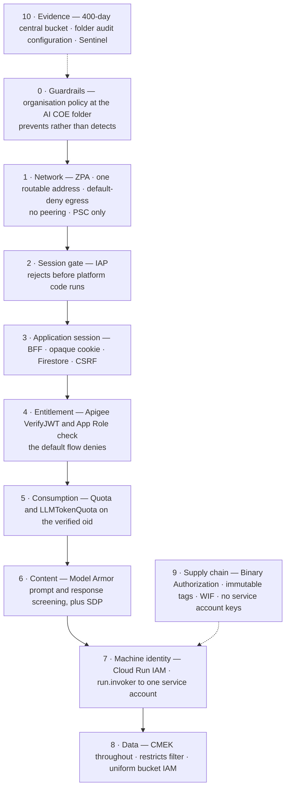

# Low Level Design — AICOE GCP Infrastructure

**Version 2.0.2 · Colt AI Centre of Excellence · Google Cloud Platform**\
**Environments covered: Sandbox and Development**

| | |
|---|---|
| **Classification** | **Internal — Restricted** |
| Version | 2.0.2 |
| Status | Draft |
| Last Updated | August 2026 |
| Owner | AICOE Cloud Platform Team |

---

# 1. Document Control

## 1.1 Purpose

This Low Level Design describes the target-state build of the Colt AI Centre of Excellence platform on Google Cloud across two environments.

**Sandbox** (`aicoesandox`) is a single, self-contained project and VPC addressed from `192.168.1.0/24`, with `192.168.2.0/24` held alongside it for Private Service Connect. It is the environment in which the AI CoE developer team tests and experiments: it carries a Vertex AI Workbench instance for interactive work, Cloud Run services for the translation and sales-agent use cases behind two internal load balancers, and deterministic outbound egress through Cloud NAT. 

**Development** is the platform environment: eight Google Cloud projects — seven of its own plus the shared seed project — under a single Shared VPC, an Apigee organisation acting as both API gateway and AI gateway, a Cloud Run Backend-for-Frontend as the single user entry point behind Identity-Aware Proxy, and Vertex AI reachable only through a metered, screened gateway path. Production is not built by this document; it repeats the Development design with different address ranges.

The document is written to be buildable. Every value in it — project identifier, subnet range, service account, policy name, quota figure — is either a decision recorded by the design authority or is explicitly marked as allocated by a Google service at provisioning time.

## 1.2 Revision history

| Rev | Date | Change | Author |
|---|---|---|---|
| 2.0.1 | — | Previous baseline, superseded by this revision | AI CoE Platform Team |
| 2.0.2 | 10 Aug 2026 | Consolidated baseline covering Sandbox and Development, with all security content brought under a single parent section. Development re-addressed onto `192.168.4.0/22`, and Sandbox recorded as `192.168.1.0/24` with `192.168.2.0/24` held for Private Service Connect — raising the Cloud Run instance ceiling from 31 to 127 as a consequence of the larger workload subnet. Within Development, `192.168.6.64/26` is held in reserve for the proxy-only subnet's mandatory role-swap, placing the PSC NAT, internal-VIP and global-PSC blocks at `192.168.6.128/28`, `192.168.6.144/28` and `192.168.6.160/28` accordingly. The instance-budget note that described the Cloud Run workload subnet as expandable in place is corrected: a new use case is given its own subnet carved from `192.168.7.0/24`. High level architecture diagrams added for Development and Sandbox, each split across two parts for legibility, replacing the diagram source listings that previously appeared in **Platform topology**. Every diagram carrying an address was re-labelled onto this addressing plan, and the session cookie name in the sign-in sequence was corrected to `__Host-AISESSION` | AI CoE Platform Team |

## 1.3 Review and approvals

| Team | Name | Responsibility | Status | Date |
|---|---|---|---|---|
| AICOE Platform Team | *TBC* | Design authority for this document — owner of every value recorded in it, covering infrastructure, DevOps and Terraform delivery | Pending | |
| Colt Cloud CoE | Naveen Raman | Organisation policy, folder and project provisioning, billing, IPAM, subnet and firewall baseline, ZPA connector configuration | Pending | |
| Colt CSOC | *TBC* | Firewall opening for `10.110.73.20`, SIEM onboarding, pre-go-live security assessment | Pending | |
| PM Team | Alejandro Bottaniz, Yogesh Gupta | Design sign-off, CAB submission, change record ownership and closure, change window communication and Service Management update | Pending | |

## 1.4 Abbreviations, terms and definitions

| Term | Definition |
|---|---|
| **ADC** | Application Default Credentials — the credential chain a Google client library resolves automatically |
| **AI Hub** | The single user-facing entry point of the Development platform: a Cloud Run service hosting the single-page application and the Backend-for-Frontend. **Development only — there is no AI Hub in Sandbox** |
| **AICOE** | AI Centre of Excellence — the owning organisational unit and the Google Cloud folder under which every project in this design sits |
| **ALB** | Application Load Balancer |
| **API** | Application Programming Interface |
| **Apigee environment** | A deployment target within an Apigee organisation. The Development platform has `int` (user API) and `llm` (AI gateway) |
| **Apigee environment group** | A mapping of hostnames to environments. Apigee selects the environment from the request's `Host` header |
| **Apigee organisation** | The top-level Apigee container. One per Google Cloud project, permanent, cannot be renamed or moved |
| **App Role** | An entitlement defined on an Entra ID application registration and assigned to users or groups. Emitted as a `roles[]` array in the token |
| **Attestation** | A cryptographic signature over a container image digest, verified by Binary Authorization before the image may run |
| **BFF** | Backend-for-Frontend — a server-side component that owns the OAuth client, so the browser holds only an opaque session cookie |
| **Binary Authorization** | A Google Cloud deploy-time control that refuses container images lacking a valid attestation |
| **BM25** | A lexical relevance ranking function used alongside vector similarity in hybrid retrieval |
| **BR-nn** | Business requirement identifier, defined in **Requirements** |
| **BU** | Business Unit — the tenancy dimension used for cost attribution and Vector Search isolation |
| **CAB** | Change Advisory Board — the Colt governance forum that approves the change record and the build window |
| **CAF** | Cloud Adoption Framework — the Colt-adopted structure for cloud governance, referenced by the compliance requirements |
| **CDN** | Content Delivery Network |
| **CI/CD** | Continuous Integration / Continuous Delivery |
| **CIDR** | Classless Inter-Domain Routing — the address-range notation used throughout this document |
| **CIS** | Center for Internet Security — source of the GCP Foundation Benchmark |
| **CMEK** | Customer-Managed Encryption Key — a Cloud KMS key owned by Colt, used to encrypt a Google-managed resource |
| **CoE** | Centre of Excellence. The Colt Cloud CoE owns the enterprise cloud controls, organisation policy and project provisioning |
| **Confidential client** | An OAuth client that can hold a secret because it runs on a server. The Backend-for-Frontend is one; a browser single-page application is not |
| **CR-nn** | Compliance requirement identifier, defined in **Requirements** |
| **CRL** | Certificate Revocation List |
| **CSF** | Cybersecurity Framework — NIST CSF 2.0 |
| **CSIRT** | Computer Security Incident Response Team — the responder group engaged by the kill-switch and incident procedures |
| **CSOC** | Colt Security Operations Centre — owns firewall openings on the Colt corporate network, SIEM onboarding and alert response |
| **CSR** | Certificate Signing Request |
| **CSRF** | Cross-Site Request Forgery — an attack in which a third-party site causes the browser to send an authenticated request. Relevant because the Development session is cookie-borne |
| **DAST** | Dynamic Application Security Testing — scanning a running application |
| **DEK** | Data Encryption Key — a symmetric key that encrypts data and is itself wrapped by a KMS key |
| **DLP / SDP** | Sensitive Data Protection (formerly Cloud DLP) — inspection and de-identification of personal data |
| **D-nn** | Decision identifier, recorded in **Decision Log** |
| **DNS** | Domain Name System |
| **DPIA** | Data Protection Impact Assessment — required where processing is likely to present a high risk to individuals |
| **DR** | Disaster Recovery |
| **DRS** | Domain Restricted Sharing — the `iam.allowedPolicyMemberDomains` organisation policy. Forbids `allUsers` |
| **Entra ID** | Microsoft Entra ID (formerly Azure AD) — Colt's corporate identity provider |
| **envgroup** | Shorthand for Apigee environment group |
| **`EXECUTION_SKIPPED`** | A Model Armor outcome meaning a filter did not run because the content exceeded its token limit. **Not** a pass |
| **Firestore Native** | Firestore in Native mode — the document database holding sessions, jobs and idempotency keys |
| **GCP** | Google Cloud Platform |
| **GCS** | Google Cloud Storage |
| **GDPR** | General Data Protection Regulation |
| **IaC** | Infrastructure as Code — in this platform, Terraform |
| **IAM** | Identity and Access Management |
| **IAP** | Identity-Aware Proxy — Google's authentication checkpoint in front of a load balancer backend service or a Cloud Run service |
| **IAP SSH** | Administrative SSH brokered through IAP's TCP forwarding range `35.235.240.0/20`. The only remote access path to the Sandbox Workbench |
| **IBAN** | International Bank Account Number — one of the sensitive-data infoTypes screened by the guardrail templates |
| **ILB** | Internal Application Load Balancer — regional, `INTERNAL_MANAGED` scheme |
| **IPAM** | IP Address Management — the Colt process for allocating address ranges |
| **ISMS** | Information Security Management System — the ISO/IEC 27001 scope |
| **JIT** | Just-in-Time — time-bounded privilege elevation, granted on approval and expiring automatically |
| **JML** | Joiner / Mover / Leaver — the identity lifecycle process that drives group membership and access removal |
| **JWKS** | JSON Web Key Set — the published public keys a token issuer signs with |
| **JWT** | JSON Web Token |
| **KMS** | Key Management Service — Cloud KMS, which holds every CMEK in this design |
| **KVM** | Key Value Map — an Apigee runtime lookup table, scoped to an environment |
| **LLD** | Low Level Design — this document |
| **LLM** | Large Language Model |
| **`LLMTokenQuota`** | An Apigee **Extensible** policy enforcing token consumption limits per API Product over an interval. Returns 429 |
| **MFA** | Multi-factor authentication |
| **MNPI** | Material Non-Public Information — a data class that must not be submitted to the platform |
| **Model Armor** | Google Cloud's screening service for prompt injection, jailbreak patterns, malicious URLs and sensitive data |
| **NAT** | Network Address Translation. Cloud NAT provides Sandbox outbound egress from two fixed addresses |
| **NCSC** | National Cyber Security Centre — source of guidance referenced by the compliance requirements |
| **NEG** | Network Endpoint Group. A **serverless NEG** points a load balancer backend service at a Cloud Run service |
| **NIS2** | Network and Information Security Directive 2 |
| **OCSP** | Online Certificate Status Protocol |
| **`oid`** | The Entra ID object identifier claim — the immutable per-user key on which all rate limiting and cost attribution is based |
| **OIDC** | OpenID Connect — the identity layer over OAuth 2.0 used by both Entra ID sign-in and GitLab CI federation |
| **ONNX** | Open Neural Network Exchange — a portable model format, relevant to model provenance controls |
| **P4SA** | Per-Product Service Account, more commonly *service agent* — a Google-managed identity a service uses to act on your behalf |
| **PAM** | Privileged Access Management |
| **PII** | Personally Identifiable Information |
| **PKI** | Public Key Infrastructure |
| **PM** | Project Management — the PM Team owns change governance, CAB submission and stakeholder communication |
| **PR-nn** | Performance requirement identifier, defined in **Requirements** |
| **`PromptTokenLimit`** | An Apigee **Extensible** policy throttling on prompt size. Enforces a rate but keeps no persistent count, so it cannot substitute for `LLMTokenQuota` |
| **PSC** | Private Service Connect — private connectivity to a producer service without VPC peering |
| **PSC service attachment** | The producer side of a PSC connection — what a consumer endpoint connects to |
| **PSC service endpoint** | Apigee's internal-routing option: an address inside the VPC that reaches the Apigee runtime |
| **RACI** | Responsible, Accountable, Consulted, Informed — the accountability model in **Requirements** |
| **RAG** | Retrieval-Augmented Generation — retrieving documents and placing them in a model's context |
| **RBAC** | Role-Based Access Control |
| **`restricts`** | A Vertex AI Vector Search field carrying namespace/value tags used to filter query results. The business-unit isolation mechanism |
| **R-nn** | Risk identifier, recorded in **Risk Register** |
| **`roles/run.invoker`** | The Cloud Run IAM role permitting a principal to invoke a service |
| **RPO** | Recovery Point Objective — the maximum tolerable data loss, measured in time |
| **RTO** | Recovery Time Objective — the maximum tolerable time to restore service |
| **SA** | Service Account |
| **SAST** | Static Application Security Testing — scanning source code without executing it |
| **Serverless NEG** | See NEG. Must live in the same project as the Cloud Run service it points at |
| **Service agent** | See P4SA. Created **lazily** — must be forced into existence before a KMS or IAM binding can reference it |
| **Shared VPC** | A model in which one *host* project owns the network and *service* projects run workloads inside it. Used in Development; **not** used in Sandbox |
| **Shielded VM** | A Compute Engine hardening option combining vTPM, Secure Boot and Integrity Monitoring. Applied to the Sandbox Workbench |
| **SIEM** | Security Information and Event Management — Microsoft Sentinel |
| **SLA** | Service Level Agreement |
| **SLI** | Service Level Indicator — the measured signal behind an SLO |
| **SLO** | Service Level Objective |
| **SOP** | Standard Operating Procedure |
| **SPA** | Single-page application — the browser-side AI Hub client |
| **`SpikeArrest`** | An Apigee Standard policy smoothing traffic bursts. Per message processor unless `UseEffectiveCount` is true. Returns **500** by default |
| **SSH** | Secure Shell |
| **SSL / TLS** | The transport encryption protocols. TLS is the current standard; SSL survives only in Google resource names |
| **SSO** | Single Sign-On |
| **TF** | Terraform |
| **TPM** | Trusted Platform Module. The Workbench uses a virtual TPM (vTPM) |
| **TR-nn** | Technical requirement identifier, defined in **Requirements** |
| **TSA** | Colt internal Technical Security Architecture standard, referenced by the compliance requirements |
| **TTL policy** | Firestore's time-to-live deletion. Lags by up to **24 hours**, so it is housekeeping, not enforcement |
| **UPN** | User Principal Name — the Entra ID sign-in identifier |
| **`UseEffectiveCount`** | The `SpikeArrest` element that synchronises counts across message processors |
| **Vertex AI Workbench** | Google's managed Jupyter notebook environment. Provisioned in **Sandbox only** |
| **VPC** | Virtual Private Cloud |
| **VPC-SC** | VPC Service Controls — a data-exfiltration perimeter |
| **VPN** | Virtual Private Network |
| **WIF** | Workload Identity Federation — machine authentication from GitLab CI to Google Cloud without a downloadable key |
| **Workforce pool** | Workforce Identity Federation — the Google side of the Entra ID arrangement that lets a Colt employee sign in |
| **`X-Serverless-Authorization`** | A header carrying an authentication token to Cloud Run. IAP's internal hop uses it; with no IAP in the path it is the documented header for a caller presenting a Cloud Run IAM token |
| **XSS** | Cross-site scripting |
| **ZPA** | Zscaler Private Access — how Colt users reach the Development platform. Connector range `10.100.209.0/29` |

---

# 2. Design Objectives, Scope and Constraints

## 2.1 Key design goals

| # | Goal | Mechanism | Rationale | Applies to |
|---|---|---|---|---|
| G1 | Zero public-IP workloads | Cloud Run services and the Vertex AI Workbench carry no external address. Reachable only through internal Application Load Balancers | Removes the internet-facing attack surface. A workload with no public address cannot be reached by a misdirected scan or a mistaken firewall rule | Sandbox, Dev, Prod    |
| G2 | Private Google API access | A Private Service Connect endpoint per environment, with private DNS overriding `*.googleapis.com` and `*.googleusercontent.com` | Keeps API traffic on Google's backbone, closes the most common exfiltration path, and leaves the design ready for a VPC Service Controls perimeter | Sandbox, Dev, Prod |
| G3 | Data stays in the EU | `gcp.resourceLocations` pinned to `europe-west1`; Secret Manager manual replication; Apigee analytics region in the EU; KMS keys regional | Residency requirement. The pinning costs one Model Armor capability, addressed in **AI Gateway and Vertex AI — Apigee `llm` Environment** | Sandbox, Dev, Prod |
| G4 | Preventive guardrails in place of detective controls | Ten organisation policies set at the `AI COE` folder, inherited by every child project | A policy at the folder applies the moment a project is created. A check in a pipeline applies only to what goes through the pipeline | Sandbox, Dev, Prod |
| G5 | Credential-free CI/CD | GitLab OIDC to Workload Identity Federation with an attribute condition. No downloadable service account keys exist | Long-lived keys are the most common cause of CI credential leakage and lateral movement | Sandbox, Dev, Prod |
| G6 | Nothing runs that was not built by the pipeline | Binary Authorization with a KMS-backed attestor, immutable Artifact Registry tags | Closes the supply-chain gap at deploy time and removes console-deployed images from the platform | Sandbox, Dev, Prod |
| G7 | 400 days of retained evidence, held centrally | One user-defined log bucket per environment in the `auditlogs` project, fed by a folder-level aggregated sink with `include_children` | `_Required` is fixed and per-project; `_Default` is per-project and short. Neither satisfies the retention requirement | Sandbox, Dev, Prod |
| G8 | Layered blast-radius containment | Terraform state split by stage, so a faulty apply or a compromised credential affects one stage rather than the environment | Limits the impact of the most likely operational failure to a single tier | Sandbox, Dev, Prod |
| G9 | Deterministic Sandbox egress | Cloud Router and Cloud NAT with two reserved static external addresses | Fixed egress addresses let partners and upstream systems allow-list the platform, so outbound access is auditable and constrained | Sandbox |
| G10 | Hardened interactive compute | Shielded VM Workbench with vTPM, Secure Boot and Integrity Monitoring; OS Login, root and `nbconvert` disabled; access by IAP SSH only | The Workbench is the only interactive host on the platform and therefore its largest host-level attack surface | Sandbox |
| G11 | One interactive login per session, including across token refresh | IAP establishes the Entra session; the Backend-for-Frontend's authorisation-code exchange reuses it non-interactively with `login_hint` from the IAP assertion. Refresh happens server-side | A second prompt would be interpreted as an authentication failure and would undermine the rationale for federated single sign-on | Dev, Prod |
| G12 | No token in the browser | The Backend-for-Frontend is the OAuth client. The browser holds only a 256-bit opaque cookie value with no data in it | Eliminates token theft through cross-site scripting and removes Apigee from the browser's reachable surface | Dev, Prod |
| G13 | Per-user rate limiting and cost attribution, not per-service | Apigee `Quota` and `LLMTokenQuota` keyed on the verified Entra `oid`. Business unit is a reporting dimension only | The consumption budget is defined per individual. Keying quotas on business unit would permit one user to consume another user's allowance | Dev, Prod |
| G14 | The AI gateway is mandatory, not advisory | `roles/aiplatform.user` is granted to `apigee-llm-runtime` and to **no workload service account** | Without this single IAM decision, every quota, safety filter and cost control in the gateway can be bypassed by calling Vertex AI directly | Dev, Prod |
| G15 | One user-reachable address on the whole platform | `10.110.73.20` in `10.110.73.0/24`. Everything else sits in `192.168.4.0/22`, which has no route from the Colt network | An address in an unrouted range remains unreachable from the corporate network even if a firewall rule is opened in error | Dev, Prod |
| G16 | The gateway is consumable by future usecase VPCs | Apigee provisioned non-peered, Private Service Connect throughout | VPC peering is non-transitive, so a peered Apigee could never serve another usecase network. The choice is fixed at organisation creation | Dev, Prod |
| G17 | One authentication mechanism per boundary | IAP proves a *person* at the front door; Apigee decides what they *may do*; Cloud Run IAM proves the *machine* on the last hop | Separating the invocation mechanism from the authorisation mechanism prevents the ambiguity that caused the backend authentication position to be revised repeatedly in earlier design iterations | Dev, Prod |

## 2.2 In scope

### 2.2.1 Sandbox

- The `aicoesandox` project and its own custom-mode VPC — this environment does **not** use the Shared VPC model.
- Primary application subnet `192.168.1.0/25` and a regional Application Load Balancer proxy-only subnet `192.168.1.128/26`.
- Private Service Connect endpoint for Google APIs at `192.168.2.3`, with the private DNS zones that resolve to it.
- Cloud Router and Cloud NAT with two reserved static egress addresses.
- Vertex AI Workbench — Shielded VM, no public address, IAP SSH access only.
- Cloud Run services for the translation and sales-agent use cases.
- Two internal Application Load Balancers — translation and sales agent.
- Cloud Storage buckets with CMEK, BigQuery datasets, Secret Manager and Cloud KMS key rings.
- Vertex AI Vector Search index and PSC-enabled index endpoint.
- GitLab CI/CD with Workload Identity Federation.

### 2.2.2 Development

- The eight Google Cloud projects listed in **Solution Architecture Overview**, their enabled APIs, service agents, IAM and CMEK.
- Shared VPC host and service-project model: one VPC, five subnets, firewall, private DNS, four Private Service Connect flows.
- Two internal Application Load Balancers — the AI Hub front door and the machine-only Backend ILB.
- Identity: Workforce Identity Federation to Entra ID with IAP; Workload Identity Federation to GitLab CI; the full service account inventory.
- The Backend-for-Frontend contract — session store, cookie, lifecycle, CSRF handling, refresh. **The application code itself is built by the application team**; **Backend-for-Frontend and Session Management** states the contract it must meet.
- Apigee organisation, instance, two environments, two environment groups, the user API proxy and the AI gateway proxy, API Products, developer apps, key value maps and target servers.
- Vertex AI consumption model, Model Armor templates, Sensitive Data Protection templates, Vector Search index and endpoint.
- Data platform: Firestore, Cloud Storage, BigQuery, Cloud Tasks, Artifact Registry, Secret Manager, Cloud KMS.
- Logging with a 400-day central bucket, three sinks and folder audit configuration; monitoring, alerting and cost controls.
- Terraform stages, apply order, state layout and the CI/CD pipeline.

### 2.2.3 Both environments

- The ten organisation policies applied at the `AI COE` folder.
- The naming standard and resource labelling set out in **Naming Standard and Tagging**.

## 2.3 Out of scope

| Item | Why, and where it belongs |
|---|---|
| VPC Service Controls | The perimeter is owned, defined and enforced by the Colt Cloud CoE as a centralised enterprise control — **Security Architecture and Operations** |
| Semantic caching in the AI gateway | Left out of the first build. It saves money but introduces a cross-business-unit leakage risk needing its own testing |
| Multi-region disaster recovery | Single-region by design. Recovery is by rebuild from Terraform and Git — **Backup and Restore** |
| Colt-side ZPA configuration and the CSOC firewall change | Owned by Colt Network and Colt CSOC. This document states the one address that needs opening |
| Public DNS zone administration for `colt.net` | Required for DNS-01 certificate validation. Owned by the DNS team, and it carries a lead time |

## 2.4 Immutable and expensive-to-reverse decisions

| # | Decision | Set where | Reversible? |
|---|---|---|---|
| I1 | Apigee provisioned with **no VPC peering** — Private Service Connect throughout | Apigee provisioning wizard | **No.** Fixed at organisation creation |
| I2 | Apigee runtime database encryption key `apigee/runtime-db` | Apigee provisioning wizard | **No.** Cannot be added or changed later |
| I3 | Apigee analytics region — an EU region | Apigee provisioning wizard | **No** |
| I4 | Apigee internal routing using the **service endpoint** option | Apigee provisioning wizard | **No.** A provisioning-time routing choice, not something added afterwards |
| I5 | One Apigee organisation per project, in `gclt-aicoe-dev-apigee` | Apigee provisioning | **No** |
| I6 | Project identifiers | Project creation | **No** |
| I7 | Development subnet ranges — carved from `192.168.4.0/22` | VPC creation | **Expandable, never shrinkable and never movable.** The `/22` is sized so that expansion is possible without renumbering |
| I8 | Sandbox subnet ranges — `192.168.1.0/25` and `192.168.1.128/26` | VPC creation | **Expandable, never shrinkable and never movable.** As-built |
| I9 | `gcp.resourceLocations` pinned to `europe-west1` | Set at the organisation | Changeable, but it is a Colt-wide policy and not this platform's to change |
| I10 | Firestore database mode **Native** and its location | Database creation | **No** |
| I11 | Log bucket **retention lock** | Log bucket | **No, once locked.** Deliberately **not** locked in Development — a locked bucket cannot be deleted for 400 days. Decide separately for production |
| I12 | KMS key deletion | Cloud KMS | Mandatory waiting period. Data encrypted with a destroyed key is unrecoverable |

## 2.5 Day-1 operating model

This subsection describes how that target state is reached on Day 1 and who is accountable for each step: the gates that must be closed before the change window opens, the order in which the platform is built, what must be true for the change to be declared successful, the conditions under which it is rolled back, and the point at which the platform passes to operations. A reader who needs to know whether this design is ready to go live, and what happens if it does not, should be able to answer that here without reading the rest of the document.

### 2.5.1 Delivery teams and Day-1 ownership

| Team | Day-1 scope | Contact |
|---|---|---|
| AICOE Platform Team | The majority of the build — VPC and subnets, PSC, DNS, load balancers and IAP, KMS and CMEK, service accounts and IAM, Apigee organisation and configuration, Vertex AI and Model Armor, logging and monitoring, Terraform and the pipeline. Holds technical rollback authority during the window | *TBC* |
| AICOE Developer Team | Cloud Run application build and deployment, the Backend-for-Frontend implementation against its contract, use-case validation and smoke testing | *TBC* |
| Colt Cloud CoE | Organisation policy at the `AI COE` folder, folder creation, billing, project provisioning, IPAM allocation, subnet and firewall baseline confirmation, ZPA connector configuration | *TBC* |
| Colt CSOC | Firewall opening for `10.110.73.20`, SIEM onboarding and alert response, pre-go-live security assessment. Authority to withdraw the firewall opening on a security-driven rollback | *TBC* |
| PM Team | Design sign-off, CAB submission and approval, change window communication, Service Management update, and closure of the change record whether the outcome is success or rollback | *TBC* |
| Platform Operate | Steady-state operation after handover — alert triage, incident response, access requests, certificate renewal tracking | `platformoperate@colt.net` |

### 2.5.2 Pre-requisite gates

Each gate is owned outside the AICOE Platform Team and carries an external lead time. Those marked ★ should be started immediately regardless of build order.

| # | Gate | Owner | Blocks |
|---|---|---|---|
| P1 | ★ IPAM confirmation of `192.168.4.0/22` against Colt corporate use | Colt Cloud CoE | The Development VPC itself |
| P2 | IPAM allocation of `10.110.73.0/24` | Colt Cloud CoE | The AI Hub front door |
| P3 | CSOC firewall opening for `10.110.73.20` only | Colt CSOC | User access and the end-to-end verification tests |
| P4 | ★ Public `colt.net` DNS zone control for DNS-01 validation, plus a named certificate owner | Colt Cloud CoE / AICOE Platform Team | TLS certificate issue. Expiry is a total outage |
| P5 | Entra app registrations `AI-BFF` and `AI-API`, App Roles, three security groups, optional claims | Identity Team | Workforce Identity Federation and the Backend-for-Frontend |
| P6 | Organisation-level roles `orgpolicy.policyAdmin` and `iam.workforcePoolAdmin` granted | Colt Cloud CoE | Organisation policy and Workforce Identity Federation |
| P7 | Folder `AI COE` created, with `logging.configWriter` and `resourcemanager.folderAdmin` granted | Colt Cloud CoE | Folder sinks and folder audit configuration |
| P8 | Host-project roles for PSC endpoint creation from service projects | Colt Cloud CoE | All four Private Service Connect flows |
| P9 | ★ Penetration test and security assessment booked | Colt CSOC | Go-live. Lead time is measured in weeks and findings land on the critical path |
| P10 | GitLab repositories, CI/CD templates and the branch-as-environment promotion model with approval gates configured | AICOE Platform Team | Every Terraform stage and every Cloud Run deployment |
| P11 | Terraform state backend reachable from the GitLab runner, and rollback capability confirmed — previous state versions and prior Cloud Run revisions available | AICOE Platform Team | Rollback steps 1 and 2 |
| P12 | Change window communicated to AI CoE stakeholders and CAB approval obtained | PM Team | The window itself. Do not proceed without a CAB reference |
| P13 | Apigee licence entitlement for **Extensible** policies confirmed, and the Intermediate-environment cost model reviewed against expected AI-gateway volume | AICOE Platform Team / Commercial | Whether the `llm` environment can carry `LLMTokenQuota`, `PromptTokenLimit` and the Apigee Model Armor policies at all, per **AI Gateway and Vertex AI — Apigee `llm` Environment** |

P10 and P11 are satisfied by AICOE Platform Team infrastructure already in place — the GitLab CI/CD templates and the Terraform state backend — and are listed here as design pre-conditions, not as open dependencies.

### 2.5.3 Day-1 build sequence

Steps 1 through 7 build the Sandbox environment and the organisation policies shared across all three environments; this portion of the sequence is already built. Steps 8 through 31 build the Development environment addressed by this document. Production repeats the same sequence under a different address range.

| # | Activity | Env | Depends on | Exit criterion |
|---|---|---|---|---|
| 1 | Sandbox VPC, subnets `192.168.1.0/25` and `192.168.1.128/26`, firewall, Cloud Router and Cloud NAT with two static addresses | Sandbox | — | Subnets present; NAT egress observed from the two reserved addresses |
| 2 | Sandbox PSC endpoint at `192.168.2.3` and private DNS zones for Google APIs | Sandbox | 1 | `*.googleapis.com` resolves to `192.168.2.3` from inside the VPC |
| 3 | Sandbox KMS key rings and keys; CMEK bound to Cloud Storage, BigQuery and Vertex AI service agents | Sandbox | 1 | Every Sandbox bucket and dataset shows a customer-managed key |
| 4 | Vertex AI Workbench — Shielded VM, no public address, IAP SSH only, CMEK boot and data disks | Sandbox | 3 | Instance reachable only through IAP SSH; no external address present |
| 5 | Sandbox Cloud Run services, serverless NEGs and the two internal load balancers | Sandbox | 3 | Both load balancers serve; no service carries an external ingress setting |
| 6 | Sandbox Vector Search index and PSC index endpoint | Sandbox | 2, 3 | Index deployed; endpoint reachable over the private address |
| 7 | Organisation policies at the `AI COE` folder | Sandbox, Dev, Prod | P6, P7 | All ten policies show as inherited and active in a child project |
| 8 | Enable APIs per project | Dev, Prod | 7 | Each project's enabled-API list matches **Solution Architecture Overview** |
| 9 | **Force service agents into existence** | Dev, Prod | 8 | Each `gcloud beta services identity create` returns an address; addresses recorded per project |
| 10 | KMS key rings and keys, then grant each service agent Encrypter/Decrypter | Dev, Prod | 9 | Every key listed in **Compute and Data Platform** shows its agent on the Permissions tab |
| 11 | Logging — 400-day bucket with CMEK and Log Analytics, three folder sinks, writer-identity grants, `_Default` exclusions, folder audit configuration | Sandbox, Dev, Prod | 10 | Bucket shows 400-day retention and a customer-managed key; all three sinks hold their grants |
| 12 | Network — VPC, five subnets, reserved addresses, firewall, private DNS zones for internal names and user content | Dev, Prod | P1, P2, 8 | Five subnets listed; `egress-deny-all` present at priority 65000 |
| 13 | Attach the three service projects to the Shared VPC | Dev, Prod | 12, P8 | The host network is visible from each service project |
| 14 | PSC to Google APIs, then create the Google APIs private DNS zone | Dev, Prod | 13 | Endpoint status Accepted; the wildcard zone resolves to it |
| 15 | Artifact Registry with CMEK and immutable tags; Artifact Analysis scanning enabled | Sandbox, Dev, Prod | 10 | Repository shows a customer-managed key in both workload projects |
| 16 | Binary Authorization — asymmetric signing key, attestor, enforce policy per workload project | Sandbox, Dev, Prod | 15 | A public sample image is **refused** on deploy |
| 17 | Secret Manager containers with manual EU replication and CMEK | Dev, Prod | 10 | All secrets created with the owner label set |
| 18 | Workload Identity Federation for GitLab, with the attribute condition | Sandbox, Dev, Prod | 8 | Pool and provider show no configuration warnings |
| 19 | Workforce Identity Federation for Entra ID | Dev, Prod | P5, P6 | Pool and provider exist; attribute mapping matches **Security Architecture and Operations** |
| 20 | Apigee — organisation, instance, two environments, two environment groups | Dev, Prod | 10, 12, P13 | Green instance, two environments attached, two environment groups. Allow 60–105 minutes elapsed |
| 21 | Vector Search index, private endpoint, service connection policy | Dev, Prod | 10, 13 | Index deployed with a minimum of two replicas; allocated address recorded |
| 22 | Data services — Cloud Storage, BigQuery, Firestore with TTL policy, Cloud Tasks | Dev, Prod | 10, 13 | All present with CMEK; Firestore TTL policy set on the session expiry field |
| 23 | LLM project — Model Armor templates, Sensitive Data Protection inspection and de-identification templates, quota check | Dev, Prod | 10 | Both Model Armor templates exist in `europe-west1` |
| 24 | Service accounts and IAM, including **removal of `aiplatform.user` from every workload account** | Dev, Prod | 20, 21, 22, 23 | A workload service account cannot call Vertex AI |
| 25 | Cloud Run services deployed to the contract in **Compute and Data Platform** | Dev, Prod | 24 | Ingress internal and load-balancer only, direct VPC egress, `maxScale` within the instance budget |
| 26 | Load balancers — backend services, serverless NEGs, IAP on the AI Hub backend service only, URL maps | Dev, Prod | 25, P3, P4 | Front door reachable over ZPA; backends reachable only from Apigee |
| 27 | PSC for Apigee in both directions — service endpoint recorded, accept list, southbound publish, endpoint attachment | Dev, Prod | 20, 26 | Endpoint status Accepted; a Cloud Run service reaches the `llm` host |
| 28 | Apigee configuration — key value maps, target servers, API Products, developer apps, both proxies | Dev, Prod | 27 | Both proxies deployed; the gateway verification tests pass |
| 29 | Monitoring — log-based metrics, alerting policies, synthetic end-to-end check | Sandbox, Dev, Prod | 11, 28 | Alerts fire against a deliberately triggered condition |
| 30 | End-to-end verification against the acceptance test suite | Dev, Prod | 29 | All tests pass or carry a recorded, accepted exception |
| 31 | Hand over to stakeholders, update Service Management, communicate change success and close the change record | Dev, Prod | 30 | Change record closed with a CAB reference |

Steps 7 to 23 have no dependency on any later build step and can begin as soon as P1 (IPAM confirmation), P6 (organisation-level roles) and P7 (folder creation) are in place.

### 2.5.4 Day-1 exit criteria

**Development**

1. A Colt user on a ZPA-connected device reaches the AI Hub, signs in **exactly once**, and uses both use cases.
2. Browser storage contains **one** `__Host-` prefixed opaque cookie and **no token of any kind**.
3. A translation-entitled user calling a sales endpoint receives 403 from Apigee on the missing App Role.
4. A workload service account calling Vertex AI directly is **denied**.
5. No `allUsers` or `allAuthenticatedUsers` binding exists on any Cloud Run service.
6. The central log bucket contains entries from every project at 400-day retention.
7. A single user request is traceable end to end in the logs and attributable to **the person**, not to a service account.
8. An unsigned container image is refused on deploy, and a service account key creation attempt is refused by policy.

**Sandbox — as-built confirmation**

9. The Workbench carries no external address and is reachable only through IAP SSH.
10. `*.googleapis.com` resolves to `192.168.2.3` from inside the Sandbox VPC.
11. Outbound traffic from Sandbox leaves only from the two reserved NAT addresses.

### 2.5.5 Rollback triggers and procedure

Rollback is a planned outcome of the change process. Technical rollback authority sits with the AICOE Platform Team during the window; the PM Team owns the change record and communicates the outcome.

| Trigger | Rollback scope |
|---|---|
| Application-level failure — a service is unhealthy, the smoke test fails, or the error rate is unacceptable | Cloud Run revision rollback only, step 1. Infrastructure is left in place |
| Infrastructure-level failure — load balancer, NEG, DNS or PSC misconfiguration that cannot be corrected forward inside the window | Steps 1 to 3 |
| IPAM rejects `192.168.4.0/22` after the build has started | Roll back step 12 onward. Every subnet, firewall destination, DNS record and target server carries the range |
| A certificate cannot be issued for a privately resolved name | Roll back the step 26 frontend. The alternative — an internal Colt certificate authority — requires the CA certificate in **every** container image |
| Impact to a workload outside the AI CoE platform | Full rollback, steps 1 to 6, on AICOE Platform Team authority |
| Window overrun with no viable path to the exit criteria | Full rollback, steps 1 to 6. The change is closed as unsuccessful and re-submitted to CAB |

| # | Rollback activity | Owner | Note |
|---|---|---|---|
| 1 | Freeze the pipeline — revoke the apply role from the Terraform deployer identity, then roll Cloud Run services back to the previous revision by traffic split | AICOE Platform Team | Traffic-split rollback is the fastest reversal and requires no rebuild. It depends on P11 (Terraform state backend and rollback capability) having confirmed prior revisions exist |
| 2 | Remove the URL map path rules, leaving the front door serving the AI Hub only, then Terraform apply against the previous approved state or tag | AICOE Platform Team | Stops user traffic reaching a broken backend before infrastructure is reverted |
| 3 | Delete Apigee **proxies and products**, not the organisation | AICOE Platform Team | Organisation deletion carries a waiting period and destroys settings that cannot be recreated |
| 4 | Withdraw the CSOC firewall opening for `10.110.73.20` | Colt CSOC | Only where the rollback is security-driven |
| 5 | Retain the log bucket, all sinks and all KMS keys. Never schedule key destruction; disable newly created key versions only if strictly required | AICOE Platform Team | Evidence retention survives a rollback. Destroying a key makes CMEK-encrypted data unrecoverable |
| 6 | Platform sanity check — networking, DNS and PSC resolution; confirm workloads outside the platform are unaffected and smoke-test existing applications | AICOE Platform Team | Provides evidence that the rollback completed, rather than an assumption that it did |
| 7 | Update Service Management, communicate the change as unsuccessful and document the rollback reason | PM Team | The documented reason is the required input to the CAB re-submission and prevents recurrence of the same failure |

### 2.5.6 Change governance and handover to operations

| Aspect | Position |
|---|---|
| Infrastructure changes | Terraform, merge request, `plan` posted to the request, apply on merge to a protected branch |
| Apigee proxy and product changes | Held in Git, applied by the pipeline service account only. The console is read-only for humans; a console change is treated as drift to be reconciled |
| Organisation policy changes | Colt Cloud CoE change process — external lead time |
| CSOC firewall and IPAM requests | Colt process — external lead time. No platform change should assume same-day turnaround |
| Entra App Role and group membership | Identity Team and service desk. A group membership change needs no application-registration edit, which is the reason for the combined App Roles and groups model |
| Model allow-list additions | A configuration edit to the `allowed-models` key value map, held in Git, with a named approver |
| Emergency change | The break-glass path in **Security Architecture and Operations**. Every use raises an alert |
| Change approval | CAB approval against a submitted change record, obtained by the PM Team before the window opens |
| Authority during the window | AICOE Platform Team for technical decisions including rollback; PM Team for change closure and communication |
| Handover to operations | On closure of the change record the platform passes to Platform Operate at `platformoperate@colt.net`, with the alerting policies, runbooks and the break-glass procedure in place |
| First-30-day operating posture | The AICOE Platform Team remains available to Platform Operate for escalation. Alert thresholds and quota values are reviewed at the end of the period against observed traffic |
| Documentation closure | This design and the change plan are confirmed to be in agreement before the change record is closed. Points requiring a decision are raised with the design authority during the build rather than carried as open items in this document |

---

# 3. Requirements

Each requirement carries an identifier so it can be traced through the design, build and test stages. Compliance identifiers are referenced again in **Security Architecture and Operations** under Security Control Traceability.

## 3.1 Business requirements

| ID | Requirement |
|---|---|
| BR-01 | Provide a single internal entry point through which Colt staff reach AI usecases, without a separate credential |
| BR-02 | Host two usecases at launch — document translation (synchronous API plus asynchronous worker) and a Sales research agent (retrieval-augmented, single-turn responses) |
| BR-03 | Business users submit documents for translation without technical knowledge |
| BR-04 | Support PDF and DOCX source formats |
| BR-05 | Target language configurable per request, using ISO 639-1 codes |
| BR-06 | Translated documents available within 5 minutes for documents up to 25 pages |
| BR-07 | Secure download link issued on translation completion |
| BR-08 | Translation job history auditable by department administrators |
| BR-09 | Sales users interact with the Sales Agent through a conversational interface |
| BR-10 | Sales Agent responses cite the underlying source documents |
| BR-11 | Sales Agent conversation history retained and auditable |
| BR-12 | Department documents remain confidential — no cross-department visibility |
| BR-13 | Retrieved knowledge isolated by business unit, so a query from one unit never returns another unit's documents |
| BR-14 | Model consumption and cost attributable to an individual user and to their business unit |
| BR-15 | A per-user consumption budget, so one user cannot exhaust the platform allowance |
| BR-16 | Entitlement to each usecase granted and revoked by the service desk through existing group membership processes, with no engineering involvement |
| BR-17 | Platform extensible to further usecases and departments without architecture change |
| BR-18 | The AI gateway remains consumable by future usecase VPCs outside this platform's network |
| BR-19 | A documented emergency route to model access if the gateway is unavailable, gated by approval and alerted on every use |
| BR-20 | Support a subsequent production environment without redesigning the development one |

## 3.2 Technical requirements

| ID | Requirement | Applies to |
|---|---|---|
| TR-01 | All resources in `europe-west1`. No exceptions | Sandbox, Dev, Prod |
| TR-02 | All application compute is serverless. The Sandbox Vertex AI Workbench is the single exception, provided for data science | Sandbox, Dev, Prod |
| TR-03 | No public IP address on any workload | Sandbox, Dev, Prod |
| TR-04 | Dev and Prod use one Shared VPC with a host project and attached service projects. Sandbox uses a single standalone VPC | Sandbox, Dev, Prod |
| TR-05 | No VPC peering anywhere on the platform, enforced by `compute.restrictVpcPeering` | Sandbox, Dev, Prod |
| TR-06 | Exactly one address reachable from the Colt corporate network. All other addresses sit in a range with no route from it | Dev, Prod |
| TR-07 | Default-deny egress. Allow only the specific Private Service Connect endpoint addresses on TCP 443 | Sandbox, Dev, Prod |
| TR-08 | Private Google Access off. All Google API traffic through one PSC endpoint per environment, redirected by a private `googleapis.com` zone | Sandbox, Dev, Prod |
| TR-09 | Data at rest encrypted with CMEK through Cloud KMS — Apigee runtime and instance disk, the log bucket, Artifact Registry, Cloud Storage, BigQuery, the Vector Search index, Firestore and Secret Manager | Sandbox, Dev, Prod |
| TR-10 | Data in transit uses TLS 1.2 or above, terminated at the internal load balancer | Sandbox, Dev, Prod |
| TR-11 | All Cloud Run services set `ingress=internal-and-cloud-load-balancing`, except the translation worker which sets `internal`, with direct VPC egress and no unauthenticated invocation | Sandbox, Dev, Prod |
| TR-12 | Cloud Run services use dedicated, minimum-privilege service accounts | Sandbox, Dev, Prod |
| TR-13 | No downloadable service account keys anywhere; `iam.disableServiceAccountKeyCreation` enforced | Sandbox, Dev, Prod |
| TR-14 | Pipeline authentication by Workload Identity Federation with an attribute condition binding `project_path` and `ref_protected` | Sandbox, Dev, Prod |
| TR-15 | Infrastructure defined in Terraform and deployed through CI/CD, with a documented cross-project apply order | Sandbox, Dev, Prod |
| TR-16 | Container images signed and verified by Binary Authorization at deployment, with immutable Artifact Registry tags, in every workload project | Sandbox, Dev, Prod |
| TR-17 | Vertex AI reachable **only** through the `apigee-llm-runtime` service account | Dev, Prod |
| TR-18 | Per-user rate limiting enforced at Apigee, keyed on the verified Entra `oid`, in exactly one place | Dev, Prod |
| TR-19 | No access or refresh token in the browser. Session state held server-side, keyed on the hash of an opaque 256-bit identifier | Dev, Prod |
| TR-20 | The `int` Apigee environment contains **only Standard policies**, enforced by a pipeline check | Dev, Prod |
| TR-21 | Total Cloud Run maximum instances across the workload subnet must not exceed **127** — a hard consequence of the address plan. Ninety are allocated to the Day-1 services; thirty-seven are reserved for future use cases | Dev, Prod |
| TR-22 | Firestore session document writes throttled so the last-seen timestamp is written at most once per minute per document | Dev, Prod |
| TR-23 | No KMS round trip on the request path. Either a cached data encryption key wrapped by KMS, or Firestore CMEK alone | Dev, Prod |
| TR-24 | Fail closed on session-store unavailability — return 503, never a fallback that lets a request through | Dev, Prod |
| TR-25 | Resources labelled with environment, project, team and managed-by | Sandbox, Dev, Prod |

## 3.3 Compliance requirements

| ID | Requirement | Standard / driver |
|---|---|---|
| CR-01 | Personal data processed on the platform remains within the EU | GDPR — residency |
| CR-02 | All resources deployed in `europe-west1` | GDPR — residency |
| CR-03 | Secret Manager uses manual replication pinned to `europe-west1`, not the default global automatic replication | GDPR — residency |
| CR-04 | Apigee analytics region set to an EU region, because request metadata is stored there | GDPR — residency |
| CR-05 | Cloud Audit Logs enabled | CIS 2.1 |
| CR-06 | Data Access audit logs enabled for IAP, Cloud Storage, BigQuery, Vertex AI, Secret Manager, Cloud KMS and Cloud Run. These are off by default, and without them there is no record of who read what | Auditability |
| CR-07 | 400 days of retained logs across all projects, held centrally and queryable | Colt evidence retention |
| CR-08 | Security-relevant logs forwarded to Microsoft Sentinel through a filtered Pub/Sub sink | Colt SOC standard |
| CR-09 | No primitive Owner or Editor role at project level | CIS 1.1 |
| CR-10 | Uniform bucket-level access on all Cloud Storage buckets | CIS 5.1 |
| CR-11 | Public access prevention enforced on all storage, and `iam.allowedPolicyMemberDomains` restricted to Colt's customer identifier | Colt security standard |
| CR-12 | Security notifications restricted to Colt domains by `essentialcontacts.allowedContactDomains` | Colt security standard |
| CR-13 | CIS GCP Foundation Benchmark v1.3 Level 1 | CIS |
| CR-14 | TSA network segmentation — workloads isolated in a custom VPC with default-deny egress and no external addresses on internal compute | TSA |
| CR-15 | TSA encryption — customer-managed keys for data at rest and TLS 1.2 minimum in transit | TSA |
| CR-16 | TSA access logging — administrative and data-access activity logged and forwarded to the enterprise SIEM | TSA |
| CR-17 | Vulnerability assessment on container images before deployment | TSA / Internal |
| CR-18 | Automated security scanning of application source, dependencies, container images and infrastructure-as-code, with defined severity thresholds that block a release and a bounded, approved exception process | ISO 27001 A.8.8 / A.8.28 |
| CR-19 | Prompt content is **not** logged by default. Message logging is metadata-only unless Data Protection signs off a stated purpose and retention | GDPR — purpose limitation and data minimisation |
| CR-20 | Personal data in prompts detected by Sensitive Data Protection templates and **redacted rather than blocked** for translation, where personal data is legitimate content | GDPR — proportionality |
| CR-21 | AI guardrails enforced on the model request and response path — input and output inspection, PII detection, prohibited-content and native safety filtering | Internal / EU AI Act readiness |
| CR-22 | Model access, prompt screening and consumption metering enforced centrally, with evidence that the control cannot be bypassed | AI governance |
| CR-23 | A documented residual risk statement covering gateway-dependent screening and the `EXECUTION_SKIPPED` behaviour | AI governance |
| CR-24 | AI consumption abuse controls — rate limiting, per-identity quotas, execution budgets, cost alerting and automatic cut-off | Internal / FinOps |
| CR-25 | Documented and rehearsed capability to immediately terminate active sessions and agent activity during an incident | NIS2 / Internal incident response |
| CR-26 | Retrieval-time access control documented and enforced for AI retrieval sources, with business-unit isolation applied at both write time and read time | ISO 27001 A.5.15 |
| CR-27 | Access recertification cycle defined for the Entra security groups that drive entitlement | Access governance |
| CR-28 | Penetration test or security assessment completed before go-live | CSOC requirement |
| CR-29 | Cyber Assessment Framework Objective B (protecting against cyber attack) and Objective C (detecting cyber security events) outcomes demonstrably met | NCSC CAF |
| CR-30 | NIS2 Directive obligations — cyber risk management, supply-chain security and incident reporting addressed | NIS2 |
| CR-31 | ISO/IEC 27001:2022 Annex A controls mapped for the platform ISMS scope — access control, cryptography, logging, supplier relationships | ISO 27001 |
| CR-32 | NIST CSF 2.0 functions — Govern, Identify, Protect, Detect, Respond, Recover — mapped for the platform | NIST CSF 2.0 |

> **GDPR erasure — accepted, not solved.** Prompt content may exist in Apigee analytics, the session store, job records, BigQuery and a 400-day log bucket, and some of those cannot be selectively deleted. This is accepted on the basis that logging is metadata-only by default (CR-19, prompt content not logged by default). It must be revisited if prompt-content logging is ever switched on, and that dependency is recorded in **Risk Register**.

### 3.3.1 Compliance framework alignment

The baseline requirements CR-01 (EU data residency) to CR-18 (automated security scanning) cover the CIS GCP Foundation Benchmark, GDPR residency and Colt TSA. The design is additionally aligned to the enterprise frameworks referenced in the AI CoE operating model, as mapped below.

| Framework | Focus area | How this design meets it |
|---|---|---|
| NCSC CAF — Objective B (protecting against cyber attack) | Identity and access control, data security, resilient networks, secure supply chain | IAP with Entra ID single sign-on carrying MFA and Conditional Access; Workload Identity Federation with no static keys; CMEK at rest and TLS 1.2 or above in transit; default-deny egress with Private Service Connect; Binary Authorization at deploy |
| NCSC CAF — Objective C (detecting cyber security events) | Security monitoring, logging and correlation | Cloud Audit Logs including Data Access on seven named services; IAP allow and deny logs; VPC flow logs; Microsoft Sentinel fed through Log Router and Pub/Sub, correlated with Entra sign-in events |
| NIS2 Directive | Risk management, incident handling, supply chain, reporting | Risk Register and Decision Log maintained in this document; RTO and RPO recovery approach; signed-image supply chain through Binary Authorization; centralised SIEM correlation supporting incident reporting; the emergency termination procedure in **Security Architecture and Operations** |
| ISO/IEC 27001:2022 Annex A | A.5 and A.8 — access control, cryptography, logging and monitoring, supplier relationships | A.5.15 access control through Entra App Roles, Apigee authorisation and Vector Search business-unit filtering; A.5.17 authentication through federated identity with no local credentials; A.8.8 and A.8.28 through pipeline scanning and gate policy; A.8.24 cryptography through the CMEK key map; A.8.15 logging through the 400-day central bucket |
| NIST CSF 2.0 | Govern, Identify, Protect, Detect, Respond, Recover | Govern — RACI, Decision Log and change governance. Identify — Risk Register and data classification. Protect — organisation policies, IAM, encryption, guardrails. Detect — log-based metrics, alerting policies and SIEM. Respond — the kill switch and incident classification. Recover — the backup and restore approach |
| EU AI Act — general-purpose and high-risk readiness | Transparency, human oversight, risk management, record keeping | Model version pinning and an allow-list with a named approver; Model Armor screening on request and response with recorded outcomes; per-user metering and audit trail attributable to a person; human approval on the break-glass model path; residual risk statement for gateway-dependent screening |
| Baseline — CIS, GDPR, TSA | Platform hardening, residency, Colt technical security architecture | CR-01 (EU data residency) to CR-18 (automated security scanning) |

## 3.4 Performance requirements

### 3.4.1 Service performance targets

| ID | Requirement | Target |
|---|---|---|
| PR-01 | Translation and Sales Agent API availability | 99.9% over 30 days |
| PR-02 | Translation latency, documents up to 10 pages | Under 30 s at P95 |
| PR-03 | Translation latency, documents up to 50 pages | Under 5 min at P95 |
| PR-04 | Upload API acknowledgement (HTTP 202) | Under 2 s |
| PR-05 | Maximum document size | 50 MB |
| PR-06 | Sales Agent single-turn latency | Under 5 s at P95 |
| PR-07 | Cloud Run scale-out to first response | Under 10 s |
| PR-08 | End-to-end latency budget | **Not yet set.** A request traverses ZPA, the load balancer, IAP, the Backend-for-Frontend, Firestore, Apigee, PSC and the backend load balancer, and IAP adds latency at each front-door call. Must be set and measured before go-live |

### 3.4.2 Platform performance budgets

| ID | Requirement | Target | Note |
|---|---|---|---|
| PR-09 | Session read latency, P95 | Under 25 ms | On the critical path of every API call, and the number most likely to degrade quietly. Alert above it |
| PR-10 | Firestore call timeout | 2 s | Comfortably inside the Cloud Run request timeout |
| PR-11 | Refresh lease duration | 10 s, with the Entra HTTP call timing out well inside it | A 30 s HTTP timeout under a 10 s lease recreates the stampede the lease exists to prevent |
| PR-12 | Maximum wait for a refresh loser before failing | About 2 s, then 503 | Holding Cloud Run instances during a refresh problem turns a token issue into a capacity outage |
| PR-13 | Instance-level session cache | 5 to 15 s, bypassed on logout, rotation and privilege-sensitive operations | The trade is explicit — a revoked session stays valid for up to the cache lifetime |
| PR-14 | Cloud Run request timeout | 600 s for API services, 3,600 s for the worker | The load balancer backend timeout does not apply to serverless backends |
| PR-15 | Session lifetimes | Absolute 8 h aligned to the IAP session; idle 60 min; access token refreshed at 80% of life with jitter | |
| PR-16 | Session rotation grace window | 30 s | Long enough for in-flight browser requests, short enough that a stolen old identifier is worthless |
| PR-17 | Screened model calls, platform ceiling | About 600 per minute | Model Armor allows 1,200 API queries per minute per project, and screening a prompt plus its response is two calls |
| PR-18 | Vector Search availability | Minimum 2 replicas | A single replica means a restart is an outage |
| PR-19 | Cloud Run address consumption alert | Alert when instance count multiplied by two exceeds 250 | The point at which a revision rollout starts to be at risk against the workload subnet |
| PR-20 | Recovery time and recovery point objectives | RTO 4 h, RPO 24 h | Recovery is by rebuild from Terraform and Git — see **Backup and Restore** |

## 3.5 RACI — roles and responsibilities

**R** Responsible (does the work) · **A** Accountable (owns the outcome, one per row) · **C** Consulted · **I** Informed

Work owned by the Colt identity function (Entra ID application registrations, App Roles, security group membership) and by Data Protection (prompt-logging purpose and retention, the GDPR position) is named in the activity text and coordinated by the Colt Cloud CoE. Platform Operate is the distribution list `platformoperate@colt.net` and holds steady-state ownership after handover.

| Activity / control area | AICOE Platform Team | AICOE Developer Team | Colt Cloud CoE | Colt CSOC | PM Team | Platform Operate |
|---|---|---|---|---|---|---|
| Design authorship and technical sign-off | **R/A** | C | C | C | C | I |
| Architecture gate approval and CAB submission | C | I | C | C | **R/A** | I |
| Organisation policies at the `AI COE` folder | C | I | **R/A** | C | I | I |
| Folder creation, billing and project provisioning | C | I | **R/A** | I | I | I |
| IPAM allocation of all platform address ranges | C | I | **R/A** | I | I | I |
| Shared VPC, Sandbox VPC, subnets, firewall and DNS | **R/A** | I | C | C | I | C |
| Firewall rule change after go-live | **R** | I | C | C | I | **A** |
| CSOC firewall opening on the Colt corporate network | C | I | C | **R/A** | I | I |
| ZPA connector configuration | I | I | **R/A** | C | I | I |
| Private Service Connect flows | **R/A** | I | C | I | I | C |
| Load balancers, TLS certificates and IAP configuration | **R/A** | I | C | C | I | C |
| TLS certificate renewal after go-live | C | I | C | I | I | **R/A** |
| Entra ID application registrations, App Roles and redirect URIs | C | C | **R/A** | C | I | I |
| Entra security group membership (joiner, mover, leaver) | I | I | **R/A** | I | I | C |
| Workforce and Workload Identity Federation on the Google side | **R/A** | C | C | C | I | I |
| Service accounts and IAM bindings | **R/A** | C | C | C | I | C |
| Removal of `aiplatform.user` from workload service accounts | **R/A** | I | I | C | I | I |
| Privileged access, entitlement design and just-in-time approval | **R/A** | I | C | C | I | C |
| Break-glass account and its approval path | **R** | I | C | **A** | I | C |
| Access review and recertification | **R** | C | **A** | C | I | C |
| Cloud KMS key rings, keys and CMEK bindings | **R/A** | I | C | I | I | C |
| Secrets provisioning and rotation | **R/A** | C | C | C | I | **R** |
| VPC Service Controls perimeter | C | I | **R/A** | C | I | I |
| Apigee organisation, instance and environments | **R/A** | I | C | I | I | C |
| Apigee proxy and API Product deploy approval | **R/A** | C | I | C | I | C |
| Model allow-list additions | **R** | C | **A** | C | I | I |
| Model Armor and Sensitive Data Protection template configuration | **R/A** | C | C | C | I | C |
| Prompt-logging purpose and retention decision | C | C | **R/A** | C | I | I |
| Cloud Run service build and deployment | C | **R/A** | I | I | I | I |
| Backend-for-Frontend session, CSRF and refresh implementation | **A** | **R** | I | C | I | I |
| `maxScale` allocation from the instance ceiling | **R/A** | C | I | I | I | C |
| RAG ingestion and business-unit labelling | **A** | **R** | I | C | I | I |
| Vertex AI Workbench provisioning and hardening (Sandbox) | **R/A** | C | I | C | I | C |
| Logging design, sinks and retention | **R/A** | I | C | C | I | C |
| SIEM onboarding and alert response | C | I | I | **R/A** | I | C |
| Security incident detection and response | I | I | I | **R/A** | C | C |
| Emergency termination of sessions and agent activity | **R** | C | I | **A** | C | **R** |
| Terraform pipeline, state and policy-as-code | **R/A** | C | C | I | I | C |
| Pipeline security scanning and gate policy | **R/A** | C | I | C | I | I |
| Security finding waiver and exception approval | **R** | C | **A** | C | I | I |
| Penetration test scope and remediation | C | C | I | **R/A** | C | I |
| Backup and recovery execution | **R** | C | I | I | I | **A** |
| Billing budgets, cost attribution and chargeback | **R** | C | **A** | I | I | C |
| Risk Register and Decision Log upkeep | **R/A** | C | C | C | I | C |
| Change record ownership, closure and stakeholder communication | C | I | I | I | **R/A** | I |
| Steady-state alert triage and incident escalation | C | C | I | C | I | **R/A** |
| Production promotion | **R** | C | **A** | C | C | C |

---

# 4. Solution Architecture Overview

## 4.1 Architecture summary

Two environments share one folder, one set of organisation policies and one delivery pipeline, and differ in almost everything else.

**Sandbox** is a single project on its own VPC. Two internal Application Load Balancers front the translation and sales-agent Cloud Run services, each protected by Identity-Aware Proxy authenticating **Google identities directly** — there is no Entra workforce pool and no Backend-for-Frontend in this environment. A Vertex AI Workbench provides interactive compute, Cloud NAT gives deterministic outbound egress from two fixed addresses, and Google APIs are reached privately through a PSC endpoint at `192.168.2.3`. There is no AI Hub and no Apigee. The Cloud Run services cannot be reached except through the load balancer, and cannot be published publicly at all — both are consequences of organisation policy rather than of service configuration.

**Development** is the platform. Colt users reach one address, `10.110.73.20`, through ZPA. An internal Application Load Balancer with Identity-Aware Proxy sits in front of a Cloud Run Backend-for-Frontend, which serves the interface and is the OAuth client — the browser holds only an opaque session cookie, never a token. The Backend-for-Frontend calls Apigee server-side at an internal service endpoint, where per-user rate limiting is enforced on the Entra `oid` and entitlement is checked against App Roles. Apigee reaches the backend Cloud Run services over Private Service Connect, authenticating with a Google ID token validated against `roles/run.invoker`. Both backends call Vertex AI through a second Apigee environment that meters token spend per user. Everything except that one address sits in `192.168.4.0/22`, which has no route from the Colt network.

**Production** repeats the Development design with different address ranges.

## 4.2 Organisation, folder and project structure

```
Colt Organisation
│
└── AI COE                                    ← organisation policy attaches HERE
    │                                           hierarchical firewall policy too
    │
    ├── shared
    │   ├── aicoe-sharedwif                   GitLab WIF pool and providers, Terraform state bucket
    │   │                                     ⚠ serves Dev and Prod both · namespace exception
    │   ├── logs/
    │   │   ├── gclt-aicoe-dev-auditlogs      400-day log bucket, folder sinks, Sentinel Pub/Sub
    │   │   └── gclt-aicoe-prod-auditlogs     400-day log bucket, folder sinks, Sentinel Pub/Sub
    │   ├── network/
    │   │   ├── gclt-aicoe-dev-network        SHARED VPC HOST — five subnets, private DNS, PSC endpoints
    │   │   └── gclt-aicoe-prod-network       SHARED VPC HOST — same design, IPAM-allocated ranges
    │   ├── ingress/
    │   │   ├── gclt-aicoe-dev-ingress        AI Hub ILB frontend 10.110.73.20
    │   │   │                                 Backend ILB frontend 192.168.6.145
    │   │   │                                 PSC service attachment, Binary Authorization attestor
    │   │   └── gclt-aicoe-prod-ingress       Same design, IPAM-allocated addresses
    │   ├── apigee/
    │   │   ├── gclt-aicoe-dev-apigee         Apigee X organisation, non-peered
    │   │   │                                 env int (Base) · env llm (Intermediate)
    │   │   │                                 service endpoint 192.168.6.146
    │   │   └── gclt-aicoe-prod-apigee        Separate organisation — one per project, immutable
    │   ├── aihub/
    │   │   ├── gclt-aicoe-dev-aihub-ui       Cloud Run Backend-for-Frontend, IAP (workforce)
    │   │   │                                 Firestore · Secret Manager · KMS
    │   │   └── gclt-aicoe-prod-aihub-ui      Same design
    │   └── llm/
    │       ├── gclt-aicoe-dev-llm            Vertex AI target — NO COMPUTE
    │       │                                 quota · billing · Model Armor · CMEK
    │       └── gclt-aicoe-prod-llm           Same design, separate quota and billing boundary
    │
    ├── Dev
    │   └── usecases/
    │       └── gclt-aicoe-dev-st             translation-api-service
    │                                         sales-research-application
    │                                         translation-worker-service
    │                                         mcp-server (future)
    │                                         Cloud Tasks · BigQuery · GCS
    │                                         Vector Search 192.168.6.147
    │
    ├── Prod
    │   └── usecases/
    │       └── gclt-aicoe-prod-st            Same service set as Dev
    │
    └── Sandbox
        └── aicoesandox                       Standalone VPC 192.168.1.0/24 + 192.168.2.0/24 (PSC)
                                              Workbench · two ILBs · Cloud NAT
                                              PSC to Google APIs 192.168.2.3
                                              namespace exception
```

**The four branches under `AI COE`.** `shared` holds the platform projects that are not usecase-specific, grouped by function rather than by environment — each of `logs`, `network`, `ingress`, `apigee`, `aihub` and `llm` holds one Dev project and one Prod project, so a reader looking for "the network host" finds both in one place. `Dev` and `Prod` each hold a `usecases/` sub-folder with that environment's workload project. `Sandbox` holds the single `aicoesandox` project. Organisation policy and the hierarchical firewall policy attach at `AI COE`, above all four branches, so every project inherits them regardless of which branch it sits in.

**Project namespace.** Projects are named `gclt-aicoe-{env}-{function}`, where `env` is `dev`, `prod` or `sandbox` and `function` is the platform role — `network`, `ingress`, `apigee`, `aihub-ui`, `llm`, `auditlogs`, `st`. Two projects pre-date the convention and cannot be renamed, because a Google Cloud project identifier is immutable after creation:

| Project | Why it is an exception |
|---|---|
| `aicoe-sharedwif` | The seed project. It serves Dev and Prod together, so it has no single `env` value, and rebuilding it would mean re-creating Workload Identity Federation, the Terraform state bucket and every deployer identity that depends on it |
| `aicoesandox` | Pre-dates the convention and is already in developer use |

Both are recorded again in **Naming Standard and Tagging**. Every project created from this point follows the namespace.

> **Projects and organisation policy are provisioned outside Terraform.** All existing projects were created in the console, and organisation policy — including the hierarchical firewall policy — is applied and maintained by the **Colt Cloud CoE** at the `AI COE` folder. A Terraform plan will never show drift in either area, and the AICOE Platform Team cannot add, change or remove a policy itself. The risk this creates is recorded in **Risk Register**.

### 4.2.1 Project inventory

Each environment holds seven projects of its own and shares `aicoe-sharedwif` with the other, so a complete environment is eight projects. Sandbox is the exception at one.

| Function | Dev project | Prod project | Shared VPC | Holds compute |
|---|---|---|---|---|
| Network host | `gclt-aicoe-dev-network` | `gclt-aicoe-prod-network` | Host | No |
| Ingress | `gclt-aicoe-dev-ingress` | `gclt-aicoe-prod-ingress` | Service | No |
| API and AI gateway | `gclt-aicoe-dev-apigee` | `gclt-aicoe-prod-apigee` | **Not attached** — Apigee reaches the platform over PSC, not by sharing the network | Managed |
| AI Hub | `gclt-aicoe-dev-aihub-ui` | `gclt-aicoe-prod-aihub-ui` | Service | Yes |
| Usecases | `gclt-aicoe-dev-st` | `gclt-aicoe-prod-st` | Service | Yes |
| Vertex AI target | `gclt-aicoe-dev-llm` | `gclt-aicoe-prod-llm` | Not attached — needs no network | No |
| Audit logs | `gclt-aicoe-dev-auditlogs` | `gclt-aicoe-prod-auditlogs` | Not attached | No |
| Seed / federation | `aicoe-sharedwif` | `aicoe-sharedwif` — the same project | Not attached | No |
| Sandbox | — | — | Standalone VPC, not Shared VPC — `aicoesandox` | Yes |

| Function | What the project owns |
|---|---|
| Network host | The VPC, subnets, firewall, private DNS, PSC endpoints and published services |
| Ingress | Load balancer frontends — addresses, forwarding rules, URL maps, target proxies, certificates. Also the Binary Authorization attestor and its signing key |
| API and AI gateway | The Apigee organisation, instance, both environments and both environment groups |
| AI Hub | The Backend-for-Frontend Cloud Run service, its backend service and serverless NEG, and the Firestore session store |
| Usecases | Translation and Sales Agent Cloud Run services, their backend services and NEGs, and their data — Cloud Storage, BigQuery, Cloud Tasks, Vector Search |
| Vertex AI target | Central Vertex AI target, Model Armor templates and Sensitive Data Protection templates. **Holds no compute** |
| Audit logs | The 400-day log bucket, its linked BigQuery dataset, log views and the Sentinel Pub/Sub topic |
| Seed / federation | The GitLab Workload Identity Federation pool and provider, and the Terraform state bucket |
| Sandbox | Everything in one project — VPC, Workbench, Cloud Run services, two ILBs, Cloud NAT, data services |

**Why the Vertex AI target project holds no compute.** It exists to be the single project every Vertex AI call in its environment is billed and quota-counted against, so consumption is visible in one place instead of scattered across usecases. It is also the boundary the Model Armor templates and the `aiplatform.user` grant sit on — the two controls that make the AI gateway mandatory.

**Criticality of `aicoe-sharedwif`.** Every other stage's Terraform identity depends on it: bootstrap runs against it to create the state bucket and the `tf-deployer` service accounts everything else impersonates, and it is the one project that spans Development and Production. If its Workload Identity Federation provider condition is permissive, any repository that can request a token for the audience can impersonate a production deployer.

**Why Apigee is two organisations, not one.** An Apigee organisation is fixed to one Google Cloud project and cannot be moved, so Production cannot share the Development organisation. The provisioning-time settings that are immutable — non-peered networking, the runtime database key, the analytics region and service-endpoint routing — must therefore be set correctly a second time when Production is built. They are listed in **Design Objectives, Scope and Constraints** under Immutable and expensive-to-reverse decisions.

## 4.3 Environment and project mapping

| Attribute | Sandbox | Dev | Prod |
|---|---|---|---|
| Project model | Single project, standalone VPC | Eight projects, Shared VPC host and service projects | Eight projects, same design as Dev |
| Project identifiers | `aicoesandox` | `gclt-aicoe-dev-*` plus `aicoe-sharedwif` | `gclt-aicoe-prod-*` plus `aicoe-sharedwif` |
| Project number | 297743845367 | Per project | Per project, allocated at creation |
| `envname` | `sandox` | `dev` | `prod` |
| Region | `europe-west1` | `europe-west1` | `europe-west1` |
| Unrouted range | `192.168.1.0/24` for subnets, `192.168.2.0/24` for PSC | `192.168.4.0/22` — no route from the Colt network | Allocated by IPAM |
| Workload subnet | `192.168.1.0/25` | `192.168.4.0/23` | Allocated by IPAM |
| User-reachable range | None — direct developer access inside the VPC | `10.110.73.0/24`, one address opened | Allocated by IPAM |
| Proxy-only subnet | `192.168.1.128/26` | `192.168.6.0/26` | Allocated by IPAM |
| Google APIs PSC endpoint | `192.168.2.3` | `192.168.6.164` | Allocated by IPAM |
| Internal DNS zone | `aicoesandox-int.colt.net.` | `aicoe-dev-int.colt.net.` | `aicoeprod-int.colt.net.` |
| Internal load balancers | Two — translation, sales agent | Two — AI Hub front door, Backend ILB | As Dev |
| Cloud NAT | Yes, two reserved static addresses | No | No |
| Vertex AI Workbench | Yes | No | No |
| AI Hub and Backend-for-Frontend | No | Yes | Yes |
| Apigee | No | Yes — `int` and `llm` | Yes |
| Identity-Aware Proxy | Yes, on both load balancer backend services — **Google identities, no Entra federation** | Yes, on the AI Hub backend service only — **Entra ID through a workforce pool** | As Dev |
| VPC Service Controls | Enforced — owned by the Colt Cloud CoE | Enforced — owned by the Colt Cloud CoE | Enforced — owned by the Colt Cloud CoE |

Resource naming follows `{project}{envname}` — see **Naming Standard and Tagging**.

## 4.4 Platform topology

### 4.4.1 Development — Shared VPC

{width=6.5in}

{width=6.5in}

### 4.4.2 Sandbox — standalone VPC

{width=6.5in}

{width=6.5in}

> **Where Sandbox logs land.** Sandbox has no `auditlogs` project of its own. The `AI COE` folder sink carries every child project, so Sandbox log entries are synced into the 400-day bucket in `gclt-aicoe-dev-auditlogs` alongside Development. No third bucket, sink or CMEK key is created for Sandbox.

Sandbox reaches Vertex AI directly rather than through a gateway, because there is no Apigee in this environment. The consequence is that the per-user metering, prompt screening and token quota described in **AI Gateway and Vertex AI — Apigee `llm` Environment** do not apply in Sandbox; the compensating controls are the project-level Vertex AI quota and the budget alerting described in **Security Architecture and Operations**.

## 4.5 Logical request flows

### 4.5.1 Interactive user request — Dev, synchronous

| Step | Hop | Behaviour |
|---|---|---|
| 1 | Browser → ZPA | Corporate device, ZPA tunnel. Connector source range `10.100.209.0/29` |
| 2 | ZPA → AI Hub ILB `10.110.73.20` | HTTPS 443, certificate for `aihub.aicoe-dev-int.colt.net` |
| 3 | ILB → IAP | Unauthenticated traffic is rejected **before** it reaches the container. On success IAP sets its own session cookie and adds `x-goog-iap-jwt-assertion` |
| 4 | IAP → Backend-for-Frontend | The IAP service agent of `gclt-aicoe-dev-aihub-ui` invokes the service holding `roles/run.invoker`. **The only IAP grant in the platform** |
| 5 | BFF → Firestore | Session lookup on the SHA-256 of the session identifier taken from the `__Host-` prefixed cookie. Instance cache 5 to 15 s. **Fail closed with 503 if unavailable** |
| 6 | BFF → Apigee `int` at `192.168.6.146` | Server-side. Bearer is the Entra access token from the session; the `Host` header selects the environment group; an Apigee client key resolves the API Product |
| 7 | Apigee `int` policy chain | SpikeArrest on `oid` → VerifyJWT → extract `oid`, `roles[]` and `department` → 403 if the App Role is absent → VerifyAPIKey → Quota per minute → Quota per day → strip and inject headers |
| 8 | Apigee → endpoint attachment → PSC → Backend ILB `192.168.6.145` | The source address presented to the load balancer originates from `192.168.6.128/28` and carries no attribution value. Attribution is derived from the forwarded user context and the Apigee message identifier |
| 9 | Backend ILB → serverless NEG → Cloud Run backend | Google ID token in `X-Serverless-Authorization`, audience is the Cloud Run service URL, validated against `roles/run.invoker` granted to `apigee-int-runtime` alone |
| 10 | Backend service | Strips any inbound `x-colt-*` header, reads the injected verified user context, executes |

### 4.5.2 Model inference — Dev, east-west

| Step | Hop | Behaviour |
|---|---|---|
| 1 | Backend service → Apigee `llm` at `192.168.6.146` | `Host: llm.aicoe-dev-int.colt.net`. Carries a Google ID token for the calling service account, an Apigee credential resolving the API Product, and the forwarded user context |
| 2 | Apigee `llm` policy chain | SpikeArrest → VerifyJWT on the caller identity, checked against the permitted list → VerifyAPIKey → VerifyJWT on the forwarded assertion → key value map lookup of group to business unit → PromptTokenLimit → LLMTokenQuota **enforce** → Model Armor prompt sanitisation → force `safetySettings` → key value map model selection |
| 3 | Apigee → Vertex AI in `gclt-aicoe-dev-llm` | Target server `europe-west1-aiplatform.googleapis.com`, authenticating as `apigee-llm-runtime`. **No workload service account can make this call** |
| 4 | Response path | Model Armor response sanitisation → LLMTokenQuota **count** → statistics collected by subject, business unit and product → message logging, metadata only |

The full-detail gateway diagram is `diagrams/aicoe-dev-llm-gateway.svg`.

### 4.5.3 Asynchronous translation — Sandbox and Dev

Neither AI service holds a client connection open for the duration of the work it performs. A translation of a large document and a sales-agent research run are both long-running, and both APIs accept work and report on it rather than completing it inline. Several controls elsewhere in this design only make sense against that contract.

| Step | Behaviour |
|---|---|
| 1 | `translation-api-service` receives the request with the verified user context |
| 2 | It **persists the user identifier and department into the Firestore job record at creation, immutable after write** — the access token will have expired by the time the worker runs |
| 3 | It writes an idempotency document from the client-supplied key, so a retried submission does not run twice |
| 4 | It enqueues to Cloud Tasks at 5 dispatches per second, 10 concurrent, 3 attempts and a 3,600 s retry duration, acting through the worker invoker service account |
| 5 | Cloud Tasks dispatches to `translation-worker-service`, which sets `ingress=internal` and grants `roles/run.invoker` to the worker invoker service account alone |
| 6 | The worker reads identity from the immutable job record and calls the model with it. **Attribution here is asserted from a trusted store rather than proven from a token**, and that distinction is part of the design record |
| 7 | The worker has a 3,600 s request timeout. A 429 must be handled with `Retry-After`, or quota exhaustion becomes a stuck job |
| 8 | The caller polls for completion and receives a secure download link on success |

### 4.5.4 User access — Sandbox

Sandbox has no AI Hub, no Backend-for-Frontend and no Apigee. Each Cloud Run service sits behind its own internal Application Load Balancer with Identity-Aware Proxy enabled on the backend service, and a developer reaches it by resolving the hostname in the private zone.

**The identity model differs from Development.** IAP in Sandbox authenticates **Google identities directly** — there is no workforce pool and no Entra ID federation. A developer signs in with their Google account and IAP checks `roles/iap.httpsResourceAccessor` on the backend service. Development and Production instead federate Entra ID through a workforce pool, so that a Colt user signs in with their corporate credential and carries App Roles into the request. The consequence is that entitlement in Sandbox is a Google IAM grant, not an Entra App Role, and it is managed separately.

| Service | Cloud Run service | DNS hostname | Protection |
|---|---|---|---|
| Translation API | `translation-api-service` | `translation.aicoesandox-int.colt.net` | ILB with IAP, Google identity |
| Sales Agent API | `sales-research-application` | `salesagent.aicoesandox-int.colt.net` | ILB with IAP, Google identity |

**Direct access to a Cloud Run service is not possible, and neither is publishing one.** Two organisation policies inherited from the `AI COE` folder enforce this. Both are set by the **Colt Cloud CoE** as centralised enterprise controls, so neither the project nor the AICOE Platform Team can turn one off:

| Policy | Setting | Effect in Sandbox |
|---|---|---|
| `run.allowedIngress` | Custom — allow `internal-and-cloud-load-balancing` only | A Cloud Run service cannot accept traffic from outside the VPC or from anything other than the load balancer. The `.run.app` URL is unreachable |
| `iam.allowedPolicyMemberDomains` | Allow only Colt's customer identifier | An `allUsers` or `allAuthenticatedUsers` binding cannot be added to any Cloud Run service, so a service cannot be made public even by an operator with project-level rights |

`iam.allowedPolicyMemberDomains` is the policy that makes the public Cloud Run option impossible, and that is intentional. Removing it is not available as a workaround — it is owned by the Colt Cloud CoE and any change would go through their change process, affecting every project under the folder. Both policies are listed in full in **Security Architecture and Operations** under Organisation Policies.

## 4.6 GCP service integration matrix

Project names below are given by function. The full identifier is `gclt-aicoe-{env}-{function}` — so `network` means `gclt-aicoe-dev-network` in Development and `gclt-aicoe-prod-network` in Production.

| GCP service | Role on this platform | Environment | Project(s) | Terraform stage |
|---|---|---|---|---|
| Shared VPC | One network, three attached service projects | Dev, Prod | `network` (host) | `3-network` — host enablement and every service-project attachment |
| VPC, subnets, firewall, DNS | Network fabric | Sandbox, Dev, Prod | `network`; `aicoesandox` | `3-network` |
| Cloud Router and Cloud NAT | Deterministic outbound egress from two fixed addresses | **Sandbox only** | `aicoesandox` | `3-network` |
| Private Service Connect | Google APIs; Apigee northbound service endpoint; Apigee southbound to the Backend ILB; Vector Search | Sandbox, Dev, Prod | `network`; `aicoesandox` | `5-network-psc`, `6c-ingress` (southbound attachment) |
| Cloud DNS | Private zones for platform hostnames, the `googleapis.com` redirect and `run.app` | Sandbox, Dev, Prod | `network`; `aicoesandox` | `3-network`, `5-network-psc` |
| Internal Application Load Balancer | AI Hub front door and machine-only Backend ILB in Dev; translation and sales-agent ILBs in Sandbox | Sandbox, Dev, Prod | `ingress` (frontends), `aihub-ui` and `st` (backend services and NEGs) | `6-workloads`, `6c-ingress` |
| Identity-Aware Proxy | Authenticates people on the AI Hub backend service. **One place only** | Dev, Prod | `aihub-ui` | `6-workloads` |
| Cloud Run | Backend-for-Frontend, translation API and worker, Sales Agent, future MCP server | Sandbox, Dev, Prod | `aihub-ui`, `st`; `aicoesandox` | `6-workloads` provisions backend services and NEGs. **The services themselves are application code, deployed by the pipeline, not Terraform** |
| Vertex AI Workbench | Interactive data science compute | **Sandbox only** | `aicoesandox` | `2-foundations` |
| Apigee X | API gateway (`int`) and AI gateway (`llm`) | Dev, Prod | `apigee` | `4-apigee` (organisation, instance, environments, environment groups — manual gate), `7-apigee-runtime` (endpoint attachment, key value map containers). Proxy bundles and products are deployed by `apigeecli`, not Terraform |
| Vertex AI | Model inference; Vector Search index and endpoint | Sandbox, Dev, Prod | `llm` (models), `st` (Vector Search); `aicoesandox` | `2-foundations`, `6-workloads` |
| Model Armor | Prompt and response screening, two templates | Dev, Prod | `llm` | `2-foundations` |
| Sensitive Data Protection | Inspection and de-identification templates behind Model Armor's sensitive-data filter | Dev, Prod | `llm` | `2-foundations` |
| Firestore (Native) | Session store, job records, idempotency keys | Dev, Prod | `aihub-ui` | `2-foundations` (database), application (documents) |
| Cloud Tasks | Asynchronous translation dispatch and backpressure | Sandbox, Dev, Prod | `st`; `aicoesandox` | `2-foundations` |
| Cloud Storage | Uploaded documents, embedding source data, Terraform state | Sandbox, Dev, Prod | `st`, state bucket; `aicoesandox` | `2-foundations`; `0-bootstrap` for the state bucket in `aicoe-sharedwif` |
| BigQuery | Usage and job telemetry; the log bucket's linked analytics dataset | Sandbox, Dev, Prod | `st`, `auditlogs`; `aicoesandox` | `2-foundations` |
| Cloud KMS | CMEK across the platform, plus the Binary Authorization asymmetric signing key | Sandbox, Dev, Prod | All except the state-only key in `aicoe-sharedwif` | `0-bootstrap` (state key), `4-apigee`, `2-foundations` |
| Secret Manager | Certificates, the Entra client secret, Apigee credentials, session key reference | Sandbox, Dev, Prod | `st`, `aihub-ui`; `aicoesandox` | `2-foundations` (containers), pipeline (versions) |
| Artifact Registry | Container images, CMEK, immutable tags | Sandbox, Dev, Prod | `aihub-ui`, `st`; `aicoesandox` | `2-foundations` |
| Binary Authorization | Attestor and enforce policy | Sandbox, Dev, Prod | `ingress` (attestor), `aihub-ui` and `st` (policy) | `2-foundations` |
| Cloud Logging | 400-day user-defined bucket, three folder sinks, folder audit configuration, log-based metrics | Sandbox, Dev, Prod | `auditlogs`, folder | `2-foundations` |
| Cloud Monitoring | Alerting policies and the synthetic end-to-end check | Sandbox, Dev, Prod | `auditlogs` | `2-foundations` |
| Pub/Sub | The security-log topic feeding Microsoft Sentinel | Sandbox, Dev, Prod | `auditlogs` | `2-foundations` |
| Workforce Identity Federation | Entra ID sign-in for people | Dev, Prod | Organisation | Provisioned outside Terraform |
| Workload Identity Federation | GitLab CI machine authentication | Sandbox, Dev, Prod | `aicoe-sharedwif` | `0-bootstrap` — manual, once |
| Organisation Policy | Guardrails at the `AI COE` folder, plus a hierarchical firewall policy at the same folder | Sandbox, Dev, Prod | Folder | **Not Terraform-managed.** Applied and maintained directly by the Colt Cloud CoE Team |
| GitLab CI | Pipeline execution | Sandbox, Dev, Prod | External | External |

---

# 5. Networking

## 5.1 Network models

The two environments use different network models, and the difference is not cosmetic.

| | Sandbox | Dev and Prod |
|---|---|---|
| Model | One standalone custom-mode VPC inside one project | Shared VPC — one host project owns the network, service projects attach to it |
| Subnets | Two | Five |
| Internet egress | Cloud NAT, two reserved static addresses | None. Default-deny egress stands |
| User-reachable address | None routed from the Colt network; developers reach load balancers from inside | Exactly one — `10.110.73.20` |
| Google API access | PSC endpoint, Private Google Access off | PSC endpoint, Private Google Access off |

## 5.2 Shared VPC model — Dev and Prod

One VPC in the network host project, with three service projects attached. Workloads in the service projects consume the host project's subnets directly — no peering, no gateways, one set of firewall rules and one address plan.

| Field | Value (Dev) |
|---|---|
| VPC name | `gclt-aicoe-dev-vpc` |
| Subnet creation mode | Custom |
| Dynamic routing mode | Regional |
| **Private Google Access** | **Off** |
| Flow logs | On, sample rate `0.1`, aggregation interval 15 minutes |
| Host project | `gclt-aicoe-dev-network` |
| Attached service projects | `gclt-aicoe-dev-ingress`, `gclt-aicoe-dev-aihub-ui`, `gclt-aicoe-dev-st` |
| Not attached | `gclt-aicoe-dev-apigee` (reaches the platform over PSC), `gclt-aicoe-dev-llm` (no compute), `gclt-aicoe-dev-auditlogs`, `aicoe-sharedwif` |

**Why Private Google Access is off.** Every call to a Google API must travel through one endpoint the platform controls, so it can be logged and restricted at a single point. Private Google Access would give workloads a second, invisible route to the same APIs.

**Why flow logs are sampled.** Full-rate flow logs on a busy subnet can cost more than the workload. 10% sampling with a 15-minute aggregation interval still shows traffic patterns and denied connections.

**A permission that is easy to miss.** Creating a Private Service Connect endpoint **in a service project against a subnet in the host project** needs additional roles granted **on the host project**, not just the service project. Three of the four PSC flows described in Private Service Connect below do this.

## 5.3 Sandbox standalone VPC

Sandbox owns its network outright. There is no host project and nothing to attach, because there is only one project.

| Field | Value |
|---|---|
| VPC name | `aicoesandox-vpc` |
| Project | `aicoesandox` |
| Subnet creation mode | Custom |
| Dynamic routing mode | Regional |
| **Private Google Access** | **Off** — same reasoning as Dev |
| Flow logs | On, sample rate `0.1`, aggregation interval 15 minutes |
| Internet egress | Cloud Router and Cloud NAT with two reserved static addresses |

**Why Sandbox is not attached to the Shared VPC.** A Sandbox workload is by definition unproven. Attaching it to the platform network would place experimental code inside the same firewall and routing domain as the platform, and a Shared VPC attachment cannot be scoped to "only this subnet, only these rules". Keeping Sandbox in its own VPC means a mistake there has no path into Dev.

## 5.4 IP addressing plan

### 5.4.1 The two ranges in Dev, and why the split is a security control

| Range | Routed from the Colt network? | Contents |
|---|---|---|
| `10.110.73.0/24` | **Yes.** Colt routes it; CSOC opens the firewall for individual addresses on request | **Only** addresses real users must reach. Today exactly one: `10.110.73.20` |
| `192.168.4.0/22` | **No.** There is no route from the Colt network into it | Everything else — Cloud Run instances, load balancer machinery, every PSC endpoint |

The separation is a security control rather than an addressing convention. An address in the unrouted range remains unreachable from the corporate network **even if a firewall rule is opened in error**, because no route exists to carry the traffic.

Sandbox has no equivalent split, because it has no user-routed range at all — every Sandbox address is machine-only and reached from inside the VPC.

**Why a `/22` and not a `/24`.** The unrouted range is sized for the use cases that will be added to Development after Day 1, not only for the five services built here. A `/22` carries 1,024 addresses against the roughly 100 the Day-1 platform consumes, so a new use case can be given its own workload subnet without renumbering anything that already exists — and, per I7 (Development subnet ranges), renumbering after the fact is the outcome the size is chosen to avoid.

### 5.4.2 Dev subnets

| Subnet name | Range | Purpose | Usable | For |
|---|---|---|---|---|
| `gclt-aicoe-dev-subnet-ew1` | `10.110.73.0/24` | Private (normal) | — | User-facing load balancer addresses |
| `gclt-aicoe-dev-cloudrun-ew1` | `192.168.4.0/23` | Private (normal) | **508** | Cloud Run direct VPC egress. **The binding constraint on the instance budget** |
| `gclt-aicoe-dev-proxy-ew1` | `192.168.6.0/26` | **Regional Managed Proxy** | — | Google's Envoy fleet for both load balancers. **Active** |
| *(reserved)* | `192.168.6.64/26` | **Not a subnet** | — | Held empty for the proxy-only subnet's role-swap. A proxy-only subnet cannot be resized in place, so growing the Envoy fleet means creating a second proxy-only subnet here, marking it `ACTIVE` and the original `BACKUP`, then decommissioning the original — never an in-place expansion |
| `gclt-aicoe-dev-pscnat-ew1` | `192.168.6.128/28` | **Private Service Connect** | — | NAT for the southbound service attachment. Can hold nothing else |
| `gclt-aicoe-dev-internal-ew1` | `192.168.6.144/28` | Private (normal) | — | Machine-only load balancer VIPs and PSC endpoint addresses |
| *(deliberately empty)* | `192.168.6.160/28` | **Not a subnet** | — | Holds the **global** PSC address for Google APIs, which must not sit inside any subnet |
| *(reserved)* | `192.168.6.176/28` – `192.168.6.255` | — | — | Growth for further platform subnets |
| *(reserved)* | `192.168.7.0/24` | — | — | **Future use cases.** Held unallocated so a new use case can be given its own workload subnet without renumbering |

**Dev address space in use**

| Range | Allocated to |
|---|---|
| `192.168.4.0` – `192.168.5.255` | `gclt-aicoe-dev-cloudrun-ew1` — the workload subnet |
| `192.168.6.0` – `192.168.6.63` | `gclt-aicoe-dev-proxy-ew1` — the regional managed proxy subnet (active) |
| `192.168.6.64` – `192.168.6.127` | Unallocated by design. Reserved for the proxy-only subnet's role-swap pair |
| `192.168.6.128` – `192.168.6.143` | `gclt-aicoe-dev-pscnat-ew1` — the Private Service Connect NAT subnet |
| `192.168.6.144` – `192.168.6.159` | `gclt-aicoe-dev-internal-ew1` — machine-only VIPs and PSC endpoints |
| `192.168.6.160` – `192.168.6.175` | Unallocated by design. Holds the global PSC address `192.168.6.164` |
| `192.168.6.176` – `192.168.6.255` | Unallocated. Growth for further platform subnets |
| `192.168.7.0` – `192.168.7.255` | Unallocated. Reserved for future use-case workload subnets |


### 5.4.3 Sandbox subnets

| Subnet name | Range | Purpose | For |
|---|---|---|---|
| `aicoesandox-subnet-ew1` | `192.168.1.0/25` — `192.168.1.0` to `192.168.1.127` | Private (normal) | Cloud Run direct VPC egress, the Workbench, load balancer VIPs, the Vector Search endpoint |
| `aicoesandox-proxy-ew1` | `192.168.1.128/26` — `192.168.1.128` to `192.168.1.191` | **Regional Managed Proxy** | Google's Envoy fleet for both Sandbox load balancers |

Sandbox is addressed from two ranges. `192.168.1.0/24` carries both subnets above. `192.168.2.0/24` carries no subnet at all and exists solely to hold Private Service Connect addresses.

> **These ranges are as-built and must be confirmed against the live VPC before sign-off.** Sandbox is already deployed, so the values above describe an environment that exists rather than one to be created, and per I8 (Sandbox subnet ranges) a subnet range cannot be moved once set. The application subnet and the Private Service Connect address are recorded from the build. The proxy-only subnet's exact range is the value here most likely to differ from the deployed environment, because it is referenced by no firewall rule, DNS record or target server and so is not cross-checked anywhere else in this document. Read it back from the live VPC and correct this table if it differs; do not move the deployed subnet to match the table.

> **The PSC endpoint sits outside both subnets, by design.** A Private Service Connect endpoint for Google APIs uses a **global** internal address, and Google requires it to sit outside every subnet range in the VPC. Holding `192.168.2.0/24` entirely free of subnets satisfies that constraint by construction rather than by leaving a gap inside a range that is otherwise being carved up: `192.168.2.3` cannot collide with a subnet because no subnet may be created in that range. The equivalent in Dev is `192.168.6.164`, held in the deliberately unallocated `192.168.6.160/28`.

**Address space in use**

| Range | Allocated to |
|---|---|
| `192.168.1.0` – `192.168.1.127` | `aicoesandox-subnet-ew1` — the application subnet |
| `192.168.1.128` – `192.168.1.191` | `aicoesandox-proxy-ew1` — the regional managed proxy subnet |
| `192.168.1.192` – `192.168.1.255` | Unallocated. Growth for further Sandbox subnets |
| `192.168.2.0` – `192.168.2.255` | **No subnet may be created here.** Reserved for Private Service Connect addresses. Holds `192.168.2.3`; the remainder is growth for further PSC endpoints |

**Sandbox address reservations**

| Purpose | Address | Note |
|---|---|---|
| PSC endpoint for Google APIs | `192.168.2.3` | Global internal address, outside every subnet |
| Vertex AI Workbench | Reserved from `192.168.1.0/25` | Address to be recorded from the live instance |
| Translation ILB VIP | Reserved from `192.168.1.0/25` | Address to be recorded from the live instance |
| Sales Agent ILB VIP | Reserved from `192.168.1.0/25` | Address to be recorded from the live instance |
| Vector Search endpoint | Allocated from `192.168.1.0/25` by the service connection policy | Address to be recorded after index deployment |
| Cloud Run instances | Ephemeral, from `192.168.1.0/25` | Never reference individual addresses |
| Cloud NAT egress | `34.22.137.242`, `34.53.217.166` | Reserved static addresses |

### 5.4.4 Address allocation — who actually chooses

**Only one address on the Dev platform is genuinely a free choice** — `10.110.73.20`, the front door. Two more are addresses the platform team creates rather than chooses in any meaningful sense, and the subnet ranges themselves are the real allocation decision. **Everything else is allocated by the service being connected to**, and the platform team's job is to reserve space and record what was given.

| Address / range | What | Allocated by |
|---|---|---|
| `10.110.73.20` | AI Hub ILB front door | **You.** Static reservation `aihub-ilb-vip`. The one address CSOC opens |
| `192.168.6.145` | Backend ILB VIP | **You.** Static reservation `backend-ilb-vip` in `gclt-aicoe-dev-internal-ew1`. No CSOC request — nothing routes to it |
| `192.168.6.164` | PSC to Google APIs | **You.** A **global** internal address named `psc-google-apis-ip`, outside every subnet |
| Apigee service endpoint *( `192.168.6.146`)* | Reached by the Backend-for-Frontend and by the backends | **Apigee's provisioning flow.** Select internal routing with the service endpoint option, then look the address up |
| Vector Search endpoint *( `192.168.6.147`)* | Reached by the Sales Agent | **A service connection policy**, in automatic mode. Only manual mode lets you pick |
| `192.168.4.0/23` | Cloud Run instances | **Cloud Run**, ephemerally, from the whole subnet. Never reference individual addresses |

> Read `192.168.6.146` and `192.168.6.147` throughout this document as *the address that was allocated, recorded here*. Printing them as decisions would produce a firewall rule, a DNS record and a target server all pointing at addresses the platform never assigned.

### 5.4.5 Allocation register

| Purpose | Environment | Reserved from | Actual address | Recorded into |
|---|---|---|---|---|
| Apigee service endpoint | Dev | `192.168.6.144/28` | *(record after Apigee provisioning)* | DNS, firewall rule 2, Apigee target servers |
| Vector Search endpoint | Dev | `192.168.6.144/28` | *(record after index deployment)* | Firewall rule 2, optionally DNS |
| PSC endpoint for Google APIs | Sandbox | Outside every subnet | `192.168.2.3` | DNS, firewall — **allocated** |
| Workbench address | Sandbox | `192.168.1.0/25` | *(read back from the live instance)* | Firewall |
| Translation and Sales Agent ILB VIPs | Sandbox | `192.168.1.0/25` | *(read back from the live load balancers)* | DNS |
| Vector Search endpoint | Sandbox | `192.168.1.0/25` | *(record after index deployment)* | Firewall |

## 5.5 Cloud Router and Cloud NAT — Sandbox only

Cloud NAT provides outbound internet access for workloads that have no public address; Cloud Router is the control-plane component that programs it. It exists in Sandbox alone, so that experimental workloads can reach package registries and partner endpoints through a small, fixed, allow-listable set of addresses.

| Parameter | Value |
|---|---|
| Environments | **Sandbox only** |
| Router | `aicoesandox-cloudrouter` |
| NAT gateway | `aicoesandox-cloudnat` |
| Reserved addresses | `aicoesandox-staticip-nat-1` = `34.22.137.242`, `aicoesandox-staticip-nat-2` = `34.53.217.166` |
| Source subnets | All subnets in the VPC |
| Purpose | Deterministic, allow-listable outbound egress |

**Dev and Prod deploy neither.** Default-deny egress stands, and no platform workload requires outbound internet access. Google APIs are reached over PSC.

## 5.6 Firewall

The principle in both environments is **deny everything outbound by default, then allow the few destinations that are genuinely needed**. A compromised service cannot phone home because there is nowhere to phone.

### 5.6.1 Dev and Prod rules

| # | Rule | Direction | Action | Target | Filter | Protocol / port | Priority | Logs |
|---|---|---|---|---|---|---|---|---|
| 1 | `egress-deny-all` | Egress | **Deny** | All instances in the network | Destination `0.0.0.0/0` | all | `65000` | On |
| 2 | `egress-allow-psc` | Egress | Allow | All instances in the network | Destination `192.168.6.164/32`, the Apigee service endpoint `/32`, the Vector Search endpoint `/32` | TCP `443` | `1000` | On |
| 3 | `ingress-allow-proxy-subnet` | Ingress | Allow | All instances in the network | Source `192.168.6.0/26` | TCP `443` | `1000` | On |

**Lower priority number wins**, so rule 2 takes precedence over rule 1.

**Rule 2 must be revisited after provisioning.** Two of its three destinations do not exist until Apigee and Vector Search have been created. Where egress deny rules exist, a specific egress allow rule to the endpoint's internal address is required — so an unrevised rule 2 is the most likely cause of a "cannot reach the gateway" fault. Create it initially against the reserved block `192.168.6.144/28`, then tighten to the actual `/32` addresses.

**Rule 3 is defensive rather than strictly required.** Every load balancer backend on this platform is Cloud Run, which sits outside the VPC, so VPC firewall rules do not govern that traffic and health checks are not used. The rule costs nothing and becomes necessary the moment anyone adds a VM backend.


### 5.6.2 Sandbox rules

Sandbox carries the same default-deny baseline plus the narrow set of paths a development environment genuinely needs. Every additional rule here is a deliberate widening relative to Dev, and each is scoped to a named destination rather than to the internet.

| # | Rule | Direction | Action | Filter | Protocol / port | Priority | Logs |
|---|---|---|---|---|---|---|---|
| 1 | `egress-deny-all` | Egress | **Deny** | Destination `0.0.0.0/0` | all | `65000` | On |
| 2 | `egress-allow-psc` | Egress | Allow | Destination `192.168.2.3/32` and the Vector Search endpoint `/32` | TCP `443` | `1000` | On |
| 3 | `ingress-allow-proxy-subnet` | Ingress | Allow | Source `192.168.1.128/26` | TCP `443` | `1000` | On |
| 4 | `ingress-allow-iap-ssh` | Ingress | Allow | Source `35.235.240.0/20` | TCP `22` | `1000` | On |
| 5 | `egress-allow-gitlab-runner` | Egress | Allow | GitLab CI endpoints | TCP `443` | `1100` | On |
| 6 | `ingress-allow-gitlab-runner` | Ingress | Allow | Self-hosted runner source range | TCP `443` | `1100` | On |
| 7 | `egress-allow-pypi-fastly` | Egress | Allow | Fastly CDN ranges serving PyPI | TCP `443` | `1100` | On |

**Rule 4 is the sole access path to the Workbench.** The instance has no public address and OS Login is disabled, so `35.235.240.0/20` — the IAP TCP forwarding range — is the only source that can open an SSH session. Restricting it to that range forces every administrative connection through IAP's authenticated, logged tunnel.

**Rules 5 to 7 exist in Sandbox only.** Pipeline execution and package installation happen here; Dev and Prod pull only from Artifact Registry, which is reached over PSC. Scoping the PyPI rule to the Fastly ranges rather than to `0.0.0.0/0` means a dependency fetch cannot become a general internet egress path.

### 5.6.3 Hierarchical firewall policy at the folder

A hierarchical firewall policy is attached at the `AI COE` folder, above every project in the estate, so `shared`, `Dev`, `Prod` and `Sandbox` all inherit it. It is a second, folder-level control layered on top of the VPC rules above; the two are evaluated together, not as alternatives.

Its rules are owned and maintained by the **Colt Cloud CoE**, outside this document and outside Terraform — the same operating model as the organisation policy at the same folder. This design records that it exists and where it attaches, because it changes how a connectivity fault should be triaged: the VPC rules above are not the only place a packet can be dropped, and this document alone will not show what the folder policy permits. **Confirming its exact rule set with the Colt Cloud CoE is an open item before go-live.**

## 5.7 Private Service Connect

Dev has four distinct PSC flows in two directions. They are not symmetric and are easy to conflate. Sandbox has two.

{width=6.5in}

### 5.7.1 Why Private Service Connect and not VPC peering

Apigee X offers two networking models and the choice is made once, at organisation creation. **Peered** uses Private Services Access: Apigee's Google-managed tenant project is peered to the VPC, its runtime takes addresses from a range allocated for it, and traffic in both directions is native routing. **Non-peered** uses Private Service Connect throughout — the model in this design. Private Service Connect is selected because an Apigee organisation can peer with exactly one VPC network, and peering is non-transitive. A second usecase network could not peer to Apigee, because Apigee is already peered elsewhere, and could not route through this platform's VPC either, because peering does not chain. The gateway would be permanently captive to one network. With PSC, any VPC in the organisation creates its own endpoint and is admitted by adding its project to the accept list.

### 5.7.2 Flow 1 — Google APIs

| Field | Dev | Sandbox |
|---|---|---|
| Endpoint name | `psc-google-apis` | `aicoesandox-pscapis` |
| Target | **All Google APIs**, service bundle **`vpc-sc`** in preference to `all-apis` | Same |
| Address | `192.168.6.164`, a **global** internal address outside every subnet | `192.168.2.3`, a **global** internal address outside every subnet |
| Paired with | Private DNS zone for `googleapis.com`, wildcard and root A records | Same, resolving to `192.168.2.3` |

**Why `vpc-sc` over `all-apis`.** The `vpc-sc` bundle resolves only Google APIs that support perimeter protection, so under the Colt Cloud CoE perimeter a workload cannot slip data out through an unprotected API.

**Ordering.** Create the endpoint **before** the `googleapis.com` private zone. If the zone exists first, every Google API call from inside the network fails to connect for as long as the gap lasts.

### 5.7.3 Flow 2 — Apigee northbound, the service endpoint

Dev and Prod only. Cloud Run services — the Backend-for-Frontend for the user API, the backends for the AI gateway — call Apigee from inside the network using Apigee's **service endpoint** internal-routing option.

| Aspect | Position |
|---|---|
| How it is created | **At Apigee provisioning time**, by selecting internal routing with the service endpoint option. Not a generic PSC endpoint built afterwards |
| Address | Allocated by Apigee. Retrieve with `gcloud apigee instances list`. Assumed `192.168.6.146` |
| How a caller reaches it | By **hostname**, via the private DNS records below — not by address |
| Environment selection | By **`Host` header**. `Host: llm.aicoe-dev-int.colt.net` selects `llm`; `Host: aihub-api.aicoe-dev-int.colt.net` selects `int`. Both resolve to the same address |
| Consumer accept list | **`gclt-aicoe-dev-network` only** |

**Why callers must use the hostname, not the address.** The certificate is issued for the hostname, not the address, so calling the endpoint by address only works with certificate verification disabled. **That must not be built into a service** — a service that disables certificate verification to reach the gateway is a service that will accept any certificate from anywhere. The private DNS record exists precisely so verification stays on.

**Using the address without a `Host` header** reaches the instance but matches no environment group, and the request is rejected in a way that looks like a network fault.

**The accept list is admission control, not revocation.** Two behaviours matter: the limit on PSC NEG connections per project to an Apigee instance is **100**; and **removing a project from the accept list does not sever existing connections** — they keep working, and only new ones are refused. Revoking access means deleting the existing connections in that project, or recreating the instance. If the accept list were permissive, any project in the organisation could create its own endpoint and invoke the AI gateway directly, bypassing every control on the intended path. This field is therefore a primary access control and not a configuration detail.

### 5.7.4 Flow 3 — Apigee southbound, so Apigee can reach the backends

Dev and Prod only. Apigee runs in a Google-managed tenant project outside the VPC and cannot otherwise reach a Cloud Run service with internal-only ingress. The platform publishes the Backend ILB and Apigee connects to it.

| Field | Value |
|---|---|
| Published in | `gclt-aicoe-dev-network` → Private Service Connect → Published services |
| Load balancer type | Internal Application Load Balancer |
| Load balancer | Backend ILB frontend at `192.168.6.145` |
| Service name | `sa-backends` |
| NAT subnet | `gclt-aicoe-dev-pscnat-ew1` (`192.168.6.128/28`) |
| Accepted projects | **`gclt-aicoe-dev-apigee` only** |
| Apigee side | An **endpoint attachment** created against the service attachment identifier, returning a host address used as the `int` environment's target server |

**A logging consequence to design around.** Every request Apigee sends arrives at the Backend ILB with a source address from `192.168.6.128/28`. This is the value recorded in the access logs, and it identifies neither the environment, the proxy, nor the user. **Attribution must come from the forwarded user context and the Apigee message identifier**, not from source address.

### 5.7.5 Flow 4 — Vector Search

Vector Search publishes a service attachment **per deployed index**. There are two connection modes and the difference matters more than it looks.

| Mode | How | Position |
|---|---|---|
| **Automatic** | A **service connection policy** names a subnet; Google allocates the address and creates the forwarding rule on every index deployment | **This design, in both environments.** No manual work per deployment, no address to track |
| Manual | The address and forwarding rule are created by hand, per deployed index | Correct only when several addresses are needed for one service attachment. Retained as a fallback only |

| Service connection policy field | Dev | Sandbox |
|---|---|---|
| Network | `gclt-aicoe-dev-vpc` | `aicoesandox-vpc` |
| Region | `europe-west1` | `europe-west1` |
| Service class | Vertex AI / Vector Search | Vertex AI / Vector Search |
| Subnet | `gclt-aicoe-dev-internal-ew1` (`192.168.6.144/28`) | `aicoesandox-subnet-ew1` (`192.168.1.0/25`) |
| Connection limit | 5 | 5 |


## 5.8 DNS

No zone in this design exists on the public internet.

### 5.8.1 Dev and Prod zones

| Zone name | DNS name | Purpose |
|---|---|---|
| `aicoe-dev-int` | `aicoe-dev-int.colt.net` | Platform hostnames |
| `googleapis-private` | `googleapis.com` | Redirects **all** Google API traffic to the PSC endpoint |
| `run-app-private` | `run.app` | Internal Cloud Run addresses, needed by Cloud Tasks to reach the worker |

**Platform zone records**

| Name | Type | TTL | Value | Resolves to |
|---|---|---|---|---|
| `aihub` | A | 300 | `10.110.73.20` | AI Hub ILB — the front door |
| `aihub-api` | A | 300 | *Apigee service endpoint* (`192.168.6.146`) | Apigee `int` environment group |
| `llm` | A | 300 | *Apigee service endpoint* (`192.168.6.146`) | Apigee `llm` environment group |
| `backend` | A | 300 | `192.168.6.145` | Backend ILB |

`aihub-api` and `llm` resolve to the **same** address. Apigee selects the environment from the `Host` header, which is why the header is functional rather than cosmetic.

**Build-time note.** These four records are not created together. `aihub` is created with the zone itself. `aihub-api` and `llm` cannot be — they resolve to the Apigee service endpoint address, which does not exist until Apigee is provisioned — so both are created later, alongside the PSC forwarding rule that publishes that address. Anyone reading the zone during a partial build should expect `aihub` to appear first.

**Google APIs zone records**

| Name | Type | TTL | Value |
|---|---|---|---|
| `*` (wildcard) | A | 300 | `192.168.6.164` |
| *(zone root)* | A | 300 | `192.168.6.164` |

This zone is the reason Private Google Access is off. Together they force every Google API call through one address the platform controls. **Do not create it before the endpoint exists.**

The `run.app` zone is created empty and populated when Cloud Tasks is configured.

### 5.8.2 Sandbox zones

| Zone name | DNS name | Purpose |
|---|---|---|
| `aicoesandox-int` | `aicoesandox-int.colt.net` | Service hostnames |
| `googleapis-private` | `googleapis.com` | Redirects all Google API traffic to `192.168.2.3` |
| `run-app-private` | `run.app` | Internal Cloud Run addresses for Cloud Tasks |

**Platform zone records**

| Name | Type | TTL | Value | Resolves to |
|---|---|---|---|---|
| `translation` | A | 300 | Translation ILB VIP | `translation-api-service` behind IAP |
| `salesagent` | A | 300 | Sales Agent ILB VIP | `sales-research-application` behind IAP |

There is no `aihub`, `aihub-api` or `llm` record in Sandbox, because none of those components exist there.

## 5.9 Load balancers

### 5.9.1 Dev — AI Hub ILB, the front door

| Component | Configuration |
|---|---|
| Type | Application Load Balancer, **Internal**, Regional, `europe-west1` |
| Network | `gclt-aicoe-dev-vpc` |
| Frontend IP | Reserved `aihub-ilb-vip` = **`10.110.73.20`** |
| Protocol / port | HTTPS / 443 |
| Certificate | For `aihub.aicoe-dev-int.colt.net` |
| URL map | **One rule.** Everything → `bs-aihub-bff` in `gclt-aicoe-dev-aihub-ui` |
| Cloud Armor | Attach a security policy. Confirmed supported on the backend service of a regional internal Application Load Balancer, per Google Cloud's Cloud Armor and L7-internal documentation |
| Access logs | Enabled per backend service |

**There is only one routing rule**, and that is deliberate. The Backend-for-Frontend serves the static assets, the `/auth/*` endpoints and the `/api/*` endpoints from a single origin, which is what lets the session cookie work with no cross-origin configuration at all.

| Backend service field | Value |
|---|---|
| Name | `bs-aihub-bff`, in `gclt-aicoe-dev-aihub-ui` |
| Backend type | Serverless network endpoint group `neg-aihub-bff` → the Backend-for-Frontend Cloud Run service |
| Protocol | HTTPS |
| **IAP** | **On**, workforce pool. **The only IAP in Dev** |
| Cloud CDN | Off |

**The rule that shapes every load balancer here:** a **serverless NEG must live in the same project as the Cloud Run service it points at**. So backend services are created in the workload projects and the frontends in `gclt-aicoe-dev-ingress` reference them across the boundary — cross-project service referencing. The principal building the frontend needs **Compute Load Balancer Services User** on each backend service in the other project, granted on the backend service itself.

### 5.9.2 Dev — Backend ILB, machine-only transport

| Component | Configuration |
|---|---|
| Type | Application Load Balancer, **Internal**, Regional, `europe-west1` |
| Frontend IP | Reserved `backend-ilb-vip` = **`192.168.6.145`** |
| Protocol / port | HTTPS / 443 |
| Certificate | For `backend.aicoe-dev-int.colt.net` |
| **IAP** | **Off** — on the load balancer and on every one of its backend services |
| Cloud Armor | Not applicable. Nothing user-facing reaches this |
| Published as | PSC service attachment `sa-backends` |

| Path | Backend service | Project | Cloud Run service |
|---|---|---|---|
| `/translation/*` | `bs-translation` | `gclt-aicoe-dev-st` | `translation-api-service` |
| `/sales/*` | `bs-sales` | `gclt-aicoe-dev-st` | `sales-research-application` |
| `/mcp/*` | `bs-mcp` | `gclt-aicoe-dev-st` | `mcp-server`, when it exists |

**This load balancer is pure transport.** It exists for exactly one reason: Apigee runs in a Google-managed tenant outside the VPC and cannot otherwise reach a Cloud Run service with internal-only ingress. Authentication on this hop is Cloud Run IAM.

### 5.9.3 Sandbox load balancers

Two internal Application Load Balancers, both drawing their Envoy fleet from `aicoesandox-proxy-ew1`, and both with IAP enabled on the backend service.

| Component | Translation ILB | Sales Agent ILB |
|---|---|---|
| Type | Application Load Balancer, Internal, Regional, `europe-west1` | Same |
| Frontend IP | Reserved, from `192.168.1.0/25` | Reserved, from `192.168.1.0/25` |
| Protocol / port | HTTPS / 443 | HTTPS / 443 |
| Certificate | For `translation.aicoesandox-int.colt.net` | For `salesagent.aicoesandox-int.colt.net` |
| Backend service | `bs-translation` → serverless NEG → `translation-api-service` | `bs-sales` → serverless NEG → `sales-research-application` |
| **IAP** | **On — Google identities, no workforce pool** | **On — Google identities, no workforce pool** |
| Access logs | Enabled | Enabled |

**The difference from Dev is the identity, not the mechanism.** IAP here checks `roles/iap.httpsResourceAccessor` against a Google identity. In Dev the same product is configured against an Entra ID workforce pool, so the user signs in with their corporate credential and App Roles travel into the request. Sandbox entitlement is therefore a Google IAM grant managed separately from Entra group membership.

### 5.9.4 A timeout that does not apply

For **serverless** backends the backend-service timeout setting has no effect. The binding value is the **Cloud Run request timeout**. Load balancer timeout tuning has no effect on these paths and should not be attempted.

## 5.10 TLS and certificate provisioning

| Aspect | Position |
|---|---|
| Names requiring certificates — Dev | `aihub.aicoe-dev-int.colt.net`, `backend.aicoe-dev-int.colt.net`, plus the Apigee environment group hostnames `aihub-api.aicoe-dev-int.colt.net` and `llm.aicoe-dev-int.colt.net` |
| Names requiring certificates — Sandbox | `translation.aicoesandox-int.colt.net`, `salesagent.aicoesandox-int.colt.net` |
| **Preferred option** | A **publicly issued certificate for a privately resolved name**. Validation must be by **DNS-01**, because a certificate authority cannot reach a private address over HTTP. Requires control of the public `colt.net` zone. No trust-store distribution needed |
| Alternative | An internal Colt certificate authority. This requires the authority's certificate to be installed in **every container** that calls the gateway, and produces the same TLS validation failure across multiple images when it is not |
| Storage | Certificate and key in Secret Manager, CMEK, manual EU replication |
| Renewal | **Automated.** DNS-01 automation is pre-requisite gate P4 (public DNS zone control and named certificate owner) |
| Monitoring | Alert **30 days** before expiry, on the load balancer and the Apigee environment group certificates |
| Ownership | Named in **Requirements** under RACI — certificate renewal passes to Platform Operate at handover |

**Why this is a gate rather than a build step.** An expired certificate here is a total outage, it is the most common self-inflicted failure in designs of this shape, and it has an external dependency on the public DNS zone team and therefore a lead time.

## 5.11 Connectivity from the Colt network

| Aspect | Position |
|---|---|
| Path — Dev and Prod | Colt user device → **ZPA** → App Connector → `10.110.73.20` |
| App Connector source range | `10.100.209.0/29` |
| CSOC firewall change | Opens **`10.110.73.20` only**. No other platform address is requested, now or later, without a design change |
| Monitoring | A log-based metric fires on denied traffic from `10.100.209.0/29`, alerting at more than 5 in 5 minutes — usually meaning the connector addresses changed |
| Failure signature | If the browser hangs with no redirect, the network path is wrong. If it redirects but loops, the sign-in redirect is being sent through the ZPA tunnel when it needs to go directly |

**Internet egress is not provisioned in Dev or Prod.** There is no Cloud NAT, default-deny egress stands, and no platform workload requires outbound internet access. Sandbox is the exception, described in Cloud Router and Cloud NAT — Sandbox Only.

---

# 6. Backend-for-Frontend and Session Management

**Scope.** This section applies to **Dev and Prod only**. Sandbox has no Backend-for-Frontend, no AI Hub and no application session — a developer is authenticated by IAP against a Google identity and reaches the service directly, as described in **Solution Architecture Overview** under User access — Sandbox.

The application code itself is built by the AICOE Developer Team. This section is the contract that code must meet.

## 6.1 Backend-for-Frontend rationale

A Backend-for-Frontend is a server-side component that owns the OAuth client credentials. The browser receives only an opaque session cookie; access and refresh tokens remain server-side. This satisfies TR-19 (no token in the browser).

Token hygiene is the conventional rationale, and IETF guidance for browser-based applications ranks this pattern highest. In this environment, however, that rationale is less decisive: the application is internal-only, reachable through ZPA, fronted by IAP, operated on managed devices, and uses tokens scoped to a first-party API. Cross-site scripting-based token theft remains a valid risk, but the exposure is comparatively reduced.

Silent token acquisition in the browser depends on third-party-cookie behaviour and may produce a second visible prompt, which would break the single-login goal G11 (one interactive login per session). With a Backend-for-Frontend, the refresh token is held server-side and token renewal occurs without browser interaction, so this goal no longer depends on browser cookie policy.

Without a Backend-for-Frontend, the browser-to-Apigee path remains unresolved: either route through the load balancer, which implies a PSC network endpoint group on an **internal** load balancer with limited documentation, or expose a separate CSOC-opened address. The Backend-for-Frontend removes this ambiguity because the browser never calls Apigee directly. Apigee is invoked server-side, from inside the VPC, via the internal service endpoint.

Together, these two outcomes provide stronger justification than token hygiene alone and make the pattern the preferred design choice for this platform.

**Operational trade-offs**

| Cost | Detail |
|---|---|
| A stateful component on the request path | The Backend-for-Frontend and Firestore are now both **hard dependencies**. Neither was before |
| Latency | One session read per API call, 10 to 20 ms. Included in PR-09 (session read latency) |
| A credential to own | An Entra client secret to rotate and alert on. A certificate is preferable |
| A second authentication per session | IAP, then the code exchange. Layered rather than redundant, and the second is non-interactive — but it is a second failure mode |
| Instance budget | The service requires VPC egress where a static single-page application would not, so it consumes capacity from the instance ceiling defined in TR-21 (Cloud Run instance ceiling). It takes the largest share, as it is on the path of every request including static asset retrieval |


## 6.2 Authentication and session establishment

{width=6.5in}

## 6.3 Cookie design

| Attribute | Value | Why |
|---|---|---|
| Name | `__Host-AISESSION` | The `__Host-` prefix forbids `Domain` and requires `Secure` and `Path=/`, so a subdomain cannot set or overwrite it |
| `HttpOnly` | Yes | Prevents JavaScript from reading the cookie value, which is the primary control this pattern provides |
| `Secure` | Yes | |
| `SameSite` | **`Lax`** | **Not `Strict`.** `Strict` drops the cookie on the return leg of the Entra redirect and the login loops |
| Value | **256 bits** of cryptographic randomness, base64url encoded | Not a JWT, not guessable, carries no data |
| Path | `/` | Required by the `__Host-` prefix |

**The identifier is accepted from the cookie and nowhere else** — not a URL parameter, not a header, not a request body. Anything else is a session-fixation vector and puts the identifier into logs and referer headers.

## 6.4 Session store — Firestore

| Field | Notes |
|---|---|
| Document identifier | **`SHA-256(session_id)`** — never the identifier itself, so a read of the database does not yield a usable cookie |
| `oid` | The rate-limiting and attribution key |
| `email`, `department` | Context and reporting |
| `roles[]` | Cached from the token **for logging only**. Apigee remains the authority |
| `access_token` | Encrypted — see Envelope encryption below |
| `refresh_token` | Encrypted — see Envelope encryption below |
| `access_expires_at` | Drives proactive refresh at 80% of lifetime, per PR-15 (session lifetimes) |
| `absolute_expires_at` | 8 hours from authentication. Also the TTL policy field |
| `last_seen_at` | Idle timeout. **Write throttled to once per minute**, per TR-22 (Firestore session write throttling) |
| `refresh_lease_until` | The refresh lease — see Refresh stampede below |
| `superseded_by` | Set during rotation with a 30-second expiry, per PR-16 (session rotation grace window) |
| `csrf_token` | 256-bit random value, issued with the session and reissued on rotation — see **Cross-Site Request Forgery** below |

| Configuration | Value |
|---|---|
| Mode | **Native** |
| Location | `europe-west1` |
| Encryption | **CMEK**, key from the AI Hub key ring |
| Database identifier | `(default)` |
| TTL policy | Collection `sessions`, field `absolute_expires_at` |
| Reached over | The existing PSC endpoint at `192.168.6.164` — no new networking |

**Collections**

| Collection | Holds | Written by |
|---|---|---|
| `sessions` | One document per active session, keyed on the hash of the session identifier | The Backend-for-Frontend |
| `jobs` | Asynchronous translation and research jobs, carrying the user identity captured at creation, **immutable after write** | `translation-api-service` |
| `idempotency` | Client-supplied keys, so a retried submission does not run twice | `translation-api-service` |

### 6.4.1 Envelope encryption — implementation constraint

A literal implementation of envelope encryption — a Cloud KMS decrypt call on every session read — is precluded by TR-23 (no KMS round trip on the request path): it would add a network round trip and 10 to 30 ms to every API request, and it would consume KMS cryptographic-operations quota at the platform's full request rate.

**Decision: a cached data encryption key (DEK), wrapped by KMS and rotated on a schedule.** Each instance holds the unwrapped DEK in memory for its lifetime, so KMS is called on instance start and on rotation — never on the request path.

| Aspect | Detail |
|---|---|
| KMS call frequency | Instance start and scheduled key rotation only. Never per request |
| Held in memory | The unwrapped DEK, for the lifetime of the instance |
| Encrypted with the DEK | The access and refresh tokens within the session document, before write |
| Rotation | On a fixed schedule. A rotated key re-wraps the DEK; sessions written under a prior key version remain decryptable against the version recorded with them |


### 6.4.2 The two Firestore limits that shape this design

**Firestore sustains roughly one write per second to a single document.** The session document is written on every refresh and on every last-seen update. **The last-seen timestamp must be throttled to once per minute** (TR-22, Firestore session write throttling), or an active session hits this limit and writes begin to fail.

**Firestore TTL deletion lags by up to 24 hours.** TTL policy is a housekeeping mechanism, not an enforcement mechanism. The Backend-for-Frontend must check `absolute_expires_at` and `last_seen_at` on every read and reject an expired session itself; a design relying on TTL alone would permit a session to remain valid for up to 24 hours past its stated lifetime.

## 6.5 Session lifecycle

### 6.5.1 Logout across three sessions

Signing in creates **three** sessions and one stored credential:

| Session | Held where | Created by |
|---|---|---|
| Application session | Firestore document plus the `__Host-AISESSION` cookie | The Backend-for-Frontend |
| IAP session | A Google cookie on the platform domain | IAP, after workforce federation |
| Entra session | A Microsoft cookie at `login.microsoftonline.com` | Entra, during the IAP redirect |
| Refresh token | Firestore, encrypted | The code exchange |

**Requirement: the IAP session must be cleared on logout.** If only the application session is cleared, a subsequent user at the same browser reaches the Backend-for-Frontend with no application session, and the authorisation code flow starts again. If the IAP and Entra sessions remain valid, both complete without interaction and the new user is signed in as the previous user. On a shared machine this is a session-takeover condition.

**Logout is `POST /auth/logout`**, and it is CSRF-protected. A logout reachable by GET is itself a CSRF vector, because an attacker can sign a user out with an image tag.

**Order matters:**

1. **Revoke the refresh token at Entra** first, while it is still held. Best effort — log a failure, do not abort the logout.
2. **Delete the Firestore session document.** Delete it; do not mark it expired. A marked document is a document that application code can eventually read.
3. **Clear the cookie** with `Max-Age=0` and *identical* attributes, including the `__Host-` prefix and `Path=/`. A cookie cleared with mismatched attributes is not cleared.
4. **Redirect to IAP's clear-cookie endpoint** to end the IAP session.
5. **Optionally** redirect onward to Entra's RP-initiated logout.

**Step 5 is optional by design.** Signing out of Entra terminates the user's session across every Microsoft application in that browser, including Outlook, Teams and SharePoint. This is appropriate on shared or kiosk devices and is not required on personal workstations, where it would sign the user out of unrelated applications.

| Action | Clears |
|---|---|
| **Sign out** (default) | Application session, refresh token, IAP session |
| **Sign out everywhere** | The above **plus** the Entra session |

The default control is **Sign out**. **Sign out everywhere** must be presented as a distinct, separately labelled option on any device flagged as shared.

**Also required:** logout must be **idempotent** — called twice, or with a session already gone, it returns success and still clears cookies. **Expiry must run the same path** — idle timeout and absolute expiry delete the document and clear the cookie, not merely refuse the request. **Log every logout with its reason** — user-initiated, idle, absolute, or revoked.

### 6.5.2 Session identifier rotation

| Trigger | Why |
|---|---|
| **On successful authentication** | Session fixation defence. A pre-authentication identifier must never become the post-authentication one |
| **On privilege change** | If a token refresh returns a different `roles` array, the session's authority has changed and the identifier should too |
| **Not on every refresh** | Access-token renewal is not a privilege change. Rotating there is churn with no benefit |

**Mechanism**

1. Generate a new 256-bit random identifier.
2. Write a **new** Firestore document keyed on its hash, carrying the session state forward.
3. Set the new cookie.
4. Retire the old document.

**Constraint on step 4.** The old session document must not be deleted immediately: a concurrent in-flight request still carrying the old cookie would fail, and browsers typically maintain several in-flight requests per page.

**Mitigation: a grace window.** Mark the old document `superseded_by` with the new hash and a **30-second** expiry (PR-16, session rotation grace window), accept it read-only during that window while returning the new cookie again, then delete it. This window is long enough for in-flight requests to complete and short enough that a stolen old identifier retains low residual value.

**Rotation events must be logged with their trigger.** An unexplained rotation event is treated as a security incident.

### 6.5.3 Refresh stampede

**Failure mode: concurrent refresh.** When the access token expires, multiple concurrent requests may each call Entra's token endpoint with the same refresh token at the same moment. Under refresh-token rotation, the first call succeeds and invalidates that refresh token; every other call receives `invalid_grant`. A client that treats `invalid_grant` as an unconditional sign-out signal produces an intermittent, load-dependent session termination. Two mechanisms below control this.

**Refresh proactively, with jitter.** Renew at **80%** of the access token's lifetime rather than on expiry, with a few per cent of random jitter (PR-15, session lifetimes). Proactive renewal means most requests never meet an expired token; jitter stops multiple Cloud Run instances synchronising onto the same instant. That reduces the frequency but does not eliminate the race, so:

**Lease the refresh in a Firestore transaction.**

1. A request finding the token due for renewal opens a transaction on the session document.
2. It sets `refresh_lease_until` to now plus 10 seconds if no live lease exists (PR-11, refresh lease duration). One request wins.
3. The winner calls Entra, writes the new tokens, clears the lease.
4. Losers back off — 50 ms, 100 ms, 200 ms, up to about 2 seconds — re-reading the document each time, and proceed as soon as new tokens appear.
5. If the lease expires with no new token, the winner failed. The next request takes the lease and retries.

**Operational constraints on this mechanism**

- **The Entra call must time out well inside the lease.** A 10-second lease with a 30-second HTTP timeout means the lease expires while the call is still running, a second request starts another refresh, and the stampede is recreated.
- **`invalid_grant` must not loop.** Terminate the session, clear cookies, force re-authentication. Do not retry — the refresh token is gone and retrying only produces more failures.
- **Cap the wait.** A loser waiting more than about two seconds should fail with a **503** rather than hold a Cloud Run instance open (PR-12, refresh loser maximum wait). Holding instances during a refresh problem is how a token issue becomes a capacity outage.

### 6.5.4 Session read latency and Firestore failure

| Control | Effect |
|---|---|
| **Keep the session document small** | Firestore returns whole documents. Store identifiers, timestamps and wrapped tokens — never anything large |
| **Cache in the instance, briefly** | A 5 to 15 second in-memory cache keyed on the session hash removes most reads for a chatty client (PR-13, instance-level session cache) |
| **Bypass the cache** on logout, rotation and any privilege-sensitive operation | Otherwise a revoked session stays alive for the cache lifetime |
| **Target and alert** | P95 session read under **25 ms** (PR-09, session read latency) |

**Accepted trade-off:** a revoked session remains valid for up to the cache lifetime. A fifteen-second exposure is accepted for an internal platform. On a shared machine this exposure is bounded by the logout path described above, which bypasses the cache.

**When Firestore is unavailable — fail closed, always.** TR-24 (fail closed on session-store unavailability). There is no degraded mode. A session cannot be validated without the store, and any fallback that lets a request through unauthenticated is worse than an outage.

| Condition | Response |
|---|---|
| Firestore unreachable or erroring | **503** with `Retry-After`. Never 200, never a fallback path |
| Session document not found | **401**. Distinct from the above — **do not collapse them**, or an outage cannot be told from normal expiry in the logs |
| Firestore call timeout | 2 seconds (PR-10, Firestore call timeout), comfortably inside the Cloud Run request timeout |
| Sustained error rate | **Circuit-break to a fast 503** rather than waiting on timeouts. Waiting exhausts Cloud Run instances and turns a dependency problem into a capacity outage |

**Alert on the Firestore error rate.** This is a hard request-path dependency that did not exist before the Backend-for-Frontend.

## 6.6 Cross-Site Request Forgery

The session cookie is sent automatically by the browser on every request to the origin, unlike a Bearer token, which requires deliberate attachment by client-side script. This distinction exposes the Backend-for-Frontend to Cross-Site Request Forgery in a way a Bearer-token single-page application is not. The mitigation specified below is a build requirement, not a post-build verification activity.

Required, all four:

1. **`SameSite=Lax`** blocks cross-site POST, PUT and DELETE. Necessary but **not sufficient**.
2. **A synchroniser-token CSRF check on every state-changing request.** The Backend-for-Frontend issues it with the session and validates it on each non-idempotent call.
3. **Validate `Origin` or `Referer`** against the expected host as a second check.
4. **Keep all state-changing operations off GET** — including logout.

**Decision: synchroniser token, not double-submit.** The Backend-for-Frontend already holds server-side session state in Firestore (**Session store — Firestore**), so a second, deliberately stateless mechanism buys nothing here — double-submit exists specifically to avoid server-side state that the Backend-for-Frontend does not need to avoid. A synchroniser token also carries no dependency on cookie-scoping assumptions holding across every subdomain, which double-submit does.

**Mechanism**

| Step | Detail |
|---|---|
| Issue | On session creation (**Authentication and session establishment**) and again on every rotation (**Session identifier rotation**), generate a second, independent 256-bit random value and store it as `csrf_token` on the session document, alongside the identifier hash |
| Deliver | Return it once, in the response body of the session bootstrap call the single-page application makes on load — **never as a second cookie**. A cookie rides along automatically on every origin, which is the exact property this token exists to not have |
| Attach | The single-page application echoes it back as a custom request header, `X-CSRF-Token`, on every POST, PUT, PATCH and DELETE |
| Validate | The Backend-for-Frontend compares the header value against `csrf_token` on the session document it already reads for that request — no extra Firestore round trip. Missing or mismatched — **403**, logged, not a silent drop |
| Rotate | Reissue `csrf_token` together with the session identifier on rotation, so a leaked old token has the same short residual life as the leaked old session identifier |

The synchroniser-token mechanism specified above is the adopted control for this platform.

## 6.7 The Backend-for-Frontend service contract

The Backend-for-Frontend is responsible for:

1. **Complete the authorisation code exchange** with Entra using a confidential-client credential from Secret Manager, seeding `login_hint` from the IAP assertion so no second prompt appears.
2. **Store the session in Firestore** keyed on the **hash** of the session identifier, with the access and refresh tokens encrypted per Envelope encryption above.
3. **Set the cookie correctly** — `__Host-AISESSION`, `HttpOnly`, `Secure`, `SameSite=Lax`.
4. **Enforce CSRF protection** on every state-changing request — validate the synchroniser token (`X-CSRF-Token` against the session's `csrf_token`), per **Cross-Site Request Forgery** above.
5. **Strip `X-Serverless-Authorization` before every outbound call.** IAP uses this header to authenticate to Cloud Run, and Cloud Run passes it through to the container after removing its signature. The Backend-for-Frontend sits behind IAP and receives this header on inbound requests, and forwards requests to Apigee and onward to the backends; a service forwarding requests onward must remove the header first, or the downstream hop may reject the request.
6. **Handle refresh with a lease**, per Refresh stampede above.
7. **Serve the single-page application, `/auth/*` and `/api/*` from one origin**, which is what makes the cookie work with no cross-origin configuration at all.

**The Backend-for-Frontend must not:**

- **Enforce authorisation.** Entitlement is Apigee's responsibility — the App Role check on the Entra token. Two enforcement points would require synchronisation between them, and any divergence establishes the weaker one as the effective policy.
- **Enforce rate limits.** Rate limiting remains in Apigee, keyed on the verified `oid`, per TR-18 (per-user rate limiting at Apigee).

The Backend-for-Frontend is also responsible for security headers on the interface it serves — Content Security Policy, HTTP Strict Transport Security, `X-Content-Type-Options` and `frame-ancestors` — and for dependency scanning of the front-end build.

Model output rendered as HTML or Markdown is a cross-site-scripting vector and must be sanitised on render.

---

# 7. API Gateway — Apigee `int` Environment

**Scope.** This section applies to **Dev and Prod only.** Sandbox carries no Apigee organisation; Sandbox Cloud Run services are reached directly behind their own internal load balancers, per **User access — Sandbox**.

## 7.1 Apigee organisation, instance and environments

Apigee is in the request path for one reason: TR-18 (per-user rate limiting at Apigee) requires this control to be enforced in exactly one place, and Apigee is the only component positioned to enforce it for both the user API and the AI gateway.

### 7.1.1 Provisioning — settings fixed at organisation creation

The following settings cannot be changed after creation. Correcting one requires deleting the organisation, and deletion of a paid organisation carries a waiting period.

| Setting | Value | Immutable decision |
|---|---|---|
| Networking | No VPC peering. Private Service Connect throughout. No IP range supplied at creation | I1 (Apigee provisioned with no VPC peering) |
| Runtime database encryption key | `apigee/runtime-db`, per **Compute and Data Platform** | I2 (Apigee runtime database encryption key) |
| Analytics region | An EU region | I3 (Apigee analytics region — an EU region) |
| Billing | Pay-as-you-go | — |
| Project | `gclt-aicoe-dev-apigee` | I5 (one Apigee organisation per project) |
| Routing | Internal routing, service endpoint option | I4 (Apigee internal routing using the service endpoint option) |

The Apigee service agent must hold Encrypter/Decrypter on the runtime database key before provisioning starts; granting it afterwards does not recover a provisioning attempt that has already failed. Organisation creation takes 30 to 45 minutes and instance creation a further 30 to 60 minutes; both run from the Terraform static stage, per **DevOps — Infrastructure as Code and CI/CD**.

### 7.1.2 Instance

| Field | Value |
|---|---|
| Name | `aicoe-dev-ew1` |
| Location | `europe-west1` |
| Disk encryption key | `apigee/instance-disk`, per **Compute and Data Platform** |

The instance's service attachment identifier is recorded from the instance details page after creation and supplied to the Apigee southbound flow, per **Private Service Connect**.

### 7.1.3 Environments

| Environment | Type | Rationale |
|---|---|---|
| `int` — the user API | Base | Every policy in the user API proxy — `SpikeArrest`, `VerifyJWT`, `ExtractVariables`, `RaiseFault`, `VerifyAPIKey`, `Quota`, `AssignMessage` — is Standard. Standard policies deploy to any environment type and bill at the lower per-call rate |
| `llm` — the AI gateway | Intermediate | Required. `LLMTokenQuota` and `PromptTokenLimit` are Extensible policies, as are the Model Armor policies; Extensible policies deploy only to Intermediate and Comprehensive environment types |
| `ext` — external / MCP | Not created | Deferred to a later phase. Every environment bills hourly regardless of traffic |

An Intermediate environment costs several times a Base environment per month, and a single Extensible policy in a proxy reclassifies the entire proxy to approximately five times the Standard per-call rate. TR-20 (the `int` environment contains only Standard policies) is enforced by a pipeline check that fails the build if an Extensible policy is deployed to a proxy targeted at `int`.

If the modelled cost of the `llm` environment proves unacceptable, the alternative is to remove the Model Armor and token-limit policies from the AI gateway proxy and perform screening and metering in the application instead, calling the Model Armor API directly from Cloud Run. This removes central enforcement and is not the adopted design; it is recorded as a cost-driven alternative in **Decision Log**.

### 7.1.4 Environment groups

| Group | Hostname | Environment |
|---|---|---|
| `aihub-int` | `aihub-api.aicoe-dev-int.colt.net` | `int` |
| `llm-int` | `llm.aicoe-dev-int.colt.net` | `llm` |

Both hostnames resolve to the same service endpoint address, per **Private Service Connect**. Apigee selects the environment from the `Host` header; a request presenting the address without the header reaches the instance but matches no environment group.

## 7.2 Runtime configuration objects

| Object | Purpose |
|---|---|
| Key value map | A runtime lookup table scoped to an environment |
| Target server | A named destination, so a proxy references "the backends" rather than a hard-coded address |
| API Product | A bundle of proxies with a quota attached. Token limits are measured against a product, not a proxy |
| Developer app | A consumer, with credentials. One per calling service |
| Keystore | Not required. Apigee mints no identity token of its own on either path: for the user API it verifies the forwarded Entra access token against Entra's published keys; for the AI gateway it receives forwarded user context. There is no private signing key to store or rotate |

**Key value maps**

| Environment | Map | Contents |
|---|---|---|
| `llm` | `group-to-bu` | One entry per Entra group object ID, value the business unit name |
| `llm` | `allowed-models` | Approved model names, so a model change is a configuration edit rather than a proxy redeploy |
| `llm` | `bu-armor-template` | Business unit mapped to Model Armor template (`aicoe-default` or `aicoe-strict`) |
| `int` | `backend-audiences` | One entry per backend, value the audience its token must carry |

**Target servers**

| Environment | Name | Host | Port | TLS |
|---|---|---|---|---|
| `llm` | `vertex` | `europe-west1-aiplatform.googleapis.com` | 443 | Enabled |
| `int` | `backends` | The endpoint attachment host returned by **Private Service Connect** | 443 | Enabled |

No truststore is required for `vertex`; it is a public Google endpoint with a publicly trusted certificate.

**API Products**

| Product | Attributes | Consumers |
|---|---|---|
| `aicoe-standard` | 60 requests/min · 5,000 requests/day · 200,000 LLM tokens/day | The Backend-for-Frontend, on behalf of standard users |
| `aicoe-power` | 300 requests/min · 20,000 requests/day · 1,000,000 LLM tokens/day | Heavier users |
| `llm-translation-standard` | 5,000,000 tokens/day | `translation-api-service` and its worker |
| `llm-sales-standard` | 2,000,000 tokens/day | Sales research |
| `llm-internal-low` | 200,000 tokens/day | Any usecase added subsequently |

Token limits are configured as API Product custom attributes rather than as proxy settings, so a limit change is an edit against the product rather than a proxy redeploy.

**Developer apps** — one per calling service: `aihub-bff`, `translation-api`, `translation-worker`, `sales-research`. Each is issued a key and secret; both are stored in Secret Manager and nowhere else. The Backend-for-Frontend holds its key server-side, so — unlike a browser-side integration — the key is never shipped to the browser.

## 7.3 The user API proxy — policy chain

Deployed to `int` under service account `apigee-int-runtime`. This proxy carries the platform's per-user rate limiting.

{width=6.2in}

| # | Policy | Detail |
|---|---|---|
| 1 | `SpikeArrest` on `oid` | First in the chain; requires no credential and sheds load before authentication is evaluated. `UseEffectiveCount` set to `true` |
| 2 | `VerifyJWT` | The Entra access token. JWKS retrieved from Entra's metadata endpoint; issuer checked; audience pinned to `api://aicoe-platform`; expiry checked |
| 3 | `ExtractVariables` | `oid`, `roles[]`, `preferred_username`, `department` |
| 4 | `RaiseFault` 403 | Raised if the required App Role is absent. The default flow denies; an unlisted path is refused, not allowed |
| 5 | `VerifyAPIKey` | Resolves the API Product, which the attribute-driven quota policies require |
| 6 | `Quota` per minute on `oid` | `Distributed` and `Synchronous` both `true` |
| 7 | `Quota` per day on `oid` | Limits read from API Product attributes |
| 8 | `AssignMessage` | Strips the client `Authorization` header and any inbound `x-colt-*` header, then injects the verified user context |
| — | Target | `GoogleIDToken`, audience the target Cloud Run service URL, delivered in `X-Serverless-Authorization` |
| — | `FaultRule` | Converts quota and spike-arrest faults to 429 with `Retry-After` |

Authorisation is enforced before quota: an unauthorised caller must not consume another user's counter.

**Path to role mapping**

| Path | Required App Role |
|---|---|
| `/api/translation/*` | `Translation.User` |
| `/api/sales/*` | `SalesAgent.User` |
| Anything else | Denied by the default flow |

## 7.4 Rate limiting model

### 7.4.1 What is keyed on what

| Layer | Policy | Key | Purpose |
|---|---|---|---|
| Burst | `SpikeArrest` | `oid` | Smooths a single user's bursts |
| Requests | `Quota` per minute | `oid` | Abuse control |
| Requests | `Quota` per day | `oid` | Fair-use ceiling |
| Prompt size | `PromptTokenLimit` | — | Bounds a single oversized prompt |
| Model spend | `LLMTokenQuota` | `oid` | The consumption budget |
| Tracking | `StatisticsCollector` | `department` | A reporting dimension, not a limit |

Every quota and burst control is keyed on `oid`, not `department`: G13 (per-user rate limiting and cost attribution) fixes the consumption budget at the individual. A quota keyed on department would create a shared pool in which one user could exhaust a colleague's allowance. TR-18 (per-user rate limiting at Apigee) requires this enforcement in exactly one place; the Backend-for-Frontend must not duplicate it.

### 7.4.2 The four policies are not substitutes

| Policy | Purpose | Type |
|---|---|---|
| `SpikeArrest` | Protects the backend from traffic spikes | Standard |
| `Quota` | Limits calls per consumer over longer intervals | Standard |
| `LLMTokenQuota` | Manages total token consumption per API Product, for cost control | Extensible |
| `PromptTokenLimit` | Throttles on prompt size — the token-volume equivalent of spike arrest | Extensible |

`PromptTokenLimit` enforces a rate and keeps no persistent count; it does not substitute for `LLMTokenQuota` for billing or budget purposes.

### 7.4.3 Fault behaviour and counter scope

Three properties of the policy set differ from the platform's default expectation and are specified here to remove ambiguity.

| Property | Specification |
|---|---|
| `Quota` and `SpikeArrest` fault code | Returns HTTP 500 by default, not 429. A `FaultRule` catches the fault names and returns 429 with `Retry-After` instead — a control the platform owns, rather than a support-gated organisation property. `LLMTokenQuota` returns 429 by default; the two policy families are not symmetric |
| `SpikeArrest` scope | Per message processor unless `UseEffectiveCount` is `true`, in which case it is a single platform-wide rate. The default policy template ships with the element set to `true`; a pipeline check must fail the build if it is absent |
| `Quota` counter scope | Per proxy, not per API Product. Proxies within the same product do not share a counter. The user API and the AI gateway are each built as a single proxy with conditional flows per path for this reason; splitting either proxy by path would multiply its effective token budget |

The `second` time unit is supported only for non-distributed `Quota` counters; sub-minute limiting uses `SpikeArrest`.

### 7.4.4 Dynamic quota

Limits are held as API Product custom attributes and referenced from policy, so a tier change is an edit against the product rather than a proxy redeploy. This requires a credential Apigee can resolve to a product, which `VerifyAPIKey` (step 5) provides; the Backend-for-Frontend holds that key in Secret Manager.

## 7.5 How Apigee reaches the backends

Apigee and Identity-Aware Proxy authenticate a machine caller to Cloud Run by different mechanisms, and the platform uses both, in different places.

| | Cloud Run IAM | IAP |
|---|---|---|
| Caller presents | A Google ID token, audience the service URL | An IAP ID token, audience the OAuth client ID |
| Carried in | `Authorization`, or `X-Serverless-Authorization` | `Authorization`, or `Proxy-Authorization` if the application already uses `Authorization` |
| Validated by | Cloud Run, against `roles/run.invoker` | IAP, before the request reaches the service |

`X-Serverless-Authorization` is the header IAP itself uses to authenticate to Cloud Run on its internal hop; Cloud Run passes the header through to the container after stripping its signature. Where IAP is in the path, a caller must not construct this header itself. Where a service carries no IAP — as with the backends described below — `X-Serverless-Authorization` is the documented header for a caller presenting a Cloud Run IAM token, leaving `Authorization` free for the application's own use. The Backend-for-Frontend sits behind IAP and does receive this header on inbound requests; it must strip it before forwarding, per **The Backend-for-Frontend service contract**.

## 7.6 The backend hop — Cloud Run IAM

IAP is used in exactly one place on this platform: the front door, authenticating people. The hop from Apigee to the backend Cloud Run services uses Cloud Run IAM.

{width=4.75in}

| Component | Setting |
|---|---|
| `bs-aihub-bff` in `gclt-aicoe-dev-aihub-ui` | IAP on, workforce pool. The only IAP in the platform |
| IAP service agent of `gclt-aicoe-dev-aihub-ui` | `roles/run.invoker` on the Backend-for-Frontend |
| Backend services in `gclt-aicoe-dev-st` | IAP off |
| Backend Cloud Run services | IAP off. Ingress `internal-and-cloud-load-balancing`. No `allUsers` binding |
| `apigee-int-runtime@` | `roles/run.invoker` on each backend Cloud Run service. This is the entire grant |
| Apigee TargetEndpoint | `<Authentication><GoogleIDToken><Audience>` set to the Cloud Run service URL, header set to `X-Serverless-Authorization` |

### 7.6.1 Why the backends carry no IAP

A load balancer invoking a Cloud Run service through a serverless network endpoint group does not pass the caller's identity through; Cloud Run would otherwise see an anonymous request, which would require an `allUsers` binding forbidden by domain-restricted sharing. IAP addresses this by validating the caller and invoking the container as its own service agent. A machine caller supplying its own token achieves the same outcome without it: Apigee sends a Google ID token in `X-Serverless-Authorization`, the load balancer passes the header through unmodified, and Cloud Run validates it against `roles/run.invoker` scoped to one service account. This removes one component and avoids the per-service OAuth client and the IAP latency the alternative would add on a hop executed on every API call. IAP is not the authorisation mechanism on this path; entitlement is enforced earlier, by the App Role check on the Entra token in **The user API proxy — policy chain**.

### 7.6.2 What the backend learns about the caller

Cloud Run validates the token before the container runs, so the backend knows the request originated from `apigee-int-runtime` and from no other principal. The user's identity is carried separately, in the context headers Apigee injects after verifying the Entra token. This trust chain holds only while `run.invoker` remains scoped to the one service account and the `allUsers` binding remains absent; both are load-bearing security controls, not routine hardening. Backends must strip any inbound `x-colt-*` header before setting their own.

## 7.7 Apigee deployment governance

Apigee proxies have no equivalent of Binary Authorization: nothing in the platform cryptographically prevents a proxy being edited and deployed from the console, and this proxy carries the platform's only per-user rate-limiting and model-usage controls. The following controls compensate:

1. Proxy bundles are held in Git. The Apigee console is read-only for human operators.
2. Only the pipeline service account holds the deploy role, per the Apigee proxy and API Product deploy approval control in **RACI — roles and responsibilities**.
3. A log-based metric, `apigee-deploy-by-human`, alerts on any deployment performed by a principal other than the pipeline service account, per **TechOps — Logging, Monitoring and Cost**.
4. Gateway verification tests run in the pipeline as an automated build gate, not as a manual step.

A configuration change made directly in the console is treated as drift to be detected and reconciled, not as a legitimate deployment path. What is exported to Git and what is not is set out in **Backup and Restore**.

---

# 8. AI Gateway and Vertex AI — Apigee `llm` Environment

**Scope.** This section applies to **Dev and Prod only.** Sandbox reaches Vertex AI directly; no gateway metering or Model Armor screening applies there, per **User access — Sandbox**.

## 8.1 Three components, three locations

An "AI gateway" is three distinct components, each with its own home.

| Component | Location | Reason |
|---|---|---|
| Central inference project | `gclt-aicoe-dev-llm` | Quota pool, billing boundary, CMEK ring, Model Armor templates, Sensitive Data Protection templates |
| Policy enforcement | The `llm` environment, in the same `gclt-aicoe-dev-apigee` organisation used by the `int` environment | A second Apigee organisation carries real cost and provides no isolation that a separate environment, environment group and runtime service account do not already provide |
| Consumer entry point | The Private Service Connect service endpoint, private DNS `llm.aicoe-dev-int.colt.net` | Cloud Run cannot consume a service attachment directly, and no CSOC firewall opening or Colt routing is required |

**A second Apigee organisation for the AI gateway is rejected as a design option**: it duplicates cost and provides no isolation the `llm` environment does not already provide. One organisation, two environments, is the adopted design.

## 8.2 The AI gateway proxy — policy chain

Deployed to `llm` under service account `apigee-llm-runtime`.

| # | Policy | Function |
|---|---|---|
| 1 | `SpikeArrest` | Smooths bursts before any credentialled or paid step runs. First because it requires no credential |
| 2 | `VerifyJWT` | Validates the calling service's Google identity token, then checks the service account against the permitted list |
| 3 | `VerifyAPIKey` / OAuth | Resolves the API Product the token quota is measured against |
| 4 | `VerifyJWT` | Validates the forwarded user assertion, extracting subject and groups |
| 5 | `KeyValueMapOperations` | Maps group to business unit using `group-to-bu` |
| 6 | `PromptTokenLimit` | Caps a single prompt, bounding how far the quota in step 7 can be overshot in one call |
| 7 | `LLMTokenQuota` — enforce mode | Rejects with 429 when the allowance is spent |
| 8 | `SanitizeUserPrompt` | Model Armor, template selected from `bu-armor-template`. The response is checked for `EXECUTION_SKIPPED`, not only for a match |
| 9 | `AssignMessage` | Sets `safetySettings` on the request body, so the caller cannot weaken them |
| 10 | `KeyValueMapOperations` | Selects the model from `allowed-models` and sets the target |
| — | Target | Vertex AI, via target server `vertex`, authenticating as `apigee-llm-runtime` |
| 11 | `SanitizeModelResponse` | Model Armor on the return path |
| 12 | `LLMTokenQuota` — count mode | Records tokens actually consumed |
| 13 | `StatisticsCollector` | Tokens by subject, business unit and product |
| 14 | `MessageLogging` | Metadata only, per CR-19 (prompt content not logged by default) |

The enforce and count instances of `LLMTokenQuota` are both required: the enforce instance in the request flow rejects a call once the quota is exhausted; the count instance in the response flow records what was actually consumed. Policy order follows spike arrest, then credential verification, then quota enforcement keyed on the verified identity.

**Document handling for translation.** The translation worker does not pass the source PDF or DOCX file to the model. It extracts text from the document, chunks it, and sends the extracted text to the model as a standard text prompt, per **Asynchronous translation — Sandbox and Dev**. No multimodal payload — inline or by `gs://` reference — is sent to Vertex AI by either usecase on this platform. Neither usecase streams a model response either: the Sales Agent returns a single-turn response per BR-02, and translation is served by a synchronous API plus an asynchronous worker.

**Model Armor policy commitment, split by GA status.** `LLMTokenQuota` and `PromptTokenLimit` are General Availability policies and are committed as controls. The Apigee-native Model Armor policies (`SanitizeUserPrompt`, `SanitizeModelResponse`) are Pre-GA, governed by the Pre-GA Offerings Terms with limited support, and are Extensible policies with their own cost implications; they are not committed as a control at this stage. Gate P13 (Apigee licence entitlement and cost model) covers this position. The project-level Model Armor capability described in **Model Armor** below does not depend on Apigee and is unaffected by this split. If the Apigee-native policies prove cost-prohibitive, the fallback moves prompt and response screening into the application — calling the Model Armor API directly from Cloud Run — at the cost of losing central, gateway-enforced screening; this trade is recorded in **Decision Log**, not assumed.

## 8.3 Token quota and cost attribution

Apigee's Tokens Consumption Report, under Custom Reports, provides per-consumer token accounting by Developer App and Product without a purpose-built export pipeline, satisfying BR-14 (model consumption and cost attribution) as a first-party capability. An export is still taken for long-term cost analysis.

**Per-user counting requires user identity to reach Apigee.** Counting by service account alone attributes consumption to the calling service, not the person; the backends must forward the verified user context on outbound LLM calls for per-user attribution, and hence for BR-15 (per-user consumption budget), to hold.

**An Apigee credential is required in addition to the Google ID token that authenticates the calling service**, because `LLMTokenQuota` is keyed on API Products, and Apigee must resolve a consumer to measure against one. This is the role of the `VerifyAPIKey` or OAuth step.

| Approach | Provides | Cost |
|---|---|---|
| API Product per business-unit tier, with an OAuth2 client credential per consumer service | Native token quota, product tiering, built-in consumption reports | One additional credential per service in Secret Manager, with CMEK, a rotation owner and an expiry alert |
| Google ID token only, with a generic `Quota` on a custom identifier | No new secrets | No product tiers and no built-in reports; counting must be built |

The adopted design is the first: the credential management burden is well understood, and the consumption reporting is the capability the platform needs.

**Chargeback is designed but not operationalised.** Token counts per user and department exist as data, but the monthly reporting owner, the unit rate, reconciliation against the Vertex AI bill, per-project budget alerts, and an alert on Extensible-proxy call volume are not yet defined.

## 8.4 Model Armor

Model Armor screens for prompt injection, jailbreak patterns, malicious URLs and sensitive data, using Sensitive Data Protection info types. The gateway proxy invokes it through the `SanitizeUserPrompt` and `SanitizeModelResponse` policies.

### 8.4.1 Screening pattern

Model Armor supports two integration patterns, and the platform's residency policy admits only one of them.

| Pattern | Mechanism | Available here |
|---|---|---|
| Called explicitly | The gateway proxy calls the Model Armor API against a template in `europe-west1` | Yes — the adopted design |
| Built-in Vertex AI integration | Configured once per project; every Vertex AI call is screened automatically, with no proxy involvement | No. This pattern requires the template to sit in `us-central1`, `us-east4`, `us-west1` or `europe-west4`, none of which G3 (data stays in the EU) and the pinned `gcp.resourceLocations` policy permit |

The built-in pattern would screen a call regardless of path, including one that bypassed the gateway. With only the explicit pattern available, screening depends on traffic passing through the gateway. This dependency is closed by G14 (the AI gateway is mandatory, not advisory): `roles/aiplatform.user` is granted to `apigee-llm-runtime` and to no workload service account, so no caller can reach a model except through the gateway. This IAM control is what makes explicit screening equivalent in effect to built-in screening, and is a load-bearing part of this design rather than a hardening measure to be deferred.

### 8.4.2 Templates

| Template | Configuration | Applied to |
|---|---|---|
| `aicoe-default` | Prompt injection and jailbreak detection enabled, confidence Medium and above; malicious URL detection enabled; sensitive-data protection using the templates in **Sensitive Data Protection templates**; Responsible AI filters per content policy | Internal-facing business units |
| `aicoe-strict` | Tighter thresholds throughout | Business units handling customer data |

Both are created in `gclt-aicoe-dev-llm`, region `europe-west1`. The `bu-armor-template` key value map selects between them per business unit.

### 8.4.3 Limits and the `EXECUTION_SKIPPED` behaviour

| Filter | Token limit |
|---|---|
| Prompt injection and jailbreak detection | 10,000 tokens |
| Responsible AI | 10,000 tokens |
| Child sexual abuse material | 10,000 tokens |
| Sensitive Data Protection | 130,000 tokens |

Input size is limited to 4 MB for all supported files and text; content above this limit is skipped entirely. The API quota is 1,200 queries per minute per project, adjustable on request.

**Content exceeding a filter's token limit does not fail and does not block — it returns `EXECUTION_SKIPPED`.** Content within the limit and clean returns `NO_MATCH_FOUND`. Both outcomes look identical to code that checks only for a match.

| Outcome | Handling |
|---|---|
| `MATCH_FOUND` | Block, log, return an error to the caller |
| `NO_MATCH_FOUND` | Proceed |
| `EXECUTION_SKIPPED` | Handled per usecase, specified below. The proxy must not treat this the same as `NO_MATCH_FOUND` |

**Adopted handling, by usecase.** For the Sales Agent, where unscreened input is precisely the risk addressed in **Application-level controls** below, `EXECUTION_SKIPPED` results in block or chunk-and-rescreen. For document translation, where content originates from platform storage rather than direct user input, `EXECUTION_SKIPPED` results in proceed with a logged entry. In both cases, the `EXECUTION_SKIPPED` rate is alerted on; a sustained rise indicates either a legitimate change in usage or an attempt to locate the gap.

Screening a prompt and its response is two API calls. Against the 1,200 queries-per-minute project quota, this yields a platform-wide ceiling of PR-17 (screened model calls, platform ceiling) — approximately 600 screened model calls per minute across every usecase sharing `gclt-aicoe-dev-llm`. This figure is compared against expected peak load before go-live, and a quota increase is requested early if the margin is narrow; quota increases are not instant.

### 8.4.4 Residual risk statement

> Prompt screening is performed by the API gateway rather than by the built-in Vertex AI integration, which requires a template region the organisation's resource-location policy does not permit. Screening therefore depends on traffic passing through the gateway; the compensating control is that no workload service account holds permission to call a model directly. Filters screen up to 10,000 tokens (130,000 for sensitive-data detection); content above the limit returns `EXECUTION_SKIPPED` rather than an error, so an unscreened request is silent unless the proxy handles that outcome explicitly, per the adopted handling above. Indirect prompt injection through retrieved documents is mitigated by prompt construction rather than by screening, per **Application-level controls**.

## 8.5 Sensitive Data Protection templates

Model Armor's sensitive-data filter is configured against platform-defined inspection rules rather than its defaults.

| Template | Configuration |
|---|---|
| Inspection, in `gclt-aicoe-dev-llm`, `europe-west1` | Info types covering the personal-data categories relevant to Colt — names, email addresses, phone numbers, national identifiers, payment details. Likelihood threshold Possible |
| De-identification | Replaces findings with a placeholder |

Block-or-redact is a per-business-unit decision. Translation prompts legitimately contain personal data, so redaction rather than blocking applies there, per CR-20 (personal data in prompts redacted rather than blocked for translation). Business units where personal data in a prompt is not expected use blocking.

## 8.6 Vector Search and retrieval-time isolation

| Component | Configuration | Rationale |
|---|---|---|
| Index | `aicoe-business-index`, `europe-west1`, CMEK `st/vxai-index`, per **Compute and Data Platform**. Dimensions match the embedding model | The corpus |
| Index endpoint | `aicoe-business-endpoint`, `europe-west1`, access by Private Service Connect, project allowlist `gclt-aicoe-dev-st` | No public endpoint |
| Replicas | Minimum 2 | A single replica means a restart is an outage, per PR-18 (Vector Search availability) |
| Connectivity | Automatic, via the service connection policy, per **Private Service Connect** | Removes recurring manual work per index deployment |
| Deployment time | 20 to 60 minutes | Scheduled ahead of when the index is needed |
| Access | `salesagent-sa` holds Vertex AI User in `gclt-aicoe-dev-st`, scoped to Vector Search only, never to models | Model access is exclusively through the gateway |

### 8.6.1 Isolation mechanism

Business-unit isolation is enforced by a `restricts` field attached to every item in the index and filtered on at query time. This filtering is only as trustworthy as the label written at ingestion: a mislabelled item at write time is a cross-business-unit disclosure that no query-side control can catch.

The business unit is read from the verified Entra token — a `department` claim, or derived from App Role and group membership — and never from a field in the request body. A body field can be set to any value by the caller; a token claim is signed by Entra and verified by the service. Accepting a business unit from the payload at ingestion would make the isolation ineffective.

### 8.6.2 Ingestion handover contract

Ingestion is built separately from this design; the handover contract is:

1. Verify the token, using the same validation as the read-path services.
2. Read the business unit from the verified claim, ignoring any value in the request body.
3. Write the business unit into the item's `restricts` field at index time.
4. Record, per document, who ingested it and which business unit was applied.
5. Provide a re-index path, for when business units change or documents are misfiled.

**Adopted design.** `restricts` cannot be bypassed at query time, and ingestion never accepts a body-supplied business unit — the business unit is taken from the verified token claim at every write, per the handover contract above.

### 8.6.3 Current authorisation model

The index has exactly one caller today: `sales-research-application`, via `salesagent-sa`.

| # | Layer | Control | Stops |
|---|---|---|---|
| 1 | Network | Endpoint is Private-Service-Connect-only, project allowlist `gclt-aicoe-dev-st`, reachable only from the VPC | Access from outside the network |
| 2 | Firewall | Egress allowed to the endpoint address only | A compromised service reaching the endpoint from an unexpected source |
| 3 | IAM | Vertex AI User held by `salesagent-sa` alone | Other workloads querying the index |
| 4 | Application | Every query carries a `restricts` filter derived from the verified claim | A user retrieving another business unit's documents |
| 5 | Ingestion | `restricts` written from the verified claim | A mislabelled document, which layer 4 cannot catch |
| 6 | Audit | Vertex AI Data Access logs, plus a log-based alert on index or endpoint change | Undetected index redeployment or endpoint recreation without Private Service Connect |

If the corpus becomes user-scoped rather than business-unit-scoped, the query filter must be injected by the service from the verified claim and never accepted from the caller — the same rule as ingestion, applied to reads.

## 8.7 Application-level controls

Model Armor screening is not a complete control. Two responsibilities remain with the application.

### 8.7.1 Indirect prompt injection

The Sales Agent retrieves documents and places them in the model's context. Model Armor screens the user's prompt; it does not screen an instruction planted inside a retrieved document, because that content never passes through the prompt filter. Four controls apply:

1. **Delimit retrieved content structurally.** Place it in a clearly bounded section of the prompt, with an explicit statement that content inside it is data to be considered, not instructions to be followed.
2. **Screen retrieved chunks, in addition to prompts,** for content from less trusted sources. The same Model Armor template applies to retrieved text before it enters the context; this consumes the same 1,200-per-minute quota, so it is applied selectively rather than to every chunk.
3. **Constrain the output shape.** Structured output is materially harder to divert than free-form prose.
4. **Authorise every tool call in the user's context and against the user's entitlements, never the agent's.** An agent that inherits its own broad permissions for a tool call becomes a confused deputy holding the union of every user's access. This control is specified now, while the Sales Agent's tool surface is small, rather than retrofitted after it grows.

### 8.7.2 Output handling

Model output rendered as HTML or Markdown carries the same cross-site-scripting exposure addressed in **The Backend-for-Frontend service contract**; the sanitise-on-render requirement there applies equally to output returned through the AI gateway.

### 8.7.3 Quota-exhaustion handling in long-running consumers

An agent or worker that receives a 429 mid-run leaves partial state if the response is not handled explicitly. The Sales Agent's asynchronous job and the translation worker both implement `Retry-After` handling on 429, so that quota exhaustion produces a retry rather than a stuck job.

## 8.8 Semantic caching — deferred

Google's sample repository combines Apigee's cache layer with Vector Search as the embeddings store, and this platform already runs Vector Search, so the building block exists. Semantic caching is deliberately excluded from the first build: a cache shared across business units is a cross-tenant disclosure, because semantic caching matches on meaning rather than exact string, and a prompt from one business unit can return a cached response generated from another's.

**Conditions for enabling it later:**

- The cache key must include the business unit.
- Cache entries must be CMEK-encrypted, with a defined retention.
- The cache is treated as a data store holding prompt and response content, subject to the same data-protection and retention rules as BigQuery, not as an infrastructure detail.
- A cross-tenant leak test must pass before enablement: a prompt from one business unit followed by an equivalent prompt from another must produce a cache miss.

## 8.9 Anti-patterns rejected

| # | Anti-pattern | Position taken |
|---|---|---|
| 1 | A second Apigee organisation for the AI gateway | Rejected. One organisation, two environments, per **Three components, three locations** |
| 2 | The gateway as the only path to a model, with no emergency route | Rejected. BR-19 (documented emergency route to model access) requires an approval-gated, alerted break-glass path, specified in **Security Architecture and Operations** |
| 3 | Logging full prompt content by default | Rejected. Metadata always; prompt content only on a signed-off exception, per CR-19 (prompt content not logged by default) |
| 4 | A semantic cache shared across business units | Rejected for the first build. Per **Semantic caching — deferred** |
| 5 | Relying on Apigee policy alone for model-access safety | Rejected. The IAM control in **Screening pattern** is the unbypassable layer; Apigee policy is the per-consumer refinement on top of it |
| 6 | Omitting 429 handling in agents and workers | Rejected. Explicit `Retry-After` handling is required, per **Quota-exhaustion handling in long-running consumers** |
| 7 | Committing Pre-GA policies as a signed-off control | Rejected. The GA token-quota policies are committed; the Apigee-native Model Armor policies are Pre-GA and are not, per **The AI gateway proxy — policy chain** |

---

# 9. Compute and Data Platform

**Scope.** This section applies to **Dev and Prod only.** Sandbox compute — the Vertex AI Workbench, the translation and Sales Agent Cloud Run services, and the Sandbox KMS key rings — is specified in **Sandbox standalone VPC**, **IP addressing plan** and the Day-1 build sequence steps 1 through 6; it is not repeated here.

## 9.1 Cloud Run — service inventory and settings

The application teams build these five services; this section is the contract each must meet to operate inside the platform.

| Service | Project | Service account | Ingress | Direct VPC egress | Request timeout | Invoked by |
|---|---|---|---|---|---|---|
| `aihub-bff` | `gclt-aicoe-dev-aihub-ui` | `aihub-bff-sa` | `internal-and-cloud-load-balancing` | Yes | 600 s | The IAP service agent, via `bs-aihub-bff` |
| `translation-api-service` | `gclt-aicoe-dev-st` | `translation-api-sa` | `internal-and-cloud-load-balancing` | Yes | 600 s | `apigee-int-runtime@` |
| `translation-worker-service` | `gclt-aicoe-dev-st` | `translation-worker-sa` | `internal` | Yes | 3,600 s | `worker-invoker-sa@`, via Cloud Tasks |
| `sales-research-application` | `gclt-aicoe-dev-st` | `salesagent-sa` | `internal-and-cloud-load-balancing` | Yes | 600 s | `apigee-int-runtime@` |
| `mcp-server` *(future)* | `gclt-aicoe-dev-st` | `mcp-sa` | `internal-and-cloud-load-balancing` | Yes | 600 s | `apigee-int-runtime@` |

Request timeouts are set per PR-14 (Cloud Run request timeout). Every service requires direct VPC egress: the Backend-for-Frontend calls Apigee, Firestore and Secret Manager; the backends call Google APIs and the AI gateway; the Sales Agent additionally calls Vector Search. This egress requirement is what makes TR-21 (Cloud Run instance ceiling) binding — a static, egress-free front end would not have consumed subnet capacity.

**Settings common to every service**

| Tab | Setting | Value |
|---|---|---|
| Security | Service account | The matching account above, per the service account inventory in **Security Architecture and Operations** |
| Networking | Egress / VPC | Direct VPC egress |
| Networking | Network / subnet | `gclt-aicoe-dev-vpc` / `gclt-aicoe-dev-cloudrun-ew1` |
| Networking | Traffic routing | Route only requests to private IPs to the VPC |
| Container | Maximum instances | Per the budget in **The instance budget — a hard ceiling** |
| Variables and Secrets | Secrets | Referenced from Secret Manager, created by the AICOE Platform Team and attached by the GitLab CI/CD pipeline at deploy time. Never pasted into environment variable values |
| Security | Identity-Aware Proxy | Off. IAP is configured on `bs-aihub-bff` only |
| — | Unauthenticated invocations | Never. Also blocked by organisation policy |

**Service contract.** The Backend-for-Frontend's contract is set out in **The Backend-for-Frontend service contract**. Every backend service must, in addition:

1. Verify the credential on the final hop — the token and its audience.
2. Strip any incoming `x-colt-*` header before use. A service that reads a business unit from a plain header allows any caller to claim any business unit.
3. Forward the verified user context on calls to the AI gateway, so token spend attributes to a person rather than to a service account.
4. Persist `oid` and `department` into the job record when creating an asynchronous job, because the access token will have expired by the time the worker runs and identity must be captured while it is still provable.
5. Handle 429 with `Retry-After`, per **Quota-exhaustion handling in long-running consumers**.

`translation-worker-service` carries one further responsibility specific to its usecase: it extracts text from the uploaded PDF or DOCX document and chunks it before constructing the model prompt. It never passes the source file to the model, by reference or inline, per **The AI gateway proxy — policy chain**.

## 9.2 The instance budget — a hard ceiling

Direct VPC egress draws addresses from `gclt-aicoe-dev-cloudrun-ew1` (`192.168.4.0/23`), which has 508 usable addresses, per **IP addressing plan**. Google's documented Cloud Run sizing behaviour is stricter than it first appears.

| Documented behaviour | Consequence |
|---|---|
| The Cloud Monitoring instance-count metric must be multiplied by 2 to estimate addresses in use | Steady state consumes approximately two addresses per instance, not one |
| A revision rollout — one revision scaling 100 to 0 while the next scales 0 to 100 — requires `(100 + 100) × 2` addresses | A rollout requires four times the steady-state peak |
| Addresses are retained for up to 20 minutes after a revision scales down | This retention is what creates the rollout overlap above |
| Addresses are reserved in blocks of 16 | Usable capacity is slightly below the raw address count |
| The subnet must be `/26` or larger | `/23` satisfies this |

508 usable addresses divided by the 4× rollout multiplier yields TR-21 (Cloud Run instance ceiling): **127 total maximum instances across the workload subnet.**

That ceiling is deliberately not consumed in full by the five services built here. Ninety instances are allocated to them and the remaining thirty-seven are held for the use cases that will be added to Development after Day 1, so a new service can be admitted against a recorded reservation rather than by taking capacity from a service already running.

| Service | Maximum instances | Rationale |
|---|---|---|
| `aihub-bff` | 30 | The largest share — it is on every request path, including static asset retrieval |
| `translation-api-service` | 20 | — |
| `translation-worker-service` | 20 | Long-running jobs hold instances open |
| `sales-research-application` | 12 | — |
| `mcp-server` | 8 | — |
| **Day-1 subtotal** | **90** | The five services in this document |
| *(reserved)* | 37 | **Future use cases.** Allocated on admission, not held by any service |
| **Ceiling** | **127** | `192.168.4.0/23` ÷ the 4× rollout multiplier |

This is a hard ceiling. If a service's maximum instance setting is left at a high default, a rollout eventually cannot obtain addresses and stalls, and the resulting error does not clearly indicate an address exhaustion condition. The allocation above is agreed with the application teams and recorded; it is not to be adjusted by an individual service team without re-running this arithmetic.

**Monitoring.** Track the Cloud Run instance-count metric, multiply by 2, and alert above 250, per PR-19 (Cloud Run address consumption alert) — the point at which a revision rollout starts to be at risk against the workload subnet.

**If more capacity is needed.** Every service requires VPC egress, so the address headroom a static front end would not have consumed does not exist here. `gclt-aicoe-dev-cloudrun-ew1` itself cannot be grown in place: expanding a subnet must preserve its network address and can only widen the prefix to the next aligned boundary, and the `/22` that would produce here (`192.168.4.0/22`) is the entire Dev unrouted range — already spoken for by the proxy-only, PSC and growth infrastructure in `192.168.6.0/24` and by the reserved future-use-case block below. A new use case therefore gets **its own new workload subnet**, carved from `192.168.7.0/24`, not an enlargement of the existing one — that is what the reservation is for. Unlike the previous `/24` plan, this no longer requires a new IPAM request in the first instance, per I7 (Development subnet ranges): `192.168.7.0/24` is held unallocated inside `192.168.4.0/22` precisely so a fresh subnet can be cut from it on demand. Only once the `/22` itself is exhausted does a new IPAM request arise.

## 9.3 Cloud Tasks

| Field | Value |
|---|---|
| Queue name | `translation-jobs` |
| Region | `europe-west1` |
| Maximum dispatches per second | 5 |
| Maximum concurrent dispatches | 10 |
| Maximum attempts | 3 |
| Maximum retry duration | 3,600 s |
| Dispatches as | `worker-invoker-sa`, which holds `roles/run.invoker` on `translation-worker-service` alone |

The queue exists because document translation can take several minutes; the API hands the job to the queue and returns immediately rather than holding the caller. Dispatch rate and concurrency are the backpressure control for translation and are set deliberately rather than left at their defaults. Retry behaviour interacts with quota exhaustion returning 429, per **Quota-exhaustion handling in long-running consumers**. The task payload carries only the job identifier; job detail is held in the Firestore `jobs` document.

**Adopted design.** `translation-worker-service` is configured with `ingress=internal`; Cloud Tasks dispatches to it directly on that setting.

The `run.app` private DNS zone specified in **DNS** exists for this dispatch path.

## 9.4 Firestore

Firestore's configuration — Native mode, `europe-west1`, CMEK from the AI Hub key ring, database identifier `(default)`, the TTL policy on `sessions.absolute_expires_at`, and the three collections — is fully specified in **Session store — Firestore**. This subsection records two consequences that follow from Firestore's role, beyond those covered in **Session read latency and Firestore failure**.

| Concern | Position |
|---|---|
| Backup and restore | Session-document loss signs every affected user out, which is recoverable by re-authentication. **Job-record loss breaks an in-flight translation**, which is not recoverable the same way. This asymmetry is carried into **Backup and Restore** |
| Failure-mode testing | Firestore's hard-dependency failure behaviour is specified in **Session read latency and Firestore failure**, and confirmed by build-time testing rather than assumed |

## 9.5 Cloud Storage

| Bucket | Purpose |
|---|---|
| `gclt-aicoe-dev-st-documents` | Uploaded documents for translation |
| `gclt-aicoe-dev-st-vector-source` | Embedding source data for Vector Search |

The Terraform state bucket is a separate resource in a separate project, `aicoe-sharedwif`, and is specified in **Terraform state management**, not in the table above.

**Settings applied to every bucket in this table**

| Field | Value | Rationale |
|---|---|---|
| Location type | Region, `europe-west1` | Residency |
| Storage class | Standard | — |
| Access control | Uniform | Per-object permissions become impossible to audit; uniform access control means the bucket's IAM is the whole story, per CR-10 (uniform bucket-level access) |
| Public access prevention | Enforced | Also enforced by organisation policy, per CR-11 (public access prevention and domain-restricted sharing) |
| Encryption | CMEK, key `st/app-gcs`, per TR-09 (CMEK across platform data stores) | — |
| Object versioning | On | — |

`translation-api-sa` holds Storage Object Admin scoped to the documents bucket only, not across the project.

## 9.6 BigQuery

| Dataset | Project | Purpose | Encryption |
|---|---|---|---|
| `aicoe_usage` | `gclt-aicoe-dev-st` | Usage and consumption records for long-term cost analysis | CMEK `st/bq` |
| `aicoe_dev_logs` | `gclt-aicoe-dev-auditlogs` | The linked dataset for Log Analytics over the 400-day log bucket — not a second copy | Inherits from the log bucket |

| Control | Configuration |
|---|---|
| Location | Region, `europe-west1` |
| Access | `salesagent-sa` holds BigQuery Data Editor scoped to `aicoe_usage` |
| Audit | Data Access audit logs enabled at folder level |

Dataset identifiers permit letters, numbers and underscores only; a hyphen is rejected, which is inconsistent with the platform's project-naming convention and must be substituted at creation. The linked Log Analytics dataset queries the log bucket in place rather than copying it; a separate BigQuery sink would be a second stored copy at a second cost, per **TechOps — Logging, Monitoring and Cost**.

## 9.7 Artifact Registry and Binary Authorization

### 9.7.1 Artifact Registry

One repository per workload project, so a compromise in one usecase does not expose another's images.

| Field | Value |
|---|---|
| Name | `containers` |
| Format | Docker |
| Mode | Standard |
| Location | Region, `europe-west1` |
| Encryption | CMEK, the project's `artifacts` key |
| Immutable image tags | Enabled |
| Cleanup policies | Dry run initially |
| Vulnerability scanning | Artifact Analysis automatic scanning enabled per project |

Created in `gclt-aicoe-dev-st` and `gclt-aicoe-dev-aihub-ui`. Immutable tags are what make an attestation meaningful: without them, a tag such as `v1.2.3` could be repointed at different content after signing, so one image is signed and a different image is deployed under the same tag.

### 9.7.2 Binary Authorization

| Component | Configuration | Location |
|---|---|---|
| Signing key | `attestor-signing` — asymmetric sign, Elliptic Curve P-256 SHA256 digest, protection level Software, manual rotation | Key ring `ingress`, in `gclt-aicoe-dev-ingress` |
| Attestor | `aicoe-build-attestor`, with the PKIX key from Cloud KMS, version 1 | `gclt-aicoe-dev-ingress` |
| Policy | Default rule: allow only images approved by `aicoe-build-attestor`. Evaluation mode Enforce, with audit log entries. No exempt images | `gclt-aicoe-dev-st` and `gclt-aicoe-dev-aihub-ui` |

The symmetric keys specified in **Cloud KMS — key rings and CMEK map** do not serve this purpose; attestation requires an asymmetric signing key, with a private key that signs and a public key that verifies.

Three controls apply, per TR-16 (signed and verified container images) and G6 (nothing runs that was not built by the pipeline):

1. Binary Authorization is enabled before the first real deployment, so the policy and the application are not debugged simultaneously.
2. The identity that signs an image must differ from the identity that deploys it; if the same identity performs both, the control proves nothing.
3. Binary Authorization does not cover Apigee. Proxy bundles have no equivalent mechanism, which is why **Apigee deployment governance** relies on Git and pipeline-only deployment instead.

Deployment of a public sample image, such as `gcr.io/google-samples/hello-app:1.0`, must be refused; that refusal is the verification that the control is active.

## 9.8 Cloud KMS — key rings and CMEK map

A key ring is regional, and keys inside it inherit that region; a `europe-west1` resource cannot use a `europe-west4` key.

| Project | Key ring | Key | Protects | Granted to |
|---|---|---|---|---|
| `gclt-aicoe-dev-apigee` | `apigee` | `runtime-db` | Apigee runtime database. Immutable after organisation creation | `gcp-sa-apigee` agent |
| `gclt-aicoe-dev-apigee` | `apigee` | `instance-disk` | Apigee instance disk | `gcp-sa-apigee` agent |
| `gclt-aicoe-dev-auditlogs` | `logs` | `log-bucket` | The 400-day log bucket | `gcp-sa-logging` agent |
| `gclt-aicoe-dev-st` | `st` | `app-gcs` | Both Cloud Storage buckets | `gcp-sa-storage` agent |
| `gclt-aicoe-dev-st` | `st` | `bq` | Dataset `aicoe_usage` | `bigquery-encryption` agent |
| `gclt-aicoe-dev-st` | `st` | `vxai-index` | Vector Search index | `gcp-sa-aiplatform` agent |
| `gclt-aicoe-dev-st` | `st` | `secrets` | Secret Manager secrets | Secret Manager agent, granted explicitly at CMEK enablement |
| `gclt-aicoe-dev-st` | `st` | `artifacts` | Artifact Registry `containers` | `gcp-sa-artifactregistry` agent |
| `gclt-aicoe-dev-aihub-ui` | `aihub` | `artifacts` | Artifact Registry `containers` | `gcp-sa-artifactregistry` agent |
| `gclt-aicoe-dev-aihub-ui` | `aihub` | `session-key` | The Firestore database; wraps the session data encryption key, per **Envelope encryption — implementation constraint** | Firestore agent, `aihub-bff-sa` |
| `gclt-aicoe-dev-llm` | `llm` | `semantic-cache` | Semantic cache entries — only if **Semantic caching — deferred** is later enabled | `gcp-sa-aiplatform` agent |
| `gclt-aicoe-dev-ingress` | `ingress` | `attestor-signing` | Binary Authorization attestations. Asymmetric sign, not symmetric | Attestor |

Standard key settings, except `attestor-signing`: Software protection level, symmetric encrypt/decrypt, 90-day rotation period, region `europe-west1`.

### 9.8.1 Service agent creation order

Google service agents are created lazily — typically the first time the service in question actually performs an action. Granting Encrypter/Decrypter on a key to an agent that does not yet exist fails outright, or worse, appears to succeed and the resource creation fails later with an error naming the key rather than the missing agent.

Service agents are therefore forced into existence explicitly, before any key grant, as part of Day-1 build sequence step 9 (force service agents into existence):

| Project | Services requiring forced identity creation |
|---|---|
| `gclt-aicoe-dev-apigee` | `apigee.googleapis.com` |
| `gclt-aicoe-dev-auditlogs` | `logging.googleapis.com`, `pubsub.googleapis.com`, `bigquery.googleapis.com` |
| `gclt-aicoe-dev-st` | `artifactregistry.googleapis.com`, `aiplatform.googleapis.com`, `storage.googleapis.com`, `bigquery.googleapis.com` |
| `gclt-aicoe-dev-aihub-ui` | `artifactregistry.googleapis.com` |
| `gclt-aicoe-dev-llm` | `aiplatform.googleapis.com` |

The identifier returned in the middle of a forced agent's address is the project **number**, not the project ID; an address recorded from one project does not work in another and each must be recorded per project.

A key must not be deleted or disabled once a resource uses it: data encrypted with it becomes unreadable, which is why key deletion carries a mandatory waiting period, per I12 (KMS key deletion).

## 9.9 Secret Manager

| Secret | Holds | Project |
|---|---|---|
| `aihub-tls-cert` | The certificate for `aihub.aicoe-dev-int.colt.net`, per **TLS and certificate provisioning** | `gclt-aicoe-dev-st` |
| `aihub-tls-key` | Its private key | `gclt-aicoe-dev-st` |
| `apigee-consumer-credentials` | The client credentials each Cloud Run service uses to call the AI gateway | `gclt-aicoe-dev-st` |
| `entra-bff-client-secret` | The Backend-for-Frontend's confidential-client credential. A certificate is preferable, per **Backend-for-Frontend rationale** | `gclt-aicoe-dev-st` |
| `apigee-bff-client-key` | The Apigee client key the Backend-for-Frontend presents so quota can resolve an API Product | `gclt-aicoe-dev-st` |
| `session-encryption-key-ref` | A reference to the Cloud KMS key wrapping the session data encryption key | `gclt-aicoe-dev-st` |

| Setting | Value | Rationale |
|---|---|---|
| Replication policy | Manual, region `europe-west1` | The default automatic replication spreads the secret globally, which conflicts with CR-03 (Secret Manager manual replication pinned to `europe-west1`) |
| Encryption | CMEK, the `secrets` key | — |
| Labels | `owner: platform-team` at minimum, per TR-25 (resource labelling) | Every secret has a named owner |
| Rotation | Rotation period and notification topic set per secret | Per **Security Architecture and Operations** |

Secrets are referenced by Cloud Run and never injected as environment variable values, per the service settings in **Cloud Run — service inventory and settings**. The AICOE Platform Team creates the secret in Secret Manager; the GitLab CI/CD pipeline attaches it to the Cloud Run service as a secret reference at deploy time, not as a plaintext environment variable.

---

# 10. Security Architecture and Operations

This section consolidates every security control for the platform under a single parent section. It covers the security model, organisation policy, identity and access management, network security, encryption, data classification, secrets handling, compute hardening, supply-chain integrity, data-loss prevention and AI guardrails, security logging, consumption abuse protection, and emergency termination.

## 10.1 Security model — defence in depth

The platform adopts a Zero Trust model: no user, workload or network location is implicitly trusted, access is granted per request on the basis of verified identity and least privilege, and every service-to-service and user-to-service call is authenticated, authorised and logged.



The organising principle is G17 (one authentication mechanism per boundary): IAP proves a person, Apigee decides what that person may do, and Cloud Run IAM proves the machine on the final hop. Layering two mechanisms on a single boundary is what caused the backend authentication position to be revised repeatedly in earlier design iterations, and is avoided by design here.

Layers 2 to 6 apply to Dev and Prod only. Sandbox carries layers 0, 1, 2, 7, 8, 9 and 10, with IAP authenticating a Google identity rather than a federated Entra identity, and with no Apigee entitlement, consumption or content layer — see **User access — Sandbox**.

## 10.2 Organisation policies

Ten policies are set at the `AI COE` folder rather than per project, so a project is governed from the moment it is created. This is G4 (preventive guardrails in place of detective controls): a policy at the folder is inherited automatically, whereas a check in a pipeline governs only what passes through that pipeline.

**These policies are owned, applied and maintained by the Colt Cloud CoE and are not Terraform-managed by the AICOE Platform Team.** The AICOE Platform Team cannot add, change or remove a folder-level policy; policy changes are raised with the Colt Cloud CoE.

| Policy | Setting | Prevents |
|---|---|---|
| `compute.vmExternalIpAccess` | Deny all | Virtual machines obtaining public internet addresses |
| `run.allowedIngress` | Custom — allow `internal-and-cloud-load-balancing` only | Cloud Run services being published to the internet |
| `iam.disableServiceAccountKeyCreation` | Enforced | Downloadable credential files, per TR-13 (no downloadable service account keys) |
| `iam.allowedPolicyMemberDomains` | Allow only Colt's customer identifier | Granting access outside Colt, including to `allUsers` and `allAuthenticatedUsers` |
| `gcp.resourceLocations` | Pinned to `europe-west1` | Data created outside the region, per I9 (`gcp.resourceLocations` pinned to `europe-west1`) |
| `compute.restrictVpcPeering` | Deny all | A later network join that would break the non-peered Apigee decision, per TR-05 (no VPC peering) |
| `storage.publicAccessPrevention` | Enforced | Public storage buckets |
| `compute.requireShieldedVm` | Enforced | Virtual machines without boot integrity verification |
| `compute.disableSerialPortAccess` | Enforced | A console back door into a virtual machine |
| `essentialcontacts.allowedContactDomains` | Colt domains only | Security notifications reaching an address outside Colt |

`iam.allowedPolicyMemberDomains` is the policy that makes public Cloud Run hosting impossible, and it is the reason the anonymous-invoker problem described in **Why the backends carry no IAP** is solved by machine identity rather than by an `allUsers` binding. It is not to be removed as a workaround.

Two further policies — `compute.restrictSharedVpcSubnetworks`, and `storage.publicAccessPrevention` raised from folder to organisation scope — are a matter for the Colt Cloud CoE to apply at their discretion; they are owned and maintained outside this design, like every other folder-level policy above.

Policy changes take a few minutes to propagate. Verification is by opening a child project and confirming each policy shows as inherited and active, per Day-1 build sequence step 7.

## 10.3 Identity and access management

### 10.3.1 The identity model

Three layers sit between a Colt employee and a backend service in Dev and Prod, each establishing something the others cannot.

| Layer | Enforced by | Establishes | Failure behaviour |
|---|---|---|---|
| Network | ZPA and the internal load balancer | The request originated on the corporate network | No route; the browser does not connect |
| Session gate | IAP with the workforce pool, on `bs-aihub-bff` | An authenticated workforce member, verified before any platform code runs | Redirect to Entra ID, or 403 if the user holds none of the three group memberships |
| API credential | The Backend-for-Frontend as a confidential OAuth client | This user, holding these App Roles, for `api://aicoe-platform` | 403 from Apigee on the missing App Role |

IAP is retained even though the Backend-for-Frontend authenticates independently: it rejects unauthenticated traffic before it reaches the container, and its assertion supplies the `login_hint` that makes the authorisation-code exchange non-interactive, which is what delivers G11 (one interactive login per session).

Sandbox has two layers rather than three — network, then IAP against a Google identity. There is no Entra federation, no application session and no App Role entitlement, per **User access — Sandbox**.

### 10.3.2 Microsoft Entra ID configuration

Two app registrations, in Dev and Prod. This subsection is written to be handed to the Colt identity function as a specification.

**`AI-BFF` — confidential client**

| Setting | Value |
|---|---|
| Platform | Web |
| Redirect URI | `https://aihub.aicoe-dev-int.colt.net/auth/callback` |
| Credential | Client secret or certificate. A certificate is preferred — no expiry surprise and no secret in transit |
| Implicit grant | Disabled |
| Credential storage | `entra-bff-client-secret` in Secret Manager, CMEK, manual EU replication |

**`AI-API` — resource**

| Setting | Value |
|---|---|
| Application ID URI | `api://aicoe-platform` |
| Scope | `access_as_user` |
| Optional claims | `department`, `companyName` |

**App Roles**, declared on the API registration with `allowedMemberTypes: ["User"]`:

| Role | Grants access to |
|---|---|
| `Translation.User` | `/api/translation/*` |
| `SalesAgent.User` | `/api/sales/*` |
| `Platform.Admin` | Administrative endpoints |

**Security groups assigned to roles.** Groups are assigned to roles; users are never assigned to roles directly.

| Group | Role |
|---|---|
| `App-AICoE-Translation-Users` | `Translation.User` |
| `App-AICoE-SalesAgent-Users` | `SalesAgent.User` |
| `App-AICoE-Platform-Admins` | `Platform.Admin` |
| `App-AICoE-UI-Users` | No role — used for the IAP grant only |

This hybrid model — App Roles for entitlement, security groups for administration — means Apigee reads a clean `roles` array with no group identifiers in policy, and the service desk manages entitlement through existing group-membership processes without ever editing an app registration, satisfying BR-16 (entitlement granted and revoked by the service desk).

**Configuration required from the Colt identity function:**

- The two app registrations, with the redirect URI shown on the Google workforce provider page.
- The `groups` claim added to the token, configured to emit only groups assigned to this application rather than all of a user's groups.
- `department` and `companyName` added as optional claims.
- The three access groups assigned to the application.

**Group overflow behaviour.** Where a user belongs to more than approximately 150 groups, Entra ID stops sending the group list and sends a pointer to retrieve it instead, so the gateway policy would receive no groups at all. Emitting only application-assigned groups makes this condition unlikely, and the gateway is configured to deny when groups are absent rather than to allow, per **The user API proxy — policy chain**.

### 10.3.3 Workforce Identity Federation and IAP — Dev and Prod

Google does not hold Colt credentials. Entra ID authenticates the user and vouches for them, including group membership.

| Field | Value |
|---|---|
| Scope | Organisation level — the resource picker must show the organisation, not a project |
| Pool name | `colt-aiappsui-auth` |
| Session duration | 8 hours, aligned to the application session's absolute lifetime in PR-15 (session lifetimes) |
| Provider type | OIDC |
| Provider name | `entra` |
| Issuer URL and client ID | From the Entra app registration |
| Client secret | From Entra, stored in Secret Manager |

**Attribute mapping**

| Google attribute | Entra claim |
|---|---|
| `google.subject` | `assertion.sub` |
| `google.groups` | `assertion.groups` |
| `attribute.department` | `assertion.department` |
| `attribute.organization` | `assertion.companyName` |

**IAP grant.** On `bs-aihub-bff`, each Entra group is added as a principal holding IAP-secured Web App User, in workforce-pool principal-set format:

`principalSet://iam.googleapis.com/locations/global/workforcePools/colt-aiappsui-auth/group/<GROUP_OBJECT_ID>`

IAP uses a Google-managed OAuth client; a custom client is required only for access originating outside the organisation, which this platform does not permit.

**Adopted design.** IAP is placed on the backend service of the regional internal Application Load Balancer fronting the AI Hub, using the workforce pool.

### 10.3.4 Identity-Aware Proxy — Sandbox

Sandbox uses the same product against a different identity source. Both Sandbox load balancers carry IAP, and IAP authenticates a Google identity directly — there is no workforce pool and no Entra federation.

| Aspect | Sandbox | Dev and Prod |
|---|---|---|
| Identity source | Google identities, granted directly | Entra ID through the `colt-aiappsui-auth` workforce pool |
| IAP role granted | `roles/iap.httpsResourceAccessor` to named Google principals | IAP-secured Web App User to Entra group principal sets |
| Entitlement carried in the request | None — access is binary, per service | App Roles from the verified Entra token, enforced at Apigee |
| Managed by | Google IAM grants, maintained separately from Entra group membership | Entra group membership through the service desk |

Sandbox entitlement is therefore a Google IAM grant rather than an Entra group membership, and is reviewed on the cadence in **Access review and recertification**.

### 10.3.5 Workload Identity Federation — GitLab CI

Workload Identity Federation replaces a downloaded service account key: GitLab presents a short-lived token proving which repository and branch is running, Google verifies it and returns a temporary credential, and nothing is ever downloaded. This satisfies G5 (credential-free CI/CD) and TR-13 (no downloadable service account keys).

The pool is provisioned in the Terraform bootstrap stage, applied once and manually, alongside the state bucket. `aicoe-sharedwif` is the seed project referenced throughout that Terraform; it pre-dates the platform namespace and is not created by any Terraform stage, per **Organisation, folder and project structure**.

| Field | Value |
|---|---|
| Project | `aicoe-sharedwif` |
| Pool | `gitlab-pool` |
| Provider | `gitlab-provider`, OIDC |
| Issuer URL | The Colt GitLab URL |
| Audiences | The value requested in `.gitlab-ci.yml` |

**Attribute mapping**

| Google attribute | GitLab claim |
|---|---|
| `google.subject` | `assertion.sub` |
| `attribute.project_path` | `assertion.project_path` |
| `attribute.ref_protected` | `assertion.ref_protected` |
| `attribute.environment` | `assertion.environment` |
| `attribute.ref` | `assertion.ref` |

**Attribute condition**, required by TR-14 (pipeline authentication by Workload Identity Federation with an attribute condition):

`attribute.project_path == "aicoe/terraform" && attribute.ref_protected == "true"`

This condition is a security control rather than a configuration preference. The pool serves Development and Production; without the condition, any repository on the GitLab server able to request a token for this audience could impersonate any service account bound to the pool, including production accounts. The condition is the only separation between the two environments at this boundary.

**Binding format.** `principal://`, naming one pipeline subject, is preferred over `principalSet://`, which admits an entire group and widens who may impersonate the account. In the pipeline as built, the binding is narrower still: the bootstrap stage creates one `tf-deployer` service account per project, and each stage's CI job impersonates the `tf-deployer` for the project it applies to, rather than binding a single shared identity. The role granted is Workload Identity User, on each project's `tf-deployer` service account.

### 10.3.6 Service account inventory

One service account per service, holding only the permissions that service requires. A shared account means a compromise anywhere is a compromise everywhere. This satisfies TR-12 (dedicated, minimum-privilege service accounts).

| Project | Service account | Used by |
|---|---|---|
| `gclt-aicoe-dev-st` | `translation-api-sa` | `translation-api-service` |
| `gclt-aicoe-dev-st` | `translation-worker-sa` | `translation-worker-service` |
| `gclt-aicoe-dev-st` | `salesagent-sa` | `sales-research-application` |
| `gclt-aicoe-dev-st` | `mcp-sa` | The future MCP service |
| `gclt-aicoe-dev-st` | `worker-invoker-sa` | Cloud Tasks, to invoke the worker |
| `gclt-aicoe-dev-aihub-ui` | `aihub-bff-sa` | The Backend-for-Frontend |
| `gclt-aicoe-dev-apigee` | `apigee-int-runtime` | The `int` environment — the user API |
| `gclt-aicoe-dev-apigee` | `apigee-llm-runtime` | The `llm` environment — the AI gateway |
| `gclt-aicoe-dev-llm` | `llm-breakglass` | Emergency direct model access |
| Each project | `tf-deployer` | The Terraform pipeline |

### 10.3.7 IAM bindings

| Principal | Role | Scope | Rationale |
|---|---|---|---|
| `translation-api-sa` | Storage Object Admin | The documents bucket only, not the project | Upload and retrieval of translation source documents |
| `translation-api-sa` | Cloud Tasks Enqueuer | `gclt-aicoe-dev-st` | Submitting asynchronous jobs |
| `translation-api-sa` | Service Account User on `worker-invoker-sa` | `gclt-aicoe-dev-st` | So a task can be created that authenticates as the invoker |
| `worker-invoker-sa` | Cloud Run Invoker | `translation-worker-service` | The only principal that may invoke the worker |
| `salesagent-sa` | Vertex AI User | `gclt-aicoe-dev-st` — for Vector Search only, never for models | Retrieval. Model access is exclusively through the gateway |
| `salesagent-sa` | BigQuery Data Editor | Dataset `aicoe_usage` | Usage records |
| `aihub-bff-sa` | Firestore User | The `(default)` database in `gclt-aicoe-dev-aihub-ui` | Session, job and idempotency documents |
| `aihub-bff-sa` | Secret Manager Secret Accessor | The Backend-for-Frontend's secrets only | Entra client credential, Apigee client key, session key reference |
| `aihub-bff-sa` | Cloud KMS CryptoKey Encrypter/Decrypter | The session key | Wrapping the cached data encryption key, per **Envelope encryption — implementation constraint** |
| IAP service agent of `gclt-aicoe-dev-aihub-ui` | Cloud Run Invoker | The Backend-for-Frontend service | The only IAP grant in the platform |
| `apigee-int-runtime` | Cloud Run Invoker | `translation-api-service`, `sales-research-application`, `mcp-server` | The whole of the backend hop authentication design, per **The backend hop — Cloud Run IAM** |
| `apigee-llm-runtime` | Vertex AI User | `gclt-aicoe-dev-llm` | The only principal that may call a model |
| `apigee-llm-runtime` | Model Armor User | `gclt-aicoe-dev-llm` | Prompt and response screening |
| `apigee-llm-runtime` | DLP User | `gclt-aicoe-dev-llm` | Sensitive Data Protection inspection templates |
| `llm-breakglass` | Vertex AI User | `gclt-aicoe-dev-llm` | Emergency access only, per **Break-glass access** |
| Each sink writer identity | Logs Bucket Writer or Pub/Sub Publisher | Its destination | Per **TechOps — Logging, Monitoring and Cost** |
| Each service agent | Cloud KMS CryptoKey Encrypter/Decrypter | Its own key | Per **Cloud KMS — key rings and CMEK map** |
| `tf-deployer`, per project per stage | Stage-appropriate roles | Its project | Per **DevOps — Infrastructure as Code and CI/CD** |

**The IAP service agent.** With IAP enabled, the load balancer invokes Cloud Run as its own service agent, `service-<PROJECT_NUMBER>@gcp-sa-iap.iam.gserviceaccount.com`. That account must hold Cloud Run Invoker on the Backend-for-Frontend, or every request returns 403 after a successful sign-in. The agent is forced into existence explicitly rather than lazily, per **Service agent creation order**.

**Primitive roles.** `roles/owner` and `roles/editor` are build-time conveniences and are removed once the platform is operational, per CR-09 (no primitive Owner or Editor role at project level). Every grant is made on the narrowest resource the service supports — Storage Object Admin on a single bucket rather than across a project.

### 10.3.8 The control that makes the AI gateway enforceable

No workload service account in the inventory above holds permission to call a language model. Only `apigee-llm-runtime` does. This is G14 (the AI gateway is mandatory, not advisory) and TR-17 (Vertex AI reachable only through `apigee-llm-runtime`).

Until this is true, every service can call Vertex AI directly and the gateway's quotas, safety screening and cost attribution are all optional rather than enforced. This is the step most easily deferred and the one that must not be.

The explicit check is that `translation-api-sa`, `translation-worker-sa`, `salesagent-sa` and `mcp-sa` do not hold Vertex AI User in `gclt-aicoe-dev-llm`. Removal of this role is Day-1 build sequence step 24, confirmed as part of **Day-1 exit criteria** before go-live.

This control also compensates for the screening limitation recorded in **Screening pattern**: because the pinned resource-location policy rules out Model Armor's built-in Vertex AI integration, screening occurs only on the gateway path, and this IAM decision is what makes the gateway the only path.

Sandbox is explicitly outside this control. Sandbox workloads reach Vertex AI directly, with no gateway metering or screening, which is why Sandbox carries no production or customer data.

### 10.3.9 Privileged access management — just-in-time elevation

Standing administrative roles are replaced with time-bound, approval-based elevation through Google Cloud Privileged Access Manager, so elevated access exists only for the duration of a specific task and every elevation is justified, approved and auditable.

| Entitlement | Eligible requesters | Roles granted | Maximum duration | Approver |
|---|---|---|---|---|
| `aicoe-{env}-break-glass` | AICOE Platform Team on-call | `roles/run.admin`, `roles/compute.admin` | 1 h | Colt Cloud CoE and Colt CSOC |
| `aicoe-{env}-deploy-fix` | AICOE Developer Team | `roles/run.developer`, `roles/artifactregistry.writer` | 2 h | Colt Cloud CoE |
| `aicoe-data-investigate` | AICOE Platform Team | `roles/bigquery.dataViewer`, `roles/storage.objectViewer` | 4 h | Colt Cloud CoE |
| `aicoe-kms-maintenance` | AICOE Platform Team | `roles/cloudkms.admin` | 1 h | Colt Cloud CoE and Colt CSOC |
| `aicoe-{env}-secret-emergency` | AICOE Platform Team on-call | `roles/secretmanager.admin` | 2 h | Colt Cloud CoE |
| `aicoe-{env}-deny-policy` | AICOE Platform Team on-call | `roles/iam.denyAdmin` on the project attachment point | 2 h | Colt Cloud CoE |
| `aicoe-org-federation-disable` | Named Colt identity and security on-call, at organisation scope | `roles/iam.workloadIdentityPoolAdmin`, `roles/iam.workforcePoolAdmin` | 1 h | Colt Cloud CoE and Colt CSOC |
| `aicoe-sbx-elevated` | AICOE Developer Team | `roles/run.developer`, `roles/storage.objectAdmin`, `roles/bigquery.dataEditor`, `roles/aiplatform.user` | 8 h | Colt Cloud CoE |

**Controls on the entitlement model:**

- Eligibility is assigned to Entra-backed Google Groups only, so joiner, mover and leaver changes flow through the enterprise identity process and never require an entitlement to be edited.
- Durations are short for production and key-management tasks. A recurring need for longer access is treated as a signal to review the permanent role model rather than to extend the entitlement.
- Production and key-management entitlements require a second approver from Colt CSOC, to mitigate insider risk. Approvers see the requested scope, duration and justification before deciding.
- No primitive role is granted, even just-in-time — including in Sandbox, which hosts the self-hosted GitLab runner, internet egress through Cloud NAT, and the Workbench, so `roles/editor` there would reach KMS, buckets and BigQuery.
- Privileged Access Manager is configured at organisation level, and its service agent holds the Privileged Access Manager Service Agent role, inherited by every AICOE project.
- Entitlements are provisioned as code in the Terraform infrastructure stage, so the elevation model is versioned and reviewed like the rest of the platform.

### 10.3.10 Break-glass access

Apigee sits on the path of every model call, so an Apigee outage stops all AI on the platform. BR-19 (documented emergency route to model access) requires a route around that dependency.

| Aspect | Position |
|---|---|
| Account | `llm-breakglass` in `gclt-aicoe-dev-llm`, holding Vertex AI User |
| Default impersonation rights | None. No human holds them by default |
| How access is obtained | Through the Privileged Access Manager entitlement above, with approval |
| Detection | Log-based metric `breakglass-used` on `protoPayload.authenticationInfo.principalEmail`, alerting on any occurrence at immediate urgency |

An emergency route whose use is not detected is not a control; the alert is the operative part of this design.

### 10.3.11 Access review and recertification

CR-27 (access recertification cycle) requires a defined review cycle for the entitlement mechanisms.

| Access type | Cadence | Reviewer | Action on failure |
|---|---|---|---|
| Entra security-group membership — the three access groups | Enterprise joiner/mover/leaver process, plus quarterly attestation | Group owner, through the enterprise Entra process | Remove membership; access is revoked at IAP |
| Sandbox IAP Google-identity grants | Quarterly | AICOE Platform Team | Remove the grant |
| Standing privileged access | Quarterly | Colt Cloud CoE with Colt CSOC | Remove the member and update the access record |
| Service account role bindings | Semi-annual, informed by IAM Recommender | AICOE Platform Team with Colt CSOC review | Reduce to least privilege through an infrastructure-as-code change |
| Privileged Access Manager entitlement definitions and eligibility | Quarterly | Colt Cloud CoE | Remove the unused entitlement; re-validate the eligible group |
| Workload Identity Federation attribute conditions | Semi-annual | AICOE Platform Team | Tighten the attribute condition |
| `roles/owner` and `roles/editor` holders | Immediately after build, then periodically | AICOE Platform Team | Reduce to least privilege |
| Apigee accept list | Periodic | AICOE Platform Team | Delete the offending connection — removal from the accept list alone does not revoke an established connection |

Reviews are evidence-based, driven from Cloud Audit Logs and Sentinel rather than from a manually maintained list, so the reviewer sees the access that actually exists. Every recertification records the reviewer, the date and the outcome — retain, reduce or revoke — providing an auditable trail.

Entra group membership drives entitlement, so a stale group membership is a stale entitlement. The review owner for the three access groups is named in **RACI — roles and responsibilities**.

## 10.4 Network security

The network controls themselves are specified in **Networking**. They are listed here so the security model can be read in one place.

| Control | Position | Specified in |
|---|---|---|
| Single routable address | One address, `10.110.73.20`, is reachable from the Colt network; everything else sits in an unrouted range | **IP addressing plan** |
| Default-deny egress | `egress-deny-all` at priority 65000, with allow rules only to specific PSC endpoint addresses on TCP 443, per TR-07 (default-deny egress) | **Firewall** |
| No peering | `compute.restrictVpcPeering` deny-all; Apigee provisioned non-peered | **Organisation policies**, **Why Private Service Connect and not VPC peering** |
| Controlled Google API access | Private Google Access off, one PSC endpoint per environment, private `googleapis.com` zone, `vpc-sc` service bundle | **Private Service Connect** |
| No public workload addresses | Enforced by `compute.vmExternalIpAccess` and `run.allowedIngress`, per TR-03 (no public IP address on any workload) | **Organisation policies** |
| Hierarchical firewall policy | Applied at the `AI COE` folder by the Colt Cloud CoE | **Firewall** |

### 10.4.1 VPC Service Controls

VPC Service Controls is a centralised enterprise control at Colt. The perimeter covering the AI CoE projects is owned, defined and enforced by the Colt Cloud CoE; the AICOE Platform Team does not define perimeter configuration and cannot change it.

| Dimension | Position |
|---|---|
| Perimeter ownership | Colt Cloud CoE, as a centralised enterprise control |
| Platform obligation | Build in a way that remains compatible with the perimeter, and raise any required ingress or egress rule with the Colt Cloud CoE |
| Supporting design choice | The PSC endpoint uses the `vpc-sc` service bundle rather than `all-apis`, so only perimeter-protected Google APIs resolve from inside the network |
| Supporting design choice | Private Google Access is off and a private `googleapis.com` zone redirects all Google API traffic through the single controlled endpoint |
| Supporting design choice | Default-deny egress with allow rules to specific PSC addresses only |
| Known consequence | Container image push and any other cross-perimeter operation require an ingress rule agreed with the Colt Cloud CoE; this is raised during build rather than discovered at deployment |

## 10.5 Encryption

### 10.5.1 At rest

CMEK is applied to every store that supports it, per TR-09 (CMEK across platform data stores). The full key map is in **Cloud KMS — key rings and CMEK map**. Two ordering rules govern its application:

- The service agent must hold Encrypter/Decrypter on the key before the protected resource is created. Apigee is the strictest case: its runtime database and instance disk keys cannot be added to an existing organisation at all.
- Terraform requires an explicit dependency from the protected resource to the IAM member, not merely to the key, or the apply races the grant.

### 10.5.2 In transit

TLS 1.2 or above throughout, per TR-10 (TLS 1.2 minimum in transit).

| Hop | Protection |
|---|---|
| Browser to AI Hub ILB | TLS 1.2+, certificate for `aihub.aicoe-dev-int.colt.net`, over the ZPA tunnel |
| ILB to Cloud Run, through a serverless NEG | Google-managed, HTTPS backend protocol |
| Backend-for-Frontend to the Apigee service endpoint | HTTPS to the hostname with certificate verification enabled, per **Flow 2 — Apigee northbound, the service endpoint** |
| Apigee to endpoint attachment to PSC to Backend ILB | HTTPS 443, private throughout |
| Backend ILB to Cloud Run | HTTPS, Google-managed |
| Any workload to Google APIs | HTTPS through the PSC endpoint — `192.168.6.164` in Dev, `192.168.2.3` in Sandbox. No public route |
| Apigee to Vertex AI | HTTPS to `europe-west1-aiplatform.googleapis.com`, publicly trusted certificate, no truststore required |
| Browser to Sandbox ILBs | TLS 1.2+, certificates for `translation.aicoesandox-int.colt.net` and `salesagent.aicoesandox-int.colt.net` |

### 10.5.3 Application-level encryption

The session `access_token` and `refresh_token` are envelope-encrypted above Firestore CMEK, so a database export alone does not yield usable credentials. The mechanism, and the constraint that forbids a KMS round trip on the request path, are specified in **Envelope encryption — implementation constraint**.

## 10.6 Data classification and handling

| Level | Meaning on this platform | Required controls |
|---|---|---|
| Public | No data on this platform is classified public | — |
| Internal | Platform telemetry, token counts, log metadata | CMEK, uniform IAM, 400-day retention |
| Confidential | Uploaded translation documents, retrieved knowledge, prompt and response content | CMEK, uniform bucket IAM, `restricts` filtering, Sensitive Data Protection inspection, metadata-only logging by default |
| Personal data | Content within translation documents and prompts; `oid`, `email` and `department` in session and job records | All of the above, plus Sensitive Data Protection redaction rather than blocking for translation, EU-pinned storage, and envelope encryption of tokens |

| Store | Classification | Note |
|---|---|---|
| `gclt-aicoe-dev-st-documents` | Confidential / personal data | User-uploaded content |
| `gclt-aicoe-dev-st-vector-source` | Confidential | Embedding source |
| Vector Search index | Confidential | Isolated by `restricts`, per **Vector Search and retrieval-time isolation** |
| Firestore `sessions` | Personal data | Tokens envelope-encrypted; document keyed on a hash of the session identifier |
| Firestore `jobs` | Personal data | Carries `oid` and `department`, immutable after write |
| BigQuery `aicoe_usage` | Internal | Consumption records |
| The 400-day log bucket | Internal | Metadata only, while CR-19 (prompt content not logged by default) holds |
| Apigee analytics | Internal | Held in the Apigee control plane, in the EU analytics region |
| Semantic cache | Would be confidential / personal data | Not built. If enabled it is a data store subject to these rules, per **Semantic caching — deferred** |
| Translation tokenisation mapping table | Personal data — highest sensitivity | Treated as a credential store, per **Translation — reversible de-identification** |

### 10.6.1 Privacy governance and data subject rights

| Obligation | Position | Owner |
|---|---|---|
| Lawful basis and purpose limitation for prompt processing | Metadata-only logging by default. Prompt-content logging requires a stated purpose and retention period, signed off before it is enabled | Colt Data Protection, coordinated by the Colt Cloud CoE |
| Data minimisation | The session document is kept small by design; job payloads carry an identifier rather than content | AICOE Platform Team |
| Residency | `europe-west1` pinning, manual Secret Manager replication, EU Apigee analytics region, per CR-01 (EU data residency) | AICOE Platform Team |
| Right to erasure | Accepted with a stated limitation, below | Colt Data Protection |
| Retention | 400 days platform-wide; Firestore sessions 8 hours absolute; Apigee analytics per the control plane's own retention | AICOE Platform Team |
| Personal data detection | Sensitive Data Protection inspection templates behind Model Armor's sensitive-data filter | AICOE Platform Team |

**Right to erasure — stated limitation.** Prompt content may exist in Apigee analytics, the session store, job records, BigQuery and a 400-day log bucket, and not all of these support selective deletion. The platform's position is that erasure obligations are satisfiable only while logging remains metadata-only. This position is conditional on CR-19 (prompt content not logged by default) continuing to hold; if prompt-content logging is enabled, the position must be reassessed before that change is made. The dependency is carried in **Risk Register** and requires explicit sign-off by Colt Data Protection rather than acceptance by omission.

## 10.7 Secrets management and rotation

| Control | Detail |
|---|---|
| Storage | Secret Manager only. Never in code, in environment variable values, or in configuration files |
| Encryption | CMEK, the `secrets` key |
| Replication | Manual, `europe-west1`, per CR-03 (Secret Manager manual replication) |
| Access | Secret Accessor granted per secret, to the single service account that requires it |
| Audit | Secret Manager Data Access audit logs enabled at folder level, per CR-06 (Data Access audit logs enabled) |

| Secret class | Secrets | Cadence | Rotation trigger | Executed by | Method |
|---|---|---|---|---|---|
| TLS certificates | `aihub-tls-cert`, `aihub-tls-key`, the Sandbox load balancer certificates and the Apigee environment group certificates | Per certificate authority validity | 30-day expiry alert | AICOE Platform Team, passing to Platform Operate at handover | Automated DNS-01 renewal, per gate P4 (public DNS zone control and named certificate owner) |
| Entra client credential | `entra-bff-client-secret` | Per Entra policy | Expiry alert. A certificate is preferred, to remove the expiry condition entirely | Colt identity function with the AICOE Platform Team | Rotate at Entra, then add a new secret version |
| Apigee consumer credentials | `apigee-consumer-credentials`, `apigee-bff-client-key` | Periodic | Compromise, or a developer app change | AICOE Platform Team | Regenerate the developer app key, add a new secret version, then revoke the previous one |
| KMS keys | All symmetric keys in the CMEK map | 90 days, automatic | Scheduled | Cloud KMS | Automatic rotation. A key in use is never deleted |
| Attestor signing key | `attestor-signing` | Manual | Compromise | AICOE Platform Team | New key version, attestor updated, images re-signed |
| Session data encryption key | Wrapped by the AI Hub ring key | Scheduled | Per **Envelope encryption — implementation constraint** | The Backend-for-Frontend, at instance start | Cached in the instance; never a KMS call per request |

Expiry monitoring is a control in its own right. Every secret carries a named owner in its labels, and the certificate expiry alert fires 30 days ahead on both the load balancer and the Apigee environment group certificates. An expired certificate on this platform is a total outage.

Emergency rotation follows the phased response in **Emergency termination — kill switch**.

## 10.8 Compute hardening — Vertex AI Workbench

Applies to Sandbox only. The Workbench is the platform's only interactive compute surface and therefore its largest host-level attack surface. G10 (hardened interactive compute) requires the default exposures to be removed and remote access pinned to IAP alone.

| Control | Setting | Rationale |
|---|---|---|
| Public IP address | `disable_public_ip = true` | Removes the notebook from the internet-reachable surface, forcing all access through IAP |
| Shielded VM — vTPM | Enabled | Anchors measured boot and protects against tampering with boot integrity |
| Shielded VM — Secure Boot | Enabled | Only signed, verified boot components load, blocking bootkit and rootkit persistence |
| Shielded VM — Integrity Monitoring | Enabled | Provides continuous attestation, so drift from the trusted boot baseline is detected |
| OS Login | Disabled; access is by IAP SSH to the notebook service account identity | Channels access through the IAP-authenticated identity rather than SSH key management |
| Root access | Disabled by metadata `notebook-disable-root = true` | Prevents privilege escalation to the host and limits what a compromised session can reach |
| `nbconvert` | Disabled by metadata `notebook-disable-nbconvert = true` | Removes a common notebook data-export path, reducing exfiltration risk |
| Inbound SSH | Permitted only from `35.235.240.0/20`, the IAP range | Only IAP-brokered, authenticated tunnels can reach the instance |
| Boot and data disks | CMEK-encrypted | Consistent with TR-09 (CMEK across platform data stores) |

## 10.9 Supply chain integrity

| Control | Position | Specified in |
|---|---|---|
| Signed images enforced at deploy | Binary Authorization in Enforce mode, attestor `aicoe-build-attestor`, no exempt images, per TR-16 (signed and verified container images) | **Binary Authorization** |
| Immutable image tags | Enabled on both Artifact Registry repositories, so a signed tag cannot be repointed | **Artifact Registry** |
| Vulnerability scanning | Artifact Analysis automatic scanning per project, per CR-17 (vulnerability assessment before deployment) | **Artifact Registry** |
| Pipeline scanning and gate policy | Source, dependency, image and infrastructure-as-code scanning with defined blocking thresholds and a bounded exception process, per CR-18 (automated security scanning) | **DevOps — Infrastructure as Code and CI/CD** |
| Software Bill of Materials | Generated per build and retained as release evidence | **DevOps — Infrastructure as Code and CI/CD** |
| No static credentials | `iam.disableServiceAccountKeyCreation` enforced; Workload Identity Federation with an attribute condition | **Organisation policies**, **Workload Identity Federation — GitLab CI** |
| Separation of signing and deployment | The identity that signs an image differs from the identity that deploys it | **Binary Authorization** |
| Apigee exclusion | Proxy bundles have no attestation equivalent; compensated by Git-held bundles, pipeline-only deployment and an alert on human deployment | **Apigee deployment governance** |

## 10.10 Data loss prevention and AI guardrails

CR-21 (AI guardrails on the model request and response path) requires input and output inspection, personal-data detection, prohibited-content filtering and native safety filtering. Enforcement is layered across the gateway and the application.

### 10.10.1 Enforcement points

| Point | Enforced by | Behaviour on violation |
|---|---|---|
| API boundary — request validation | The backend service, before a job is created | Reject with HTTP 4xx. No job record, no model call |
| Pre-model — prompt inspection | Model Armor `SanitizeUserPrompt` at the AI gateway | Block, log, return an error. The request never reaches the model and no tokens are consumed |
| Pre-tool — agent tool calls | The Sales Agent application, on each tool invocation | Block the query and return a blocked-query error. This is the defence against a compromised step attempting to exfiltrate through a tool call |
| Post-model — response inspection | Model Armor `SanitizeModelResponse` at the AI gateway, plus native Vertex AI safety settings forced by the proxy | Block, log. A response terminated by the native safety filter is recorded as a safety event |
| Post-retrieval — retrieved content | The Sales Agent application, on retrieved chunks from less trusted sources | Flag or block before the content enters the model context, per **Indirect prompt injection** |
| Agent output — final text | The Sales Agent application, on each stage's final output | Halt the pipeline rather than allow partially contaminated output to continue |

Input guardrails fail closed. A guardrail failure on a security decision is never retried: a blocked prompt cannot be silently re-attempted into a pass, and only transient model and tool faults are eligible for retry.

### 10.10.2 Personal data detection

Detection operates at two levels, and the two are complementary rather than alternatives.

| Level | Mechanism | Coverage |
|---|---|---|
| Platform | Sensitive Data Protection inspection templates, invoked through Model Armor's sensitive-data filter at the AI gateway | Google-managed infoType detectors — names, email addresses, telephone numbers, national identifiers, payment details. Likelihood threshold Possible |
| Application | Pattern-based scanning in a single shared guardrail module, used by both the input and the output scanners so the two paths cannot diverge | Email address, telephone number, national insurance or social security number, payment card number, IPv4 address, passport number |

Request schemas additionally constrain free-text fields to allow-list patterns with bounded length, and reject unknown fields outright, which removes most personal-data-bearing characters before any guardrail runs.

### 10.10.3 Redaction, masking and tokenisation

| Option | Position | Assessment |
|---|---|---|
| Detect and block | Adopted for the Sales Agent input path | Fail-closed and simple. No personal data transits to the model or to storage. Legitimate input containing an incidental pattern match is rejected rather than sanitised, which is proportionate to a narrow input surface |
| Redaction and masking, irreversible | Adopted where the value is not required downstream — application logs, BigQuery telemetry, evidence snippets, and translation findings the recipient does not need | Requires no key material and no vault |
| Tokenisation, reversible surrogate | Adopted for translation only, per below. Not adopted for the Sales Agent | A surrogate vault is disproportionate to the Sales Agent's input surface. Reassessed if that service begins processing customer contact data |
| Sensitive Data Protection managed detection | Adopted at the gateway, per **Sensitive Data Protection templates** | Replaces pattern matching with managed infoType detection covering names, addresses and international identifiers, and supplies de-identification templates |

Redaction of the observability and storage surface — log formatter output, and the write path to BigQuery and Cloud Storage — is not yet implemented. It is the highest-value outstanding data-protection improvement and is recorded in **Risk Register**.

### 10.10.4 Translation — reversible de-identification

Translation must preserve document meaning, so masking a personal name would corrupt the output and, in some documents, alter its legal effect. Translation therefore uses reversible de-identification where the underlying value must survive the round trip.

| Control | Implementation | Rationale |
|---|---|---|
| Inspection | Sensitive Data Protection inspects the document before translation, using managed infoType detectors | Detection is not dependent on locally maintained patterns |
| Redaction and masking | De-identification templates redact or character-mask findings whose underlying value the recipient of the translation does not require | Irreversible, requires no key material, and is the correct treatment where the value is not needed |
| Tokenisation | Findings that must survive translation are replaced with a reversible surrogate before the text reaches the model | Allows the document to be translated without the underlying personal data leaving the platform boundary |
| Mapping table controls | The surrogate mapping table is treated as a credential store rather than as telemetry, and is excluded from every general analytics grant | It is the single place where a surrogate can be resolved back to personal data |
| Re-identification | Performed only within the translation response path, to restore surrogates in the translated document. Not exposed as an API operation and not invocable by a user or by a model | Confines reversal to its one legitimate purpose and removes it as a capability an attacker or an injected prompt could invoke |
| Retention | Mapping rows are retained only for the lifetime of the translation job and its result-retrieval window, then expired by an explicit retention setting on the table | A mapping table with unbounded retention is a personal-data store by another name |
| Monitoring | Finding volume is monitored; a sudden change is alerted | A change in volume is the earliest signal that either the input mix or the detection configuration has changed |

This satisfies CR-20 (personal data in prompts redacted rather than blocked for translation), which would otherwise be unachievable — blocking would break the usecase, and irreversible masking would corrupt the output.

### 10.10.5 Prohibited content and native safety settings

Prohibited-content enforcement targets the compliance risk specific to a sales-intelligence output: references to material non-public information, and explicit buy or sell recommendations. The same pattern set is applied to each stage's output and to the final report.

Native model safety settings are forced onto the request body by the AI gateway proxy, so a caller cannot weaken them, per **The AI gateway proxy — policy chain**.

| Harm category | Default threshold |
|---|---|
| Harassment | `BLOCK_MEDIUM_AND_ABOVE` |
| Hate speech | `BLOCK_MEDIUM_AND_ABOVE` |
| Sexually explicit | `BLOCK_LOW_AND_ABOVE` |
| Dangerous content | `BLOCK_ONLY_HIGH` |

Thresholds are set by configuration rather than in code. Dangerous content is deliberately relaxed to `BLOCK_ONLY_HIGH` because competitive-threat and risk-assessment language in a business research workload would otherwise be over-blocked; the remaining categories are held at or below medium.

### 10.10.6 False-positive handling

The guardrail set is tuned for the false-positive and false-negative balance of a business-research workload, on the principle that a guardrail which blocks legitimate work is disabled by its operators and therefore protects nothing.

| Control | Position |
|---|---|
| Per-category safety thresholds | Tuned as above, rather than applied uniformly |
| Advisory checks degrade non-fatally | A failure in an advisory check, such as a grounding or hallucination check, is logged and skipped rather than failing the job. This availability trade-off applies to advisory checks only and never to the blocking input or personal-data paths |
| Bounded validation retries | Output validation retries up to a configured maximum with a hint injected into the next attempt, rather than failing on the first miss |
| Callback isolation | Inspection callbacks are individually guarded, so a malformed payload degrades gracefully rather than aborting the turn |
| Security decisions are non-retryable | Input validation failures, guardrail blocks, prompt-injection detections, safety blocks and output-validation failures are never retried |
| `EXECUTION_SKIPPED` rate | Alerted on, per **Limits and the `EXECUTION_SKIPPED` behaviour**. A sustained rise indicates either a change in usage or an attempt to locate the gap |

### 10.10.7 Residual data-protection exposure

CR-23 (documented residual risk statement) is satisfied by the statement in **Residual risk statement** for gateway-dependent screening. Two further exposures are recorded here and carried in **Risk Register**:

| Exposure | Position |
|---|---|
| Observability and storage surface is not redacted | Log output, BigQuery telemetry and stored evidence are written without a redaction pass. Remediation is a redaction stage reusing the existing pattern set, applied in the log formatter and immediately before persistence |
| Application pattern coverage is narrower than managed detection | The application's pattern set does not detect personal names, postal addresses, dates of birth, IBAN or non-UK national identifiers. Managed Sensitive Data Protection detection at the gateway covers these on the model path; the application path relies on the schema allow-list and remains narrower |

## 10.11 SIEM integration — Microsoft Sentinel

Microsoft Sentinel is a centralised enterprise SIEM owned and operated by the Colt CSOC. The AICOE Platform Team neither runs nor manages it; the platform's obligation is to route the correct logs to it, per CR-08 (security-relevant logs forwarded to Microsoft Sentinel). Detection engineering, correlation rules and incident response are held by the Colt CSOC.

| Aspect | Configuration |
|---|---|
| Path | Folder sink `aicoe-siem` to Pub/Sub topic `aicoe-security-logs` in `gclt-aicoe-dev-auditlogs`, then to Microsoft Sentinel |
| Writer identity | Granted `roles/pubsub.publisher` on the topic |
| Filter | Security-relevant records only — audit logs, IAP decisions, denied firewall traffic, Model Armor findings, and break-glass use |
| Scope | Folder-level with `include_children`, so Sandbox, Dev and Prod are all covered by one sink |

The sink filter is:

```
logName:"cloudaudit.googleapis.com" OR
logName:"iap.googleapis.com" OR
jsonPayload.@type:"firewall" OR
protoPayload.serviceName="apigee.googleapis.com"
```

The filter is a commercial control as well as a technical one: SIEM products are priced on ingested volume, so Cloud Run application and debug logs are deliberately excluded.

**Cross-cloud correlation.** Correlation relies on the user's principal identifier, which appears in both Entra sign-in events and IAP decisions and allows the two estates' logs to be joined. This makes three detections possible that neither source supports alone: repeated 403 responses across backends, indicating entitlement probing; IAP binding changes made outside the platform administrator group; and Google Cloud access grants with no corresponding Entra group change.

## 10.12 AI consumption abuse and cost protection

CR-24 (AI consumption abuse controls) addresses consumption of model spend faster than it is noticed, whether by a malicious caller or a defective one.

### 10.12.1 Request admission and rate limiting

| Control | Layer | Configuration | Purpose |
|---|---|---|---|
| `SpikeArrest` on `oid` | Apigee `int` and `llm` | `UseEffectiveCount` true | Sheds load before authentication is evaluated |
| `Quota` per minute and per day on `oid` | Apigee `int` | 60 and 5,000 standard; 300 and 20,000 power | Abuse control and fair-use ceiling |
| `PromptTokenLimit` | Apigee `llm` | Per API Product | Bounds a single oversized prompt |
| `LLMTokenQuota`, enforce and count | Apigee `llm` | 200,000 to 5,000,000 tokens per day by product | The consumption budget. Returns 429 |
| `FaultRule` returning 429 with `Retry-After` | Apigee `int` | Catches quota and spike-arrest faults | The default 500 response causes well-behaved clients to retry immediately |
| Cloud Tasks dispatch rate | `gclt-aicoe-dev-st` | 5 per second, 10 concurrent | Backpressure on the asynchronous path |

### 10.12.2 Runtime execution bounds

| Control | Configuration |
|---|---|
| Cloud Run maximum instances | 127 across the workload subnet, allocated per service, per TR-21 (Cloud Run instance ceiling) |
| Cloud Run request timeout | 600 s for API services, 3,600 s for the worker, per PR-14 (Cloud Run request timeout) |
| Cloud Tasks maximum attempts and retry duration | 3 attempts, 3,600 s |
| Refresh loser cap | Approximately 2 s, then 503, per PR-12 (refresh loser maximum wait) |
| Firestore circuit break | Fast 503 rather than waiting on timeouts |
| Model allow-list | The `allowed-models` key value map. An unlisted model cannot be selected |
| Forced `safetySettings` | Set by the gateway proxy, so a caller cannot weaken them |

### 10.12.3 Budget thresholds and cost alerting

| Control | Position |
|---|---|
| Automatic cut-off | `LLMTokenQuota` is the cut-off. A caller exhausting its allowance receives 429 until the interval resets |
| Token consumption reporting | The Apigee Tokens Consumption Report by Developer App and Product, plus the BigQuery export |
| Rate-limit metric | The `rate-limit-429` log-based metric. A sustained increase for a business unit is a medium-urgency alert, per **TechOps — Logging, Monitoring and Cost** |
| Per-project budget alerts | Not yet configured. Required before go-live |
| Alert on Extensible-proxy call volume | Not yet configured. This is the cost line most likely to move unexpectedly, and is recorded with the item above |

## 10.13 Emergency termination — kill switch

CR-25 (documented and rehearsed capability to terminate active sessions and agent activity) requires a defined, exercised termination capability rather than an improvised response.

### 10.13.1 Trigger conditions

- Confirmed credential compromise — an Entra account, an Apigee developer app key, or a service account.
- A sharp and sustained rise in the Model Armor block rate, indicating an attack rather than a false-positive problem.
- Use of the break-glass account without an approved request.
- An Apigee proxy deployed by a principal other than the pipeline service account.
- Modification of audit configuration or of a log sink — the standard precursor to an attacker suppressing evidence.
- Runaway consumption against the Vertex AI quota pool.

### 10.13.2 Authority and roles

Incident authority follows **RACI — roles and responsibilities**, in which Colt CSOC is accountable for emergency termination and for security incident response, and the AICOE Platform Team and Platform Operate are responsible for executing containment.

| Role | Held by | Responsibility during an incident |
|---|---|---|
| Incident lead | Colt CSOC | Declares the incident, sets the containment tier, owns communication |
| Platform operator | AICOE Platform Team and Platform Operate | Executes containment actions |
| Identity operator | Colt identity function, coordinated by the Colt Cloud CoE | Disables Entra accounts, revokes sessions, removes group membership |
| Break-glass approver | Colt CSOC | Approves any use of `llm-breakglass` during containment |
| Data protection contact | Colt Data Protection | Assesses whether personal data was affected and whether notification obligations apply |

### 10.13.3 Containment tiers

| Tier | Scope | Applied when | Reversibility | Time to effect |
|---|---|---|---|---|
| 1 — User | Remove the user from the Entra group; delete their Firestore session documents | One account compromised | Immediate | Minutes |
| 2 — Usecase | Remove the App Role path rule, or undeploy the affected proxy revision | One usecase misbehaving | Redeploy | Minutes |
| 3 — AI | Undeploy the `llm` proxy, or revoke Vertex AI User from `apigee-llm-runtime` | Runaway model consumption or a content incident | Regrant | Minutes. This stops all AI platform-wide; break-glass is the exception path |
| 4 — Platform | Withdraw the CSOC firewall opening for `10.110.73.20`; disable the AI Hub forwarding rule | Platform-wide compromise | Requires Colt CSOC to reopen | Longer, because of the external dependency |

Sandbox containment is separate and simpler: remove the affected Google identity's `roles/iap.httpsResourceAccessor` grant on the relevant load balancer, or disable the forwarding rule.

### 10.13.4 Phased response

| Phase | Action | Owner |
|---|---|---|
| 1 Detect | An alert fires, per **TechOps — Logging, Monitoring and Cost**, or a report is received | Colt CSOC |
| 2 Declare | The incident lead sets the containment tier | Colt CSOC |
| 3 Contain | Execute the tier's actions | AICOE Platform Team, Platform Operate, Colt identity function |
| 4 Preserve | Do not delete the log bucket, the sinks or any KMS key. Snapshot the relevant log queries | AICOE Platform Team |
| 5 Eradicate | Rotate the affected credential per **Secrets management and rotation**; revoke sessions; redeploy from a known-good image digest | AICOE Platform Team, Colt identity function |
| 6 Recover | Restore the tier's controls in reverse order; confirm the verification tests pass | AICOE Platform Team |
| 7 Review | Blameless post-incident review, with findings entered into **Risk Register** | All parties |

### 10.13.5 Pre-provisioned controls enabling fast containment

Each control below exists in the design specifically so that containment is a single, reversible change rather than a redeployment.

| Control | Containment property |
|---|---|
| Entitlement by Entra group membership | One membership removal ends a user's access with no deployment |
| The session identifier is a Firestore document | Deleting the document ends the session immediately; there is no bearer token to wait out |
| The instance session cache is 5 to 15 s and is bypassed on logout | Bounds how long a revoked session can survive |
| `run.invoker` scoped to one service account per hop | Removing one binding severs one hop cleanly |
| `aiplatform.user` held by one service account | Revoking it stops all model access in a single change |
| The model allow-list is a key value map | Removing a model is a configuration edit, not a redeployment |
| The break-glass account is alerted on every use | The exception path is visible rather than silent |
| The 400-day log bucket | Evidence survives the incident. Retention lock is deliberately not applied in Development and is a Production decision, per I11 (log bucket retention lock) |
| The Apigee accept list | **A known limitation.** The accept list is admission control only and does not sever established connections; revocation requires deleting the connections in the consuming project |

### 10.13.6 Immediate termination of all model access

1. Revoke `roles/aiplatform.user` from `apigee-llm-runtime` in `gclt-aicoe-dev-llm`.
2. Undeploy the AI gateway proxy from the `llm` environment.
3. Confirm that no workload service account holds `aiplatform.user`, per **The control that makes the AI gateway enforceable**.
4. Break-glass access remains available under Colt CSOC approval, and every use raises an alert.

This procedure is rehearsed rather than assumed, ahead of go-live.

## 10.14 Security control traceability

| Control area | Primary implementation | Specified in |
|---|---|---|
| Network isolation | One routable address; `192.168.4.0/22` unrouted | **IP addressing plan** |
| Egress control | `egress-deny-all` with specific host allow rules | **Firewall** |
| No peering | `compute.restrictVpcPeering`; Apigee non-peered | **Organisation policies**, **Why Private Service Connect and not VPC peering** |
| Google API control | Private Google Access off, private `googleapis.com` zone, `vpc-sc` service bundle | **Private Service Connect** |
| Data exfiltration perimeter | VPC Service Controls, owned by the Colt Cloud CoE | **VPC Service Controls** |
| User authentication — Dev and Prod | IAP with the workforce pool on `bs-aihub-bff` | **Workforce Identity Federation and IAP — Dev and Prod** |
| User authentication — Sandbox | IAP against Google identities on both load balancers | **Identity-Aware Proxy — Sandbox** |
| Single sign-on | `login_hint` taken from the IAP assertion | **Authentication and session establishment** |
| No token in the browser | Opaque `__Host-` prefixed cookie only | **Cookie design** |
| Cross-site request forgery | Synchroniser token with an `Origin` check | **Cross-Site Request Forgery** |
| Entitlement | App Role check at Apigee; the default flow denies | **The user API proxy — policy chain** |
| Header spoofing | Inbound `x-colt-*` stripped at Apigee and again at the backend | **The user API proxy — policy chain**, **Cloud Run — service inventory and settings** |
| Machine identity | `run.invoker` scoped to `apigee-int-runtime` | **The backend hop — Cloud Run IAM** |
| Model access | `aiplatform.user` held by `apigee-llm-runtime` alone | **The control that makes the AI gateway enforceable** |
| Gateway caller allow-list | `VerifyJWT` with a permitted service account list | **The AI gateway proxy — policy chain** |
| Consumption limits | `Quota`, `LLMTokenQuota` and `PromptTokenLimit` on the verified `oid` | **Rate limiting model** |
| Prompt and response safety | Model Armor `SanitizeUserPrompt` and `SanitizeModelResponse` | **Model Armor** |
| Personal data in prompts | Sensitive Data Protection inspection and de-identification templates | **Sensitive Data Protection templates**, **Translation — reversible de-identification** |
| Unscreened content | Explicit `EXECUTION_SKIPPED` handling with a rate alert | **Limits and the `EXECUTION_SKIPPED` behaviour** |
| Safety setting tampering | `AssignMessage` forces `safetySettings` | **The AI gateway proxy — policy chain** |
| Tenant isolation on read | `restricts` filter derived from the verified claim | **Vector Search and retrieval-time isolation** |
| Tenant isolation on write | Business unit taken from the verified Entra claim at ingestion | **Ingestion handover contract** |
| Indirect prompt injection | Structural delimiting, chunk screening, constrained output, user-context tool authorisation | **Indirect prompt injection** |
| Supply chain | Binary Authorization, immutable tags, Artifact Analysis | **Artifact Registry and Binary Authorization** |
| No static credentials | `iam.disableServiceAccountKeyCreation`; WIF with an attribute condition | **Organisation policies**, **Workload Identity Federation — GitLab CI** |
| Privileged access | Just-in-time elevation with approval and expiry | **Privileged access management — just-in-time elevation** |
| Encryption at rest | CMEK across the platform | **Cloud KMS — key rings and CMEK map** |
| Encryption in transit | TLS 1.2 or above on every hop | **In transit** |
| Secret handling | Secret Manager, manual EU replication, CMEK, per-secret accessor | **Secrets management and rotation** |
| Interactive compute hardening | Shielded VM, no public address, IAP SSH only | **Compute hardening — Vertex AI Workbench** |
| Evidence retention | 400-day bucket, folder sink with `include_children`, folder audit configuration | **TechOps — Logging, Monitoring and Cost** |
| Attribution | Forwarded user context and the Apigee message identifier, never source address | **Flow 3 — Apigee southbound, so Apigee can reach the backends** |
| Detection | Log-based metrics, alerting policies, and the Sentinel feed | **TechOps — Logging, Monitoring and Cost**, **SIEM integration — Microsoft Sentinel** |
| Emergency access | `llm-breakglass`, gated by just-in-time approval and alerted | **Break-glass access** |
| Emergency termination | Four containment tiers with a phased response | **Emergency termination — kill switch** |

---

# 11. TechOps — Logging, Monitoring and Cost

## 11.1 Logging design

CR-07 (400 days of retained logs, held centrally and queryable) requires 400 days of retention across every project, with all logs also routed to a central logging project. G7 (400 days of retained evidence, held centrally) is the design goal this satisfies.

Sandbox has no audit logs project of its own. Because the sinks below are set at the `AI COE` folder with `include_children` enabled, Sandbox logs are routed into the same 400-day bucket in `gclt-aicoe-dev-auditlogs` as Development. There is no third bucket, no third sink and no separate CMEK key for Sandbox.

### 11.1.1 Why a user-defined log bucket is required

Every project carries two system buckets, and neither satisfies the retention requirement.

| Bucket | Retention | Suitable as the central store |
|---|---|---|
| `_Required` | Fixed at 400 days. Retention cannot be changed, the bucket cannot be deleted, and the set of entries it stores cannot be modified. Holds only entries originating in its own project | No. The retention is already correct, but it is strictly local and limited to Admin Activity, System Event and Access Transparency logs |
| `_Default` | 30 days by default, adjustable between 1 and 3,650 days | No. It is per-project. Raising it to 400 days in every project produces scattered stores with no CMEK at creation, no region pin, no retention lock and no Log Analytics |
| User-defined | 1 to 3,650 days | Yes. Routing folder-level entries to a user-defined bucket in one project is the only mechanism that satisfies the requirement |

### 11.1.2 The log bucket

| Setting | Value | Note |
|---|---|---|
| Project | `gclt-aicoe-dev-auditlogs` | Also receives Sandbox logs |
| Name | `aicoe-dev-logs-400d` | |
| Location | `europe-west1` | A user-defined bucket permits an explicit region pin; `_Default` does not |
| Retention | 400 days | |
| CMEK | Key `logs/log-bucket` | The Logging service agent must hold Encrypter/Decrypter on the key before the bucket is created — the same agent-before-resource ordering described in **Service agent creation order** |
| Log Analytics | Enabled, with linked BigQuery dataset `aicoe_dev_logs` | Permits SQL queries over log data without a second sink into BigQuery, so one stored copy is paid for rather than two |
| Retention lock | Not applied in Development | Locking is irreversible: retention cannot be shortened and the bucket cannot be deleted until every entry has served its retention. Applied in Production, where evidence tampering is the greater risk, per I11 (log bucket retention lock) |

The linked BigQuery dataset can be created simultaneously with the bucket only through the console. In Terraform the bucket is created first, then the linked dataset resource.

### 11.1.3 Sinks

Three independent sinks, each with its own filter and writer identity. A sink produces a copy; the three are not alternatives to one another.

{width=6.5in}

| Sink | Level | Destination | Filter |
|---|---|---|---|
| `aicoe-400d` | Folder `AI COE`, `include_children = true` | `aicoe-dev-logs-400d` | Everything, less the exclusions in **Duplicate routing and log storage cost** |
| `aicoe-to-org` | Folder `AI COE`, `include_children = true` | The enterprise logging project | Per the Colt platform-wide standard. This filter is maintained separately, so the platform's retention requirements are not coupled to the enterprise standard's |
| `aicoe-siem` | Folder `AI COE` | Pub/Sub topic `aicoe-security-logs` | Security-relevant records only, per **SIEM integration — Microsoft Sentinel** |

`include_children = true` is required on the aggregated sinks. Without it, a folder-level sink captures only the folder resource itself and routes no project logs.

Each sink has a writer identity that must be granted on its destination — `roles/logging.bucketWriter` on the log bucket, `roles/pubsub.publisher` on the topic. An aggregated sink's writer identity does not exist until the sink itself exists, so sink creation and grant are necessarily two stages of the Terraform apply and cannot be collapsed into one.

### 11.1.4 Audit log configuration

Data Access audit logs are disabled by default for most services. Without them there are no IAP `DATA_READ` records, no Cloud Storage object reads and no BigQuery data reads — which are the records the business-unit attribution and access-review positions depend on. CR-06 (Data Access audit logs enabled) requires them.

The audit configuration is set at **folder** level, for `ADMIN_READ`, `DATA_READ` and `DATA_WRITE`, on at least:

`iap.googleapis.com`, `storage.googleapis.com`, `bigquery.googleapis.com`, `aiplatform.googleapis.com`, `secretmanager.googleapis.com`, `cloudkms.googleapis.com`, `run.googleapis.com`

### 11.1.5 Retention by log class

| Log class | Destination | Retention | Configurable |
|---|---|---|---|
| Admin Activity, System Event and Access Transparency audit logs | `_Required`, automatic, per project | 400 days | No — fixed by Google, and neither shortenable nor extendable |
| Data Access audit logs for the seven services above | `aicoe-dev-logs-400d`, via the Log Router sink | 400 days | Yes |
| Policy Denied audit logs, including VPC Service Controls violations | `aicoe-dev-logs-400d`, via the Log Router sink | 400 days | Yes |
| Platform and operational logs — VPC Flow, firewall, ILB access, Cloud NAT, Cloud Run request, Workbench system | `aicoe-dev-logs-400d`, via the Log Router sink | 400 days | Yes. Network logs are the evidence base for an incident investigation, where 30 days is frequently shorter than time to detection |
| Security-relevant subset | Microsoft Sentinel, via Pub/Sub | Per Colt CSOC policy | Colt CSOC |
| Translation de-identification mapping rows | The mapping table itself, not Cloud Logging | Bounded to the job and its result-retrieval window | Yes, set on the table, per **Translation — reversible de-identification** |
| Cloud Trace spans | The Cloud Trace backend | 30 days | No — a Cloud Trace platform default |
| Pipeline logs | GitLab artifact retention | 90 days | Yes, on the GitLab side |

### 11.1.6 What each source contributes

| Source | Enabled by | Note |
|---|---|---|
| ILB access logs | Explicitly, per backend service | The Backend ILB records all Apigee traffic with a source address from `192.168.6.128/28`, so correlation uses the forwarded user context and the Apigee message identifier rather than source address, per **Flow 3 — Apigee southbound, so Apigee can reach the backends** |
| IAP | Data Access audit logs | The authoritative record of who reached what |
| Apigee analytics and Message Logging | Message Logging is a proxy policy | Metadata only, per CR-19 (prompt content not logged by default). Apigee analytics is additionally held in Apigee's own control plane, in the EU analytics region |
| VPC Flow Logs | Per subnet | Sample rate is a cost control, per **Cost management** |
| Firewall logs | Per rule | Enabled on deny rules and on the ZPA allow rule, not on every rule |
| Cloud Run | On by default | Request logs and application logs |
| Cloud Tasks | On by default | Dispatch and retry history for the asynchronous path |
| Vertex AI | Data Access audit logs | Records which service account called which model — the evidence for TR-17 (Vertex AI reachable only through `apigee-llm-runtime`) |
| Model Armor | Findings | The block-rate alert depends on these |
| Workload Identity Federation and STS | Admin Activity | Token exchange and impersonation — the evidence for the Development and Production boundary |
| Cloud NAT | Per gateway, Sandbox only | Port allocation and translation records |

### 11.1.7 Evidence retrieval

The procedure invoked for an audit, a regulatory request or an investigation.

| Step | Action | Owner | Target |
|---|---|---|---|
| 1 | Request raised and scoped — date range, principals, resources and reason. Recorded as a ticket that becomes part of the evidence package | Requester, to the Colt Cloud CoE | Same business day |
| 2 | Administrative actions within 400 days retrieved by querying the `_Required` bucket through Logs Explorer | AICOE Platform Team | 1 business day |
| 3 | Data access, platform and network records retrieved from `aicoe-dev-logs-400d`, using Log Analytics SQL over the linked dataset | AICOE Platform Team | 1 business day |
| 4 | Correlated identity and access events retrieved from Microsoft Sentinel, joining Entra sign-in records to IAP decisions | Colt CSOC | 3 business days |
| 5 | Package and attest — export, SHA-256 manifest, the retrieval audit-log entries showing who read what and when, and reviewer sign-off | Colt Cloud CoE with Colt CSOC | 5 business days |

Log views are used to scope read access to the bucket by team, so evidence retrieval does not require broad grants on the whole 400-day store.

## 11.2 Duplicate routing and log storage cost

A log entry routed to more than one log bucket is charged for storage and retention in each. Routing to `_Default` and to a user-defined bucket, both with retention beyond 30 days, produces two storage charges and two retention charges for the same entry.

`_Default` retention is therefore **not** raised to 400 days in any project. In every project, `_Default` is left at 30 days as a short operational tail, and exclusion filters remove what the central bucket already holds.

| Exclusion name | Filter |
|---|---|
| `exclude-flow-logs` | `logName:"compute.googleapis.com%2Fvpc_flows"` |
| `exclude-lb-health` | `resource.type="http_load_balancer" AND httpRequest.userAgent:"GoogleHC"` |

`_Required` is left untouched. It is fixed, local and not chargeable, so its 400-day duplication carries no cost.

## 11.3 Monitoring and alerting

### 11.3.1 Log-based metrics

Created in `gclt-aicoe-dev-auditlogs`, of type Counter.

| Metric | Filter |
|---|---|
| `breakglass-used` | `protoPayload.authenticationInfo.principalEmail="llm-breakglass@gclt-aicoe-dev-llm.iam.gserviceaccount.com"` |
| `apigee-deploy-by-human` | `protoPayload.serviceName="apigee.googleapis.com" AND protoPayload.methodName:"deploy" AND NOT protoPayload.authenticationInfo.principalEmail:"tf-deployer"` |
| `iap-denied` | `protoPayload.serviceName="iap.googleapis.com" AND protoPayload.status.code!=0` |
| `zpa-range-denied` | `jsonPayload.connection.src_ip:"10.100.209." AND jsonPayload.disposition="DENIED"` |
| `sa-key-attempt` | `protoPayload.methodName="google.iam.admin.v1.CreateServiceAccountKey"` |
| `vector-index-change` | `protoPayload.methodName:("DeployIndex" OR "UndeployIndex")` |
| `audit-config-change` | `protoPayload.methodName:"SetIamPolicy" AND protoPayload.serviceData.policyDelta.auditConfigDeltas:*` |
| `rate-limit-429` | `resource.type="apigee.googleapis.com/Environment" AND httpRequest.status=429` |

### 11.3.2 Alerting policies

| Alert | Condition | Urgency | Rationale |
|---|---|---|---|
| Break-glass account used | Any occurrence | Immediate | An emergency route whose use is undetected is not a control, per **Break-glass access** |
| Apigee proxy deployed by a human principal | Any occurrence | Immediate | Proxy bundles have no Binary Authorization equivalent; this alert is the compensating control, per **Apigee deployment governance** |
| Service account key creation attempted | Any occurrence | Immediate | Blocked by organisation policy, so any attempt is itself a signal |
| Audit configuration changed | Any occurrence | Immediate | Modification of audit configuration is a kill-switch trigger condition, per **Trigger conditions** |
| ZPA connector range denied | More than 5 in 5 minutes | High | Usually indicates the App Connector addresses have changed |
| Certificate expiry | 30 days before expiry, on both the load balancer and the Apigee environment group certificates | High | An expired certificate is a total outage |
| Firestore error rate | Sustained | High | A hard request-path dependency introduced by the Backend-for-Frontend, per **Session read latency and Firestore failure** |
| Vector Search index changed | Any occurrence, including an endpoint created without Private Service Connect | Medium | Retrieval isolation depends on the index and endpoint configuration |
| Rate-limit 429 rate | Sustained increase for a business unit | Medium | Either abuse, or a product tier set too low |
| Model Armor block rate | Sustained increase | Medium | Either an attack, or a false-positive problem |
| Session read latency, P95 | Above 25 ms | Medium | PR-09 (session read latency). On the critical path of every API call and the value most likely to degrade without a visible failure |
| Cloud Run addresses in use | Instance count multiplied by 2 above 250 | Medium | PR-19 (Cloud Run address consumption alert). The point at which a revision rollout is at risk against the workload subnet |
| `EXECUTION_SKIPPED` rate | Sustained increase | Medium | Either a legitimate change in usage, or probing for the screening gap, per **Limits and the `EXECUTION_SKIPPED` behaviour** |
| ILB backend unhealthy | Any backend unhealthy | High | The user path is unavailable |
| Cloud Run error rate | Sustained 5xx increase per service | High | Service degradation ahead of an availability breach |
| Cloud NAT port exhaustion | Allocation approaching the configured maximum | Medium | Sandbox only. Exhaustion presents as intermittent outbound failures rather than a clear error |

Every alert has a named destination and an agreed owner. An alert with no reader is worse than no alert, because it creates unwarranted confidence. Steady-state alert triage and escalation passes to Platform Operate at handover, per **RACI — roles and responsibilities**.

### 11.3.3 Service level indicators and error budget

| Indicator | Target | Source |
|---|---|---|
| AI Hub user path availability | 99.9% over 30 days, per PR-01 (Translation and Sales Agent API availability) | ILB and Cloud Run request logs |
| Translation latency | Per PR-02 (translation latency, up to 10 pages) and PR-03 (translation latency, up to 50 pages) | Application metrics on the job record |
| Sales Agent single-turn latency | Per PR-06 (Sales Agent single-turn latency) | Apigee and Cloud Run request logs |
| Cloud Run scale-out to first response | Per PR-07 (Cloud Run scale-out to first response) | Cloud Monitoring Cloud Run metrics |
| Session read latency | Per PR-09 (session read latency) | Application metric on the Firestore read |

PR-01 (Translation and Sales Agent API availability) permits approximately 43 minutes of unavailability in 30 days. Two burn-rate alerts are therefore configured on the AI Hub user path rather than a single threshold alert: a fast-burn alert on a 1-hour window, and a slow-burn alert on a 6-hour window. This makes a single degradation visible while error budget remains to decide against.

PR-08 (end-to-end latency budget) is not yet set. A request traverses ZPA, the load balancer, IAP, the Backend-for-Frontend, Firestore, Apigee, Private Service Connect and the backend load balancer, and IAP adds latency at each front-door call. The budget must be set and measured before go-live.

### 11.3.4 Synthetic check

An internal address cannot be probed from Google's public uptime checks. A scheduled job instead calls the health endpoint through the full path — ZPA, load balancer, IAP, Backend-for-Frontend, gateway, backend service — and alerts on failure.

Exercising the complete chain is the purpose of the check. A probe against Cloud Run directly proves nothing about the components between the user and the service.

## 11.4 Cost management

### 11.4.1 Attribution and control mechanisms

| Mechanism | Detail |
|---|---|
| Resource labels | Environment, project, team and managed-by on every resource, per TR-25 (resource labelling). Labels are what make per-environment cost attribution possible on the bill |
| Budgets | Per-project budget alerts. Not yet configured and required before go-live |
| VPC Flow Log sampling | Sample rate 0.1, aggregation interval 15 minutes. Full-rate flow logs on a busy subnet can cost more than the workload they observe |
| Sink exclusions | Health-check traffic, readiness probes and Cloud Run request logs for static asset paths excluded at the sink |
| Log Analytics rather than a BigQuery sink | The linked dataset queries the log bucket in place. A separate BigQuery sink would be a second stored copy at a second cost |
| Sentinel sink filtering | Security-relevant records only. SIEM products are priced on volume ingested at the SIEM end |
| `_Default` exclusions | Per **Duplicate routing and log storage cost** |
| Apigee environment tier | An Intermediate environment costs several times a Base environment per month, and a single Extensible policy reclassifies a whole proxy to approximately five times the Standard per-call rate. This is the largest single cost lever on the platform, and is gated by P13 (Apigee licence entitlement and cost model) |
| `ext` environment not created | Every Apigee environment bills hourly whether or not it carries traffic |
| Cloud Run maximum instances | Capped at 127 across the workload subnet by TR-21 (Cloud Run instance ceiling), which bounds compute spend as a consequence |
| Cloud Run minimum instances | Zero in Sandbox and Development. Production holds one minimum instance per user-facing service, to meet PR-07 (Cloud Run scale-out to first response) |
| Workbench stop policy | The Sandbox Workbench is stopped when idle. It is the largest single fixed cost in Sandbox |
| Cloud Storage lifecycle | Lifecycle rules on the documents bucket, aligned to the translation result-retrieval window |
| Runtime ceilings and automatic cut-off | `LLMTokenQuota` is the consumption cut-off; runtime bounds are specified in **Runtime execution bounds** |
| Cost anomaly detection | Billing anomaly detection enabled on the billing account, so an unexpected step change is surfaced without waiting for the monthly invoice |

Monthly logging volume is modelled before go-live. 400 days of retention at full fidelity across nine projects is a material budget line, and sampling is more straightforward to agree in advance than to justify afterwards.

### 11.4.2 Indicative infrastructure cost

Indicative per-environment infrastructure cost, excluding Apigee and model consumption.

| Service | Usage assumption | Indicative monthly cost |
|---|---|---|
| Vertex AI Workbench | `e2-standard-4`, 250 GiB balanced persistent disk, approximately 160 active hours per month — Sandbox only | £35 |
| Cloud NAT | Two static addresses, low egress volume — Sandbox only | £4 |
| Internal Application Load Balancers | Three forwarding rules, low request volume | £15 |
| Cloud Run | Per-environment request volume, minimum instances zero | £5 |
| Cloud Storage | Approximately 30 GiB across application, state and bootstrap buckets | £1 |
| Cloud KMS | Six keys in Sandbox, five to seven per platform environment, with per-environment operations | £1 |
| Secret Manager | Six secrets | Under £1 |
| Artifact Registry | Approximately 5 GiB of images | £1 |
| Firestore | Session, job and idempotency documents at platform request volume | £3 |
| Cloud Logging and Monitoring | 400-day retention on the user-defined bucket, chargeable beyond the 30-day free allowance | £25 |
| **Indicative total, per environment** | | **Approximately £90** |

Three cost lines are deliberately excluded from the table above because they dominate it and are modelled separately:

| Excluded line | Where it is modelled |
|---|---|
| Apigee organisation, instance and the Intermediate `llm` environment | P13 (Apigee licence entitlement and cost model). This is the largest single line on the platform |
| Vertex AI model consumption | Bounded per user by `LLMTokenQuota`, per **Token quota and cost attribution**. Actual spend is a function of adoption, not of infrastructure |
| Vector Search index serving | A function of index size and replica count, with a minimum of two replicas per PR-18 (Vector Search availability) |

The logging line is the figure most likely to require re-basing against observed volume, and is reviewed after the first full month of operation.

### 11.4.3 Chargeback

Token consumption is attributable per user and per business unit, per **Token quota and cost attribution**, and is the input to chargeback. The chargeback process itself is not yet defined: the monthly reporting owner, the unit rate, the reconciliation against the Vertex AI invoice, and the alert on Extensible-proxy call volume all remain outstanding. Billing budgets and cost attribution are accountable to the Colt Cloud CoE, per **RACI — roles and responsibilities**.

---

# 12. DevOps — Infrastructure as Code and CI/CD

## 12.1 Toolchain

| Tool | Role | Version or setting |
|---|---|---|
| Terraform | Infrastructure provisioning | `~> 1.15.0` |
| Google provider | GCP resource management | `7.39.0` |
| GitLab CI | Pipeline orchestration | — |
| Cloud Storage | Remote Terraform state, one bucket | CMEK, versioned, per **Terraform state management** |
| `apigeecli` | Apigee proxy bundle, API Product and key value map deployment | Scripted, not Terraform |

Version pinning is what makes a build reproducible: two applies of the same commit against the same pinned tool versions produce the same plan. This satisfies TR-15 (infrastructure defined in Terraform and deployed through CI/CD, with a documented cross-project apply order).

## 12.2 Terraform stage model

Every Terraform-managed resource on the platform is organised into **ten numbered stages**, one state file per stage, rather than a smaller set of named layers. The stage number is the apply order.

| Stage | Contains | Applies to | Trigger |
|---|---|---|---|
| `0-bootstrap` | Manual, once: the Terraform state bucket (CMEK, versioned, `prevent_destroy`), the GitLab Workload Identity Federation pool and provider, one `tf-deployer` service account per project | `sharedwif` — the seed project | Run by hand, never from the pipeline |
| `1-org` | A read-only lookup of the existing project estate. Publishes each project's identifier and number for downstream stages. Creates no project and defines no organisation-policy resource — see **Stage `1-org` scope** below | `sharedwif` | Pipeline, on a change to stage inputs |
| `2-foundations` | Per-project API enablement, forced service agents (per **Service agent creation order**), Cloud KMS key rings and keys, Artifact Registry repositories, log buckets and sinks | Every project | Pipeline, needs stage `1-org` |
| `3-network` | The VPC, subnets, firewall rules, the private DNS zone and its records, and Shared VPC host and service-project attachments | `network`; `aicoesandox` in Sandbox | Pipeline, needs stage `2-foundations` |
| `4-apigee` | Manual gate, 30 to 60 minutes elapsed. The Apigee organisation, instance, both environments and both environment groups. Five provisioning-time settings are fixed at this stage, per Immutable and expensive-to-reverse decisions in **Design Objectives, Scope and Constraints** | `apigee` | Pipeline, manual, needs stages `2-foundations` and `3-network` |
| `5-network-psc` | Private Service Connect to Google APIs (global) and to Apigee (regional, consuming stage `4`'s service attachment); the Apigee and Vertex AI private DNS records | `network` | Pipeline, needs stages `3-network` and `4-apigee` |
| `6-workloads` (`6a` / `6b`) | `6a`: the Backend-for-Frontend's backend service and the platform's one Identity-Aware Proxy. `6b`: the usecase Cloud Run backend services, serverless NEGs and `run.invoker` grants. The two run in parallel | `aihub-ui` (`6a`); `st` (`6b`) | Pipeline, needs stage `5-network-psc` |
| `6c-ingress` | The cross-project join: both load balancers' front ends — addresses, URL maps referencing `6a`'s and `6b`'s backend services, forwarding rules, and the southbound service attachment to Apigee | `ingress` | Pipeline, needs stage `3-network`, `6a` and `6b` |
| `7-apigee-runtime` | The southbound Apigee endpoint attachment — consuming `6c`'s service attachment, not stage `5`'s — and two empty key value map containers | `apigee` | Pipeline, needs stages `4-apigee` and `6c-ingress` |
| `proxies` | Apigee proxy bundles, API Products and key value map values. Not Terraform — deployed by `apigeecli` through a scripted step | Not project-scoped | Pipeline, default branch only, on a proxy source change |

`modules/` holds the shared building blocks referenced by relative path from every stage — a Cloud Run backend-service module, a KMS key-ring module, a project-baseline module and a service-agents module. `envs/sandbox`, `envs/dev` and `envs/prod` each hold one value file against the same stage code; this is the entire mechanism by which the same Terraform produces Sandbox, Development and, eventually, Production. G8 (layered blast-radius containment) rests on the state file being split by stage in the way this table describes.

### 12.2.1 Applicability by environment

Development and Production hold eight projects each and use every stage in the table above. Sandbox holds one project, and several stages either collapse into `aicoesandox` or do not apply:

| Stage | Sandbox |
|---|---|
| `0-bootstrap`, `2-foundations`, `3-network` | Apply, targeting `aicoesandox` in place of the separate network, foundations and per-function projects used in Development |
| `6-workloads` | Only the `6b` role applies — the two Sandbox ILBs front the translation and Sales Agent Cloud Run services directly. There is no `6a` role, because Sandbox has no Backend-for-Frontend |
| `4-apigee`, `5-network-psc`'s Apigee leg, `6c-ingress`, `7-apigee-runtime` | Do not apply. Sandbox has no Apigee organisation and no separate ingress project |

Sandbox was built under this stage numbering before Development, and its build corresponds to steps 1 through 7 of Day-1 build sequence, already applied. Steps 8 through 31 build Development.

### 12.2.2 Rationale for the numbered-stage model

An earlier, named-layer structure preceded this one. The numbered-stage model replaced it for the following reasons:

| Limitation of a named-layer structure | Fix in the numbered-stage model |
|---|---|
| Named layers are not inherently ordered — the dependency graph exists only in the heads of the people who built it | Numbered stages `0` to `7`; the number is the apply order |
| Cross-stack handoff by `terraform_remote_state` lets any stage's identity read every other stage's full state | `.auto.tfvars.json` artifacts published by each pipeline job and consumed only by name, per **Terraform state management** — a stage's identity sees only its own state |
| No bootstrap stage — the state bucket and the pipeline identity had to already exist before anything could run | `0-bootstrap`, run once by hand, exists specifically to remove that circularity |
| API enablement, forced service agents and service-account creation held together in one module, one concern not separable from another | Split across `1-org` (project and identity lookup) and `2-foundations` (API enablement, service agents, KMS, registries) |
| No environment abstraction beyond convention | `envs/sandbox`, `envs/dev` and `envs/prod` hold one value file each against the same stage code |
| A policy check asserting an unconditional pass — a control that appeared in the plan output without enforcing anything | Replaced by `ci/policy-check.sh`, per **Policy as code** |

Terragrunt, the Fabric FAST framework adopted wholesale, and Terraform Stacks were each considered and not adopted for this platform; the comparison and the reasoning behind each rejection is recorded in **Decision Log**.

### 12.2.3 Stage `1-org` scope

`1-org` performs a read-only lookup of the existing project estate, keyed by a `role => project ID` map held in each environment's value file, and publishes each project's identifier and number for every downstream stage to consume. It creates no project, and no organisation-policy resource is defined anywhere in this Terraform.

Project creation, and organisation policy at the `AI COE` folder — including the hierarchical firewall policy — are provisioned and maintained directly by the **Colt Cloud CoE**, per **Solution Architecture Overview**. Neither is represented as a Terraform resource, so a Terraform plan against `1-org` shows no drift in either area regardless of what changes underneath it; the risk this creates is recorded in **Risk Register**.

Resource-labelling enforcement — environment, project, team and managed-by, per TR-25 (resource labelling) — has no automated check in this Terraform or in the pipeline.

## 12.3 Stage dependency graph and apply order

Two dependencies take the stage sequence out of strict numeric order, and both are encoded in the pipeline's job dependencies rather than left as unwritten knowledge.

**The Apigee and network split.** The Private Service Connect endpoint to Apigee targets a service attachment that exists only once the Apigee instance is provisioned in stage `4-apigee`. Rather than applying the network stage twice, the network stage is split: `3-network`, which nothing Apigee-specific depends on, and `5-network-psc`, which needs stage `4-apigee`'s output.

**The cross-project ingress join.** A serverless NEG must live in the same project as the Cloud Run service it points at, so backend services are created in `aihub-ui` (`6a`) and `st` (`6b`), while the URL maps referencing them live in `ingress` (`6c`). `6c-ingress` therefore needs artifacts from both `6a` and `6b` as well as from `3-network` — without those dependencies, a stage can complete while a load balancer still points at nothing. `7-apigee-runtime`'s southbound endpoint attachment consumes `6c-ingress`'s service attachment, not stage `5-network-psc`'s, which is the detail most likely to be read backwards from the stage numbers alone.

{width=6.5in}

Apply order for a green-field build:

```
0  0-bootstrap        MANUAL, ONCE: state bucket, KMS key for state, WIF pool/provider,
                       one tf-deployer service account per project — sharedwif
1  1-org               READ-ONLY: looks up the pre-existing projects, publishes their
                       IDs and numbers. Creates nothing — no projects, no org policy
2  2-foundations       APIs, forced service agents, KMS rings/keys, Artifact Registry,
                       log buckets and sinks — per project
3  3-network           VPC, subnets, firewall, private DNS zone, Shared VPC attachments
4  4-apigee            MANUAL GATE: org, instance, environments, environment groups
                       (30-60 min elapsed)
5  5-network-psc       PSC to Google APIs, PSC to Apigee (needs stage 4's service
                       attachment), Apigee and Vertex AI DNS records
6a 6a-aihub-ui         Backend-for-Frontend backend service, the platform's one IAP    \ run in
6b 6b-st               usecase backend services, NEGs, run.invoker grants             / parallel
6c 6c-ingress          THE CROSS-PROJECT JOIN: both load balancers' front ends, URL maps
                       referencing 6a and 6b, southbound service attachment to Apigee
7  7-apigee-runtime    endpoint attachment (consumes 6c's service attachment, not stage
                       5's), KVM containers
   proxies             apigeecli deploys proxy bundles, products, KVM values (not Terraform)
```

## 12.4 Terraform state management

One state file per stage, in a single CMEK-encrypted bucket, `gs://aicoe-sharedwif-tfstate/`, created by `0-bootstrap`:

```
gs://aicoe-sharedwif-tfstate/
  0-bootstrap/
  1-org/
  2-foundations/
  3-network/
  4-apigee/
  5-network-psc/
  6-workloads/6a-aihub-ui/
  6-workloads/6b-st/
  6-workloads/6c-ingress/
  7-apigee-runtime/
```

Bucket settings: a dedicated `tfstate` CMEK key with a 90-day rotation period, versioning on, uniform bucket-level access, public access prevention enforced, objects older than the twenty most recent versions deleted, `prevent_destroy` set on the bucket itself.

Access is scoped per stage, not by convention alone. `0-bootstrap` creates one `tf-deployer` service account per project and grants each `roles/storage.objectAdmin` on the state bucket **with an IAM condition restricting it to that project's own object prefix**. A stage's identity cannot read another stage's state at all — this is the mechanism behind G8 (layered blast-radius containment), and the direct replacement for `terraform_remote_state` cross-stack reads. Handoff between stages is by `.auto.tfvars.json` artifact, published by each pipeline job and consumed by name, per **Pipeline** below — never by state access.

## 12.5 Failure patterns addressed by the stage design

Two ordering traps are specific to this stage design and are not covered elsewhere in this document. The lazy creation of service agents, and the requirement that a KMS binding precede the resource it protects, are addressed in **Service agent creation order**.

| Pattern | Where it bites | Fix |
|---|---|---|
| A sink's writer identity does not exist until the sink itself does, so granting it on the destination in the same apply fails | `2-foundations` | The sink is created first; the grant on the writer identity follows as an explicit dependent step |
| The southbound endpoint attachment is wired to the wrong stage's output — stage `5-network-psc`'s network PSC address, rather than stage `6c-ingress`'s service attachment | `7-apigee-runtime` | The variable is documented in code as sourced from stage `6c-ingress`, precisely because this is the ordering detail most likely to be read backwards |

## 12.6 Pipeline

The pipeline runs three kinds of job: a Terraform stage job for each stage in **Terraform stage model**; an application container build-and-deploy job for each Cloud Run service, governed by **Artifact Registry and Binary Authorization** and TR-16 (signed and verified container images); and the `proxies` job, which deploys Apigee configuration through `apigeecli` rather than Terraform.

| Stage | Trigger | Action |
|---|---|---|
| validate | Every merge request and every push to the default branch | `terraform fmt -check`, plus a validation script across every stage |
| policy | Every merge request and every push to the default branch | `ci/policy-check.sh` — the checks in **Policy as code**. Runs before any plan is produced |
| plan | Every merge request touching a stage, `modules/` or `envs/` | `terraform plan`, saved as an artifact. On a merge request, the job stops after the plan — it does not apply |
| apply | Push to the default branch, the same file-change rule as plan | `terraform apply`, then the stage's outputs are published as a `.auto.tfvars.json` artifact for downstream stages |
| `4-apigee` | Manual, even on the default branch | The organisation and instance apply is deliberately not automatic, given the 30 to 60 minute elapsed time and the immutable settings fixed at this stage |
| `proxies` | Push to the default branch, only when the proxy source changed | `ci/deploy-apigee-config.sh`, gated by the Apigee proxy bundle checks in **Scanner inventory by artefact** before `apigeecli` runs |

Ordering is enforced three ways rather than left to whoever runs the apply: the pipeline's stage list matches the numbered directories; each job's declared dependencies are the dependency graph in **Stage dependency graph and apply order**; and a file-change rule means a stage with no relevant change simply does not run.

Pipeline authentication is by Workload Identity Federation, per **Workload Identity Federation — GitLab CI** and TR-14 (pipeline authentication by Workload Identity Federation with an attribute condition) — not redefined here.

### 12.6.1 Policy as code

`ci/policy-check.sh` runs in the policy job and fails the merge request before a plan is produced if any of the following is true anywhere in the Terraform tree:

| # | Check | What it catches |
|---|---|---|
| 1 | No `allUsers` or `allAuthenticatedUsers` IAM member, anywhere | A public binding. This duplicates `iam.allowedPolicyMemberDomains`, the organisation policy applied at the `AI COE` folder, but enforces the same position a second time, earlier, in code — the only place in this Terraform that would catch a violation, since that organisation policy is not itself represented as a resource here |
| 2 | No Cloud Run resource sets `ingress = "INGRESS_TRAFFIC_ALL"` | A service accidentally made internet-reachable |
| 3 | Every Cloud Storage bucket, BigQuery dataset and Artifact Registry repository sets a CMEK key reference | A resource created without CMEK |
| 4 | The state bucket, the Apigee organisation and the AI Hub reserved address all set `prevent_destroy` | An irreplaceable resource left deletable |
| 5 | No `google_service_account_key` resource anywhere | A long-lived key created in code, which `iam.disableServiceAccountKeyCreation` would reject at apply time regardless — caught here before the apply runs |

A sixth check, requiring every project-factory input file to define cost-attribution labels, was removed when project creation moved outside this Terraform, per **Stage `1-org` scope** — there is no longer a file for it to check.

## 12.7 Pipeline security and code scanning

Scanning is the control that catches what a design review does not: a vulnerable transitive dependency, a secret committed by mistake, an outdated base image. Every gate below is a control on the pipeline itself, per CR-18 (automated security scanning of application source, dependencies, container images and infrastructure-as-code, with defined severity thresholds and a bounded exception process).

### 12.7.1 Scanner inventory by artefact

| Artefact | Scanner | Pipeline stage |
|---|---|---|
| Application source | SAST analysis plus a project-specific ruleset | lint / test |
| Secrets in source | Secret detection on the repository, and a pre-commit hook so a secret is caught before it reaches the remote at all | pre-commit and test |
| Application dependencies | Dependency scanning against the resolved lock file | test |
| Dependency integrity | Frozen-lock install with hash pinning in the lock file | build |
| Container images | Vulnerability scanning on push, per **Artifact Registry and Binary Authorization** | Post-push, continuous |
| Container admission | Binary Authorization attestation check, per **Artifact Registry and Binary Authorization** | deploy |
| Terraform and infrastructure-as-code | `tflint`, plus IaC security scanning against the CIS GCP Foundation Benchmark ruleset, plus the checks in **Policy as code** | validate |
| Apigee proxy bundles | A check that no Extensible policy appears in an `int`-targeted proxy, per TR-20 (the `int` environment contains only Standard policies); a check that `UseEffectiveCount` is present on every `SpikeArrest`; the negative test suite covering IAM, Backend-for-Frontend, Apigee and Vector Search | validate / test |
| AI guardrail and security regression | A regression suite covering guardrail, safety, PII and authentication paths, with a coverage floor | test |
| Running API | Dynamic Application Security Testing (DAST), already built into GitLab CI | test (post-deploy, non-production) |

### 12.7.2 Gate policy — what blocks a release

| Finding | Build outcome | Remediation | Override |
|---|---|---|---|
| Verified secret in source | Block | The secret is rotated; the commit history does not remove the exposure | None. A secret that reached a remote is compromised regardless of later removal |
| Unsigned or non-attested image | Block at deploy, enforced by the platform, not the pipeline | Re-run the signing step | None. No exempt images |
| Critical severity finding, any scanner | Block | Remediate within 7 calendar days | None. The dependency is upgraded, replaced or removed |
| High severity, fix available | Block | Remediate within 30 calendar days | — |
| High severity, no fix available | Block, unless waived | 30 days or until a fix publishes | A waiver naming a compensating control, per **Waiver and exception process** |
| Medium severity | Pass; finding recorded and tracked | 90 calendar days | Not required — reviewed at the periodic security review |
| Low or informational | Pass; finding recorded | Best effort | Not required |
| Extensible policy in an `int`-targeted proxy | Block | Rewrite with the Standard equivalent | A deliberate, approved tier change only |
| `SpikeArrest` without `UseEffectiveCount` | Block | Add the element | None |
| Terraform policy check failure | Block | Fix the resource | Documented waiver |
| IaC scan, medium finding | Warn | Backlog item | — |
| Any negative security test failing (IAM, Backend-for-Frontend, Apigee, Vector Search) | Block | Fix the control | None. These are the controls the design rests on |

### 12.7.3 Waiver and exception process

A blocking gate with no exception route gets disabled the first time it stops an urgent release. The process is therefore available, but bounded and attributable:

- Raised by the AICOE Developer Team or the AICOE Platform Team, stating the finding, the technical reason it cannot be remediated now, and the compensating control that reduces the residual risk in the meantime.
- Approved by the Colt Cloud CoE, and additionally by Colt CSOC where the finding is Critical or affects an internet-reachable path. The requester is never the approver.
- Recorded against a named individual with a mandatory expiry — 30 days for High severity, 90 days for Medium.
- An expired waiver reverts to blocking automatically; the build fails again rather than the waiver persisting silently.

### 12.7.4 Security testing and threat modelling

| Activity | Scope | Cadence | Owner |
|---|---|---|---|
| Negative test suite | IAM, Backend-for-Frontend, Apigee, Vector Search | Every pipeline run | AICOE Platform Team |
| Penetration test or security assessment | The full platform | Before go-live, per CR-28 (penetration test completed before go-live), then annually and after any change to the authorisation model | Colt CSOC commissions; AICOE Platform Team supports |
| Threat model review | The platform as a whole. Must cover at minimum: compromise of the delivery pipeline and the Terraform identity; a malicious or compromised insider with Workbench access; lateral movement between environments; abuse of the Backend-for-Frontend as a confused deputy, per **Cross-Site Request Forgery**; and prompt injection reaching a tool call | Before go-live; revisited when a new component or trust boundary is introduced | AICOE Platform Team with Colt CSOC |
| AI red-teaming and prompt injection testing | The AI gateway and both usecases | Before go-live, then on model or template change | AICOE Platform Team with Colt CSOC |
| Access recertification | Entra security groups and IAM | Per **Access review and recertification** | Identity Team with AICOE Platform Team |

## 12.8 Software Bill of Materials

An SBOM records the resolved dependency set for a deliverable at a point in time, so that when a vulnerability is disclosed, whether the platform is affected is answered from a held inventory rather than by re-running a scan against code that has since moved on.

| Deliverable | SBOM scope |
|---|---|
| Terraform | Provider and module versions as resolved in the dependency lock file, across all ten stages, per environment |
| Each container image — Backend-for-Frontend, translation API, translation worker, Sales Agent | Full dependency tree resolved from the application lock file, together with the container base image and its operating-system packages |
| Apigee proxy bundles | Policy inventory — which policies, which are Extensible, and which are Pre-GA, per **Model Armor policy commitment, split by GA status** |

Storage location: `[SharePoint link — to be added]`. Findings raised against an SBOM entry are handled under the severity model, remediation timescales and waiver process in **Gate policy — what blocks a release** and **Waiver and exception process**, exactly as a scanner-reported finding would be.

---

# 13. Backup and Restore

PR-20 (recovery time and recovery point objectives) sets the platform-level target of a 4-hour recovery time and a 24-hour recovery point, met by rebuilding from Terraform and Git. The sections below refine that target per asset class: several components recover faster than the objective because their backup mechanism is continuous or near-instantaneous, and a small number are explicitly slower or out of scope, stated as such rather than left unaddressed.

## 13.1 Backup strategy

| Asset | Method | Frequency | Rationale |
|---|---|---|---|
| Terraform state | GCS bucket versioning, CMEK, per **Terraform state management** | Continuous — one object version per apply | Every infrastructure object is reconstructible from code plus state |
| Infrastructure and application source | Git | Every merge | The infrastructure and the applications are the code |
| Apigee runtime configuration | Declarative export to Git, per **Apigee configuration in Git** below | Scheduled, including when nothing has changed, so drift surfaces | Proxy bundles have no Binary Authorization equivalent; Git is the control, per **Apigee deployment governance** |
| Container images | Artifact Registry, immutable tags, per **Artifact Registry and Binary Authorization** | Every build | An attestation is meaningless without immutability |
| Firestore `sessions` | Not backed up, deliberately | — | Session loss signs every affected user out, which is recoverable by re-authentication. Restoring a stale session would reintroduce a session that should already have expired |
| Firestore `jobs` and `idempotency` | Export to Cloud Storage — method and schedule not yet defined | Not yet defined | Job-record loss breaks an in-flight translation, which is not recoverable by re-authentication |
| Cloud Storage — documents and Vector Search source | Object versioning, per **Cloud Storage** | Continuous — one object version per write | User-uploaded content and the embedding source corpus |
| BigQuery `aicoe_usage` | Time travel, the seven-day default | Continuous, seven-day window | Covers accidental row or table deletion inside the window. Dataset deletion protection is not yet configured; without it, a dropped dataset is not covered by time travel at all |
| The 400-day log bucket | No backup | — | Retention is the durability guarantee, per **The log bucket**. Retention lock is a Production decision, per I11 (log bucket retention lock) |
| Cloud KMS keys | Not exportable, by design | — | Key deletion carries a mandatory waiting period, per I12 (KMS key deletion). A key must never be deleted while any resource still uses it |
| Secret Manager | Version history retained until explicitly destroyed | Per rotation, per **Secrets management and rotation** | A prior version remains available for fast rollback if a rotation introduces a bad credential |
| Vertex AI Vector Search index | Rebuilt from the embedding source data bucket, per **Vector Search and retrieval-time isolation** | On demand or scheduled batch | The index is reproducible from its source data, which removes it as a single point of unrecoverable loss |

## 13.2 Apigee configuration in Git

Apigee runtime configuration belongs in Git for reasons that are not primarily about disaster recovery — Apigee is a managed service, and provider-side loss of the organisation is not the risk being addressed:

- **Proxy bundles have no Binary Authorization equivalent.** Container images are cryptographically attested; proxy bundles are not. Git is the control that provides review, history and attribution in place of attestation, per **Apigee deployment governance**.
- **A quota is a financial and safety control.** Raising a token quota by an order of magnitude in the console is a cost and abuse-control decision; TR-18 (per-user rate limiting) and TR-20 (the `int` environment contains only Standard policies) depend on the product and policy definitions being reviewable, which requires them to be in version control.
- **Reconstruction from memory is unreliable.** Key value maps, target servers, product attributes and app-to-product bindings are individually simple and collectively difficult to reproduce accurately without a held definition.

| Artefact | In Git | Notes |
|---|---|---|
| Proxy bundles | Yes | Code. Console editing is disabled for human operators |
| API Products, including quota attributes | Yes | Where the tier definitions live |
| Developer app definitions | Yes | The app-to-product bindings |
| Key value maps — structure and non-secret values | Yes | |
| Target servers | Yes | |
| Environment and environment group configuration | Yes | |
| Keystore and truststore configuration | Yes | The shape, not the contents |
| App credentials — keys and secrets | No | Held in Secret Manager. Git holds a reference, never a value |
| Encrypted key value map values | No | Same |
| Private key material in keystores | No | Same |

Export is declarative, through `apigeecli`, committed to the repository, and applied by the same pipeline identity that deploys proxies, per **DevOps — Infrastructure as Code and CI/CD**. A configuration change made directly in the console is treated as drift to be detected and reconciled, not as a legitimate deployment path, consistent with **Apigee deployment governance**.

A restore rehearsal into a scratch Apigee organisation, proving the export can actually be re-applied, has not yet been scheduled.

## 13.3 Recovery approach

| Scenario | RTO target | Approach | Rationale |
|---|---|---|---|
| A single Cloud Run revision is bad | Minutes | Roll back traffic to the previous revision | Cloud Run retains prior revisions |
| A bad Apigee proxy, API Product or quota change | Minutes | Redeploy the previous revision from Git through the pipeline | Console rollback is possible but bypasses the control in **Apigee configuration in Git** |
| A Cloud Storage object is lost or overwritten | Minutes to hours | Restore from object versioning | Self-service restore within the RTO, with no external dependency |
| An infrastructure object is deleted in error | Hours | `terraform apply` from the relevant stage | Provided the stage's state is intact, per **Terraform state management** |
| Terraform state is lost or corrupted | Hours | Restore the prior object version from the state bucket | Bucket versioning is the entire recovery mechanism |
| A container image is withdrawn or corrupted | Hours | Rebuild from source and re-sign | Immutable tags mean the digest is unambiguous |
| A BigQuery dataset or table is lost | Hours, within the seven-day time-travel window | Restore using BigQuery time travel | Does not survive dataset deletion — see the deletion-protection gap in **Backup strategy** above |
| The Vector Search index is lost | Hours — longer than PR-20's general objective, because a rebuild is a batch operation | Rebuild from the embedding source data bucket | PR-20 is therefore read as excluding index rebuild time |
| Firestore `sessions` is unavailable | Not applicable — fail closed | Return 503; users re-authenticate once it recovers | There is no degraded mode, per **Session read latency and Firestore failure** |
| Firestore `jobs` or `idempotency` is corrupted or lost | Not yet defined | Restore from export once the export mechanism is defined; in-flight jobs are lost and must be resubmitted | The backup gap that carries the greater operational consequence, per **Backup strategy** above |
| The Apigee organisation is lost | Days | Rebuild from Git | The immutable settings in **Immutable and expensive-to-reverse decisions** must be re-chosen identically, and organisation provisioning alone takes 30 to 60 minutes |
| A certificate expires | Outage until reissued | Reissue and redeploy | The reason the 30-day expiry alert and named secret ownership exist, per **Secrets management and rotation** |
| A Cloud KMS key is destroyed | Not recoverable | None | The mandatory waiting period on deletion exists precisely to prevent this, per I12 (KMS key deletion) |
| A Secret Manager version is destroyed | Not recoverable | None | Prior versions exist for rollback; a destroyed version is gone |
| Full region loss | Out of scope for this phase | Multi-region disaster recovery is not built | Stated explicitly so the residual risk is visible rather than assumed covered. Recorded in **Risk Register** |
| Recovery from a security compromise, as distinct from a failure | Longer than PR-20 — a target to be set separately | Rebuild to a known-good state rather than restore | The pre-incident state cannot be trusted as a restore point, which is why this is a rebuild objective and not a restore objective. Follows the containment tiers in **Emergency termination — kill switch** |

---

# 14. Risk Register

A living record, reviewed as the design and threat landscape evolve. Likelihood and impact: **H** high, **M** medium, **L** low.

| ID | Risk | L | I | Mitigation | Owner |
|---|---|---|---|---|---|
| R-03 | Certificate expiry on the AI Hub load balancer or an Apigee environment group — a total outage | M | H | Named secret ownership, automated DNS-01 renewal per gate P4 (public DNS zone control and named certificate owner), and a 30-day expiry alert, per **Secrets management and rotation** | AICOE Platform Team |
| R-04 | Apigee licence entitlement and cost model prove unaffordable against expected AI-gateway volume | M | H | Confirmation is gate P13; the fallback is to move screening and metering into the application, keeping Apigee for the user API only, per **Decision Log** | AICOE Platform Team / Commercial |
| R-07 | Firestore is a hard request-path dependency introduced by the Backend-for-Frontend — an outage signs every user out | M | M | Fail closed with a 503, a 2-second call timeout, circuit-breaking, an instance-level cache and an error-rate alert, per **Session read latency and Firestore failure** | AICOE Platform Team |
| R-08 | Indirect prompt injection through documents retrieved by the Sales Agent, which Model Armor's prompt filter does not screen | M | M | Four application-side controls — structural delimiting, selective chunk screening, constrained output shape, and per-user tool authorisation — per **Application-level controls** | AICOE Developer Team |
| R-09 | A document is mislabelled with the wrong business unit at Vector Search ingestion, producing a cross-business-unit disclosure that query-time filtering cannot catch | M | H | The label is taken from the verified Entra claim, never the request body, per **Ingestion handover contract** | AICOE Developer Team |
| R-10 | The Cloud Run instance-budget allocation across services is exceeded, and a rollout cannot obtain addresses | M | M | The 127-instance ceiling and the PR-19 alert bound this | AICOE Platform Team / AICOE Developer Team |
| R-11 | The GDPR erasure position is invalidated if prompt-content logging is ever switched on beyond metadata | L | H | The acceptance is explicitly conditional on CR-19 (prompt content not logged by default) continuing to hold; any change requires Colt Data Protection sign-off first | Colt Data Protection |
| R-12 | Apigee configuration — a proxy, an API Product, or a key value map value such as the model allow-list — is changed outside the pipeline | M | M | Console read-only for human operators, deploy role held only by the pipeline service account, an alert on any deployment by another principal, per **Apigee deployment governance** | AICOE Platform Team |
| R-13 | The Apigee accept list gives false confidence — removing a project from it does not sever an already-established connection | L | M | Documented as admission control, not revocation, per **Pre-provisioned controls enabling fast containment**; revocation requires deleting the connection directly | AICOE Platform Team |
| R-14 | The Model Armor screened-call ceiling, approximately 600 per minute across the platform, is exceeded by combined usecase volume | M | M | PR-17 sets the ceiling explicitly; compare against expected peak before go-live and request an increase early, since increases are not instant | AICOE Platform Team |
| R-15 | Runaway consumption against the pooled Vertex AI quota in `gclt-aicoe-dev-llm` by one usecase starves the other | M | M | The gateway's per-user quota bounds an individual; sustained pooled-quota consumption is a kill-switch trigger condition, per **Emergency termination — kill switch** | AICOE Platform Team |
| R-16 | The Apigee-native Model Armor policies are Pre-GA, provided as-is with limited support | M | M | Only the General Availability token-quota policies are committed as controls; the Pre-GA policies are tracked in the SBOM so the position stays visible, per **Model Armor policy commitment, split by GA status** | AICOE Platform Team |
| R-17 | IPAM rejects `192.168.4.0/22`, or a future Colt network change creates a route overlap | L | H | Confirmation is gate P1; every subnet, firewall destination, DNS record and target server carries the range, so a rejection is a rebuild rather than an edit | Colt Cloud CoE |
| R-18 | An immutable Apigee provisioning-time setting — networking model, runtime database key, analytics region or routing option — is chosen incorrectly at organisation creation | L | H | All five settings are listed in **Immutable and expensive-to-reverse decisions**; each is verified before the organisation is created. Deletion of a paid organisation carries a waiting period | AICOE Platform Team |
| R-19 | A Cloud KMS key is destroyed or disabled while a resource still depends on it | L | H | The mandatory waiting period on deletion, per I12 (KMS key deletion); a key must never be deleted while in use | AICOE Platform Team |
| R-20 | A Google service agent is not forced into existence before the KMS or IAM binding that depends on it | M | L | An explicit forced-creation step, encoded as a Terraform dependency rather than left to a second apply, per **Service agent creation order** | AICOE Platform Team |
| R-21 | Log double-billing — `_Default` retention is raised alongside the 400-day user-defined bucket for the same entries | M | M | `_Default` is held at 30 days with exclusion filters in every project, per **Duplicate routing and log storage cost** | AICOE Platform Team |
| R-22 | Attribution of a request is attempted from the source IP address, which is uniform across every Apigee-originated call | M | M | Correlate on the forwarded user context and the Apigee message identifier instead, per **Evidence retrieval** | AICOE Platform Team / Colt CSOC |
| R-23 | The Workload Identity Federation attribute condition on the `aicoe-sharedwif` provider is loosened over time, letting an unprotected branch or the wrong repository impersonate a production deployer | L | H | The condition binds `project_path` and `ref_protected`, per TR-14 (pipeline authentication with an attribute condition); reviewed on a semi-annual cadence, per **Access review and recertification** | AICOE Platform Team |
| R-24 | The Backend-for-Frontend is a privileged intermediary holding `run.invoker` on every backend Cloud Run service — a defect or compromise in it reaches both usecases | L | H | A single, minimal-surface component, consistent with G17 (one authentication mechanism per boundary); reducing this further would mean duplicating the front door | AICOE Platform Team |
| R-25 | A future change to the AI Hub load balancer's URL map adds a second routing rule, silently opening a same-origin route that bypasses the Backend-for-Frontend's entitlement and anti-forgery checks | L | H | The single routing rule is a deliberate design constraint, per **Dev — AI Hub ILB, the front door**; any change to the URL map requires the same review as any other ingress change | AICOE Platform Team |
| R-26 | Private Google Access is enabled on a workload subnet, giving a second route to Google APIs that bypasses the controlled Private Service Connect endpoint | L | M | Off by design, per TR-08 (private Google access through one PSC endpoint); no automated pipeline check currently asserts this | AICOE Platform Team |
| R-27 | Organisation policy and the `AI COE` folder's hierarchical firewall policy are provisioned outside Terraform, so a Terraform plan will never show drift in either | M | H | A legitimate operating model, since the Colt Cloud CoE owns both directly, per **Stage `1-org` scope**; a drift-detection or review process outside Terraform is not yet defined | AICOE Platform Team / Colt Cloud CoE |
| R-28 | The observability and storage surface — log formatter output, and the write path to BigQuery and Cloud Storage — is not redacted | M | H | Remediation is a redaction stage reusing the existing pattern set, applied in the log formatter and immediately before persistence, per **Residual data-protection exposure**. Not yet built | AICOE Developer Team |
| R-29 | Application-level personal-data pattern coverage is narrower than managed Sensitive Data Protection detection — personal names, postal addresses, dates of birth, IBAN and non-UK national identifiers are not detected on the application path | M | M | Managed detection at the gateway covers these on the model path; the application path relies on the schema allow-list, per **Residual data-protection exposure** | AICOE Developer Team |
| R-30 | Full region loss is out of scope for this phase — no multi-region disaster recovery capability exists | L | H | None in this phase. Stated explicitly so the residual risk is visible rather than assumed covered, per **Backup and Restore** | AICOE Platform Team |
| R-31 | A translation download link is forwarded before it expires, and access is not bound to the caller's identity | M | M | Not yet specified, pending a signed-URL expiry and identity-binding design | AICOE Developer Team |
| R-32 | Sandbox holds data outside its intended classification, because it is the only environment that reaches Vertex AI without gateway screening or per-user metering | M | H | By design, per **Sandbox — standalone VPC**; the compensating controls are project-level Vertex AI quota and budget alerting. No data-classification control beyond IAM exists in Sandbox today | AICOE Developer Team |
| R-33 | Penetration test or security assessment findings land on the critical path before go-live | M | M | Booked early, per gate P9; the lead time is typically measured in weeks | Colt CSOC |
| R-34 | No runbook exists for onboarding a usecase beyond the two built here | M | M | Not yet written. Relevant to BR-17 (platform extensible to further usecases without architecture change) | AICOE Platform Team |
| R-35 | The end-to-end latency budget (PR-08) is not yet set or measured across the full request chain | M | M | PR-08 records this as not yet set; must be measured before go-live rather than discovered during acceptance testing | AICOE Platform Team |

---

# 15. Decision Log

An auditable trail of the significant design decisions taken, and the alternative each rejected, for the benefit of a maintainer who was not in the room.

| ID | Decision | Rationale | Reversible? |
|---|---|---|---|
| D-01 | Apigee provisioned non-peered, Private Service Connect throughout | Peering is non-transitive, so a peered gateway could never be consumed by other usecase VPCs | No — fixed at organisation creation, per I1 |
| D-02 | Two Apigee organisations, one per environment, not one shared organisation | An Apigee organisation is fixed to one Google Cloud project and cannot be moved | No |
| D-03 | Development and Production share one Shared VPC; Sandbox remains a standalone VPC | Sandbox pre-dates the platform and is already in developer use; rebuilding it onto a Shared VPC is not justified by any current requirement | Only by rebuilding Sandbox |
| D-04 | Project namespace `gclt-aicoe-{env}-{function}`, with `aicoe-sharedwif` and `aicoesandox` retained as pre-existing exceptions | A Google Cloud project identifier is immutable after creation; renaming means rebuilding | No |
| D-05 | Project creation and organisation policy are not Terraform-managed | The Colt Cloud CoE already owns and maintains both directly in the console; `1-org` is reduced to a read-only lookup, per **Stage `1-org` scope** | Yes, at the cost of rebuilding a project factory |
| D-06 | Two address ranges split by Colt corporate reachability, with exactly one address reachable from the corporate network | An address in an unrouted range cannot be reached even if a firewall rule is opened by mistake, per G15 | Ranges are expandable, never movable, per I7 |
| D-07 | Private Google Access off; all Google API traffic through one Private Service Connect endpoint | One controlled, logged path. Private Google Access would give workloads a second, invisible route, per TR-08 | Yes |
| D-08 | The `vpc-sc` Private Service Connect bundle chosen over `all-apis` | Keeps a future VPC Service Controls perimeter a configuration change rather than a migration | Yes |
| D-09 | Vector Search connected in automatic mode, via a service connection policy, not manual mode | Manual mode requires a hand-made address and forwarding rule on every index redeployment — a recurring task certain to be forgotten once | Yes |
| D-10 | Health-check source ranges deliberately excluded from the firewall rule set | Every load balancer backend on this platform is Cloud Run, which sits outside VPC firewall governance; the ranges would answer a question nothing in the design asks | Yes |
| D-11 | Callers reach Apigee's service endpoint by hostname, never by address | The certificate is issued for the hostname. Reaching the endpoint by address only works with certificate verification disabled, which must never be built into a service | Yes |
| D-12 | Attribution comes from the forwarded user context and the Apigee message identifier, never from source IP | Every Apigee-originated request arrives at the Backend ILB from the same NAT subnet, per **Evidence retrieval** | No — platform behaviour |
| D-13 | Backend-for-Frontend rather than a browser-side token | Makes single sign-on independent of browser cookie policy and removes Apigee from the browser's reach entirely, per G12 | Yes, expensively |
| D-14 | Session cookie `SameSite=Lax`, not `Strict` | `Strict` drops the cookie on the return leg of the Entra redirect, which loops the login, per **Cookie design** | Yes |
| D-15 | Firestore TTL treated as housekeeping, not enforcement | TTL deletion lags by up to 24 hours; the Backend-for-Frontend checks expiry on every read instead, per **The two Firestore limits that shape this design** | Yes |
| D-16 | `last_seen_at` writes throttled to once per minute | Firestore sustains roughly one write per second to a single document, and the session document is written on every refresh, per TR-22 | Yes |
| D-17 | Envelope encryption via a cached, KMS-wrapped data encryption key, not a KMS call on every read | A KMS round trip per request adds 10 to 30 ms to every call and consumes KMS quota at the platform's full request rate, per TR-23 | Yes |
| D-18 | Refresh proactive at 80% of token lifetime with jitter, serialised by a Firestore lease | Under refresh-token rotation, the losers of a concurrent refresh receive `invalid_grant` and would otherwise be signed out at random, per **Refresh stampede** | Yes |
| D-19 | Fail closed on session-store failure — a 503, never a fallback | There is no degraded mode; any fallback that lets a request through unauthenticated is worse than an outage, per TR-24 | Yes |
| D-20 | Logout clears the application session, refresh token and IAP session by default; Entra sign-out is a separate action | Signing out of Entra signs the user out of every Microsoft application in that browser session — appropriate on a shared machine, disruptive on a personal one, per **Logout across three sessions** | Yes |
| D-21 | Synchroniser token for Cross-Site Request Forgery protection, not double-submit cookie | The Backend-for-Frontend already holds server-side session state, so a second, deliberately stateless mechanism buys nothing | Yes |
| D-22 | Southbound authentication from Apigee to backend Cloud Run is Cloud Run IAM, not IAP | Removes one component, together with the per-service OAuth client and the IAP latency the alternative would add on a hop executed on every API call | Yes — IAP on the backend services is a viable alternative shape |
| D-23 | `int` environment type Base, `llm` environment type Intermediate | Both LLM token policies are Extensible and deploy only to Intermediate or Comprehensive environment types | Environment type is fixed at creation |
| D-24 | `ext` Apigee environment not created | Every environment bills hourly whether it carries traffic or not, and the external API is a later phase | Yes |
| D-25 | The user API stays as one proxy with conditional flows per path, not one proxy per usecase | Quota counters are per proxy, not per product; one proxy per usecase would silently multiply each user's daily budget | Yes |
| D-26 | API Product per tier, with a developer app per calling service | `LLMTokenQuota` keys off API Products, so Apigee must resolve a consumer; this also buys product tiering and built-in consumption reporting | Yes |
| D-27 | Rate-limit faults converted to 429 with `Retry-After` by a `FaultRule` | `Quota` and `SpikeArrest` return 500 by default, which makes a well-behaved client retry immediately rather than back off | Yes |
| D-28 | Quota keyed on the verified `oid`, never on department | The consumption budget is per individual; keying on department would let one user exhaust a colleague's allowance, per G13 | Yes |
| D-29 | Model Armor used through the explicit Apigee-proxy pattern, not the built-in Vertex AI integration | The built-in pattern requires a template region the pinned residency policy does not permit | Only if the resource-location policy changes |
| D-30 | `roles/aiplatform.user` held by exactly one service account, `apigee-llm-runtime`, and no workload service account | The single IAM decision that makes the gateway mandatory rather than advisory, per G14 | Yes — and doing so removes the control that makes the gateway mandatory |
| D-31 | If the `llm` environment's modelled cost proves unacceptable, screening and metering move into the application instead of the gateway | The only lever available against an Intermediate-environment and Extensible-policy cost that exceeds the governance value | Yes — this is itself the fallback, per **AI Gateway and Vertex AI — Apigee `llm` Environment** and **Model Armor policy commitment, split by GA status** |
| D-32 | Semantic caching deferred entirely for the first build | Semantic caching matches on meaning, so an unscoped cache would return one business unit's answer to another | Yes, once four conditions are met, per **Semantic caching — deferred** |
| D-33 | Business unit at Vector Search ingestion comes from the verified Entra claim, never a request body field | A body field can be set to anything by the caller; a token claim is signed and verified | Yes |
| D-34 | Indirect prompt injection handled application-side, not by Model Armor | Model Armor screens the user's prompt; it does not screen an instruction planted inside a retrieved document | Yes |
| D-35 | Cloud Run instance ceiling of 127 across the workload subnet, of which 90 are allocated to the Day-1 services | 508 usable addresses in `192.168.4.0/23`, divided by a 4× rollout-peak multiplier — a hard consequence of the address plan, not a policy choice | Only by adding a separate workload subnet — `gclt-aicoe-dev-cloudrun-ew1` cannot be expanded in place — for which `192.168.7.0/24` is held |
| D-36 | Backend services live with their Cloud Run service, in the workload project, not in the ingress project | A serverless NEG must be in the same project as the Cloud Run service it points at; this is what forces cross-project service referencing | No — platform constraint |
| D-37 | Binary Authorization enforced with no exempt images, and the signing identity differs from the deploying identity | If the same identity signs and deploys, the control proves nothing | Yes |
| D-38 | Immutable Artifact Registry tags | Without them, a tag could be repointed at different content after signing, so one image is signed and a different image deployed under the same tag | Set at repository creation |
| D-39 | Workload Identity Federation binding uses `principal://`, naming one subject, not `principalSet://` | `principalSet://` widens who may impersonate the account | Yes |
| D-40 | The GitLab Workload Identity Federation provider carries an attribute condition on `project_path` and `ref_protected` | The pool serves both Development and Production; the condition is the only separation between them, per TR-14 | Yes |
| D-41 | `aicoe-sharedwif` spans Development and Production deliberately, rather than one pool per environment | One shared component to get right, rather than duplicated pools with duplicated drift | Yes, at the cost of rebuilding federation |
| D-42 | Break-glass model access exists, with no default impersonation rights and an alert on every use | An emergency route nobody notices being used is not a control; making the gateway the only path with none at all is itself the anti-pattern, per BR-19 | Yes |
| D-43 | Terraform restructured into ten numbered stages, replacing an earlier three-layer model | A numbered stage encodes its own apply order; a named layer required the reader to already know the dependency graph, per **Rationale for the numbered-stage model** | Yes, in principle — expensive once further usecase projects exist |
| D-44 | Cross-stage handoff by `.auto.tfvars.json` pipeline artifact, not `terraform_remote_state` | A stage's identity previously needed read access to whichever other stage's full state it consumed; the artifact handoff means a stage's identity sees only its own state | Yes |
| D-45 | Terragrunt, the Fabric FAST framework adopted wholesale, and Terraform Stacks were each considered and not adopted | Terragrunt is an extra dependency and DSL a ten-stage estate does not need. Colt already has its own folder and policy conventions, so only Fabric FAST's numbering-and-stage-per-state pattern was borrowed, not the framework. Terraform Stacks is native only to HCP Terraform, and Colt runs GitLab CI against Cloud Storage state | Not applicable — a comparison of alternatives, not an in-place setting |
| D-46 | Bootstrap identity separated into its own manual, one-time stage, against `aicoe-sharedwif` as the seed project | The pipeline cannot create the state bucket and CI identity it needs in order to run; this circularity is why bootstrap cannot be an ordinary pipeline stage | No — foundational to everything else |
| D-47 | One 400-day user-defined log bucket per environment, fed by folder-level aggregated sinks, with `_Default` left short | `_Required` is fixed and local; `_Default` is per-project and short. Routing to both with long retention bills twice, per **Duplicate routing and log storage cost** | Yes |
| D-48 | Log bucket retention lock not applied in Development | Locking is irreversible — a bucket that cannot be deleted for 400 days. Lock in Production, where evidence tampering is the greater risk, per I11 | No, once locked. The decision itself is revisited for Production separately |
| D-49 | The Log Analytics linked dataset used in place of a second BigQuery sink | The linked dataset queries the log bucket in place; a separate sink would be a second stored copy at a second cost | Yes |
| D-50 | Apigee configuration held in Git; credentials in Secret Manager | Proxy bundles have no Binary Authorization equivalent, so Git is the control. A quota is a financial control and needs a review trail, per **Apigee configuration in Git** | Yes |
| D-51 | Cloud NAT and general internet egress not provisioned in Development or Production | Default-deny egress stands; no workload in these environments requires outbound internet access | Yes |

---

# 16. Naming Standard and Tagging

## 16.1 Naming convention

The prefix `gclt-aicoe-<env>` identifies the organisation, the programme and the environment, where `<env>` is `dev` or `prod`. Sandbox pre-dates this convention and keeps its own prefix, `aicoesandox`, per **Project namespace**; every Sandbox resource is named `aicoesandox-<purpose>-<region-short>` rather than following the pattern below.

| Resource | Pattern | Development example |
|---|---|---|
| Project | `gclt-aicoe-<env>-<function>` | `gclt-aicoe-dev-st` |
| VPC | `gclt-aicoe-<env>-vpc` | `gclt-aicoe-dev-vpc` |
| Subnet | `gclt-aicoe-<env>-<purpose>-<region-short>` | `gclt-aicoe-dev-cloudrun-ew1` |
| Reserved address | `<purpose>-<type>` | `aihub-ilb-vip`, `backend-ilb-vip` |
| Firewall rule | `<direction>-<action>-<scope>` | `egress-deny-all`, `egress-allow-psc` |
| Private DNS zone | `<purpose>` | `aicoe-dev-int`, `googleapis-private`, `run-app-private` |
| Backend service | `bs-<service>` | `bs-aihub-bff`, `bs-translation`, `bs-sales` |
| Serverless NEG | `neg-<service>` | `neg-aihub-bff` |
| Cloud Run service | `<function>` or `<function>-<type>` | `aihub-bff`, `translation-api-service`, `sales-research-application` |
| Service account | `<function>-<role>` or `<function>-sa` | `apigee-int-runtime`, `aihub-bff-sa`, `tf-deployer` |
| KMS key ring | `<scope>` | `apigee`, `logs`, `st`, `aihub`, `llm`, `ingress` |
| KMS key | `<protected-thing>` | `runtime-db`, `log-bucket`, `app-gcs`, `attestor-signing`, `tfstate` |
| Log bucket | `aicoe-<env>-logs-<retention>` | `aicoe-dev-logs-400d` |
| Log sink | `aicoe-<destination>` | `aicoe-400d`, `aicoe-to-org`, `aicoe-siem` |
| Log-based metric | `<subject>-<condition>` | `breakglass-used`, `apigee-deploy-by-human`, `audit-config-change` |
| GCS bucket | `<project-id>-<purpose>` | `gclt-aicoe-dev-st-documents` |
| BigQuery dataset | `aicoe_<purpose>` — underscores only | `aicoe_usage`, `aicoe_dev_logs` |
| Artifact Registry repository | `containers` | `containers` |
| Secret | `<consumer>-<what>` | `entra-bff-client-secret`, `apigee-bff-client-key` |
| Apigee instance | `aicoe-<env>-<region-short>` | `aicoe-dev-ew1` |
| Apigee environment | `<function>` | `int`, `llm` |
| Apigee environment group | `<consumer>-<environment>` | `aihub-int`, `llm-int` |
| Apigee key value map | `<subject>-to-<object>` or `<subject>` | `group-to-bu`, `allowed-models` |
| Apigee API Product | `<scope>-<tier>` | `aicoe-standard`, `llm-sales-standard` |
| Apigee developer app | `<consumer>` | `aihub-bff`, `translation-api` |
| Cloud Tasks queue | `<workload>-jobs` | `translation-jobs` |
| Vector Search index / endpoint | `aicoe-<corpus>-index` / `-endpoint` | `aicoe-business-index`, `aicoe-business-endpoint` |
| Model Armor template | `aicoe-<strictness>` | `aicoe-default`, `aicoe-strict` |
| Terraform state prefix | `<stage>/` or `<stage>/<sub-stage>/` for stage 6 | `6-workloads/6c-ingress/`, per **Terraform state management** |
| Entra security group | `App-AICoE-<Usecase>-<Role>` | `App-AICoE-Translation-Users` |
| Entra App Role | `<Usecase>.<Role>` | `Translation.User`, `Platform.Admin` |

Two naming constraints catch people out, and both are recorded again where the resource itself is specified: a BigQuery dataset identifier permits letters, numbers and underscores only — a hyphen is rejected, per **BigQuery** — and an Apigee organisation takes the project ID as its name, permanently, per **Apigee organisation, instance and environments**.

## 16.2 Resource labels

| Label key | Description | Example |
|---|---|---|
| `env` | Environment | `dev` |
| `programme` | Owning programme | `aicoe` |
| `usecase` | Which usecase the resource serves | `translation`, `salesagent`, `platform` |
| `owner` | Owning team, satisfying TR-25's team-labelling requirement | `platform-team` |
| `data-class` | Classification, per **Data classification and handling** | `internal`, `confidential`, `personal-data` |
| `cost-centre` | For chargeback | Assigned per project, per **Chargeback** |
| `managed-by` | How the resource was created | `terraform`, `pipeline`, `manual` |
| `tf-stage` | Which Terraform stage owns the resource | `1-org`, `3-network`, `6c-ingress`, per **Terraform stage model** |

`env`, `programme`, `owner` and `data-class` satisfy TR-25's four required labels. `usecase`, `cost-centre` and `tf-stage` are adopted as part of the same labelling standard, applied by convention alongside them. Every secret carries `owner` at minimum, per **Secret Manager**. Every resource created outside Terraform — a project, or an organisation-policy setting at the `AI COE` folder — carries `managed-by: manual`, so that provenance is visible on the resource itself and not only in this document.

---

# 17. Referenced Documents

Google Cloud documentation supporting specific claims and decisions in this design, listed against the section each supports.

| Subject | Where | Supports |
|---|---|---|
| Apigee policy reference — Standard versus Extensible classification and environment-type restrictions | Google Cloud Apigee documentation | **Apigee organisation, instance and environments** |
| `LLMTokenQuota`, `PromptTokenLimit`, `SanitizeUserPrompt`, `SanitizeModelResponse` policy reference | Google Cloud Apigee policy reference | **The AI gateway proxy — policy chain** |
| Apigee internal routing — the service endpoint option | Google Cloud Apigee networking documentation | **Flow 2 — Apigee northbound, the service endpoint** |
| Cloud Run direct VPC egress and address sizing | Google Cloud Run networking documentation | **The instance budget — a hard ceiling** |
| Identity-Aware Proxy for Cloud Run — placement options and `X-Serverless-Authorization` | Google Cloud IAP documentation | **The backend hop — Cloud Run IAM**, **Workforce Identity Federation and IAP — Dev and Prod** |
| Cloud Armor backend security policy support on the regional internal Application Load Balancer | Google Cloud Armor and Cloud Load Balancing documentation | **Dev — AI Hub ILB, the front door** |
| Model Armor supported locations, filter limits and `EXECUTION_SKIPPED` | Google Cloud Model Armor documentation | **Limits and the `EXECUTION_SKIPPED` behaviour** |
| Vertex AI Vector Search — Private Service Connect connection modes | Google Cloud Vertex AI documentation | **Flow 4 — Vector Search** |
| Vertex AI Vector Search — filtering vector matches | Google Cloud Vertex AI documentation | **Vector Search and retrieval-time isolation** |
| Cloud Logging — configuring log buckets and retention | Google Cloud Logging documentation | **The log bucket** |
| Cloud Logging — `_Required` and `_Default` log buckets | Google Cloud Logging documentation | **Duplicate routing and log storage cost** |
| Cloud Storage bucket lock and retention policies | Google Cloud Storage documentation | I11 (log bucket retention lock) |
| VPC Service Controls overview | Google Cloud documentation | **VPC Service Controls** |
| Secret Manager — secret rotation | Google Cloud Secret Manager documentation | **Secrets management and rotation** |
| Cloud Billing — programmatic budget notifications | Google Cloud Billing documentation | **Budget thresholds and cost alerting** |
| Workload Identity Federation | Google Cloud IAM documentation | **Workload Identity Federation — GitLab CI** |
| Binary Authorization | Google Cloud documentation | **Artifact Registry and Binary Authorization** |
| Mitigating compromised OAuth tokens | Google Cloud architecture guidance | **Emergency termination — kill switch** |

---

# Appendix A — Platform Limits and Quotas

The platform-imposed limits that this design is actually built against. Several are adjustable on request, and a request takes time — check the current value before go-live rather than assuming it still holds.

## A.1 Apigee

| Limit | Value | Why it matters here |
|---|---|---|
| Request and response payload size | Platform default | The uploaded document itself never passes through Apigee — it is written to Cloud Storage directly, per **Asynchronous translation — Sandbox and Dev**. This ceiling applies only to the JSON request and response bodies, prompts and model responses carried through the gateway |
| Key value map entry size and count | Platform default | Bounds `group-to-bu`, `allowed-models`, `bu-armor-template` and `backend-audiences`, per **Runtime configuration objects** |
| PSC NEG connections per project to an instance | 100 | The ceiling on the Apigee accept list, per **Flow 2 — Apigee northbound, the service endpoint** |
| Quota counter scope | Per proxy, not per product | The reason the user API stays one proxy with conditional flows rather than one proxy per usecase, per D-25 |
| Sub-minute quota intervals | The `second` unit works only for non-distributed counters | `SpikeArrest`, not a sub-minute `Quota` interval, is the burst control, per **Rate limiting model** |
| Organisation and instance provisioning time | 30–45 minutes and a further 30–60 minutes | Why `4-apigee` is a manual, gated Terraform stage, per **Terraform stage model** |

## A.2 Model Armor

| Limit | Value | Why it matters here |
|---|---|---|
| API queries per minute per project | 1,200 | Screening a prompt plus its response is two calls, giving PR-17 (screened model calls, platform ceiling) of approximately 600 screened model calls per minute across every usecase |
| Tokens per filter — injection, jailbreak, responsible AI, CSAM | 10,000 | Content above this returns `EXECUTION_SKIPPED`, per **Limits and the `EXECUTION_SKIPPED` behaviour** |
| Tokens — sensitive-data filter | 130,000 | The higher ceiling for the Sensitive Data Protection filter specifically |
| Input size | 4 MB, above which content is skipped entirely | A further, size-based trigger for `EXECUTION_SKIPPED` alongside the token ceilings |

## A.3 Vertex AI

| Limit | Value | Why it matters here |
|---|---|---|
| Queries and tokens per minute, per project per region per model | Pooled across every usecase sharing `gclt-aicoe-dev-llm` | One runaway service can starve another, per R-15 |
| Vector Search replicas | Minimum 2, this design | A single replica means a restart is an outage, per PR-18 (Vector Search availability) |
| Vector Search index deployment time | 20 to 60 minutes | Scheduled ahead of when the index is needed, per **Vector Search and retrieval-time isolation** |

## A.4 Cloud Run

| Limit | Value | Why it matters here |
|---|---|---|
| Direct VPC egress addresses per instance | Approximately 2 at steady state, 4× at rollout peak | The arithmetic behind TR-21 (Cloud Run instance ceiling) of 127 instances across the workload subnet |
| Address retention after scale-down | Up to 20 minutes | The mechanism that creates rollout overlap and drives the 4× peak multiplier |
| Address reservation granularity | Blocks of 16 | Relevant to how headroom is requested if the instance ceiling is ever raised |
| Minimum subnet size for direct VPC egress | `/26` | `gclt-aicoe-dev-cloudrun-ew1` at `/25` comfortably satisfies this |
| Request timeout | 3,600 seconds maximum | 600 s for the API services, 3,600 s for the worker, per PR-14 (Cloud Run request timeout) |

## A.5 Firestore

| Limit | Value | Why it matters here |
|---|---|---|
| Sustained writes to a single document | Approximately 1 per second | The session document is written on every refresh and on `last_seen_at` updates; TR-22 (Firestore session write throttling) throttles the latter to once per minute specifically because of this ceiling |
| Document size | 1 MiB | Not a concern while the session document stays small, per **Session store — Firestore** |
| TTL deletion lag | Up to 24 hours | Why TTL is housekeeping, not enforcement, per **The two Firestore limits that shape this design** |
| Transaction contention | Platform default | Relevant to the refresh lease; the transaction is kept short deliberately, per **Refresh stampede** |

## A.6 Cloud Tasks

| Limit | Configured value | Why it matters here |
|---|---|---|
| Task payload size | Job identifier only | Job detail is held in the Firestore `jobs` document, not in the task payload, per **Cloud Tasks** |
| Maximum dispatch rate | 5 per second | The backpressure control for translation, per **Cloud Tasks** |
| Maximum concurrent dispatches | 10 | Set deliberately alongside the dispatch rate |
| Maximum attempts / retry duration | 3 attempts / 3,600 seconds | Interacts with quota exhaustion returning 429, per **Quota-exhaustion handling in long-running consumers** |

## A.7 Cloud KMS

| Limit | Value | Why it matters here |
|---|---|---|
| Cryptographic operations per second | Platform default | A KMS call on every session read would consume this at the platform's full request rate, which is why envelope encryption uses a cached, KMS-wrapped key instead, per TR-23 (no KMS round trip on the request path) |

## A.8 Networking

| Limit | Value | Why it matters here |
|---|---|---|
| Active proxy-only subnets per region per VPC | One | Both Development load balancers share `gclt-aicoe-dev-proxy-ew1`, per **Dev subnets** |
| Usable addresses in `gclt-aicoe-dev-cloudrun-ew1` (`192.168.4.0/23`) | 508 | The binding constraint on TR-21 (Cloud Run instance ceiling) |
| PSC endpoint address placement | An internal IPv4 address from a regular subnet in the same region as the producer's service attachment | Governs where the Apigee and Google-APIs PSC addresses can sit |
| Global PSC address for Google APIs | Must not sit inside any subnet | Why `192.168.6.160/28` is deliberately left as unallocated space rather than a subnet, per **IP addressing plan** |

---
