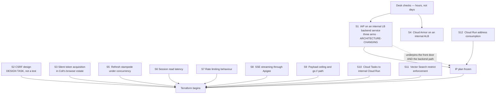

# 03 — Spike and verification plan

**Revision R12.** Rewritten for the Backend-for-Frontend architecture. Everything in the design that rests on an assumption, in dependency order, with what changes if it goes badly.

Nine items from earlier revisions have been closed by documentation checks — they are listed in §6 so nobody re-runs them.

---

## 1. Dependency order

---

## 2. Desk checks — do these first

| # | Question | How | If the answer is bad |
|---|---|---|---|
| A1 | Apigee licence tier and per-call pricing, modelled against expected AI call volume | Account team, plus your own volume estimate | Both LLM token policies are Extensible, so the `llm` environment is Intermediate and every call in that proxy is billed at the higher rate. If the arithmetic fails, screen and meter in the application instead of the proxy |
| A2 | Does Colt use any of `192.168.4.0/22` corporately? | Colt IPAM | Not routed to Colt today, but a future route change turns an overlap into an outage |
| A3 | Who owns the certificate for `aihub.aicoe-dev-int.colt.net`, and can DNS-01 validation be automated? | DNS and PKI teams | A publicly issued certificate on a privately resolved name needs control of the public zone. Expiry is a total outage |
| A4 | Per-service `maxScale` allocation within the 127-instance ceiling | Agree with the application teams | Over-allocation means a rollout that cannot obtain addresses and stalls, with an unhelpful error |
| A5 | Is a second OAuth brand needed, or does the Google-managed client suffice for programmatic access? | IAP documentation, plus S1 | Determines whether the ingress project can hold both configurations |
| A6 | Prompt-logging and per-user-metrics purpose and retention | Data protection sign-off | Per-user token counters are employee monitoring data. Needs a stated purpose before go-live, not after |

---

## 3. The one that can change the architecture

### S1 — IAP on a regional internal load balancer's backend service

**Why.** This underpins **both** the front door and the backend path, and it has been assumed since the first revision without ever being tested. IAP has historically been associated with external load balancers; whether it is available on a backend service of a *regional internal* Application Load Balancer is the single assumption the whole access model rests on.

Three arms, same scratch environment.

#### Arm 3 — the front door

Internal Application Load Balancer, serverless NEG to a Cloud Run service, IAP enabled on the backend service using the **workforce pool**. Reach it from a browser.

**Pass:** redirected to Entra, and after sign-in the request arrives at the container with `x-goog-iap-jwt-assertion`.

#### Arm 2 — IAP on the backend services (fallback)

Same shape, but IAP on the backend service uses a **dedicated OAuth client**. Mint an ID token for a test service account with that client id as audience and call the load balancer with it in `Authorization`.

**Pass:** HTTP 200, and the Cloud Run log shows the IAP service agent as the caller.

**Also record:** whether the two IAP configurations can coexist. They should — the front-door backend service lives in `gclt-aicoe-dev-aihub-ui` and the backend ones in `gclt-aicoe-dev-st`, so they are in different projects and cannot collide over an OAuth brand.

#### Arm 1 — Cloud Run IAM, no IAP on the backends (THE DESIGN — test first)

**This is the primary path.** Cloud Run service with `ingress=internal-and-cloud-load-balancing`, **no IAP anywhere**, `roles/run.invoker` granted only to a test service account. Behind an internal load balancer. Call it with a Google ID token in `X-Serverless-Authorization` whose audience is the Cloud Run service URL.

**Pass:** HTTP 200, with `run.invoker` scoped to that one service account and no `allUsers` binding.

**Why it might work despite earlier claims to the contrary.** Earlier revisions asserted this was impossible because a load balancer does not authenticate to Cloud Run. That reasoning holds for **browser** traffic, where the client cannot supply a token. A **machine** caller can: the header passes through the load balancer untouched and Cloud Run validates it against IAM. This does not contradict the rule that `X-Serverless-Authorization` is IAP's internal hop — that applies when IAP is in the path. With no IAP, it is a legitimate caller-supplied header for Cloud Run IAM.

**If it works it is the simplest of the three:** no OAuth client to manage, no IAP latency on that hop, and invoker permission scoped to exactly one service account.

#### What each outcome means

| Result | Consequence |
|---|---|
| Arms 1 and 3 pass | Build as designed. Nothing changes |
| Arm 1 fails, arm 2 passes | Backend path falls back to IAP with a dedicated OAuth client per service |
| Arm 3 fails | **The front door needs rethinking**, independent of the backend path. Fallback is IAP directly on the BFF Cloud Run service |
| Arms 1 and 2 both fail | No path from Apigee to the backends without an ingress policy exception |

## 4. Backend-for-Frontend spikes

These are new. The BFF closed two old problems and introduced four of its own.

### S2 — CSRF protection design

**Not a test — a design decision that must be made before build.** Because the browser now sends the session cookie automatically, the BFF is exposed to cross-site request forgery in a way a Bearer-token client was not. A token has to be attached deliberately by JavaScript; a cookie does not.

**Decide and document:**

1. Synchroniser token or double-submit cookie. Synchroniser is stronger; double-submit is simpler with a stateless front end.
2. Which requests require it — every non-idempotent one, and no state change behind a GET.
3. `Origin` or `Referer` validation as a second check.
4. How the token is issued and rotated alongside the session.

**Verify:** a state-changing request without the token is rejected. A cross-origin form POST carrying a valid cookie is rejected.

### S3 — Silent token acquisition with no visible prompt

**Why.** The single-login requirement depends on the BFF's authorization code exchange being non-interactive, because Entra's own session already exists from the IAP redirect. Browser cookie policy is the risk.

**Method.** In the Colt-managed browser build, complete a full login, then force a token refresh and a new session. Count credential prompts.

**Pass:** exactly one interactive prompt per session.

**If it fails:** the requirement degrades to a visible redirect on first API call. Not fatal, but it must be a known outcome rather than a surprise in user acceptance testing.

### S4 — Refresh stampede

**Why.** Several concurrent requests find an expired access token and all attempt a refresh. Under refresh-token rotation the losers receive an invalid-grant error and the user is signed out.

**Method.** Drive 50 concurrent requests at the moment of token expiry. Count sign-outs.

**Pass:** zero. One request refreshes, the rest wait on a Firestore transaction or lock document.

### S5 — Session store latency and failure behaviour

**Method.** Measure the session read at p50 and p95 under expected concurrency. Then break Firestore access deliberately.

**Pass:** read latency within the budget agreed in A1's latency target, and a deliberate failure produces a clean 503 with an alert — never a fallback to an unauthenticated path.

---

## 5. Remaining spikes

| # | Question | Method | Pass |
|---|---|---|---|
| S6 | Is Cloud Armor attachable to a regional `INTERNAL_MANAGED` load balancer, and which rule types work? | Attempt to attach a regional backend security policy to the AI Hub load balancer | If not, say so in the design rather than claiming WAF coverage. Compensating control: only ZPA reaches `.20` |
| S7 | Rate limiting behaviour under load | `SpikeArrest` with `UseEffectiveCount` present and absent. `Quota` distributed and synchronous. Force a quota breach and inspect the status code | Confirm the FaultRule returns **429 with `Retry-After`**, not the default 500. Confirm counters key on the verified `oid` and ignore a forged header |
| S8 | Does server-sent-event streaming survive Apigee, with Model Armor attached? | Deploy the first-party `llm-sse-security` sample. Compare chunk arrival against a direct Vertex call | Incremental chunks, not one buffered response. Record added time-to-first-token |
| S9 | Inline payload ceiling, and does the `gs://` URI path work? | POST progressively larger inline bodies until rejection, then the same content as `fileData` with a `gs://` URI | Record the ceiling. Confirm the `gs://` path returns 200 with a small request body |
| S10 | Can Cloud Tasks dispatch to a Cloud Run service with `ingress=internal`? | Enqueue a task with an OIDC token targeting the worker's internal URL | 200 at the worker. If not, the worker needs `internal-and-cloud-load-balancing` |
| S11 | Can Vector Search business-unit filtering be bypassed? | Query the index as one unit with `restricts` altered or removed at the application layer. Separately, attempt ingestion with a business unit set in the request body rather than the token | Neighbours never cross business units, and the ingestion service ignores the body value in favour of the verified claim |
| S12 | Actual Cloud Run address consumption under revision churn | Deploy all services at target `maxScale`, then roll a new revision on each under load. Count addresses in use | Peak below 400 of the 508 usable. Above that, exclude a service from VPC egress or request more space |
| S13 | Model Armor `EXECUTION_SKIPPED` handling | Send a prompt above the 10,000-token filter limit | The proxy applies the documented §17.4 behaviour, not a silent pass |

---

## 6. Closed — do not re-run these

| Previously | Outcome |
|---|---|
| Can a bare PSC endpoint reach Apigee northbound? | **Closed.** It is the documented **service endpoint** routing option, chosen at provisioning. Called with a `Host` header naming the environment group |
| Can IAP be enabled on a backend service backed by a PSC NEG? | **Moot.** The browser no longer calls Apigee, so there is no PSC NEG anywhere in the design |
| Is Model Armor available in europe-west1? | **Closed.** Yes. Only the built-in Vertex AI integration wants a different region |
| Are `LLMTokenQuota` and `PromptTokenLimit` Standard or Extensible? | **Closed.** Both Extensible, so `llm` is Intermediate and `int` is Base |
| Is `SpikeArrest` per message processor? | **Closed.** Only when `UseEffectiveCount` is false, and the default template sets it true. Now a configuration check, folded into S7 |
| How many addresses does a Cloud Run instance consume? | **Closed.** Two at steady state, four times peak during a rollout. Budget is 127 instances. S12 now confirms rather than discovers |
| VPC-SC dry-run | **Deferred** with the perimeter. Retained in `11` as a re-entry condition |
| Cross-project serverless NEG | **Closed.** Not a thing. Backend services live with their Cloud Run service |
| Does the browser reach Apigee through the load balancer or its own address? | **Closed.** Neither. The BFF calls Apigee server-side |

---

## 7. Kill criteria

Outcomes that mean changing the design rather than adjusting a parameter.

| Finding | Consequence |
|---|---|
| All three arms of S1 fail | No viable path from Apigee to the backends. Apigee would have to leave the user request path, and per-user rate limiting with it |
| S3 shows a second prompt that cannot be eliminated | The single-login requirement is not met as specified. Accept a visible redirect, or reconsider the identity model |
| A1 shows Extensible per-call cost exceeding the governance value | Move screening and metering into the application, keeping Apigee for the user API only |
| S8 shows streaming does not survive the gateway | The research agent's user experience changes materially. Either accept buffered responses or bypass Apigee for that one endpoint |
| S11 shows ingestion accepts a business unit from the request body | Tenant isolation has a hole on the write side. Blocks the Sales Agent, not the platform |

---

## 8. Sequencing

| Week | Work |
|---|---|
| 1 | Desk checks A1 to A6. **S1 all three arms, and S6, in a scratch project** — all load-balancer questions, one environment. Decide CSRF approach (S2) |
| 2 | S12, S10. Freeze the IP plan and the `maxScale` budget. Begin Terraform for the network and ingress projects |
| 3 | Apigee provisioning. S7 rate-limiting measurements against a throwaway proxy |
| 4 | BFF build. S3, S4, S5 — all three are BFF behaviours and test together |
| 5 | User API proxy, negative tests. S13 |
| 6 | Southbound per the S1 outcome. **Remove `roles/aiplatform.user` from workload service accounts** |
| 7 | AI gateway. S8, S9 |
| 8 | S11, end-to-end verification per runbook Part 24 |

Two things that should not slip: the desk checks in week 1, because A1 can invalidate weeks 6 and 7; and S1, because it determines whether you request `192.168.6.128/28` at all.
