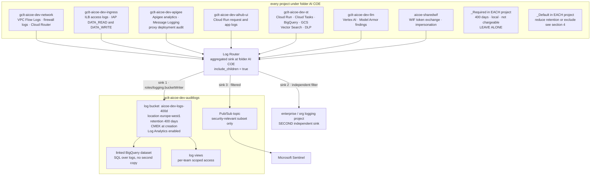

# Logging and observability design — 400 day retention, centralised

**Revision R12.**

Requirement: 400 days of retention for everything, with every log also routed to the central logging project.

---

## 1. Do you need a separate bucket? Yes, and here is why

Every project has two system buckets, and neither can satisfy the requirement.

| Bucket | Retention | Can it be your central 400-day store? |
|---|---|---|
| `_Required` | <cite index="45-1">Fixed at 400 days. You cannot change the retention, cannot delete the bucket, and cannot modify which entries it stores. It only stores log entries that originate in its own project</cite> | **No.** Already 400 days, but strictly local to each project and limited to Admin Activity, System Event and Access Transparency logs |
| `_Default` | <cite index="43-1">30 days by default, adjustable</cite> | **No.** Per-project, and raising it to 400 days in every project gives you nine scattered stores with no CMEK at creation, no region pin, no retention lock and no Log Analytics |
| **User-defined** | <cite index="43-1">1 to 3,650 days</cite> | **Yes.** <cite index="49-1">To store log entries from a folder or organisation for longer than 30 days you create a sink and route them to a log bucket in a project</cite> |

So: one user-defined bucket in `gclt-aicoe-dev-auditlogs`, fed by a folder-level aggregated sink.

---

## 2. Design

### 2.1 The bucket

| Setting | Value | Note |
|---|---|---|
| Project | `gclt-aicoe-dev-auditlogs` | |
| Name | `aicoe-dev-logs-400d` | |
| Location | `europe-west1` | Pin it. A user-defined bucket lets you choose, which `_Default` effectively does not |
| Retention | 400 days | |
| CMEK | key from the `logs` ring | <cite index="46-1">Set with `--cmek-kms-key-name` at creation</cite>. The Logging service agent needs `cryptoKeyEncrypterDecrypter` **before** the bucket is created — the same P4SA-before-resource ordering as Apigee |
| Log Analytics | enabled, with a linked BigQuery dataset | <cite index="49-1">Lets you query logs with BigQuery-standard SQL</cite> without a second sink into BigQuery, so you pay for one copy rather than two. <cite index="47-1">Note the linked dataset cannot be created at the same time as the bucket except through the console</cite>, so Terraform creates the bucket then the link |
| Retention lock | **do not lock in dev** | <cite index="47-1">Locking is irreversible: it locks the retention policy and you cannot delete the bucket until every entry has fulfilled its retention</cite>. In dev that means a bucket you cannot remove for 400 days. Lock in production, where evidence tampering is the bigger risk |

### 2.2 Sinks

Three independent sinks, because a sink is a copy and each has its own filter and writer identity.

| Sink | Level | Destination | Filter |
|---|---|---|---|
| `aicoe-400d` | folder `AI COE`, `include_children = true` | the bucket above | everything, minus the exclusions in §4 |
| `aicoe-to-org` | folder `AI COE`, `include_children = true` | the enterprise logging project | whatever the platform-wide standard requires. Keep this filter separate — do not couple your retention needs to theirs |
| `aicoe-siem` | folder `AI COE` | Pub/Sub | security-relevant only: audit logs, IAP, denied firewall, Model Armor findings, break-glass use. Do not push Cloud Run debug logs to Sentinel |

Each sink has a service-account writer identity that needs granting on the destination — `roles/logging.bucketWriter` on the log bucket, `roles/pubsub.publisher` on the topic. An aggregated sink's writer identity is created with the sink, so this is a two-step apply in Terraform.

### 2.3 Audit log configuration

Data Access audit logs are **off by default** for most services. Without enabling them you will not get IAP `DATA_READ`, GCS object reads, or BigQuery data reads — which are precisely the records the business-unit attribution story depends on. Set the audit config at folder level for `ADMIN_READ`, `DATA_READ` and `DATA_WRITE` on at least: `iap.googleapis.com`, `storage.googleapis.com`, `bigquery.googleapis.com`, `aiplatform.googleapis.com`, `secretmanager.googleapis.com`, `cloudkms.googleapis.com`, `run.googleapis.com`.

---

## 3. What each source contributes

| Source | Enable explicitly | Notes |
|---|---|---|
| ILB access logs | yes, per backend service | The Backend ILB shows all Apigee traffic as `192.168.6.128/28`, so correlate on the forwarded user context and Apigee `messageid`, not source IP |
| IAP | Data Access audit logs | The authoritative record of who reached what |
| Apigee analytics + Message Logging | Message Logging is a proxy policy | **Metadata only** unless prompt content is signed off. Note Apigee analytics also lands in Apigee's own control plane, in the analytics region |
| VPC Flow Logs | per subnet | Sample rate is a cost lever — see §4 |
| Firewall logs | per rule | Enable on deny rules and on the ZPA allow rule. Not on everything |
| Cloud Run | on by default | Request logs plus application logs |
| Cloud Tasks | on by default | Dispatch and retry history for the async translation path |
| Vertex AI | Data Access audit logs | Records which service account called which model |
| Model Armor | findings | The block-rate alert depends on these |
| WIF / STS | Admin Activity | Token exchange and impersonation — the dev-versus-prod boundary evidence |

---

## 4. The cost trap, and the levers

<cite index="48-1">If you route a log entry to multiple log buckets you can be charged storage and retention costs multiple times — routing to `_Default` and to a user-defined bucket, both with custom retention beyond 30 days, gives you two storage charges and two retention charges.</cite>

So do **not** raise `_Default` retention to 400 days as well. In every project either leave `_Default` at 30 days as a short-term operational tail, or add an exclusion filter to the `_Default` sink for whatever the central bucket already holds. `_Required` stays untouched — it is fixed, local and not chargeable, so the 400-day duplication there is free.

Other levers, given "400 days of everything" is a large volume:

- **VPC Flow Logs sampling.** Full-rate flow logs on a busy subnet dominate log spend. Reduce the sample rate and increase the aggregation interval rather than dropping the logs.
- **Exclude genuine noise** at the sink: health-check traffic, readiness probes, and Cloud Run request logs for static asset paths.
- **Log Analytics rather than a BigQuery sink.** A separate BigQuery sink is a second stored copy at a second cost. The linked dataset queries the bucket in place.
- **Filter the Sentinel sink.** Egress to a SIEM is usually priced per GB at the SIEM end, so send security-relevant logs only.

Model the monthly volume before go-live. 400 days at full fidelity across nine projects is a real budget line, and it is easier to agree sampling now than to explain the invoice later.

---

## 5. Alerting — log-based metrics on the central bucket

| Alert | Condition |
|---|---|
| App Connector range change | denied traffic from `10.100.209.0/29` |
| Break-glass use | any authentication as the break-glass service account |
| Proxy deployed by a non-CI principal | `apigee.googleapis.com` deployment where the principal is not the CI SA |
| Vector Search index change | `deployIndex`, `undeployIndex`, or an endpoint created without PSC |
| Certificate expiry | 30 days out, on both ILB and Apigee envgroup certificates |
| Rate limit spike | 429 rate per business unit |
| Model Armor block rate | sustained increase, which is either an attack or a false-positive problem |
| Audit config change | any modification to the folder audit config or a log sink — this is how an attacker goes quiet |
| SA key creation attempt | should be blocked by org policy, so any attempt is a signal |

---

## 6. Terraform notes

The bucket, sinks and audit config belong in the **static** layer (see `06`), because they must exist before anything generates logs. Ordering:

1. Logging service agent forced into existence, then granted on the KMS key.
2. `google_logging_project_bucket_config` with CMEK and 400-day retention.
3. `google_logging_linked_dataset` for Log Analytics.
4. `google_logging_folder_sink` with `include_children = true`, one per destination.
5. `google_project_iam_member` granting each sink's `writer_identity` on its destination.
6. `google_folder_iam_audit_config` for the Data Access log services.
7. Per-project `_Default` exclusion filters.

Steps 4 and 5 cannot be collapsed — the writer identity does not exist until the sink does.
