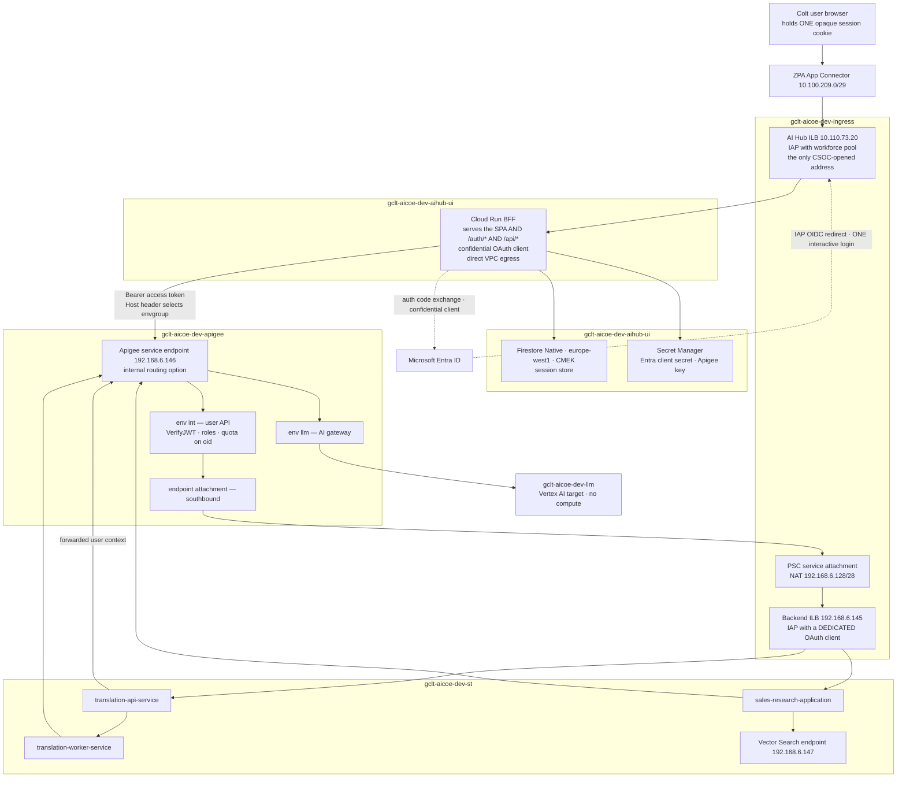
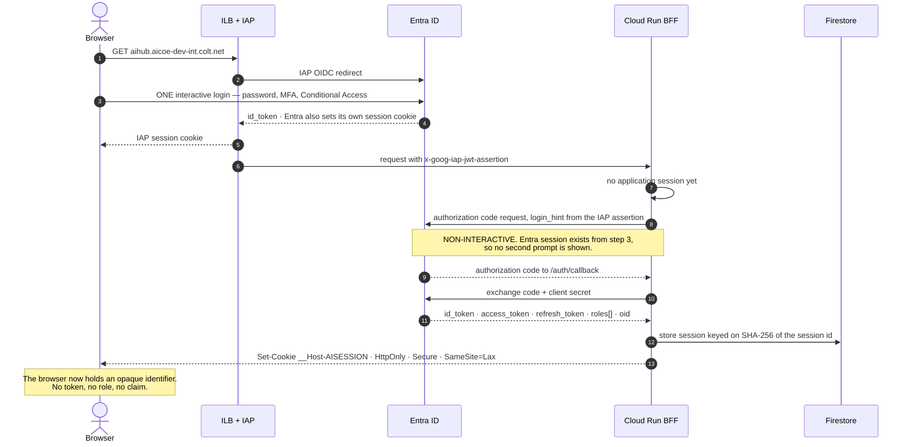
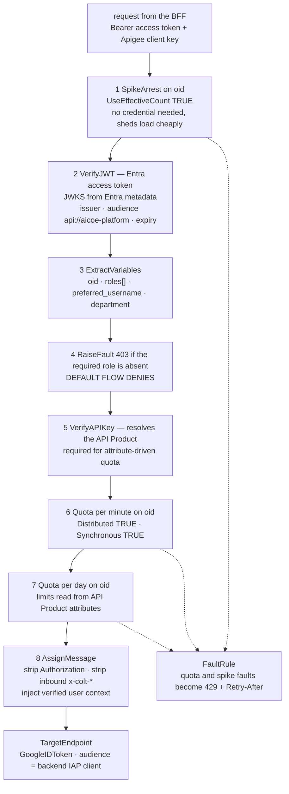
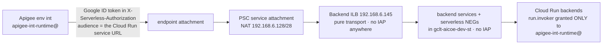

# 11 — Reconciled architecture (Backend-for-Frontend)

**Revision R12.**

**Current target design.** Supersedes the option G decision in `01` §10 and the MSAL-in-the-browser model in earlier revisions of this document.

Confirmed inputs: Private Service Connect throughout, Apigee-enforced per-user rate limiting, hybrid Entra App Roles plus Security Groups, internal load balancer only, **one interactive login**, Firestore available.

---

## 1. Why a BFF, and what it actually buys you

A Backend-for-Frontend is a server-side component that owns the OAuth client. The browser receives only an opaque session cookie; access and refresh tokens never leave the server.

The usual argument for this is token hygiene, and the IETF guidance for browser-based applications does rank it highest. But in your environment that argument is weaker than it first appears: the application is internal-only, reachable solely through ZPA, already gated by IAP, on managed devices, with a token scoped to your own API. Cross-site scripting stealing a token is a real risk but a much reduced one.

**The stronger argument is that it closes two open questions that had no other clean answer.**

| Previously open | Resolved by the BFF |
|---|---|
| Silent token acquisition in the browser depends on third-party-cookie behaviour and could produce a second visible prompt, breaking the single-login requirement | The refresh token lives server-side. Renewal never involves the browser, so the requirement no longer depends on browser policy |
| Does the browser reach Apigee through the load balancer (needs a PSC network endpoint group on an *internal* load balancer — undocumented) or via its own CSOC-opened address? | **Neither.** The browser never calls Apigee. The BFF does, from inside the VPC, straight to Apigee's internal service endpoint |

Those two together are worth more than the token-hygiene benefit, and they are why this is the right choice rather than merely a defensible one.

**What it costs:** a stateful component on the critical path, a session lookup per request, an Entra client secret to own and rotate, and a second non-interactive authentication per session. All manageable, all stated in §8.

---

## 2. Topology

The browser reaches exactly one address. Everything else is inside `192.168.4.0/22`, which has no route from the Colt network.

---

## 3. Identity — one interactive login, three layers

Three layers, each doing something the others cannot:

| Layer | Enforced by | Establishes |
|---|---|---|
| Network | ZPA and the internal load balancer | The request came from the corporate network |
| Session gate | IAP with the workforce pool | An authenticated workforce member, checked **before** your code runs |
| API credential | BFF as a confidential OAuth client | This user, holding these App Roles, for `api://aicoe-platform` |

IAP is retained deliberately even though the BFF authenticates independently. It rejects unauthenticated traffic before it reaches your container, and its assertion supplies the `login_hint` that makes step 8 non-interactive.

---

## 4. Entra configuration

Two app registrations. Hand this to the identity team as written.

**AI-BFF — confidential client**

| Setting | Value |
|---|---|
| Platform | Web |
| Redirect URI | `https://aihub.aicoe-dev-int.colt.net/auth/callback` |
| Credential | Client secret or certificate. **Certificate preferred** — no expiry surprise, no secret in transit |
| Implicit grant | Disabled |

**AI-API — resource**

| Setting | Value |
|---|---|
| Application ID URI | `api://aicoe-platform` |
| Scope | `access_as_user` |
| Optional claims | `department`, `companyName` |

**App Roles** on the API registration, `allowedMemberTypes: ["User"]`:

| Role | Grants |
|---|---|
| `Translation.User` | `/api/translation/*` |
| `SalesAgent.User` | `/api/sales/*` |
| `Platform.Admin` | administrative endpoints |

**Security groups assigned to roles**, not users to roles directly:

| Group | Role |
|---|---|
| `App-AICoE-Translation-Users` | `Translation.User` |
| `App-AICoE-SalesAgent-Users` | `SalesAgent.User` |
| `App-AICoE-Platform-Admins` | `Platform.Admin` |
| `App-AICoE-UI-Users` | *(no role — used for the IAP grant)* |

The service desk manages membership and never touches an app registration. Apigee reads a clean `roles` array, so no group GUIDs appear in policy and the Entra group-overage limit is irrelevant.

---

## 5. Session design

This is the part the pattern lives or dies on.

### 5.1 Cookie

| Attribute | Value | Why |
|---|---|---|
| Name | `__Host-AISESSION` | The `__Host-` prefix forbids `Domain` and requires `Secure` and `Path=/`, so a subdomain cannot set or overwrite it |
| `HttpOnly` | yes | JavaScript cannot read it, which is the whole point |
| `Secure` | yes | |
| `SameSite` | `Lax` | **Not `Strict`** — `Strict` would drop the cookie on the return leg of the Entra redirect and the login would loop |
| Value | 256 bits of cryptographic randomness, base64url | Not a JWT, not guessable, carries no data |

### 5.2 Firestore document

Store the **hash** of the session id, never the id itself. A read of the database then does not yield a usable cookie.

| Field | Notes |
|---|---|
| document id | `SHA-256(session_id)` |
| `oid` | the rate-limiting and attribution key |
| `email`, `department` | context and reporting |
| `roles[]` | cached from the token, for logging only — Apigee remains the authority |
| `access_token` | envelope-encrypted. **The data encryption key is cached in the instance and wrapped by KMS** — not a KMS call per read. See `13` §5 |
| `refresh_token` | envelope-encrypted |
| `access_expires_at`, `absolute_expires_at`, `last_seen_at` | **Throttle `last_seen_at` writes to once a minute** — Firestore sustains about one write per second per document |

Firestore Native mode, `europe-west1`, CMEK. Application-level envelope encryption of the two tokens sits on top of Firestore's at-rest encryption, so a database export alone does not yield usable credentials.

**Lifetimes:** absolute 8 hours to align with the IAP session, idle 60 minutes, access token refreshed at 80% of its life with jitter. A TTL policy on `absolute_expires_at` handles cleanup — but **TTL deletion lags by up to 24 hours, so it is housekeeping, not enforcement.** The BFF checks expiry on every read. Full lifecycle design in `13`.

### 5.3 Firestore, not Redis

Memorystore Redis on the basic tier uses Private Service Access, which creates a **VPC peering on the Shared VPC host** — forbidden by decision D1 and a shared-fate change for every service project. If Redis were genuinely needed it would have to be Memorystore Cluster with Private Service Connect.

It is not needed. One session read per API call, at your scale, is comfortably within Firestore's envelope, and Firestore is reached over the existing PSC endpoint at `192.168.6.164` with no new networking. Budget 10 to 20 ms per read and include it in the latency target.

### 5.4 Cross-site request forgery — the gap this pattern introduces

Because the browser now sends the session cookie **automatically**, the BFF is exposed to CSRF in a way a Bearer-token SPA was not. A Bearer token has to be attached deliberately by JavaScript; a cookie does not. The source document does not mention this at all, and it is the single most commonly missed part of a BFF migration.

Required:

1. `SameSite=Lax` blocks cross-site POST, PUT and DELETE. Necessary but not sufficient.
2. **A synchroniser or double-submit CSRF token on every state-changing request.** The BFF issues it with the session and validates it on each non-idempotent call.
3. Validate `Origin` or `Referer` against the expected host as a second check.
4. Keep all state-changing operations off GET.

### 5.5 Two failure modes to design for

**Refresh stampede.** Several concurrent requests find an expired access token and all attempt a refresh. Entra may invalidate earlier refresh tokens under rotation, so the losers get an invalid-grant error and the user is logged out. Use a short-lived Firestore transaction or a lock document so one request refreshes while the others wait.

**Session store unavailable.** If Firestore is unreachable, every request fails. Fail closed with a clear 503 rather than falling back to an unauthenticated path, and alert on it — this is now a hard dependency on the request path.

---

## 6. Rate limiting

Unchanged in substance from the previous revision: it stays at Apigee, keyed on the verified `oid`. The BFF must **not** become a second enforcement point, or you have two places to keep in sync.

### 6.1 What is keyed on what

| Layer | Policy | Key | Purpose |
|---|---|---|---|
| Burst | `SpikeArrest` | `oid` | Smooth one user's bursts |
| Requests | `Quota` per minute | `oid` | Abuse control |
| Requests | `Quota` per day | `oid` | Fair-use ceiling |
| Prompt size | `PromptTokenLimit` | n/a | Bound one oversized prompt |
| Model spend | `LLMTokenQuota` | `oid` | The budget that matters |
| Tracking | `StatisticsCollector` | `department` | **Reporting dimension, not a limit** |

Department is deliberately not a quota key. The budget is per user; department exists so spend can be aggregated. Keying a quota on department would create a shared pool where one person exhausts a colleague's allowance.

### 6.2 Policy order

Spike arrest first because it needs no credential. Authorisation before quota, so an unauthorised caller never consumes a counter.

### 6.3 Three behaviours that are not the defaults

**`Quota` and `SpikeArrest` return HTTP 500, not 429.** A 500 reads as "the server broke", so a well-behaved client retries immediately — the worst response to a rate limit. The organisation property `features.isHTTPStatusTooManyRequestEnabled` changes it, but may need a support request. **Use a FaultRule instead:** catch the fault names, return 429 with `Retry-After`. Under your control, and testable. `LLMTokenQuota` already returns 429, so the two families differ by default.

**`SpikeArrest` is per message processor unless `UseEffectiveCount` is `true`.** The default template sets it, so this bites only when the policy is written from scratch. Add a pipeline check.

**Quota counters are per proxy, not per product.** Keep the user API as one proxy with conditional flows per path. One proxy per usecase would silently multiply each user's daily budget.

### 6.4 Dynamic quota

Put limits on API Product custom attributes and reference them, so a tier change is a console edit rather than a redeploy:

| Product | `req_per_min` | `req_per_day` | `llm_tokens_per_day` |
|---|---|---|---|
| `aicoe-standard` | 60 | 5,000 | 200,000 |
| `aicoe-power` | 300 | 20,000 | 1,000,000 |

This needs a credential Apigee can resolve to a product, which is why step 5 exists. **The BFF holds that key in Secret Manager** — under the earlier SPA design it would have been shipped to the browser. Another quiet benefit of the pattern.

---

## 7. How Apigee reaches the backends

### 7.1 Two authentication mechanisms, not one

This is the part most versions of this architecture get wrong, so it is worth stating precisely.

| | Cloud Run IAM | IAP |
|---|---|---|
| Caller sends | Google ID token, audience = the service URL | IAP ID token, audience = the **OAuth client ID** |
| In which header | `Authorization`, or `X-Serverless-Authorization` | `Authorization`, or `Proxy-Authorization` if the app already uses `Authorization` |
| Validated by | Cloud Run, against `roles/run.invoker` | IAP, before the request reaches the service |

`X-Serverless-Authorization` is **how IAP itself authenticates to Cloud Run** on the internal hop. Google's documentation says so explicitly, and adds that Cloud Run passes the header through to your service after stripping its signature. **A caller should never try to emulate it.**

So when a backend is IAP-protected, Apigee authenticates *to IAP*, with an IAP ID token whose audience is the OAuth client id. It does not authenticate to Cloud Run IAM, and it does not construct the internal header.

### 7.2 Decision — one IAP, and Cloud Run IAM for the machine hop

IAP exists in exactly one place: the front door, authenticating people. The backend hop uses Cloud Run IAM.

### 7.3 Why the backends need no IAP

IAP was only ever going to solve one problem there, and it is worth naming precisely: **a load balancer invoking a Cloud Run service through a serverless network endpoint group does not pass the caller's identity through.** Cloud Run sees an anonymous request, which would need `allUsers` — forbidden by domain-restricted sharing.

IAP breaks that by validating the caller itself and then invoking the container as its own service agent. But so does the simpler option: **a machine caller supplying its own token.** Apigee sends a Google ID token in `X-Serverless-Authorization`, the load balancer passes the header through untouched, and Cloud Run validates it against `roles/run.invoker` scoped to one service account.

Same outcome. One fewer component, no OAuth client per service, and no IAP latency on a hop that occurs on every API call.

**IAP was never doing authorization on that path.** Entitlement is Apigee's job — the App Role check on the Entra token — and always was. Putting IAP there as well conflated an invoker mechanism with an authorization mechanism.

### 7.4 A note on `X-Serverless-Authorization`

Earlier revisions of this document said a caller must never send that header. That rule is correct **when IAP is in the path**, because it is IAP's own internal hop to Cloud Run and Cloud Run passes it through after stripping the signature.

With **no IAP** on these services, the situation is different: it is the documented header for a caller presenting a Cloud Run IAM token, and it leaves `Authorization` free for anything else. The two cases are distinct, and the earlier rule was stated more broadly than it should have been.

The BFF must still strip any inbound `X-Serverless-Authorization` before forwarding, because the BFF *is* behind IAP and does receive it.

### 7.5 Configuration

| Component | Setting |
|---|---|
| `bs-aihub-bff` in `gclt-aicoe-dev-aihub-ui` | **IAP on**, workforce pool. The only IAP in the platform |
| IAP service agent of `gclt-aicoe-dev-aihub-ui` | `roles/run.invoker` on the BFF |
| Backend services in `gclt-aicoe-dev-st` | **IAP off** |
| Backend Cloud Run services | **IAP off.** Ingress `internal-and-cloud-load-balancing`. No `allUsers` binding |
| `apigee-int-runtime@` | **`roles/run.invoker`** on each backend Cloud Run service. That is the entire grant |
| Apigee TargetEndpoint | `<Authentication><GoogleIDToken><Audience>` = the Cloud Run service URL, header set to `X-Serverless-Authorization` |

### 7.6 What the backend learns about the caller

Cloud Run validates the token before the container runs, so the backend knows the request came from `apigee-int-runtime` and from nothing else. The **user's** identity arrives separately, in the context headers Apigee injects after verifying the Entra token.

The trust chain: `run.invoker` is granted to one service account, therefore any `x-colt-*` header was set by Apigee, therefore it is trustworthy. That holds only while the ingress setting and the absent `allUsers` binding hold — which makes both load-bearing security controls rather than routine hardening.

Backends should still strip inbound `x-colt-*` before setting their own view of them.

### 7.7 Spike S1 — three arms, reordered

| Arm | Configuration | Status |
|---|---|---|
| **1** | **Cloud Run IAM.** No IAP on the backends. Google ID token in `X-Serverless-Authorization`, `run.invoker` scoped to one service account | **The design.** Test first |
| **2** | IAP on the backend services with a dedicated OAuth client | Fallback if arm 1 fails. Works, but costs an OAuth client per service and IAP latency per call |
| **3** | **Is IAP supported on a regional internal load balancer's backend service at all?** | **Underpins the front door.** Assumed since the first revision, never tested. Arguably the most important of the three |

Arm 3 deserves more attention than its position suggests. If IAP is unavailable on internal load balancers, the front door needs rethinking regardless of what happens on the backend path.

## 8. What this costs

| Cost | Detail |
|---|---|
| A stateful component on the request path | The BFF and Firestore are now both hard dependencies. Neither was before |
| Latency | One session read per API call, 10 to 20 ms. Include it in the target |
| An Entra client secret | Own it, rotate it, alert on expiry. Prefer a certificate |
| Two authentications per session | IAP's, then the BFF's code exchange. Layered rather than redundant, and the second is non-interactive — but it is a second failure mode |
| Instance budget | The BFF needs VPC egress where the static SPA did not, so it consumes from the ceiling |

### Revised instance budget

Direct VPC egress uses roughly 2 addresses per instance at steady state and 4x peak during a revision rollout, against 508 usable in `192.168.4.0/23`. **Total across all services is 127**, of which 90 are allocated to the Day-1 services and 37 held for future use cases.

| Service | Maximum instances |
|---|---|
| BFF | 10 |
| `translation-api-service` | 7 |
| `translation-worker-service` | 7 |
| `sales-research-application` | 4 |
| `mcp-server` | 3 |

The BFF gets the largest share because it is on every request path, including static asset requests. Monitor the instance-count metric, multiply by 2, and alert above 60.

---

## 9. IP plan

No new CSOC-opened address is needed — that is a direct consequence of the browser never calling Apigee.

| Address or range | Purpose |
|---|---|
| `10.110.73.20` | AI Hub ILB. **The only Colt-reachable address** |
| `192.168.4.0/23` | Cloud Run egress, 127-instance ceiling |
| `192.168.6.0/26` | Envoy proxy fleet, both load balancers |
| `192.168.6.128/28` | PSC NAT for the Backend ILB service attachment |
| `192.168.6.145` | Backend ILB |
| `192.168.6.146` | Apigee service endpoint, called by the BFF and by backends |
| `192.168.6.147` | Vector Search |
| `192.168.6.164` | PSC to Google APIs — now also carries Firestore traffic |

Two Apigee environments: `int` for the user API, `llm` for the AI gateway. `ext` deferred.

---

## 10. The AI gateway is unchanged

Both backends call Vertex AI through environment `llm`, with per-user `LLMTokenQuota`, `PromptTokenLimit`, Model Armor templates in `europe-west1` and the model allow-list. Backends forward `oid` and `department` so spend attributes to a person.

For the asynchronous path, the identity cannot be forwarded live — the access token has expired by the time the worker runs. Persist `oid` and `department` in the job record at creation, in the same Firestore database as the sessions but a separate collection, immutable after write. Attribution there is *asserted from a trusted store* rather than proven from a token, and that distinction belongs in the design record.

`roles/aiplatform.user` stays off every workload service account. That single IAM decision is what makes the gateway mandatory rather than advisory.

---

## 11. Open items

| # | Item | Status | Fallback |
|---|---|---|---|
| 1 | **Spike S1**, three arms — Cloud Run IAM through the load balancer (the design), IAP on backend services (the fallback), and whether IAP works on an internal load balancer at all (the front door) | Arm 1 decides the backend path. Arm 3 decides the front door | IAP on backend services with a dedicated OAuth client |
| 2 | **CSRF protection design** | New with the BFF. Must be specified before build | None — this is required, not optional |
| 3 | Refresh-stampede handling under concurrent requests | New with the BFF | Lock document in Firestore |
| 4 | ~~Are the LLM token policies Standard or Extensible?~~ | **Closed.** Both Extensible, so `llm` must be Intermediate and `int` stays Base | — |
| 5 | Cloud Armor on a regional internal load balancer | Open | State as unverified rather than claiming it |
| 6 | Session read latency under load | New with the BFF | Measure before go-live |

**Closed by this revision:** the browser-to-Apigee routing question, and the dependence of single sign-on on browser third-party-cookie behaviour.

**Closed subsequently:** the Apigee environment tier (both LLM token policies are Extensible, so `llm` is Intermediate and `int` is Base); Apigee configuration backup (in Git, secrets excluded — runbook §22.13); Terraform layering and cross-project apply order (runbook Part 25); business-unit labelling at RAG ingestion (from the verified Entra claim, never a request body field — runbook §15.6); indirect prompt injection (application-side, four measures in runbook §17.6).

**Accepted, not closed:** the GDPR erasure path. Prompt content may exist in Apigee analytics, the session store, job records, BigQuery and a 400-day log bucket, and some of those cannot be selectively deleted. Accepted on the basis that logging is metadata-only by default. Revisit if prompt-content logging is ever switched on.
