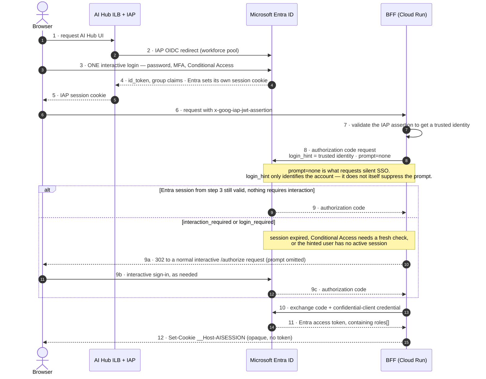

# Setting Up Entra ID Sign-In for the AI Hub Platform (IAP + Workforce Federation + Apigee)

**Audience:** this guide assumes no prior experience with Entra app registrations, Google Workforce Identity Federation, IAP, or Apigee JWT policies. Every step says exactly where to click.

**Scope:** this covers the identity path only — how a Colt employee, authenticated in Microsoft Entra ID, ends up signed into the AI Hub UI and authorized to call specific APIs through Apigee. It does not cover networking, logging, or the rest of the platform build (see the main implementation runbook for that).

**Environment used in examples:** Dev (`gclt-aicoe-dev-*` projects). Swap in the Prod project IDs and a fresh set of Entra app registrations when you repeat this for Prod — never reuse Dev's app registration or client secret in Prod.

> **One assumption this whole guide rests on, and it is currently unverified (spike S1, arm 3 in your verification plan).** Whether IAP can actually be enabled on the backend service of a *regional internal* Application Load Balancer — as Part B.7 below has you do — has been assumed since the platform's first design revision and never tested against a real deployment. If it turns out not to work, the fallback (Google's own documented recommendation, in fact) is to enable IAP **directly on the `aihub-bff` Cloud Run service** instead of on the load balancer backend service — see the runbook's §20.7 for the two constraints that come with that fallback (IAP can't be on both at once, and the plain `run.app` URL needs to be locked down separately). Run this as a scratch-project spike before you build B.7 for real if that risk matters to your timeline.

---

## 0. The picture before you start clicking

Three separate things get built, one on each side, plus one in the middle:

```
Microsoft Entra ID                 Google Cloud                          Apigee
──────────────────                 ────────────────────────              ──────────────────
App registration                   Workforce Identity Pool               VerifyJWT policy
 "AI-BFF"          ──trusts──►      "colt-aiappsui-auth"                 reads the token AI-BFF
 (confidential                      + OIDC provider "entra"               forwards, checks
  client, does                                                            issuer + audience +
  sign-in)                          IAP on "bs-aihub-bff"                 App Role
                                    (front door — authenticates
App registration                    the PERSON)
 "AI-API"          ──issues───►
 (defines App Roles,                Cloud Run IAM on backend
  Translation.User /                services (translation, sales)
  SalesAgent.User /                 (authenticates the MACHINE
  Platform.Admin)                    calling on the last hop)

Security groups    ──map to──►     IAP-secured Web App User
 (who gets which                    binding, one per group
  App Role)
```

**Why two different Google-side mechanisms exist:** IAP proves *a person* is signed in and lets them reach the front door at all. Apigee's `VerifyJWT` policy then decides *what that person may do*, based on the App Role Entra put in their token. These are deliberately kept separate — see the design notes in the platform LLD (§6–8) if you want the full reasoning.

**Why the end user never needs a Google account:** Google Workforce Identity Federation lets IAP trust Entra ID as an external identity provider. The sign-in screen the user sees is 100% Microsoft's — Google never issues them a password or an identity of its own.

### 0.1 The sign-in sequence, in detail

There are actually **two** separate exchanges with Entra, not one — this trips people up because both look like "the login." The first (steps 2–4) is IAP's own federation login, which is what gets the person past the front door. The second (steps 8–11) is the BFF's own, separate token exchange, done non-interactively where possible, which is what gets Apigee something to verify later.



**The precise mechanism, since it's easy to get slightly wrong:** `login_hint` pre-fills or pre-selects an account — Microsoft's own docs describe it that way, nothing more. It does not by itself make a request silent. `prompt=none` is the parameter that actually requests silent authentication, and Microsoft's docs are explicit about the failure mode: if the request can't complete silently, Entra returns `interaction_required` (a fresh interactive check is needed) or `login_required` (no session matches the hint) — it does not unpredictably render a sign-in page mid-flow. Whoever builds the BFF needs to catch both of those and retry the same request without `prompt=none`, which is what produces the graceful "one visible redirect" fallback in the alt-branch above, instead of a broken request.

This also means `login_hint` must come from the **validated** `x-goog-iap-jwt-assertion` (step 7), never from a query parameter or header the browser supplies directly — Google's own IAP documentation says every request must be validated this way. Trusting a browser-supplied hint would let a client claim to be signing in as anyone.

---

## Part A — Microsoft Entra ID setup

Do this first. GCP's Workforce Identity Pool needs values (issuer URL, client ID, client secret) that only exist once these app registrations are created.

You will need: **Application Administrator** or **Cloud Application Administrator** role in Entra ID, and someone who can create/manage the three security groups (often the same person, sometimes a separate identity/service-desk team).

### A.1 Two app registrations, not one — why

| | `AI-BFF` | `AI-API` |
|---|---|---|
| What it is | The application itself — a **confidential client** that performs the sign-in | The **resource** — defines what can be requested a token *for*, and what roles exist |
| Who talks to it | The BFF (Cloud Run backend-for-frontend) | Nobody signs into this one directly |
| Holds a secret? | Yes | No |

Keeping them separate means the thing that can authenticate users (`AI-BFF`) is distinct from the thing that defines entitlements (`AI-API`) — this is what lets the service desk manage group membership later without ever touching an app registration.

### A.2 Create `AI-API` first (the resource)

The App Roles need to exist before `AI-BFF` can request them, so build this one first.

1. Sign in to the [Entra admin center](https://entra.microsoft.com).
2. Go to **Identity → Applications → App registrations → + New registration**.
3. Name: `AI-API`.
4. Supported account types: **Accounts in this organizational directory only (Colt only — Single tenant)**.
5. Redirect URI: leave blank — this app is never signed into directly.
6. Click **Register**.

**Set the Application ID URI:**

7. In the `AI-API` registration, go to **Expose an API**.
8. Click **Set** next to Application ID URI. Accept or edit it to: `api://aicoe-platform`. Click **Save**.
9. Click **+ Add a scope**:
   - Scope name: `access_as_user`
   - Who can consent: **Admins and users**
   - Admin consent display name: `Access AI CoE platform as the signed-in user`
   - Admin consent description: `Allows the application to call AI CoE APIs on behalf of the signed-in user.`
   - State: **Enabled**
   - Click **Add scope**.

**Define the App Roles:**

10. Go to **App roles → + Create app role**. Create each of the following three, one at a time:

| Display name | Value | Allowed member types | Description |
|---|---|---|---|
| Translation User | `Translation.User` | **Users/Groups** | Access to `/api/translation/*` |
| Sales Agent User | `SalesAgent.User` | **Users/Groups** | Access to `/api/sales/*` |
| Platform Admin | `Platform.Admin` | **Users/Groups** | Access to administrative endpoints |

For each: set **Allowed member types** to **Users/Groups** (not Applications), fill in the display name, value, and description exactly as above, then click **Apply**.

**Configure optional claims:**

11. Go to **Token configuration → + Add optional claim**.
12. Token type: **Access**.
13. Add: `department` and `companyName` (scroll/search for each). If prompted to turn on the Microsoft Graph permission for a claim, accept it.
14. Click **Add**.

### A.3 Create `AI-BFF` (the confidential client)

1. **App registrations → + New registration**.
2. Name: `AI-BFF`.
3. Supported account types: **Single tenant**, same as above.
4. Platform: click **+ Add a platform → Web** (not Single-Page Application — this matters, see the warning below).
5. Redirect URI: `https://aihub.aicoe-dev-int.colt.net/auth/callback`
6. Also add a **Front-channel logout URL**: `https://aihub.aicoe-dev-int.colt.net/auth/logout` (found under **Authentication → Front-channel logout URL**).
7. Under **Authentication → Implicit grant and hybrid flows**, leave **both boxes unchecked**. This app never receives a token directly in the browser.
8. Click **Register**.

> **Why "Web" and not "Single-Page Application."** A SPA platform registration is a public client — it can't hold a secret, and Entra issues tokens straight to browser JavaScript. This design deliberately keeps the token exchange server-side, so the browser only ever holds an opaque session cookie, never a token. Registering as SPA would work technically but breaks that guarantee.

**Create the client credential:**

9. Go to **Certificates & secrets**.
10. **Preferred: a certificate**, not a secret — it has no surprise expiry and nothing secret ever travels over the wire. If your PKI process supports it, go to the **Certificates** tab and upload the public key of a certificate your platform team generates; the private key stays with the app that will present it.
11. **If using a secret instead:** go to **Client secrets → + New client secret**, set an expiry (24 months maximum recommended, with a calendar reminder well before it), click **Add**, and **copy the secret value immediately** — Entra shows it only once.
12. Hand this value to whoever manages the platform's Secret Manager — it becomes the value of the secret named `entra-bff-client-secret`. It must never be pasted into code, a config file, or a container image.

**Request the API permission and grant admin consent:**

13. Go to **API permissions → + Add a permission → My APIs → AI-API**.
14. Select **Delegated permissions**, check `access_as_user`, click **Add permissions**.
15. Click **Grant admin consent for Colt** and confirm.

> **Why this step is not optional.** Without admin consent, every single sign-in shows the user an OAuth consent screen the first time — confusing for end users and guaranteed to generate support tickets.

### A.4 Create the security groups

Go to **Groups → New group** (type: **Security**) and create four:

| Group name | Purpose |
|---|---|
| `App-AICoE-UI-Users` | Anyone allowed through the front door at all. Carries **no App Role** — used only for the IAP grant in Part B |
| `App-AICoE-Translation-Users` | Assigned the `Translation.User` App Role |
| `App-AICoE-SalesAgent-Users` | Assigned the `SalesAgent.User` App Role |
| `App-AICoE-Platform-Admins` | Assigned the `Platform.Admin` App Role |

> **Why groups, not direct user-to-role assignment, and why groups feed roles rather than being read directly.** The service desk manages who's in a group through its normal process and never touches an app registration. Apigee later reads a clean `roles` array from the token instead of raw group IDs, which makes the authorization policy readable. It also sidesteps Entra's group-overage limit (below) entirely, because roles aren't subject to it.

**Assign each group to its App Role:**

16. Go to `AI-API` → **Enterprise application** (click the linked enterprise app, not the app registration) → **Users and groups → + Add user/group**.
17. For each of the three role-bearing groups: select the group, select the matching App Role from the dropdown, click **Assign**.
18. `App-AICoE-UI-Users` does **not** get assigned here — it has no App Role. It will only be referenced later as a Google IAM principal.

19. Add the relevant people to each group under **Groups → [group name] → Members**. Note: anyone in `App-AICoE-Translation-Users` should also be in `App-AICoE-UI-Users`, since front-door access and entitlement are two separate checks — being in the entitlement group alone won't get someone past IAP.

### A.5 What must also be done for the Workforce Identity Pool (a separate, org-level step)

This part is done once Google's Workforce Identity Federation console (Part B.3) shows you the redirect URI it expects — you'll come back here.

1. In the `AI-BFF` (or a dedicated federation) app registration, add the **redirect URI Google's console displays** on the workforce pool provider setup page. It will look like `https://iam.googleapis.com/v1/projects/.../locations/global/workforcePools/colt-aiappsui-auth/providers/entra:...` — copy it exactly.
2. Configure the `groups` claim to emit **only groups assigned to this application** (not all of a user's groups):
   - Go to `AI-API` → **Token configuration → Add groups claim**.
   - Choose **Groups assigned to the application**, for both ID and Access tokens.
   - This is what keeps a user's IAP-relevant group list small regardless of how many other Colt groups they belong to.
3. Confirm `App-AICoE-UI-Users` is assigned to the application (Part A.4 step 16 covers this — it just has no App Role attached).
4. Confirm `department` and `companyName` are configured as optional claims (Part A.2 step 11-14).

### A.6 Verification checklist — Entra side

- [ ] `AI-API` has Application ID URI `api://aicoe-platform` and scope `access_as_user`
- [ ] All three App Roles exist on `AI-API` with **Allowed member types = Users/Groups**
- [ ] `AI-BFF` is registered as **Web**, not SPA, with implicit grant disabled
- [ ] `AI-BFF` has a client secret or certificate, recorded for handoff to Secret Manager — not left in the portal only
- [ ] Admin consent has been granted for `access_as_user`
- [ ] Four groups exist; three are assigned to their App Roles; `App-AICoE-UI-Users` is assigned to the application with no role
- [ ] Groups claim is set to emit only application-assigned groups
- [ ] `department` and `companyName` are configured as optional claims on the access token

---

## Part B — Google Cloud setup

You will need: `roles/iam.workforcePoolAdmin` at the **organization** level, and `roles/owner` (or equivalent granular roles) on the `gclt-aicoe-dev-ingress`, `gclt-aicoe-dev-aihub-ui`, and `gclt-aicoe-dev-apigee` projects.

### B.1 Enable the required APIs

**Where:** Google Cloud console → **APIs & Services → Enabled APIs & services → + Enable APIs and services**, switching projects with the selector at top-left.

| Project | APIs to enable |
|---|---|
| `gclt-aicoe-dev-ingress` | Compute Engine, **Identity-Aware Proxy**, Certificate Manager |
| `gclt-aicoe-dev-aihub-ui` | Cloud Run, Compute Engine |
| `gclt-aicoe-dev-apigee` | Apigee, Apigee Connect |

Enabling can take a minute to fully propagate — if a later step says an API isn't enabled, wait two minutes and retry before assuming something is broken.

### B.2 Create the Workforce Identity Pool

This is the Google-side trust anchor for Entra. It lives at the **organization** level, not inside a project.

1. In the console, search for **Workforce Identity Federation** and open it.
2. Make sure the resource picker at the top shows your **organization** (not a project or folder) — if it shows a project, workforce pools won't appear as an option.
3. Click **+ Create Pool**.

| Field | Value |
|---|---|
| Name | `colt-aiappsui-auth` |
| Pool ID | `colt-aiappsui-auth` |
| Description | Entra ID sign-in for AI CoE applications |
| Session duration | 8 hours to start (revisit if long-running work is interrupted — see B.7 note) |

4. Click **Continue** to add a provider (or **Create pool** first, then **Add a provider** from the pool's detail page — the console flow varies slightly by version).

### B.3 Add the OIDC provider pointing at Entra

| Field | Value |
|---|---|
| Provider type | **OpenID Connect (OIDC)** |
| Provider name | `entra` |
| Issuer (URL) | `https://login.microsoftonline.com/<YOUR_TENANT_ID>/v2.0` |
| Client ID | The **Application (client) ID** of the `AI-BFF` app registration (Overview page in Entra) |
| Client secret | The same secret/certificate value created in Part A.3 step 10–11 |
| Response type | `Code` |

5. Click through to the attribute mapping screen (or **Next**).

### B.4 Configure the attribute mapping

This is what translates an Entra token's claims into something Google IAM understands.

| Google attribute | Entra claim |
|---|---|
| `google.subject` | `assertion.sub` |
| `google.groups` | `assertion.groups` |
| `attribute.department` | `assertion.department` |
| `attribute.organization` | `assertion.companyName` |

Enter each row exactly as shown, then click **Save**.

6. Once saved, the provider's detail page shows a **redirect URI** Google expects Entra to send users back to. **Copy this value** — it's what goes into Part A.5 step 1 on the Entra side. If you already created the app registration before reaching this step, go back and add it now.

### B.5 Verification — the pool exists and shows no warnings

7. Return to the pool's detail page. It should show the `entra` provider with no configuration warnings (a warning here usually means the issuer URL has a typo, or the redirect URI hasn't been added back in Entra yet).
8. Full end-to-end testing of this pool isn't possible until IAP is wired up in B.7 — that's normal, don't expect a working sign-in yet.

### B.6 Cloud Run: confirm the BFF service's own settings

The BFF (`aihub-bff`) Cloud Run service should already exist from the application build. Confirm these settings under **Cloud Run → aihub-bff → Edit & deploy new revision**:

| Tab | Setting | Value |
|---|---|---|
| Networking | Ingress | **Internal and Cloud Load Balancing** |
| Security | Identity-Aware Proxy | **Leave off** — IAP goes on the load balancer's backend service instead, not the Cloud Run service directly, in step B.7 |
| Security | Allow unauthenticated invocations | **Not ticked.** (An org policy should already block this, but confirm.) |

### B.7 Create the backend service and enable IAP on it

**Where:** switch to project `gclt-aicoe-dev-aihub-ui` → **Network services → Load balancing → Backends tab → Create backend service**.

1. Name: `bs-aihub-bff`
2. Backend type: **Serverless network endpoint group**
3. Protocol: HTTPS
4. Region: `europe-west1`
5. Backend: create a new serverless NEG (`neg-aihub-bff`) pointing at the `aihub-bff` Cloud Run service
6. Cloud CDN: off
7. Click **Create**.

**Turn on IAP:**

8. Search for **Identity-Aware Proxy** in the console (still in `gclt-aicoe-dev-aihub-ui`).
9. Find `bs-aihub-bff` in the list and toggle IAP **on**.
   - The first time you do this in a project, Google may prompt you to configure an **OAuth consent screen** (sometimes called an "OAuth brand"). Use your organization's internal audience type if offered; a Google-managed OAuth client is used by default and is sufficient here — you only need a custom OAuth client if external (non-Colt) users must reach this later.

**Grant access to your groups:**

10. Still on the IAP page, select the checkbox next to `bs-aihub-bff`, open the info panel on the right, and click **Add principal**.
11. Add each group that should reach the front door as a principal, in this exact format, with the role **IAP-secured Web App User**:

```
principalSet://iam.googleapis.com/locations/global/workforcePools/colt-aiappsui-auth/group/<GROUP_OBJECT_ID>
```

Replace `<GROUP_OBJECT_ID>` with the **Object ID** of `App-AICoE-UI-Users` from Entra (Groups → the group → Overview → Object Id). This is the *only* group that needs an IAP grant — the other three groups drive Apigee's App Role check later, not front-door access.

> **Two different gates, two different groups.** `App-AICoE-UI-Users` is a coarse "can this person even reach the app" check, done by IAP before any of your code runs. The App Role groups are a fine-grained "what can they call" check, done later by Apigee. A user can be in an entitlement group without being in `App-AICoE-UI-Users` — and if so, they'll never even get past the front door to use that entitlement. Make sure everyone who needs access is in both.

### B.8 Grant the IAP service agent permission to invoke Cloud Run

This step is easy to miss and produces a confusing symptom if skipped: **users sign in successfully, then get a 403.**

12. Force the IAP service agent into existence (safe to run even if it already exists):

```
gcloud beta services identity create --service=iap.googleapis.com \
  --project=gclt-aicoe-dev-aihub-ui
```

13. Find the exact service account name. It follows the pattern `service-<PROJECT_NUMBER>@gcp-sa-iap.iam.gserviceaccount.com`. Look it up under **IAM & Admin → IAM**, with **Include Google-provided role grants** ticked — or take the project number from **IAM & Admin → Settings**.
14. Grant that service account **Cloud Run Invoker** on the `aihub-bff` service:

```
gcloud run services add-iam-policy-binding aihub-bff \
  --project=gclt-aicoe-dev-aihub-ui \
  --region=europe-west1 \
  --member="serviceAccount:service-<PROJECT_NUMBER>@gcp-sa-iap.iam.gserviceaccount.com" \
  --role="roles/run.invoker"
```

(Or via console: **Cloud Run → aihub-bff → Permissions → Add principal**.)

### B.9 Wire up the front-door load balancer

**Where:** switch to `gclt-aicoe-dev-ingress` → **Network services → Load balancing → Create load balancer**.

| Choice | Value |
|---|---|
| Type | Application Load Balancer (HTTP/S) |
| Facing | **Internal** |
| Deployment | Regional |
| Region | `europe-west1` |
| Network | your Shared VPC |

**Frontend:**

| Field | Value |
|---|---|
| Protocol | HTTPS |
| IP address | your reserved internal VIP (e.g. `10.110.73.20`) |
| Port | 443 |
| Certificate | one covering `aihub.aicoe-dev-int.colt.net` (see the watch-out below) |

**Routing:** a single default rule sending everything to `bs-aihub-bff` in the `gclt-aicoe-dev-aihub-ui` project. (If the console won't let you pick a backend service in a different project, create the URL map with a placeholder and repoint it with `gcloud compute url-maps add-path-matcher` — the main runbook §20.6 has the exact command.)

> **Certificate watch-out.** The hostname resolves only inside your network, but browsers still check certificate trust. A publicly issued certificate validated by DNS record is the cleanest option — no trust-store distribution needed on end-user machines. An internal CA works too, but then every client needs that CA's root installed.

### B.10 Test the sign-in path end to end

15. From a machine on your corporate network (or however your ZPA/VPN path reaches the private load balancer), browse to `https://aihub.aicoe-dev-int.colt.net`.
16. **Expected:** a redirect to a Microsoft sign-in page, then (after signing in with an account in `App-AICoE-UI-Users`) the AI Hub interface loads.
17. **If it hangs with no redirect:** the network path to the load balancer is wrong — not an identity problem.
18. **If it redirects but loops back to sign-in repeatedly:** almost always the `SameSite` cookie attribute on the BFF's session cookie is set to `Strict` instead of `Lax` — `Strict` drops the cookie on the return leg of the Entra redirect.
19. **If sign-in succeeds but the page shows 403:** go back to B.8 — the IAP service agent almost certainly doesn't have `roles/run.invoker` on the Cloud Run service yet.
20. **If sign-in succeeds for some people but not others:** check they're a member of `App-AICoE-UI-Users` specifically, not just one of the App Role groups.
21. **If every single request shows a brief second sign-in flash even though the person already signed in seconds ago:** the BFF's `prompt=none` request (§0.1, step 8) is landing on `interaction_required` or `login_required` every time instead of only occasionally. Common causes: Conditional Access has a sign-in frequency policy that applies specifically to `AI-BFF` (separate from whatever applies to the IAP workforce federation login), or the BFF isn't sending `login_hint` at all so Entra can't tell which of the browser's sessions to check. This is a UX problem, not a broken security control — but it defeats the single-sign-on requirement, so it's worth fixing.

### B.11 Apigee — verify the Entra token and enforce the App Role

By this point IAP has let the person through, and the BFF has separately completed its own token exchange with Entra (non-interactively) to get an access token to forward to Apigee. This part configures Apigee to check that token.

**Where:** Google Cloud console → **Apigee**, project `gclt-aicoe-dev-apigee`.

21. Confirm the environment for the user-facing API exists (e.g. `int`) and is attached to your Apigee instance.
22. Open (or create) the proxy that fronts the user API, and add these policies **in this order**:

| # | Policy | Configuration |
|---|---|---|
| 1 | Spike Arrest | Keyed on `oid` once extracted; protects against a single user's burst traffic before any credential check runs |
| 2 | **Verify JWT** | **JWKS URI:** `https://login.microsoftonline.com/<YOUR_TENANT_ID>/discovery/v2.0/keys` &nbsp;·&nbsp; **Issuer:** `https://login.microsoftonline.com/<YOUR_TENANT_ID>/v2.0` &nbsp;·&nbsp; **Audience:** `api://aicoe-platform` |
| 3 | Extract Variables | Pull `oid`, `roles` (the App Roles array), `preferred_username`, `department` out of the verified token's claims |
| 4 | Raise Fault (403) | If the App Role required for the requested path is missing from `roles[]`. **Default-deny**: an unrecognized path is refused, not allowed through |
| 5 | Verify API Key | Resolves the API Product tied to this caller, which the quota policies below are measured against |
| 6–7 | Quota (per minute, per day) | Keyed on `oid`, `Distributed` and `Synchronous` both set to `true` |
| 8 | Assign Message | Strip the inbound `Authorization` header and any `x-colt-*` header before forwarding; inject the verified `oid`/`department`/`roles` as trusted context headers instead |

**Path-to-role mapping to configure in step 4:**

| Path | Required App Role |
|---|---|
| `/api/translation/*` | `Translation.User` |
| `/api/sales/*` | `SalesAgent.User` |
| anything else | denied |

23. Set the target to authenticate to the backend Cloud Run service with a `GoogleIDToken`, audience = that service's exact Cloud Run URL, sent in the `X-Serverless-Authorization` header (this is the separate, machine-to-machine leg — see the note below).

> **Don't confuse this with IAP.** By the time a request reaches this proxy, IAP already did its job at the browser-facing front door. This `VerifyJWT` policy is checking a *different* token — the Entra access token the BFF forwarded — for *authorization*, not front-door authentication. And the token Apigee then sends onward to the backend Cloud Run service is different again: a Google-minted ID token proving *Apigee* is the caller, which Cloud Run checks against `roles/run.invoker`. Three tokens, three different jobs, three different verifiers.

24. **Test before considering this done — don't assume:**

| Test | Expected result |
|---|---|
| Call with no `roles` claim in the token | Denied |
| Call with an expired or wrong-audience token | Denied by Verify JWT |
| Call `/api/translation/*` with only `SalesAgent.User` | Denied |
| Call `/api/translation/*` with `Translation.User` | Allowed |
| Exhaust the per-minute quota | 429 with `Retry-After` — check this isn't the Apigee default of 500 (see the runbook's rate-limiting notes if it comes back 500) |

### B.12 Verification checklist — GCP side

- [ ] Workforce pool `colt-aiappsui-auth` exists with provider `entra`, no warnings
- [ ] Attribute mapping matches Part B.4 exactly
- [ ] `bs-aihub-bff` backend service exists, IAP is **on**
- [ ] `App-AICoE-UI-Users`'s Object ID is bound as **IAP-secured Web App User** on `bs-aihub-bff`
- [ ] IAP's service agent holds **Cloud Run Invoker** on `aihub-bff`
- [ ] Load balancer routes to `bs-aihub-bff`, certificate is trusted by client browsers
- [ ] End-to-end sign-in works from a real Entra account in the right group
- [ ] Apigee's Verify JWT policy checks issuer, audience `api://aicoe-platform`, and JWKS from Entra
- [ ] Default flow denies when the App Role is missing (tested, not assumed)

---

## Common pitfalls, gathered in one place

| Symptom | Likely cause | Where to look |
|---|---|---|
| 403 immediately after a successful sign-in | IAP service agent lacks `roles/run.invoker` on the Cloud Run service | B.8 |
| Endless redirect loop back to sign-in | Session cookie `SameSite=Strict` instead of `Lax` | BFF session code, not covered in this guide — see `13-session-lifecycle-and-limits.md` |
| User in the right App Role group still gets denied by Apigee | They're missing from `App-AICoE-UI-Users` (IAP) even though they're in the entitlement group (Apigee) — two separate memberships | A.4, B.7 |
| Apigee sees an empty `groups`/`roles` claim for a specific user | They belong to 150+ total Entra groups, so Entra sent a group-overflow pointer instead of the list. Scoping the claim to **application-assigned groups only** (A.5 step 2) avoids this for nearly everyone — but a user in 150+ *assigned* groups is still possible in theory | A.5, A.2 |
| Sign-in shows a consent screen every time | Admin consent wasn't granted for `access_as_user` | A.3 step 15 |
| Google console won't let you pick `bs-aihub-bff` when building the load balancer in a different project | Cross-project backend referencing needs `Compute Load Balancer Services User` granted on the backend service itself, or use the `gcloud` fallback | B.9 |
| Quota exceeded returns 500 instead of 429 | Apigee's documented default status for `Quota`/`Spike Arrest` is 500 — add a Fault Rule or the org-level property to convert it | B.11 |
| BFF's silent token request never succeeds, every session shows a visible Entra redirect | `login_hint` isn't being sent, or `prompt=none` was never added to the request in the first place — without it there's no silent attempt at all, just Entra's ordinary default behaviour | §0.1 |

---

## Appendix — reference values used throughout this guide

Replace anything in `<angle brackets>` with your tenant's real value before use; everything else is the settled name for the Dev environment.

| Item | Value |
|---|---|
| Workforce pool | `colt-aiappsui-auth` |
| Provider | `entra` |
| Entra tenant issuer | `https://login.microsoftonline.com/<YOUR_TENANT_ID>/v2.0` |
| Entra JWKS endpoint | `https://login.microsoftonline.com/<YOUR_TENANT_ID>/discovery/v2.0/keys` |
| App registration (client) | `AI-BFF` |
| App registration (resource) | `AI-API` |
| API audience | `api://aicoe-platform` |
| API scope | `access_as_user` |
| App Roles | `Translation.User`, `SalesAgent.User`, `Platform.Admin` |
| Front-door group (IAP) | `App-AICoE-UI-Users` |
| Entitlement groups (Apigee) | `App-AICoE-Translation-Users`, `App-AICoE-SalesAgent-Users`, `App-AICoE-Platform-Admins` |
| Client secret name in Secret Manager | `entra-bff-client-secret` |
| Backend service (IAP-protected) | `bs-aihub-bff` |
| Ingress project | `gclt-aicoe-dev-ingress` |
| UI project | `gclt-aicoe-dev-aihub-ui` |
| Apigee project | `gclt-aicoe-dev-apigee` |
| Redirect URI | `https://aihub.aicoe-dev-int.colt.net/auth/callback` |
| Logout URL | `https://aihub.aicoe-dev-int.colt.net/auth/logout` |

---

## Glossary

**App registration** — an application's identity record in Entra ID; what it's allowed to do and how it authenticates.

**App Role** — an entitlement defined on an app registration, assigned to users or groups, and emitted in a token's `roles[]` claim.

**Confidential client** — an application that can securely hold a secret or certificate (as opposed to a public client like a browser SPA, which can't).

**IAP (Identity-Aware Proxy)** — Google's checkpoint in front of a load balancer backend service or Cloud Run service; rejects unauthenticated requests before they reach your code.

**JWKS (JSON Web Key Set)** — the published set of public keys an identity provider uses to sign tokens, fetched by a verifier (like Apigee) to check a token's signature.

**Workforce Identity Federation** — the Google mechanism that lets an external identity provider (here, Entra ID) authenticate people for access to Google-protected resources, without those people needing a Google identity.

**VerifyJWT (Apigee policy)** — checks a JWT's signature (against a JWKS), issuer, audience, and expiry before letting a request proceed.
